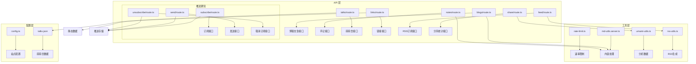
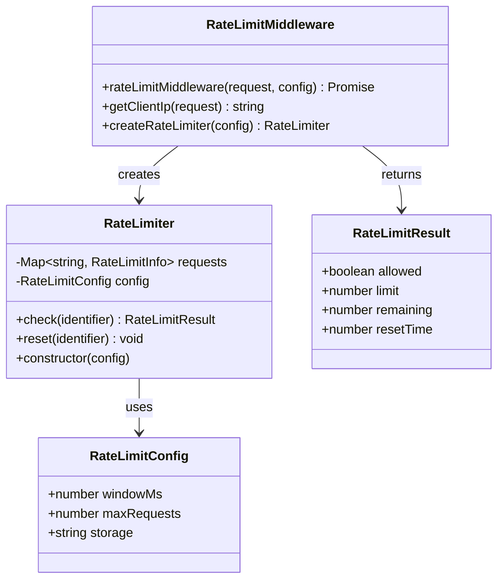
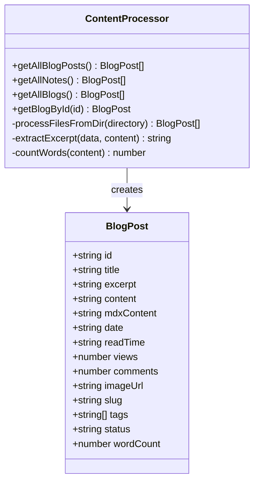
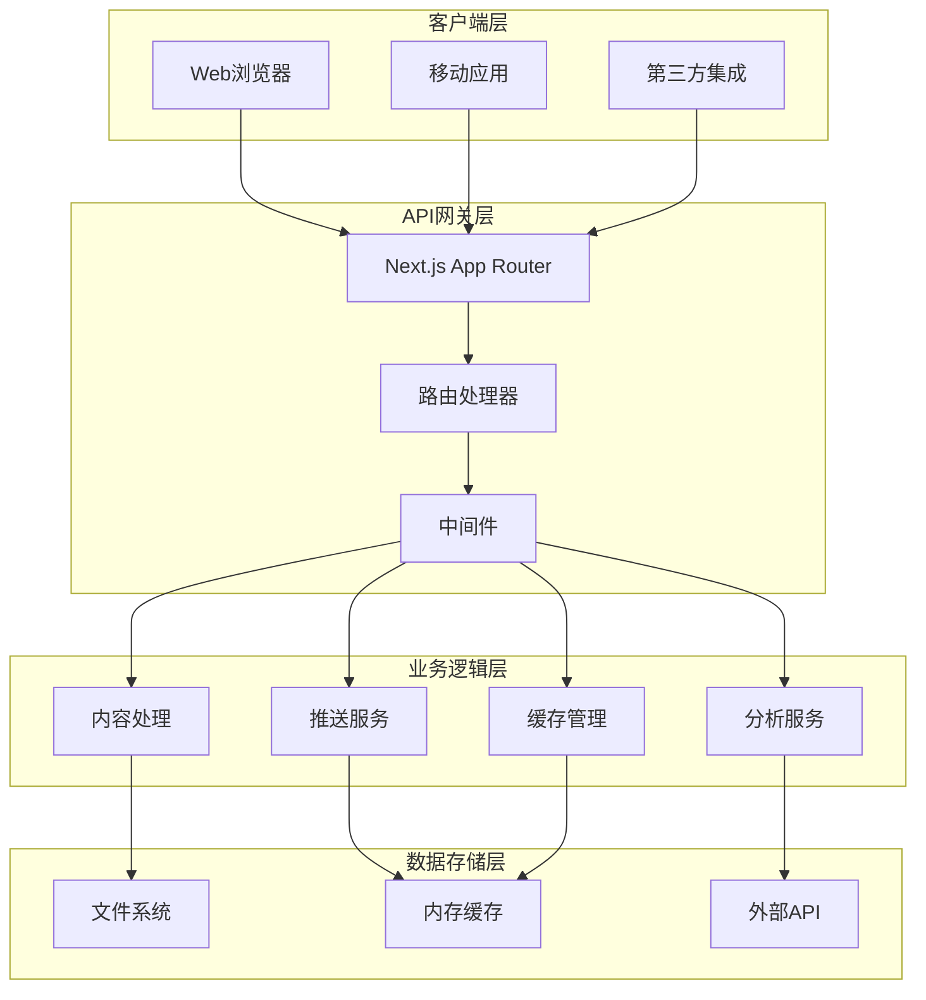
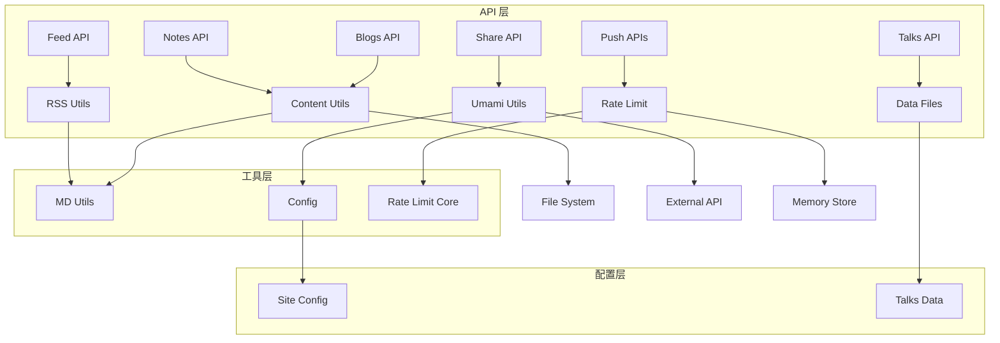

# API 接口文档

<cite>
**本文档引用的文件**
- [app/api/blogs/route.ts](file://app/api/blogs/route.ts)
- [app/api/feed/route.ts](file://app/api/feed/route.ts)
- [app/api/links/route.ts](file://app/api/links/route.ts)
- [app/api/notes/route.ts](file://app/api/notes/route.ts)
- [app/api/push/send/route.ts](file://app/api/push/send/route.ts)
- [app/api/push/subscribe/route.ts](file://app/api/push/subscribe/route.ts)
- [app/api/push/unsubscribe/route.ts](file://app/api/push/unsubscribe/route.ts)
- [app/api/share/route.ts](file://app/api/share/route.ts)
- [app/api/talks/route.ts](file://app/api/talks/route.ts)
- [lib/rate-limit.ts](file://lib/rate-limit.ts)
- [lib/rss-utils.ts](file://lib/rss-utils.ts)
- [lib/umami-utils.ts](file://lib/umami-utils.ts)
- [lib/config.ts](file://lib/config.ts)
- [lib/md-utils.server.ts](file://lib/md-utils.server.ts)
- [data/talks.json](file://data/talks.json)
- [package.json](file://package.json)
</cite>

## 目录
1. [简介](#简介)
2. [项目结构](#项目结构)
3. [核心组件](#核心组件)
4. [架构概览](#架构概览)
5. [详细组件分析](#详细组件分析)
6. [依赖关系分析](#依赖关系分析)
7. [性能考虑](#性能考虑)
8. [故障排除指南](#故障排除指南)
9. [结论](#结论)
10. [附录](#附录)

## 简介

本博客系统提供完整的 API 接口解决方案，采用 Next.js App Router 架构，支持多种内容类型的获取和管理。系统包含博客文章、手记、碎碎念、链接、RSS 订阅以及推送通知等功能模块。

主要特性：
- RESTful API 设计，遵循 HTTP 协议标准
- 内置速率限制机制，防止 API 滥用
- 支持 Markdown/MDX 内容解析和处理
- 集成 Umami 分析服务，提供访问量统计
- 完整的推送通知系统，支持订阅、发送和取消订阅
- 丰富的元数据管理和 SEO 优化

## 项目结构

博客系统的 API 层采用按功能模块组织的结构：



**图表来源**
- [app/api/blogs/route.ts:1-62](file://app/api/blogs/route.ts#L1-L62)
- [app/api/notes/route.ts:1-62](file://app/api/notes/route.ts#L1-L62)
- [app/api/talks/route.ts:1-36](file://app/api/talks/route.ts#L1-L36)
- [lib/rate-limit.ts:1-214](file://lib/rate-limit.ts#L1-L214)

**章节来源**
- [app/api/blogs/route.ts:1-62](file://app/api/blogs/route.ts#L1-L62)
- [app/api/notes/route.ts:1-62](file://app/api/notes/route.ts#L1-L62)
- [app/api/talks/route.ts:1-36](file://app/api/talks/route.ts#L1-L36)

## 核心组件

### 速率限制系统

系统实现了灵活的速率限制机制，支持多种预设配置和自定义配置：



**图表来源**
- [lib/rate-limit.ts:26-95](file://lib/rate-limit.ts#L26-L95)
- [lib/rate-limit.ts:150-197](file://lib/rate-limit.ts#L150-L197)

### 内容管理系统

基于 Markdown/MDX 的内容处理系统，支持博客文章和手记的统一管理：



**图表来源**
- [lib/md-utils.server.ts:11-28](file://lib/md-utils.server.ts#L11-L28)
- [lib/md-utils.server.ts:136-154](file://lib/md-utils.server.ts#L136-L154)

**章节来源**
- [lib/rate-limit.ts:1-214](file://lib/rate-limit.ts#L1-L214)
- [lib/md-utils.server.ts:1-218](file://lib/md-utils.server.ts#L1-L218)

## 架构概览

博客系统的整体架构采用分层设计，确保各组件职责清晰、耦合度低：



**图表来源**
- [app/api/blogs/route.ts:6-8](file://app/api/blogs/route.ts#L6-L8)
- [lib/umami-utils.ts:145-187](file://lib/umami-utils.ts#L145-L187)
- [lib/rate-limit.ts:150-197](file://lib/rate-limit.ts#L150-L197)

## 详细组件分析

### 博客 API 接口

博客 API 提供博客文章和手记内容的获取功能，支持单篇文章和批量获取两种模式。

#### 接口规范

| 接口 | 方法 | URL | 描述 |
|------|------|-----|------|
| 博客列表 | GET | `/api/blogs` | 获取所有博客文章 |
| 单篇博客 | GET | `/api/blogs?id={id}` | 根据ID获取单篇博客文章 |
| 手记列表 | GET | `/api/notes` | 获取所有手记文章 |
| 单篇手记 | GET | `/api/notes?id={id}` | 根据ID获取单篇手记 |

#### 请求参数

**通用参数**
- `id` (可选): 文章唯一标识符，用于获取单篇文章

**响应格式**
```json
{
  "id": "string",
  "title": "string",
  "excerpt": "string",
  "content": "string",
  "mdxContent": "string",
  "date": "string",
  "readTime": "string",
  "views": number,
  "comments": number,
  "imageUrl": "string",
  "slug": "string",
  "tags": string[],
  "status": "published" | "draft",
  "wordCount": number
}
```

#### 速率限制

- 默认限制：每分钟 30 次请求
- 单篇获取：每分钟 30 次请求
- 批量获取：每分钟 30 次请求

#### 错误处理

- 404 Not Found：当指定ID的文章不存在时
- 429 Too Many Requests：超出速率限制时
- 500 Internal Server Error：服务器内部错误

**章节来源**
- [app/api/blogs/route.ts:10-61](file://app/api/blogs/route.ts#L10-L61)
- [app/api/notes/route.ts:10-61](file://app/api/notes/route.ts#L10-L61)

### RSS 订阅接口

RSS 订阅接口生成标准的 RSS 2.0 格式内容，支持内容聚合和订阅。

#### 接口规范

| 接口 | 方法 | URL | 描述 |
|------|------|-----|------|
| RSS 订阅 | GET | `/api/feed` | 生成并返回 RSS 订阅内容 |

#### 响应特性

- Content-Type: `application/rss+xml; charset=utf-8`
- Cache-Control: `s-maxage=3600, stale-while-revalidate`
- XML 格式：符合 RSS 2.0 标准

#### RSS 内容结构

```xml
<rss version="2.0">
  <channel>
    <title>博客名称</title>
    <description>博客描述</description>
    <link>站点URL</link>
    <item>
      <title>文章标题</title>
      <link>文章链接</link>
      <description>文章摘要</description>
      <pubDate>发布日期</pubDate>
      <guid>唯一标识符</guid>
      <category>标签</category>
    </item>
  </channel>
</rss>
```

**章节来源**
- [app/api/feed/route.ts:9-18](file://app/api/feed/route.ts#L9-L18)
- [lib/rss-utils.ts:13-43](file://lib/rss-utils.ts#L13-L43)

### 碎碎念接口

碎碎念接口提供非正式内容的获取功能，支持文本、图片、链接等多种内容类型。

#### 接口规范

| 接口 | 方法 | URL | 描述 |
|------|------|-----|------|
| 碎碎念列表 | GET | `/api/talks` | 获取所有碎碎念内容 |

#### 数据模型

```json
{
  "talks": [
    {
      "id": "string",
      "title": "string",
      "content": [
        {
          "type": "text" | "image" | "link" | "quote",
          "id": "string",
          "content": "string",
          "url": "string",
          "alt": "string",
          "caption": "string",
          "text": "string",
          "author": "string",
          "title": "string",
          "description": "string",
          "siteName": "string"
        }
      ],
      "tags": string[],
      "createdAt": "string",
      "location": "string",
      "mood": "string",
      "isPinned": boolean
    }
  ],
  "metadata": {
    "title": "string",
    "description": "string",
    "version": "string",
    "lastUpdated": "string"
  }
}
```

#### 速率限制

- 限制：每分钟 100 次请求
- 适用场景：读取公开的碎碎念内容

**章节来源**
- [app/api/talks/route.ts:11-35](file://app/api/talks/route.ts#L11-L35)
- [data/talks.json:1-203](file://data/talks.json#L1-L203)

### 链接接口

链接接口提供友情链接数据的获取功能，支持静态链接信息管理。

#### 接口规范

| 接口 | 方法 | URL | 描述 |
|------|------|-----|------|
| 友情链接 | GET | `/api/links` | 获取所有友情链接 |

#### 响应格式

```json
[
  {
    "id": "string",
    "name": "string",
    "url": "string",
    "description": "string",
    "logo": "string",
    "author": "string",
    "tags": string[]
  }
]
```

**章节来源**
- [app/api/links/route.ts:39-41](file://app/api/links/route.ts#L39-L41)

### 分享统计接口

分享统计接口集成 Umami 分析服务，提供页面访问量统计功能。

#### 接口规范

| 接口 | 方法 | URL | 描述 |
|------|------|-----|------|
| 页面访问量 | GET | `/api/share?pathname={path}` | 获取指定页面的访问量 |

#### 请求参数

- `pathname` (必需): 页面路径，如 `/blogs/nextjs-performance`

#### 响应格式

```json
{
  "pageViews": number
}
```

#### 配置要求

需要在环境变量中配置 Umami 服务：

- `NEXT_PUBLIC_UMAMI_BASE_URL`: Umami 实例基础 URL
- `UMAMI_USERNAME`: Umami 用户名
- `UMAMI_PASSWORD`: Umami 密码
- `NEXT_PUBLIC_UMAMI_WEBSITE_ID`: 网站 ID

#### 速率限制

- 限制：每分钟 30 次请求
- 缓存：1 小时内存缓存

**章节来源**
- [app/api/share/route.ts:15-72](file://app/api/share/route.ts#L15-L72)
- [lib/umami-utils.ts:260-311](file://lib/umami-utils.ts#L260-L311)

### 推送通知接口组

推送通知系统提供完整的 Web Push 通知功能，包括订阅管理、消息发送和取消订阅。

#### 订阅管理接口

##### 订阅接口

| 接口 | 方法 | URL | 描述 |
|------|------|-----|------|
| 创建订阅 | POST | `/api/push/subscribe` | 创建新的推送订阅 |

**请求格式**
```json
{
  "endpoint": "string",
  "keys": {
    "p256dh": "string",
    "auth": "string"
  }
}
```

**响应格式**
```json
{
  "success": boolean
}
```

##### 发送通知接口

| 接口 | 方法 | URL | 描述 |
|------|------|-----|------|
| 发送通知 | POST | `/api/push/send` | 向所有订阅者发送推送通知 |

**请求格式**
```json
{
  "title": "string",
  "body": "string",
  "url": "string"
}
```

**响应格式**
```json
{
  "success": boolean,
  "message": "string"
}
```

##### 取消订阅接口

| 接口 | 方法 | URL | 描述 |
|------|------|-----|------|
| 取消订阅 | POST | `/api/push/unsubscribe` | 取消推送订阅 |

**请求格式**
```json
{
  "endpoint": "string"
}
```

**响应格式**
```json
{
  "success": boolean,
  "message": "string"
}
```

#### 速率限制

- 订阅接口：每分钟 5 次请求
- 发送通知：每分钟 3 次请求（严格限制）
- 取消订阅：无限制

#### 错误处理

- 400 Bad Request：无效的订阅数据或缺少必要字段
- 500 Internal Server Error：推送发送失败

**章节来源**
- [app/api/push/subscribe/route.ts:12-65](file://app/api/push/subscribe/route.ts#L12-L65)
- [app/api/push/send/route.ts:15-77](file://app/api/push/send/route.ts#L15-L77)
- [app/api/push/unsubscribe/route.ts:11-32](file://app/api/push/unsubscribe/route.ts#L11-L32)

## 依赖关系分析

系统采用模块化设计，各组件之间的依赖关系清晰明确：



**图表来源**
- [app/api/blogs/route.ts:7-8](file://app/api/blogs/route.ts#L7-L8)
- [lib/umami-utils.ts:7-8](file://lib/umami-utils.ts#L7-L8)
- [lib/rate-limit.ts:6-7](file://lib/rate-limit.ts#L6-L7)

**章节来源**
- [lib/md-utils.server.ts:6-9](file://lib/md-utils.server.ts#L6-L9)
- [lib/umami-utils.ts:1-326](file://lib/umami-utils.ts#L1-L326)
- [lib/config.ts:1-108](file://lib/config.ts#L1-L108)

## 性能考虑

### 缓存策略

系统实现了多层次的缓存机制以提升性能：

1. **内存缓存**：Umami 分析数据缓存 1 小时
2. **文件系统缓存**：内容处理结果缓存
3. **HTTP 缓存**：RSS 订阅内容缓存 1 小时

### 优化建议

1. **内容预处理**：使用 `npm run precompute:wordcount` 预计算字数统计
2. **CDN 集成**：将静态资源部署到 CDN 以提升加载速度
3. **数据库优化**：生产环境中建议使用 Redis 替代内存存储
4. **图片优化**：使用现代图片格式和适当的尺寸压缩

### 监控指标

- API 响应时间
- 速率限制触发次数
- Umami API 调用成功率
- 推送通知发送成功率

**章节来源**
- [lib/umami-utils.ts:8-38](file://lib/umami-utils.ts#L8-L38)
- [lib/rss-utils.ts:13-17](file://lib/rss-utils.ts#L13-L17)

## 故障排除指南

### 常见问题及解决方案

#### 速率限制问题

**症状**：收到 429 状态码
**原因**：超出配置的请求频率限制
**解决方案**：
1. 检查客户端实现的重试逻辑
2. 实现指数退避算法
3. 调整速率限制配置

#### Umami 集成问题

**症状**：分享统计接口返回 500 错误
**原因**：Umami 配置不正确或网络连接问题
**解决方案**：
1. 验证环境变量配置
2. 检查 Umami 服务可用性
3. 查看服务器日志获取详细错误信息

#### 推送通知问题

**症状**：推送通知发送失败
**原因**：订阅端点失效或 VAPID 密钥配置错误
**解决方案**：
1. 定期清理无效的订阅端点
2. 验证 VAPID 密钥配置
3. 检查推送服务提供商的状态

#### 内容加载问题

**症状**：博客文章内容无法加载
**原因**：文件系统权限问题或内容文件格式错误
**解决方案**：
1. 检查 content 目录的读取权限
2. 验证 Markdown/MDX 文件格式
3. 确认 frontmatter 字段完整性

**章节来源**
- [lib/rate-limit.ts:164-189](file://lib/rate-limit.ts#L164-L189)
- [app/api/share/route.ts:39-44](file://app/api/share/route.ts#L39-L44)
- [app/api/push/send/route.ts:51-56](file://app/api/push/send/route.ts#L51-L56)

## 结论

本博客系统的 API 接口设计遵循 RESTful 原则，提供了完整的博客内容管理功能。系统具有以下特点：

1. **模块化设计**：按功能划分的清晰 API 结构
2. **性能优化**：多层缓存和速率限制机制
3. **扩展性强**：易于添加新的内容类型和功能
4. **安全性**：内置速率限制和错误处理机制

建议在生产环境中：
- 配置 Redis 作为速率限制存储
- 设置适当的监控和告警
- 实现更完善的错误处理和日志记录
- 考虑使用 CDN 加速静态资源

## 附录

### 版本信息

当前版本：0.1.0
框架版本：Next.js 16.1.6

### 环境变量配置

| 变量名 | 必需 | 描述 |
|--------|------|------|
| NEXT_PUBLIC_UMAMI_BASE_URL | 否 | Umami 实例基础 URL |
| UMAMI_USERNAME | 否 | Umami 用户名 |
| UMAMI_PASSWORD | 否 | Umami 密码 |
| NEXT_PUBLIC_UMAMI_WEBSITE_ID | 否 | Umami 网站 ID |
| NEXT_PUBLIC_GOOGLE_ANALYTICS_ID | 否 | Google Analytics ID |

### 兼容性说明

- 支持现代浏览器的 Web Push API
- 兼容 Next.js App Router 架构
- 向后兼容旧版浏览器（通过 polyfill）

### 迁移指南

从旧版本升级时需要注意：
1. 检查 API 路径变更
2. 验证速率限制配置
3. 更新 Umami 配置参数
4. 测试推送通知功能