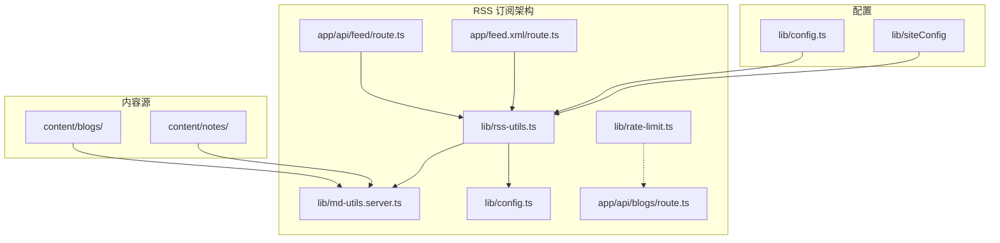
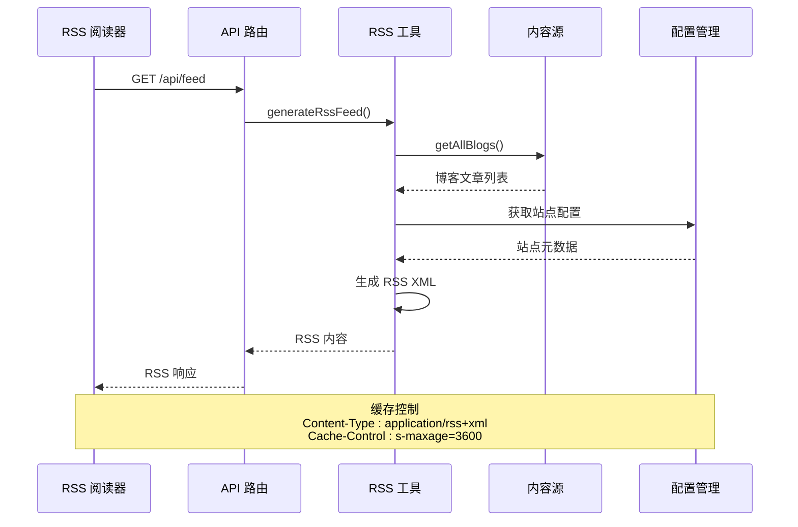
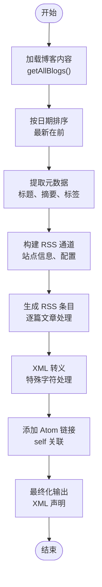
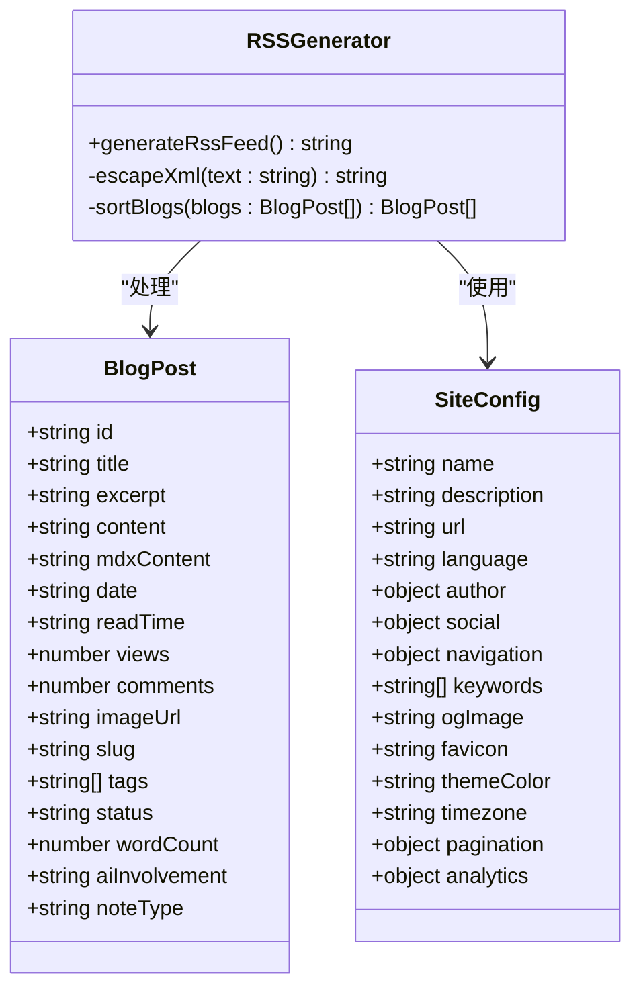
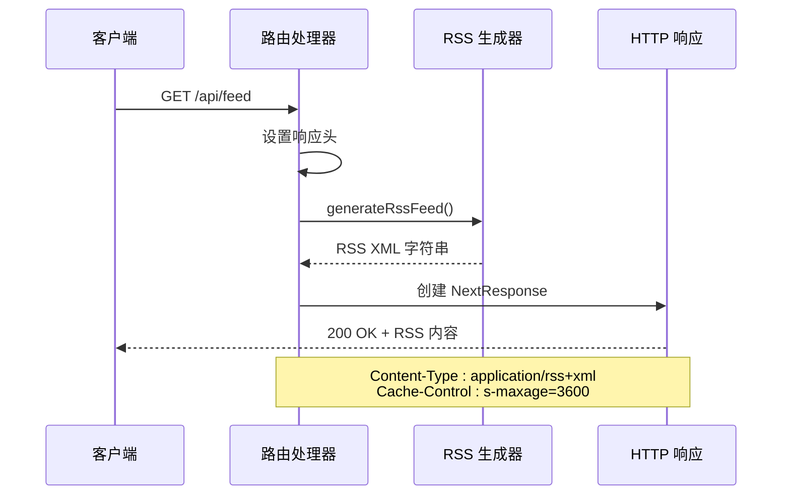
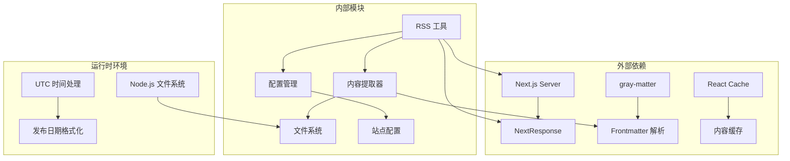

# RSS 订阅 API

<cite>
**本文引用的文件**
- [app/api/feed/route.ts](file://app/api/feed/route.ts)
- [app/feed.xml/route.ts](file://app/feed.xml/route.ts)
- [lib/rss-utils.ts](file://lib/rss-utils.ts)
- [lib/md-utils.server.ts](file://lib/md-utils.server.ts)
- [lib/config.ts](file://lib/config.ts)
- [lib/rate-limit.ts](file://lib/rate-limit.ts)
- [app/api/blogs/route.ts](file://app/api/blogs/route.ts)
- [content/blogs/test-features.mdx](file://content/blogs/test-features.mdx)
</cite>

## 目录
1. [简介](#简介)
2. [项目结构](#项目结构)
3. [核心组件](#核心组件)
4. [架构概览](#架构概览)
5. [详细组件分析](#详细组件分析)
6. [依赖关系分析](#依赖关系分析)
7. [性能考虑](#性能考虑)
8. [故障排除指南](#故障排除指南)
9. [结论](#结论)
10. [附录](#附录)

## 简介

本项目实现了完整的 RSS 订阅 API 接口，为博客内容提供标准化的 RSS 2.0 格式订阅服务。RSS（Really Simple Syndication）是一种基于 XML 的内容聚合格式，允许用户通过 RSS 阅读器订阅和获取博客更新。

该实现提供了两个主要的 RSS 订阅入口点：
- `GET /api/feed` - 通过 API 路由提供 RSS 订阅
- `GET /feed.xml` - 通过静态路由提供 RSS 订阅

系统集成了内容管理系统，能够从 Markdown 文件中提取博客文章元数据，生成符合 RSS 2.0 标准的 XML 文档，并提供适当的缓存机制和安全防护。

## 项目结构

RSS 订阅功能涉及以下关键文件和模块：



**图表来源**
- [app/api/feed/route.ts:1-19](file://app/api/feed/route.ts#L1-L19)
- [app/feed.xml/route.ts:1-15](file://app/feed.xml/route.ts#L1-L15)
- [lib/rss-utils.ts:1-58](file://lib/rss-utils.ts#L1-L58)

**章节来源**
- [app/api/feed/route.ts:1-19](file://app/api/feed/route.ts#L1-L19)
- [app/feed.xml/route.ts:1-15](file://app/feed.xml/route.ts#L1-L15)
- [lib/rss-utils.ts:1-58](file://lib/rss-utils.ts#L1-L58)

## 核心组件

### RSS 生成工具 (generateRssFeed)

RSS 生成工具是整个订阅系统的核心组件，负责将博客内容转换为标准的 RSS 2.0 XML 格式。

**主要功能特性：**
- 从内容源读取所有博客文章
- 按发布日期排序文章
- 生成 RSS 通道和条目结构
- 处理 XML 特殊字符转义
- 集成 Atom 自链接支持

**RSS 2.0 字段映射：**
- `<title>` → 站点名称或文章标题
- `<description>` → 站点描述或文章摘要
- `<link>` → 站点 URL 或文章详情链接
- `<pubDate>` → UTC 格式发布时间
- `<guid>` → 唯一标识符（文章链接）
- `<category>` → 文章标签
- `<language>` → 站点语言设置

**章节来源**
- [lib/rss-utils.ts:9-43](file://lib/rss-utils.ts#L9-L43)

### 内容提取器 (getAllBlogs)

内容提取器负责从 Markdown 文件中提取博客文章的元数据和内容。

**支持的内容格式：**
- Markdown (.md) 和 MDX (.mdx) 文件
- Frontmatter 元数据提取
- 自动摘要生成
- 字数统计和阅读时间计算

**元数据字段：**
- `title` - 文章标题
- `excerpt` - 文章摘要
- `date` - 发布日期
- `tags` - 标签数组
- `slug` - URL 友好的文章标识符
- `wordCount` - 字数统计

**章节来源**
- [lib/md-utils.server.ts:11-154](file://lib/md-utils.server.ts#L11-L154)

### 配置管理

系统使用集中式配置管理，确保 RSS 输出的一致性和准确性。

**配置项：**
- 站点基本信息（名称、描述、URL）
- 语言设置和时区配置
- 社交媒体链接
- 分页配置

**章节来源**
- [lib/config.ts:13-98](file://lib/config.ts#L13-L98)

## 架构概览

RSS 订阅系统的整体架构采用分层设计，确保了良好的可维护性和扩展性。



**图表来源**
- [app/api/feed/route.ts:9-18](file://app/api/feed/route.ts#L9-L18)
- [lib/rss-utils.ts:13-43](file://lib/rss-utils.ts#L13-L43)

### 数据流处理

RSS 内容的生成遵循以下处理流程：



**图表来源**
- [lib/rss-utils.ts:13-43](file://lib/rss-utils.ts#L13-L43)
- [lib/md-utils.server.ts:86-131](file://lib/md-utils.server.ts#L86-L131)

## 详细组件分析

### RSS 生成器类图



**图表来源**
- [lib/rss-utils.ts:13-43](file://lib/rss-utils.ts#L13-L43)
- [lib/md-utils.server.ts:11-28](file://lib/md-utils.server.ts#L11-L28)
- [lib/config.ts:13-98](file://lib/config.ts#L13-L98)

### API 路由处理流程

RSS API 路由实现了标准的 HTTP 处理模式：



**图表来源**
- [app/api/feed/route.ts:9-18](file://app/api/feed/route.ts#L9-L18)

**章节来源**
- [app/api/feed/route.ts:1-19](file://app/api/feed/route.ts#L1-L19)
- [app/feed.xml/route.ts:1-15](file://app/feed.xml/route.ts#L1-L15)

### 内容元数据提取

系统从 Markdown 文件的 Frontmatter 中提取关键元数据：

| 元数据字段 | 类型 | 必需 | 描述 |
|------------|------|------|------|
| `title` | string | 是 | 文章标题 |
| `date` | string/date | 是 | 发布日期 |
| `description` | string | 否 | 文章描述 |
| `tags` | string[] | 否 | 标签数组 |
| `coverImage` | string | 否 | 封面图片 URL |
| `wordCount` | number | 否 | 字数统计 |
| `readingTime` | number | 否 | 预计阅读时间 |

**章节来源**
- [lib/md-utils.server.ts:75-124](file://lib/md-utils.server.ts#L75-L124)
- [content/blogs/test-features.mdx:1-9](file://content/blogs/test-features.mdx#L1-L9)

### XML 安全处理

RSS 生成器实现了全面的 XML 特殊字符转义，确保输出的 RSS 内容符合 XML 标准：

**转义规则：**
- `&` → `&amp;`
- `<` → `&lt;`
- `>` → `&gt;`
- `"` → `&quot;`
- `'` → `&apos;`

**章节来源**
- [lib/rss-utils.ts:50-57](file://lib/rss-utils.ts#L50-L57)

## 依赖关系分析

RSS 订阅系统的依赖关系清晰明确，遵循单一职责原则：



**图表来源**
- [lib/rss-utils.ts:6-7](file://lib/rss-utils.ts#L6-L7)
- [lib/md-utils.server.ts:6-9](file://lib/md-utils.server.ts#L6-L9)

### 第三方库依赖

系统使用了以下关键第三方库：

- **gray-matter**: 用于解析 Markdown 文件的 Frontmatter 元数据
- **Next.js**: 提供服务器端渲染和 API 路由功能
- **React**: 提供内容缓存机制

**章节来源**
- [package.json:29](file://package.json#L29)
- [package.json:32](file://package.json#L32)

## 性能考虑

### 缓存策略

RSS 订阅实现了多层次的缓存机制以提升性能：

**HTTP 缓存控制：**
- `Cache-Control: s-maxage=3600` - CDN 缓存 1 小时
- `stale-while-revalidate` - 缓存过期时异步刷新

**内容缓存：**
- 使用 React 的 `cache` 装饰器缓存博客内容
- 避免重复读取和解析 Markdown 文件

**章节来源**
- [app/api/feed/route.ts:15](file://app/api/feed/route.ts#L15)
- [lib/md-utils.server.ts:136](file://lib/md-utils.server.ts#L136)

### 性能优化建议

1. **内容预处理**: 在构建时预计算字数统计和阅读时间
2. **数据库集成**: 对于大量内容，考虑使用数据库存储元数据
3. **CDN 优化**: 利用 Vercel CDN 提升全球访问速度
4. **压缩传输**: 启用 gzip 压缩减少传输体积

## 故障排除指南

### 常见问题及解决方案

**问题 1: RSS 内容为空**
- 检查 `content/blogs/` 目录下是否有有效的 Markdown 文件
- 确认 Frontmatter 格式正确
- 验证文件权限和路径

**问题 2: XML 格式错误**
- 检查特殊字符是否正确转义
- 验证 XML 声明和编码设置
- 使用在线 XML 验证器检查格式

**问题 3: 缓存问题**
- 清除浏览器缓存重新加载
- 检查 `Cache-Control` 头部设置
- 验证 CDN 缓存配置

**问题 4: 性能问题**
- 监控 API 响应时间
- 检查服务器资源使用情况
- 考虑启用更高效的缓存策略

### 调试工具

**在线验证工具：**
- W3C RSS Validator
- FeedValidator.org
- XMLSpy Online

**浏览器开发者工具：**
- Network 面板监控请求响应
- Console 查看错误信息
- Application 面板检查缓存状态

**章节来源**
- [lib/rss-utils.ts:50-57](file://lib/rss-utils.ts#L50-L57)

## 结论

本 RSS 订阅 API 实现了完整的博客内容聚合服务，具有以下优势：

**技术优势：**
- 遵循 RSS 2.0 标准，兼容性强
- 实现了 XML 安全处理和缓存优化
- 集成了速率限制和安全防护
- 支持多种内容格式和元数据提取

**扩展性：**
- 模块化设计便于功能扩展
- 配置驱动的站点信息管理
- 支持自定义 RSS 字段和格式

**最佳实践：**
- 使用 React 缓存提升性能
- 实施合理的缓存策略
- 提供完善的错误处理和调试支持

该实现为博客作者提供了可靠的 RSS 订阅服务，能够满足大多数内容聚合需求。

## 附录

### RSS 2.0 字段参考

| 字段 | 必需 | 描述 | 示例值 |
|------|------|------|--------|
| `rss/@version` | 是 | RSS 版本号 | `"2.0"` |
| `channel/title` | 是 | 站点标题 | `"木子博客"` |
| `channel/description` | 是 | 站点描述 | `"独立开发者的技术与生活"` |
| `channel/link` | 是 | 站点链接 | `"https://www.muzi.dev"` |
| `channel/language` | 是 | 站点语言 | `"zh-CN"` |
| `channel/lastBuildDate` | 是 | 最后构建时间 | `"Wed, 21 Mar 2024 10:00:00 GMT"` |
| `channel/generator` | 是 | 生成器信息 | `"Next.js"` |
| `item/title` | 是 | 文章标题 | `"测试 MDX 功能"` |
| `item/link` | 是 | 文章链接 | `"/blogs/test-features"` |
| `item/description` | 是 | 文章摘要 | `"测试所有 MDX 增强功能"` |
| `item/pubDate` | 是 | 发布时间 | `"Sat, 22 Mar 2026 00:00:00 GMT"` |
| `item/guid` | 是 | 唯一标识符 | `"/blogs/test-features"` |
| `item/category` | 否 | 文章分类 | `"test"` |

### 使用示例

**基本订阅链接：**
```
https://www.muzi.dev/feed.xml
```

**RSS 阅读器集成：**
1. **Feedly**: 添加订阅 → 输入 RSS 链接
2. **Inoreader**: 新建订阅 → URL 指向 `/feed.xml`
3. **The Old Reader**: 添加订阅 → 使用 RSS URL
4. **Newsblur**: 添加订阅 → 输入 RSS 地址

**自定义 RSS 内容：**

要扩展 RSS 内容，可以修改以下位置：

1. **添加自定义字段**: 在 `lib/rss-utils.ts` 中修改 `generateRssFeed` 函数
2. **修改内容过滤**: 在 `lib/md-utils.server.ts` 中调整内容提取逻辑
3. **定制样式**: 修改 RSS XML 结构和字段映射

**章节来源**
- [lib/rss-utils.ts:13-43](file://lib/rss-utils.ts#L13-L43)
- [lib/md-utils.server.ts:86-131](file://lib/md-utils.server.ts#L86-L131)