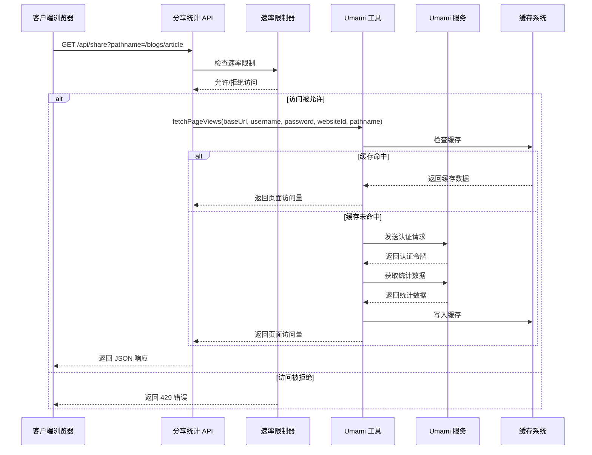
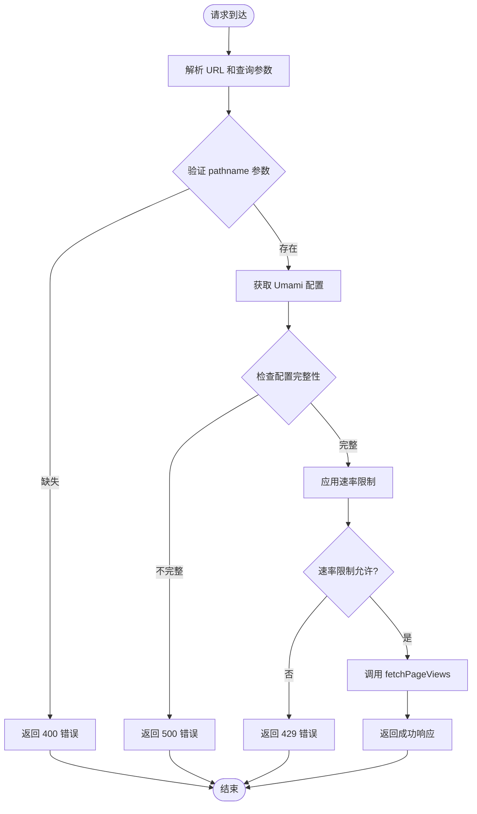
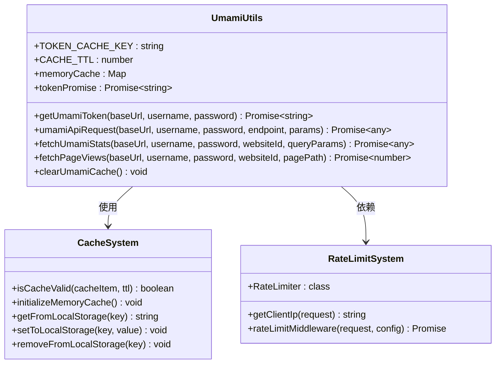
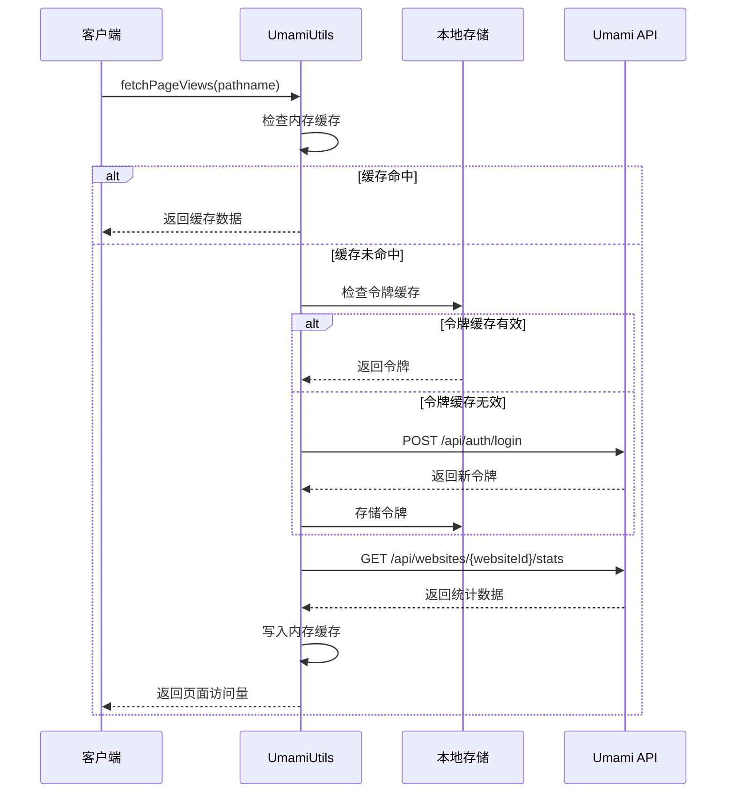
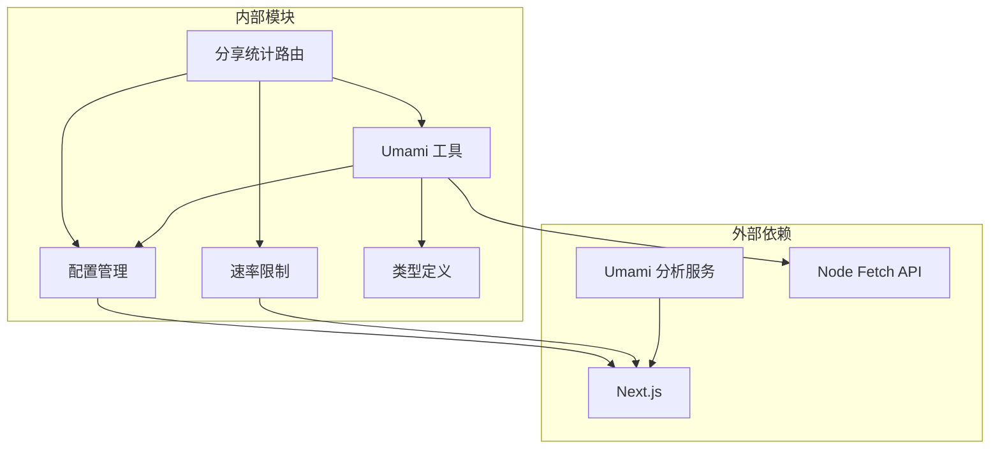

# 分享统计 API

<cite>
**本文档引用的文件**
- [app/api/share/route.ts](file://app/api/share/route.ts)
- [lib/umami-utils.ts](file://lib/umami-utils.ts)
- [lib/rate-limit.ts](file://lib/rate-limit.ts)
- [lib/config.ts](file://lib/config.ts)
- [components/common/analytics/Umami.tsx](file://components/common/analytics/Umami.tsx)
- [types/umami.d.ts](file://types/umami.d.ts)
- [app/blogs/[id]/page.server.tsx](file://app/blogs/[id]/page.server.tsx)
- [app/blogs/[id]/page.client.tsx](file://app/blogs/[id]/page.client.tsx)
</cite>

## 目录
1. [简介](#简介)
2. [项目结构](#项目结构)
3. [核心组件](#核心组件)
4. [架构概览](#架构概览)
5. [详细组件分析](#详细组件分析)
6. [依赖关系分析](#依赖关系分析)
7. [性能考虑](#性能考虑)
8. [故障排除指南](#故障排除指南)
9. [结论](#结论)

## 简介

分享统计 API 是一个基于 Next.js App Router 的服务器端 API，专门用于获取页面访问量统计数据。该 API 通过集成 Umami 分析工具，为博客文章和其他页面提供实时的访问量统计功能。

该 API 的主要特点包括：
- 基于速率限制的安全访问控制
- 智能缓存机制减少 API 调用开销
- 与 Umami 自托管分析服务的无缝集成
- 支持多种统计维度的数据获取
- 完善的错误处理和降级机制

## 项目结构

分享统计 API 在项目中的组织结构如下：

```mermaid
graph TB
subgraph "API 层"
ShareRoute[app/api/share/route.ts<br/>主路由处理器]
end
subgraph "工具层"
UmamiUtils[lib/umami-utils.ts<br/>Umami 数据工具]
RateLimit[lib/rate-limit.ts<br/>速率限制中间件]
Config[lib/config.ts<br/>配置管理]
end
subgraph "前端集成"
BlogServer[app/blogs/[id]/page.server.tsx<br/>服务端渲染]
BlogClient[app/blogs/[id]/page.client.tsx<br/>客户端组件]
UmamiScript[components/common/analytics/Umami.tsx<br/>分析脚本]
end
ShareRoute --> UmamiUtils
ShareRoute --> RateLimit
ShareRoute --> Config
BlogServer --> ShareRoute
BlogClient --> ShareRoute
UmamiScript --> Config
```

**图表来源**
- [app/api/share/route.ts:1-73](file://app/api/share/route.ts#L1-L73)
- [lib/umami-utils.ts:1-326](file://lib/umami-utils.ts#L1-L326)
- [lib/rate-limit.ts:1-214](file://lib/rate-limit.ts#L1-L214)

**章节来源**
- [app/api/share/route.ts:1-73](file://app/api/share/route.ts#L1-L73)
- [lib/umami-utils.ts:1-326](file://lib/umami-utils.ts#L1-L326)
- [lib/rate-limit.ts:1-214](file://lib/rate-limit.ts#L1-L214)

## 核心组件

### 主要 API 路由处理器

分享统计 API 的核心是位于 `app/api/share/route.ts` 的路由处理器，它负责处理所有 `/api/share` 请求。

### Umami 数据工具模块

`lib/umami-utils.ts` 提供了完整的 Umami 分析数据获取和缓存功能，包括：
- 认证令牌管理
- API 请求封装
- 智能缓存机制
- 错误处理和重试逻辑

### 速率限制中间件

`lib/rate-limit.ts` 实现了灵活的速率限制机制，支持多种预设配置：
- 严格限制：每分钟 10 次请求
- 中等限制：每分钟 30 次请求
- 宽松限制：每分钟 100 次请求

### 配置管理系统

`lib/config.ts` 集中管理网站配置，特别是 Umami 分析工具的配置信息。

**章节来源**
- [app/api/share/route.ts:15-72](file://app/api/share/route.ts#L15-L72)
- [lib/umami-utils.ts:83-325](file://lib/umami-utils.ts#L83-L325)
- [lib/rate-limit.ts:202-213](file://lib/rate-limit.ts#L202-L213)
- [lib/config.ts:83-96](file://lib/config.ts#L83-L96)

## 架构概览

分享统计 API 采用分层架构设计，确保了良好的可维护性和扩展性：



**图表来源**
- [app/api/share/route.ts:15-72](file://app/api/share/route.ts#L15-L72)
- [lib/umami-utils.ts:260-311](file://lib/umami-utils.ts#L260-L311)
- [lib/rate-limit.ts:150-197](file://lib/rate-limit.ts#L150-L197)

## 详细组件分析

### API 路由处理器

#### 功能概述
主路由处理器实现了完整的请求处理流程，包括参数验证、配置检查、速率限制应用和数据获取。

#### 请求处理流程



**图表来源**
- [app/api/share/route.ts:23-71](file://app/api/share/route.ts#L23-L71)

#### 响应格式
API 返回标准的 JSON 格式响应：

| 字段 | 类型 | 描述 | 示例值 |
|------|------|------|--------|
| pageViews | number | 页面访问量统计 | 1234 |
| X-RateLimit-Limit | string | 速率限制上限 | "30" |
| X-RateLimit-Remaining | string | 剩余请求次数 | "29" |
| X-RateLimit-Reset | string | 重置时间戳 | "2024-01-01T12:00:00Z" |

**章节来源**
- [app/api/share/route.ts:15-72](file://app/api/share/route.ts#L15-L72)

### Umami 数据工具模块

#### 认证令牌管理

Umami 工具模块实现了智能的认证令牌管理机制：



**图表来源**
- [lib/umami-utils.ts:83-325](file://lib/umami-utils.ts#L83-L325)
- [lib/rate-limit.ts:26-197](file://lib/rate-limit.ts#L26-L197)

#### 缓存策略

系统采用了多层次的缓存策略：

1. **内存缓存**：使用 Map 结构存储最近访问的数据
2. **本地存储缓存**：持久化存储认证令牌
3. **缓存 TTL**：默认 1 小时的有效期

#### 数据获取流程



**图表来源**
- [lib/umami-utils.ts:260-311](file://lib/umami-utils.ts#L260-L311)

**章节来源**
- [lib/umami-utils.ts:83-325](file://lib/umami-utils.ts#L83-L325)

### 速率限制系统

#### 配置选项

系统提供了多种预设的速率限制配置：

| 预设名称 | 时间窗口 | 最大请求数 | 适用场景 |
|----------|----------|------------|----------|
| strict | 60000ms | 10 | 严格限制，保护 API |
| moderate | 60000ms | 30 | 默认推荐，平衡性能 |
| loose | 60000ms | 100 | 宽松限制，开发测试 |
| hourly | 3600000ms | 1000 | 小时级限制 |
| daily | 86400000ms | 10000 | 日级限制 |

#### 实现原理

速率限制系统基于内存存储实现，具有以下特性：
- 自动清理过期记录
- 支持多种 IP 头检测
- 提供详细的限流信息

**章节来源**
- [lib/rate-limit.ts:26-197](file://lib/rate-limit.ts#L26-L197)

### 配置管理系统

#### Umami 配置结构

配置系统通过 `siteConfig.analytics.umami` 提供完整的 Umami 集成配置：

| 配置项 | 类型 | 必需 | 描述 |
|--------|------|------|------|
| baseUrl | string | 是 | Umami 实例基础 URL |
| username | string | 是 | Umami 用户名 |
| password | string | 是 | Umami 密码 |
| websiteId | string | 是 | 网站 ID |

#### 环境变量支持

系统支持通过环境变量进行配置：
- `NEXT_PUBLIC_UMAMI_BASE_URL`: Umami 实例 URL
- `UMAMI_USERNAME`: 用户名
- `UMAMI_PASSWORD`: 密码
- `NEXT_PUBLIC_UMAMI_WEBSITE_ID`: 网站 ID

**章节来源**
- [lib/config.ts:83-96](file://lib/config.ts#L83-L96)

## 依赖关系分析

### 组件依赖图



**图表来源**
- [app/api/share/route.ts:6-9](file://app/api/share/route.ts#L6-L9)
- [lib/umami-utils.ts:1-5](file://lib/umami-utils.ts#L1-L5)
- [lib/rate-limit.ts:6](file://lib/rate-limit.ts#L6)

### 数据流分析

分享统计 API 的数据流遵循以下模式：

1. **请求接收**：Next.js App Router 接收 HTTP 请求
2. **参数验证**：验证必需的查询参数
3. **配置加载**：从配置系统获取 Umami 设置
4. **速率限制**：应用速率限制检查
5. **数据获取**：调用 Umami API 获取统计数据
6. **响应返回**：返回标准化的 JSON 响应

**章节来源**
- [app/api/share/route.ts:15-72](file://app/api/share/route.ts#L15-L72)
- [lib/umami-utils.ts:260-311](file://lib/umami-utils.ts#L260-L311)

## 性能考虑

### 缓存策略优化

系统采用了多层缓存策略来优化性能：

#### 内存缓存优化
- **TTL 设置**：1 小时的缓存有效期
- **LRU 替换**：使用 Map 结构实现高效的缓存管理
- **并发安全**：避免重复请求的 Promise 缓存机制

#### 令牌缓存优化
- **本地存储持久化**：避免每次请求都进行认证
- **自动刷新机制**：支持令牌过期后的自动刷新
- **错误恢复**：令牌失效时的自动清理和重试

### 速率限制优化

#### 内存存储优势
- **零延迟**：内存存储提供毫秒级响应时间
- **无网络开销**：避免额外的网络请求
- **自动清理**：定时清理过期记录

#### IP 检测优化
- **多源检测**：支持多种代理和负载均衡场景
- **精确识别**：准确识别客户端真实 IP 地址

### 前端集成优化

#### 服务端渲染集成
博客详情页面通过服务端渲染集成分享统计 API，实现：
- **首屏优化**：在服务端获取统计数据，提升首屏性能
- **SEO 友好**：搜索引擎可以正确抓取统计数据
- **错误降级**：API 失败时的优雅降级机制

**章节来源**
- [lib/umami-utils.ts:8-38](file://lib/umami-utils.ts#L8-L38)
- [lib/rate-limit.ts:33-41](file://lib/rate-limit.ts#L33-L41)
- [app/blogs/[id]/page.server.tsx:40-50](file://app/blogs/[id]/page.server.tsx#L40-L50)

## 故障排除指南

### 常见错误及解决方案

#### 1. 配置错误 (500 错误)
**症状**：API 返回配置错误信息
**原因**：Umami 配置不完整或环境变量缺失
**解决方案**：
- 检查 `.env` 文件中的配置项
- 确认所有必需的配置项都已设置
- 验证配置值的正确性

#### 2. 速率限制错误 (429 错误)
**症状**：频繁收到 429 Too Many Requests 错误
**原因**：超出速率限制配置
**解决方案**：
- 检查当前的速率限制配置
- 实现客户端重试机制
- 考虑升级到更宽松的配置

#### 3. 认证失败 (401 错误)
**症状**：Umami API 返回认证错误
**原因**：用户名或密码错误
**解决方案**：
- 验证 Umami 服务的可用性
- 检查用户名和密码的正确性
- 清除令牌缓存并重试

#### 4. 网络超时错误
**症状**：API 调用超时或连接失败
**原因**：网络问题或 Umami 服务不可用
**解决方案**：
- 检查网络连接状态
- 验证 Umami 服务的可达性
- 实现重试和降级机制

### 监控和调试

#### 日志记录
系统在关键位置添加了详细的日志记录：
- API 请求和响应
- 错误处理和异常情况
- 缓存命中率统计

#### 性能监控
建议监控的关键指标：
- API 响应时间
- 缓存命中率
- 速率限制触发频率
- Umami API 调用成功率

**章节来源**
- [app/api/share/route.ts:62-71](file://app/api/share/route.ts#L62-L71)
- [lib/umami-utils.ts:170-186](file://lib/umami-utils.ts#L170-L186)

## 结论

分享统计 API 提供了一个完整、高效且易于使用的页面访问量统计解决方案。通过与 Umami 分析工具的深度集成，该 API 能够为博客平台提供准确的访问量数据，同时通过智能缓存和速率限制机制确保了系统的性能和稳定性。

### 主要优势

1. **完整的集成方案**：从配置到数据获取的一体化解决方案
2. **高性能设计**：多层缓存和智能令牌管理
3. **安全可靠**：完善的速率限制和错误处理机制
4. **易于扩展**：模块化的架构设计便于功能扩展

### 未来改进方向

1. **Redis 缓存支持**：在生产环境中使用 Redis 替代内存缓存
2. **分布式速率限制**：支持多实例部署的共享速率限制
3. **监控告警**：集成更完善的监控和告警系统
4. **数据聚合**：支持更复杂的统计数据分析功能

该 API 为博客平台的访问量统计需求提供了一个可靠的基础设施，能够满足大多数应用场景的需求，并为未来的功能扩展奠定了坚实的基础。