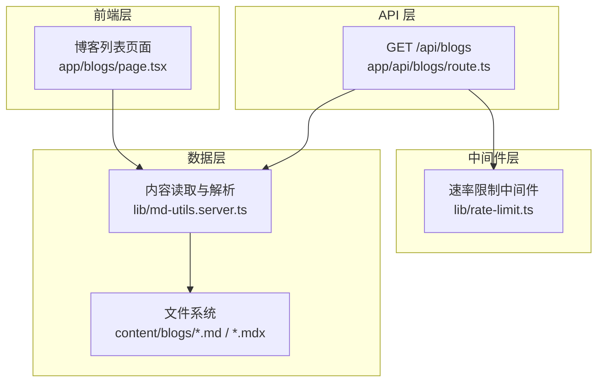
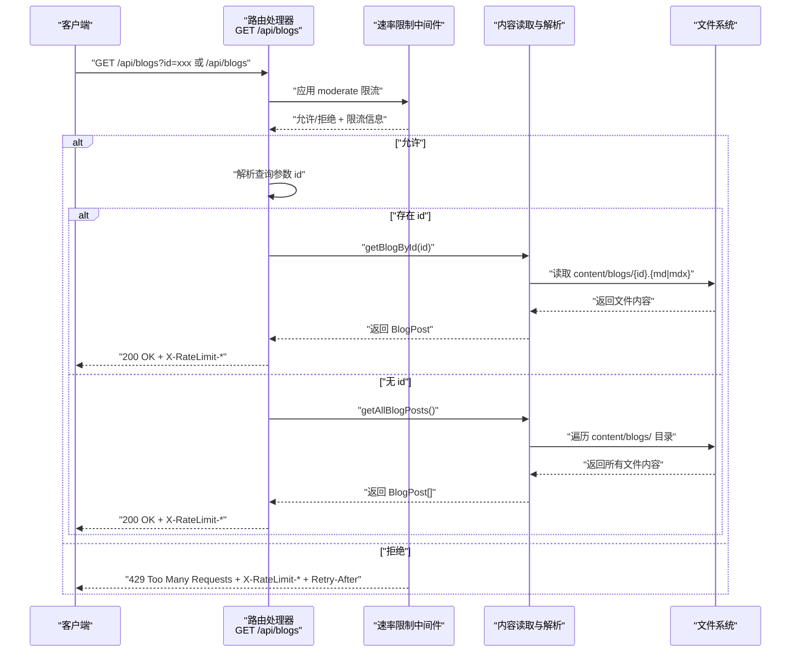
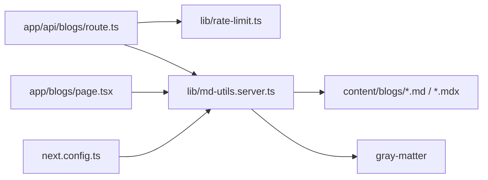
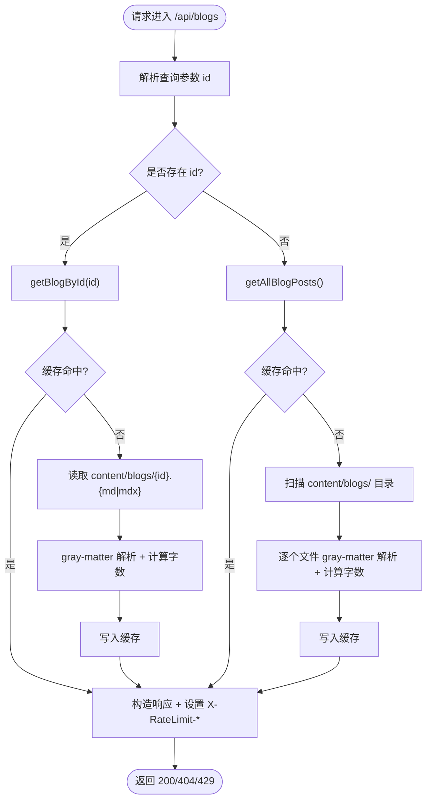

# 博客 API

<cite>
**本文引用的文件**
- [app/api/blogs/route.ts](file://app/api/blogs/route.ts)
- [lib/rate-limit.ts](file://lib/rate-limit.ts)
- [lib/md-utils.server.ts](file://lib/md-utils.server.ts)
- [content/blogs/test-features.mdx](file://content/blogs/test-features.mdx)
- [app/blogs/page.tsx](file://app/blogs/page.tsx)
- [package.json](file://package.json)
- [next.config.ts](file://next.config.ts)
</cite>

## 目录
1. [简介](#简介)
2. [项目结构](#项目结构)
3. [核心组件](#核心组件)
4. [架构总览](#架构总览)
5. [详细组件分析](#详细组件分析)
6. [依赖关系分析](#依赖关系分析)
7. [性能考虑](#性能考虑)
8. [故障排查指南](#故障排查指南)
9. [结论](#结论)
10. [附录](#附录)

## 简介
本文件面向博客 API 的使用者与维护者，聚焦于 GET /api/blogs 接口的实现细节，包括：
- 参数处理（id 查询参数）
- 响应格式与字段说明
- 错误处理机制
- 速率限制中间件（moderate 预设配置）及其 X-RateLimit-* 响应头含义
- 博客文章数据获取流程（从文件系统读取 MDX 到内存缓存再到 API 响应）
- 典型请求/响应示例（成功与 404 场景）
- 使用 id 获取特定文章与不带参数获取全部文章的差异
- 性能优化建议与最佳实践

## 项目结构
博客 API 位于 Next.js App Router 的 app/api 下，采用“路由处理器”模式。核心文件如下：
- 路由处理器：app/api/blogs/route.ts
- 速率限制中间件：lib/rate-limit.ts
- 内容读取与解析：lib/md-utils.server.ts
- 示例内容：content/blogs/test-features.mdx
- 前端页面：app/blogs/page.tsx
- 构建配置：next.config.ts
- 依赖声明：package.json

图表来源
- [app/api/blogs/route.ts:10-61](file://app/api/blogs/route.ts#L10-L61)
- [lib/rate-limit.ts:150-197](file://lib/rate-limit.ts#L150-L197)
- [lib/md-utils.server.ts:136-218](file://lib/md-utils.server.ts#L136-L218)
- [app/blogs/page.tsx:14-21](file://app/blogs/page.tsx#L14-L21)

章节来源
- [app/api/blogs/route.ts:10-61](file://app/api/blogs/route.ts#L10-L61)
- [lib/rate-limit.ts:150-197](file://lib/rate-limit.ts#L150-L197)
- [lib/md-utils.server.ts:136-218](file://lib/md-utils.server.ts#L136-L218)
- [app/blogs/page.tsx:14-21](file://app/blogs/page.tsx#L14-L21)

## 核心组件
- 路由处理器：负责接收请求、应用速率限制、解析查询参数、调用内容读取函数、构造响应并设置 X-RateLimit-* 头。
- 速率限制中间件：基于内存的滑动窗口限流，支持多种预设配置；在超限时返回 429 并附带速率限制相关响应头。
- 内容读取与解析：使用 gray-matter 解析 MD/MDX 文件，提取 frontmatter 与正文，计算字数，封装为统一的 BlogPost 结构；使用 React 缓存装饰器进行内存缓存。

章节来源
- [app/api/blogs/route.ts:10-61](file://app/api/blogs/route.ts#L10-L61)
- [lib/rate-limit.ts:150-197](file://lib/rate-limit.ts#L150-L197)
- [lib/md-utils.server.ts:11-28](file://lib/md-utils.server.ts#L11-L28)

## 架构总览
下图展示了 GET /api/blogs 的端到端调用链路，包括参数解析、限流、数据读取与响应头设置。

图表来源
- [app/api/blogs/route.ts:10-61](file://app/api/blogs/route.ts#L10-L61)
- [lib/rate-limit.ts:150-197](file://lib/rate-limit.ts#L150-L197)
- [lib/md-utils.server.ts:136-218](file://lib/md-utils.server.ts#L136-L218)

## 详细组件分析

### 路由处理器（GET /api/blogs）
- 速率限制：使用 moderate 预设（每分钟 30 次）。若中间件报错，记录日志并继续处理请求。
- 参数处理：从 URL 查询字符串中读取 id。
- 分支逻辑：
  - 存在 id：调用 getBlogById(id)，若找到返回 200，否则返回 404。
  - 不存在 id：调用 getAllBlogPosts() 返回所有文章。
- 响应头：当启用限流时，统一设置 X-RateLimit-Limit、X-RateLimit-Remaining、X-RateLimit-Reset。

章节来源
- [app/api/blogs/route.ts:10-61](file://app/api/blogs/route.ts#L10-L61)

### 速率限制中间件（moderate 预设）
- 配置：每分钟最多 30 次请求。
- 实现：基于内存 Map 的滑动窗口计数器，定期清理过期记录。
- 超限时响应：返回 429，包含错误信息与 X-RateLimit-* 响应头，同时设置 Retry-After。
- 响应头含义：
  - X-RateLimit-Limit：当前时间窗口的请求上限。
  - X-RateLimit-Remaining：当前时间窗口剩余可请求数。
  - X-RateLimit-Reset：时间窗口重置的 UTC ISO 时间。
  - Retry-After：建议客户端等待的秒数。

章节来源
- [lib/rate-limit.ts:202-213](file://lib/rate-limit.ts#L202-L213)
- [lib/rate-limit.ts:150-197](file://lib/rate-limit.ts#L150-L197)

### 内容读取与解析（MDX/MD）
- 目录：content/blogs/
- 解析：使用 gray-matter 提取 frontmatter 与正文，支持 .md 与 .mdx。
- 字数统计：去除 markdown 标记后统计英文单词、中文字符与数字，得到总字数。
- 数据模型：统一为 BlogPost 接口，包含 id、title、excerpt、content、mdxContent、date、readTime、views、comments、imageUrl、slug、tags、status、wordCount、aiInvolvement、noteType 等字段。
- 缓存：使用 React 缓存装饰器对 getAllBlogPosts/getBlogById 进行内存缓存，避免重复 IO。

章节来源
- [lib/md-utils.server.ts:11-28](file://lib/md-utils.server.ts#L11-L28)
- [lib/md-utils.server.ts:49-70](file://lib/md-utils.server.ts#L49-L70)
- [lib/md-utils.server.ts:136-218](file://lib/md-utils.server.ts#L136-L218)
- [content/blogs/test-features.mdx:1-133](file://content/blogs/test-features.mdx#L1-L133)

### 前端页面与数据一致性
- 前端博客列表页面同样调用 getAllBlogPosts() 获取数据，确保前后端数据一致。
- 前端页面会对文章按发布状态过滤并按日期倒序排序。

章节来源
- [app/blogs/page.tsx:14-21](file://app/blogs/page.tsx#L14-L21)
- [lib/md-utils.server.ts:136-138](file://lib/md-utils.server.ts#L136-L138)

## 依赖关系分析
- 路由处理器依赖：
  - 速率限制中间件（moderate 预设）
  - 内容读取函数（getAllBlogPosts/getBlogById）
- 内容读取函数依赖：
  - 文件系统（content/blogs/）
  - gray-matter（解析 frontmatter 与正文）
  - React 缓存（内存缓存）
- 构建配置：
  - next.config.ts 支持 .md/.mdx 扩展名，便于 MDX 内容集成。

图表来源
- [app/api/blogs/route.ts:6-8](file://app/api/blogs/route.ts#L6-L8)
- [lib/rate-limit.ts:6](file://lib/rate-limit.ts#L6)
- [lib/md-utils.server.ts:6-8](file://lib/md-utils.server.ts#L6-L8)
- [next.config.ts:11-12](file://next.config.ts#L11-L12)

章节来源
- [app/api/blogs/route.ts:6-8](file://app/api/blogs/route.ts#L6-L8)
- [lib/md-utils.server.ts:6-8](file://lib/md-utils.server.ts#L6-L8)
- [next.config.ts:11-12](file://next.config.ts#L11-L12)

## 性能考虑
- 内存缓存：内容读取函数使用 React 缓存装饰器，避免重复读取磁盘与解析，显著降低 IO 开销。
- 限流策略：moderate 预设（每分钟 30 次）在保证可用性的同时控制资源消耗；生产环境建议使用 Redis 存储以跨实例共享计数。
- 字数统计：在解析阶段一次性计算，避免前端重复计算；如需进一步优化，可在构建时预计算并写入 frontmatter。
- 文件系统扫描：仅在首次调用时扫描目录并缓存结果；后续请求直接命中缓存。
- 响应头：统一注入 X-RateLimit-*，便于客户端自适应重试与节流。

章节来源
- [lib/md-utils.server.ts:136-138](file://lib/md-utils.server.ts#L136-L138)
- [lib/rate-limit.ts:202-213](file://lib/rate-limit.ts#L202-L213)
- [lib/rate-limit.ts:26-42](file://lib/rate-limit.ts#L26-L42)

## 故障排查指南
- 404 未找到文章
  - 现象：当 id 对应的文章不存在时，返回 404，消息为“Blog not found”。
  - 排查：确认 id 是否正确，文件是否存在于 content/blogs/ 目录且扩展名为 .md 或 .mdx。
- 429 请求过多
  - 现象：超过 moderate 限制时返回 429，包含 X-RateLimit-* 与 Retry-After。
  - 排查：检查客户端重试策略，合理退避；必要时升级到更宽松的预设或使用 Redis 存储。
- 速率限制中间件异常
  - 现象：中间件抛错时，路由记录错误并继续处理请求。
  - 排查：检查请求头中 x-forwarded-for/x-real-ip/cf-connecting-ip 的可用性，确保能正确识别客户端 IP。
- 响应头缺失
  - 现象：正常响应缺少 X-RateLimit-*。
  - 排查：确认路由中是否正确传递 rateLimit 信息并设置响应头。

章节来源
- [app/api/blogs/route.ts:42-46](file://app/api/blogs/route.ts#L42-L46)
- [lib/rate-limit.ts:164-189](file://lib/rate-limit.ts#L164-L189)
- [lib/rate-limit.ts:107-128](file://lib/rate-limit.ts#L107-L128)

## 结论
GET /api/blogs 接口通过“路由处理器 + 速率限制中间件 + 内容读取与解析”的清晰分层，实现了稳定、可扩展的博客数据 API。其 moderate 限流策略兼顾性能与安全，内存缓存有效降低了 IO 成本。结合统一的 BlogPost 数据模型与 X-RateLimit-* 响应头，客户端可获得一致、可观测的体验。

## 附录

### 接口定义与示例

- 端点
  - 方法：GET
  - 路径：/api/blogs
  - 查询参数：
    - id：可选。用于获取特定文章；省略则返回全部文章。

- 成功响应（200 OK）
  - 不带 id：返回 BlogPost[]。
  - 带 id：返回单个 BlogPost。
  - 响应头：X-RateLimit-Limit、X-RateLimit-Remaining、X-RateLimit-Reset（若启用限流）。

- 错误响应
  - 404：当 id 对应文章不存在时返回错误消息。
  - 429：超出限流时返回错误消息与 Retry-After。

- 示例请求
  - 获取全部文章：GET /api/blogs
  - 获取特定文章：GET /api/blogs?id=xxx

- 示例响应（成功）
  - 全部文章：数组形式的 BlogPost[]
  - 特定文章：单个 BlogPost 对象

- 示例响应（404）
  - { "error": "Blog not found" }

- 示例响应（429）
  - { "error": "Too many requests", "message": "...", "limit": 30, "remaining": 0, "resetTime": "..." }
  - 响应头：X-RateLimit-Limit、X-RateLimit-Remaining、X-RateLimit-Reset、Retry-After

- 数据模型（BlogPost）
  - 字段概览：id、title、excerpt、content、mdxContent、date、readTime、views、comments、imageUrl、slug、tags、status、wordCount、aiInvolvement、noteType

章节来源
- [app/api/blogs/route.ts:24-60](file://app/api/blogs/route.ts#L24-L60)
- [lib/rate-limit.ts:164-189](file://lib/rate-limit.ts#L164-L189)
- [lib/md-utils.server.ts:11-28](file://lib/md-utils.server.ts#L11-L28)
- [content/blogs/test-features.mdx:1-133](file://content/blogs/test-features.mdx#L1-L133)

### 速率限制中间件使用说明（moderate 预设）
- 预设配置：每分钟 30 次请求。
- 使用方式：在路由处理器中调用 rateLimitMiddleware(request, rateLimitPresets.moderate)，根据返回值决定是否放行或返回 429。
- 响应头：X-RateLimit-Limit、X-RateLimit-Remaining、X-RateLimit-Reset、Retry-After。

章节来源
- [lib/rate-limit.ts:202-213](file://lib/rate-limit.ts#L202-L213)
- [lib/rate-limit.ts:150-197](file://lib/rate-limit.ts#L150-L197)
- [app/api/blogs/route.ts:12-22](file://app/api/blogs/route.ts#L12-L22)

### 数据获取流程（文件系统 → 内存缓存 → API 响应）

图表来源
- [app/api/blogs/route.ts:24-60](file://app/api/blogs/route.ts#L24-L60)
- [lib/md-utils.server.ts:136-218](file://lib/md-utils.server.ts#L136-L218)