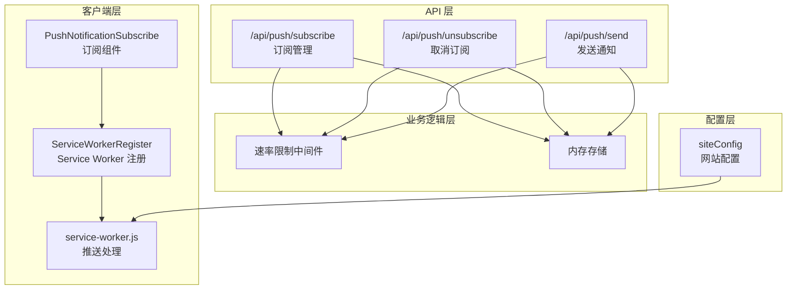
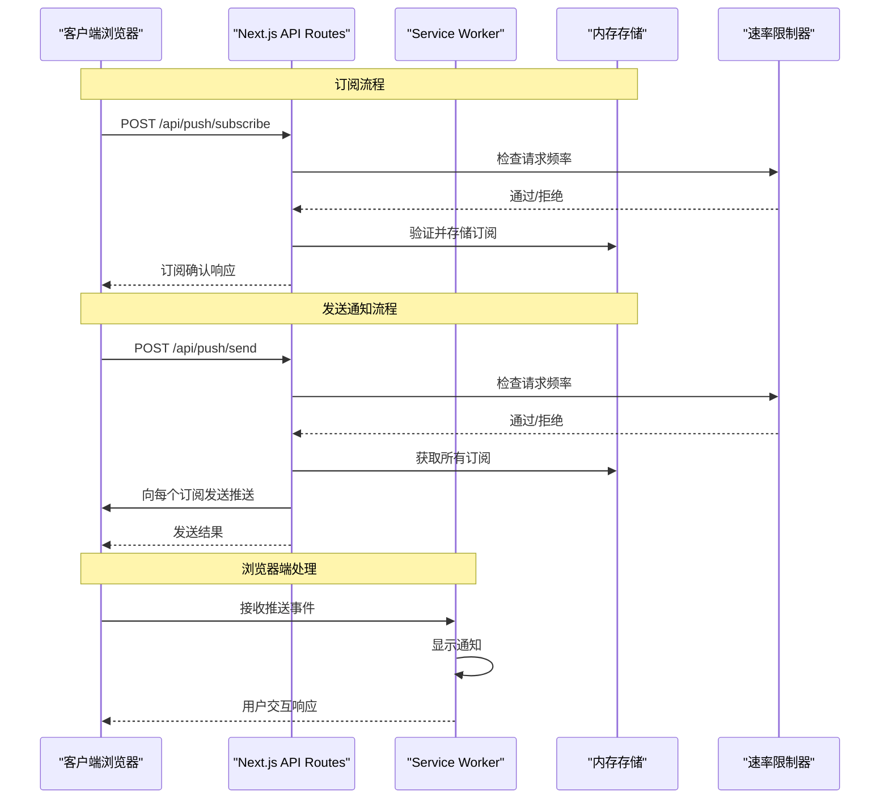
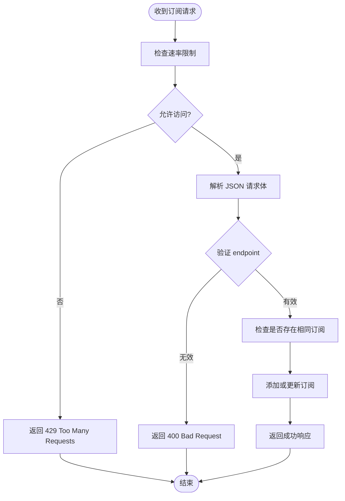
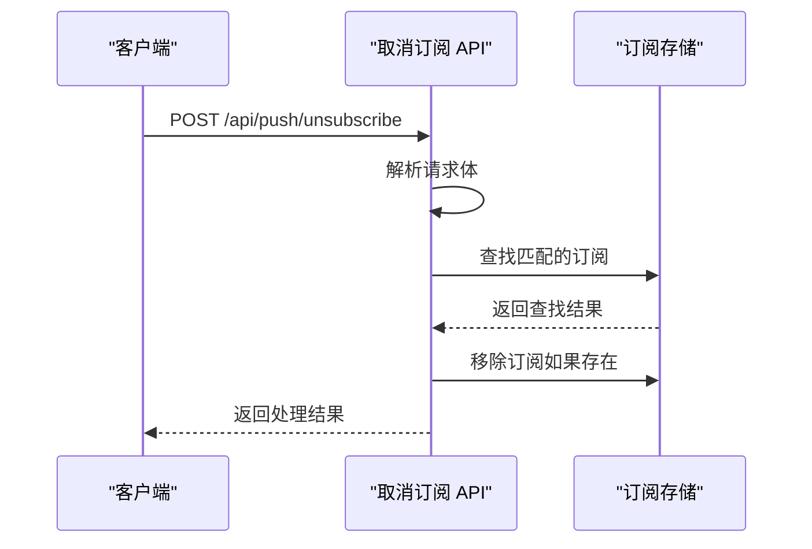
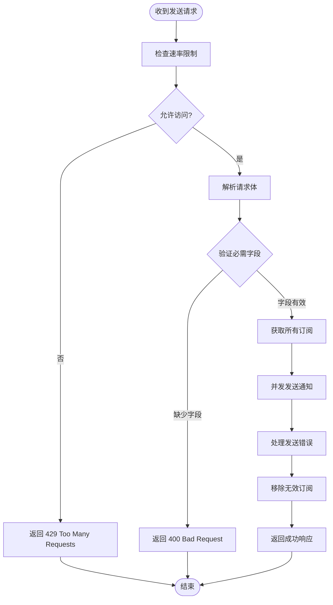
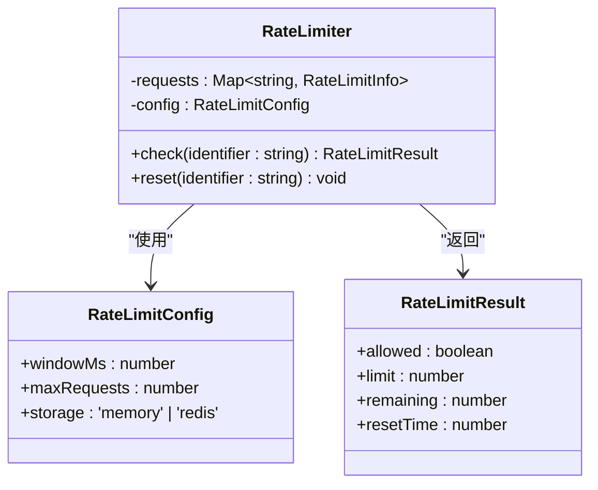
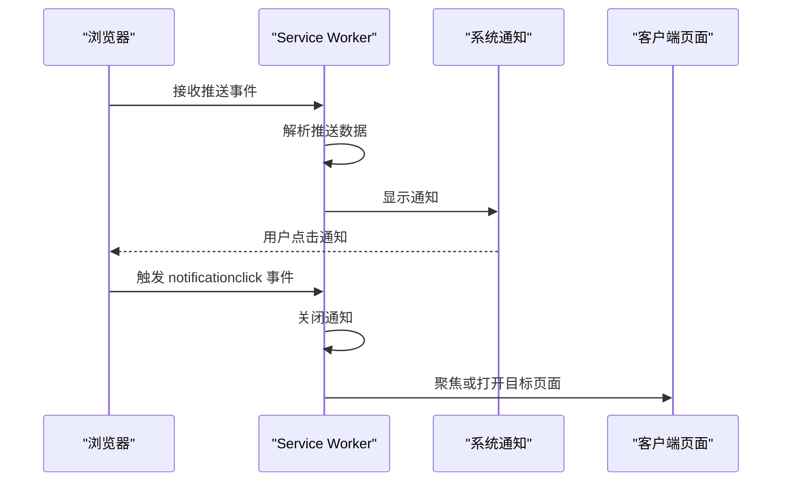
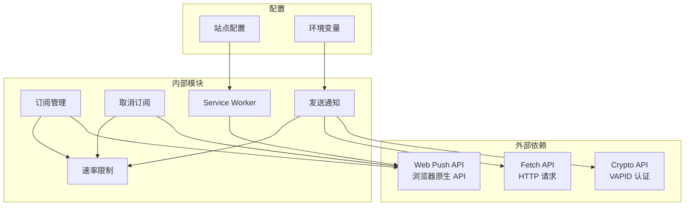

# 推送通知 API

<cite>
**本文引用的文件**
- [app/api/push/subscribe/route.ts](file://app/api/push/subscribe/route.ts)
- [app/api/push/unsubscribe/route.ts](file://app/api/push/unsubscribe/route.ts)
- [app/api/push/send/route.ts](file://app/api/push/send/route.ts)
- [lib/rate-limit.ts](file://lib/rate-limit.ts)
- [components/common/ServiceWorkerRegister.tsx](file://components/common/ServiceWorkerRegister.tsx)
- [components/common/PushNotificationSubscribe.tsx](file://components/common/PushNotificationSubscribe.tsx)
- [public/service-worker.js](file://public/service-worker.js)
- [public/sw.js](file://public/sw.js)
- [lib/config.ts](file://lib/config.ts)
</cite>

## 目录
1. [简介](#简介)
2. [项目结构](#项目结构)
3. [核心组件](#核心组件)
4. [架构概览](#架构概览)
5. [详细组件分析](#详细组件分析)
6. [依赖关系分析](#依赖关系分析)
7. [性能考量](#性能考量)
8. [故障排除指南](#故障排除指南)
9. [结论](#结论)
10. [附录](#附录)

## 简介
本文件为推送通知系统 API 的完整技术文档。该系统实现了基于 Web Push 协议的通知功能，包含三个核心接口：
- POST /api/push/subscribe：订阅管理
- POST /api/push/unsubscribe：取消订阅
- POST /api/push/send：通知发送

系统采用 Next.js API Routes 构建，结合 Service Worker 实现浏览器端的通知接收与处理。文档详细说明了每个接口的请求格式、响应结构、错误处理机制，以及推送通知的安全考虑、客户端集成示例、生命周期管理、调试指南和生产环境配置建议。

## 项目结构
推送通知相关的核心文件分布如下：



**图表来源**
- [app/api/push/subscribe/route.ts:1-66](file://app/api/push/subscribe/route.ts#L1-L66)
- [app/api/push/unsubscribe/route.ts:1-33](file://app/api/push/unsubscribe/route.ts#L1-L33)
- [app/api/push/send/route.ts:1-78](file://app/api/push/send/route.ts#L1-L78)
- [lib/rate-limit.ts:1-214](file://lib/rate-limit.ts#L1-L214)
- [components/common/ServiceWorkerRegister.tsx:1-21](file://components/common/ServiceWorkerRegister.tsx#L1-L21)
- [public/service-worker.js:1-131](file://public/service-worker.js#L1-L131)

**章节来源**
- [app/api/push/subscribe/route.ts:1-66](file://app/api/push/subscribe/route.ts#L1-L66)
- [app/api/push/unsubscribe/route.ts:1-33](file://app/api/push/unsubscribe/route.ts#L1-L33)
- [app/api/push/send/route.ts:1-78](file://app/api/push/send/route.ts#L1-L78)
- [lib/rate-limit.ts:1-214](file://lib/rate-limit.ts#L1-L214)
- [components/common/ServiceWorkerRegister.tsx:1-21](file://components/common/ServiceWorkerRegister.tsx#L1-L21)
- [public/service-worker.js:1-131](file://public/service-worker.js#L1-L131)

## 核心组件
推送通知系统由以下核心组件构成：

### 1. 订阅管理组件
负责处理用户的推送通知订阅请求，包含速率限制和数据验证功能。

### 2. 取消订阅组件
处理用户的取消订阅请求，支持重复调用的安全处理。

### 3. 通知发送组件
向所有已订阅用户发送推送通知，包含 VAPID 认证和错误处理。

### 4. 速率限制中间件
提供基于内存的请求频率控制，支持多种预设配置。

### 5. Service Worker
处理浏览器端的通知接收、显示和点击事件。

**章节来源**
- [app/api/push/subscribe/route.ts:1-66](file://app/api/push/subscribe/route.ts#L1-L66)
- [app/api/push/unsubscribe/route.ts:1-33](file://app/api/push/unsubscribe/route.ts#L1-L33)
- [app/api/push/send/route.ts:1-78](file://app/api/push/send/route.ts#L1-L78)
- [lib/rate-limit.ts:1-214](file://lib/rate-limit.ts#L1-L214)
- [public/service-worker.js:92-130](file://public/service-worker.js#L92-L130)

## 架构概览
系统采用分层架构设计，确保职责分离和可维护性：



**图表来源**
- [app/api/push/subscribe/route.ts:12-65](file://app/api/push/subscribe/route.ts#L12-L65)
- [app/api/push/send/route.ts:15-77](file://app/api/push/send/route.ts#L15-L77)
- [public/service-worker.js:92-130](file://public/service-worker.js#L92-L130)

## 详细组件分析

### 订阅管理接口 (POST /api/push/subscribe)
该接口负责处理用户的推送通知订阅请求，具有以下特性：

#### 请求格式
- **方法**: POST
- **路径**: `/api/push/subscribe`
- **内容类型**: `application/json`
- **请求体**: PushSubscription 对象

#### 响应结构
- **成功响应**: `{ success: true }`
- **错误响应**: `{ success: false, error: string }`

#### 数据验证
接口对订阅数据进行严格验证，确保包含必要的 endpoint 字段。

#### 速率限制
采用严格的速率限制策略，每分钟最多 5 次订阅请求。



**图表来源**
- [app/api/push/subscribe/route.ts:12-65](file://app/api/push/subscribe/route.ts#L12-L65)

**章节来源**
- [app/api/push/subscribe/route.ts:1-66](file://app/api/push/subscribe/route.ts#L1-L66)

### 取消订阅接口 (POST /api/push/unsubscribe)
该接口处理用户的取消订阅请求，提供幂等操作支持。

#### 请求格式
- **方法**: POST
- **路径**: `/api/push/unsubscribe`
- **内容类型**: `application/json`
- **请求体**: 包含 endpoint 的对象

#### 响应结构
- **成功响应**: `{ success: true }` 或 `{ success: true, message: 'Subscription not found' }`
- **错误响应**: `{ success: false, error: string }`

#### 幂等处理
支持重复调用，即使订阅不存在也不会报错。



**图表来源**
- [app/api/push/unsubscribe/route.ts:11-32](file://app/api/push/unsubscribe/route.ts#L11-L32)

**章节来源**
- [app/api/push/unsubscribe/route.ts:1-33](file://app/api/push/unsubscribe/route.ts#L1-L33)

### 通知发送接口 (POST /api/push/send)
该接口向所有已订阅用户发送推送通知，包含完整的错误处理机制。

#### 请求格式
- **方法**: POST
- **路径**: `/api/push/send`
- **内容类型**: `application/json`
- **请求体**: `{ title: string, body: string, url?: string }`

#### 响应结构
- **成功响应**: `{ success: true, message: string }`
- **错误响应**: `{ success: false, error: string }`

#### VAPID 认证
使用 VAPID (Voluntary Application-Server Identification) 协议进行认证，确保通知发送的安全性。

#### 并发处理
使用 Promise.all 并发向所有订阅者发送通知，提高处理效率。



**图表来源**
- [app/api/push/send/route.ts:15-77](file://app/api/push/send/route.ts#L15-L77)

**章节来源**
- [app/api/push/send/route.ts:1-78](file://app/api/push/send/route.ts#L1-L78)

### 速率限制中间件
提供灵活的请求频率控制机制：

#### 配置选项
- **内存存储**: 默认存储方式，重启后重置
- **Redis 存储**: 生产环境推荐，支持分布式部署
- **预设配置**: 支持严格、中等、宽松等多种配置

#### IP 地址检测
自动检测客户端真实 IP 地址，支持多种代理头：



**图表来源**
- [lib/rate-limit.ts:26-95](file://lib/rate-limit.ts#L26-L95)

**章节来源**
- [lib/rate-limit.ts:1-214](file://lib/rate-limit.ts#L1-L214)

### Service Worker 集成
浏览器端的推送通知处理逻辑：

#### 推送事件处理
- 接收推送数据
- 配置通知选项（标题、正文、图标、徽章）
- 显示系统通知

#### 通知点击处理
- 关闭已显示的通知
- 在现有窗口中聚焦或打开新窗口
- 支持多标签页管理



**图表来源**
- [public/service-worker.js:92-130](file://public/service-worker.js#L92-L130)

**章节来源**
- [public/service-worker.js:1-131](file://public/service-worker.js#L1-L131)
- [public/sw.js:1-34](file://public/sw.js#L1-L34)

## 依赖关系分析



**图表来源**
- [app/api/push/subscribe/route.ts:6-7](file://app/api/push/subscribe/route.ts#L6-L7)
- [app/api/push/send/route.ts:6-7](file://app/api/push/send/route.ts#L6-L7)
- [public/service-worker.js:92-130](file://public/service-worker.js#L92-L130)

**章节来源**
- [app/api/push/subscribe/route.ts:6-7](file://app/api/push/subscribe/route.ts#L6-L7)
- [app/api/push/send/route.ts:6-7](file://app/api/push/send/route.ts#L6-L7)
- [public/service-worker.js:92-130](file://public/service-worker.js#L92-L130)

## 性能考量
推送通知系统在设计时充分考虑了性能优化：

### 1. 并发处理
- 使用 Promise.all 并发发送通知，避免串行等待
- 异步处理每个订阅者的推送请求

### 2. 内存存储优化
- 采用内存存储减少数据库开销
- 定期清理过期记录，控制内存使用

### 3. 速率限制策略
- 不同接口采用不同的速率限制，平衡安全性与性能
- 提供多种预设配置适应不同场景

### 4. 错误处理优化
- 单个订阅失败不影响整体发送
- 自动移除无效订阅，保持订阅列表质量

## 故障排除指南

### 常见问题及解决方案

#### 1. 订阅失败
**症状**: POST /api/push/subscribe 返回 400 错误
**原因**: 请求体缺少必要的 endpoint 字段
**解决**: 确保前端正确获取并传递 PushSubscription 对象

#### 2. 发送通知超时
**症状**: POST /api/push/send 返回 429 错误
**原因**: 超过速率限制
**解决**: 检查速率限制配置，适当调整请求频率

#### 3. Service Worker 注册失败
**症状**: 控制台显示 Service Worker 注册错误
**原因**: 浏览器不支持或 HTTPS 环境问题
**解决**: 确保使用 HTTPS，检查浏览器兼容性

#### 4. 通知无法显示
**症状**: Service Worker 接收推送但不显示通知
**原因**: 权限未授予或通知配置错误
**解决**: 检查浏览器通知权限设置

### 调试技巧

#### 1. 启用详细日志
- 检查服务器端控制台输出
- 使用浏览器开发者工具 Network 面板监控请求

#### 2. 验证推送数据格式
- 确保推送数据包含 title 和 body 字段
- 检查 URL 字段的有效性

#### 3. 测试订阅流程
- 先测试订阅接口，再测试发送接口
- 验证取消订阅功能的幂等性

**章节来源**
- [app/api/push/subscribe/route.ts:27-32](file://app/api/push/subscribe/route.ts#L27-L32)
- [app/api/push/send/route.ts:29-34](file://app/api/push/send/route.ts#L29-L34)
- [lib/rate-limit.ts:164-189](file://lib/rate-limit.ts#L164-L189)

## 结论
推送通知系统提供了完整的 Web Push 协议实现，具有以下优势：

1. **架构清晰**: 分层设计确保职责分离，易于维护
2. **安全可靠**: 速率限制、数据验证和 VAPID 认证提供多重安全保障
3. **性能优秀**: 并发处理和内存存储优化提升系统性能
4. **易于集成**: 完整的客户端集成示例和详细的 API 文档

系统目前使用内存存储作为演示用途，在生产环境中建议替换为持久化存储方案，并完善权限控制和监控机制。

## 附录

### 客户端集成示例

#### Service Worker 注册
```javascript
// 在应用入口注册 Service Worker
import { ServiceWorkerRegister } from '@/components/common/ServiceWorkerRegister';

function App() {
  return (
    <>
      <ServiceWorkerRegister />
      {/* 其他组件 */}
    </>
  );
}
```

#### 订阅组件使用
```javascript
import PushNotificationSubscribe from '@/components/common/PushNotificationSubscribe';

function NotificationSettings() {
  return (
    <div>
      <PushNotificationSubscribe />
    </div>
  );
}
```

### 生产环境配置建议

#### 1. 存储方案
- **开发环境**: 继续使用内存存储
- **生产环境**: 集成数据库或 Redis 存储订阅信息

#### 2. 安全配置
- 配置真实的 VAPID 密钥
- 实施更严格的速率限制
- 添加用户身份验证

#### 3. 监控和日志
- 添加详细的错误日志
- 实施性能监控
- 设置告警机制

#### 4. 浏览器兼容性
- 检查目标浏览器的支持情况
- 提供降级方案
- 测试不同设备的兼容性

**章节来源**
- [lib/config.ts:1-108](file://lib/config.ts#L1-L108)
- [app/api/push/send/route.ts:12-13](file://app/api/push/send/route.ts#L12-L13)