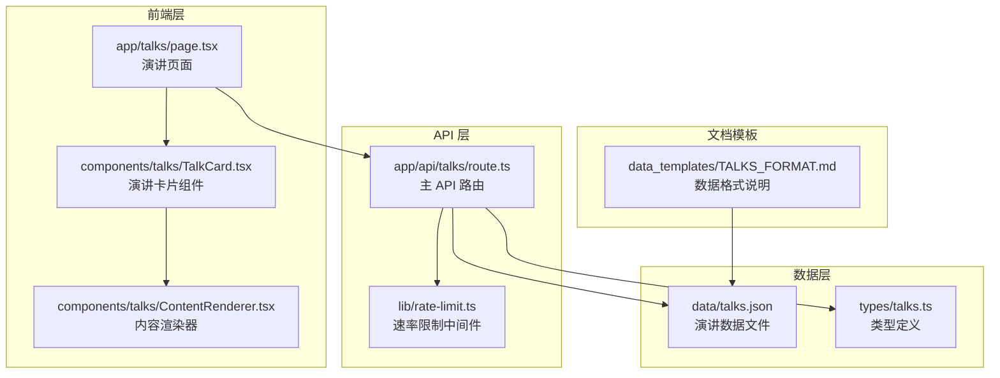
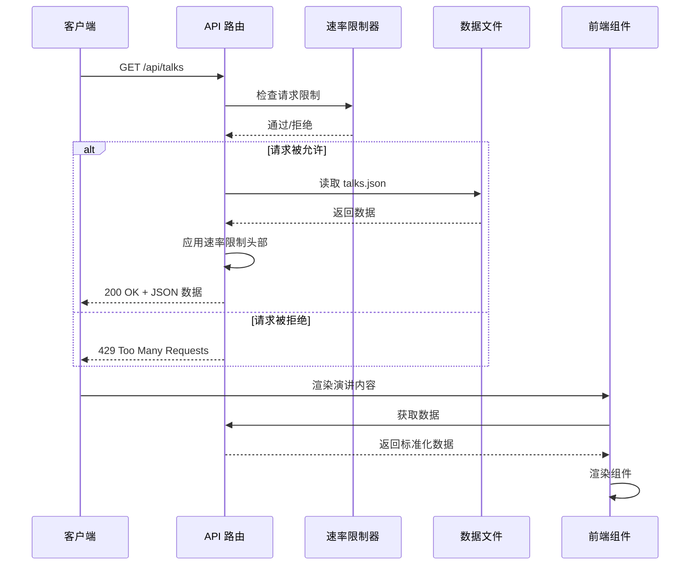
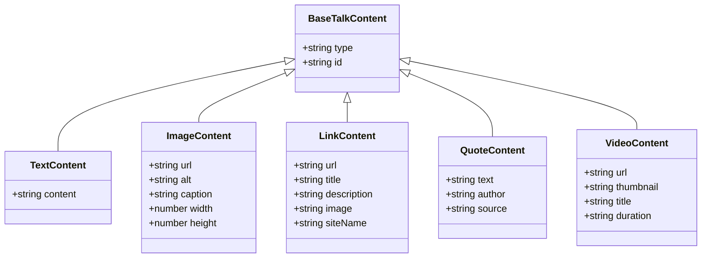
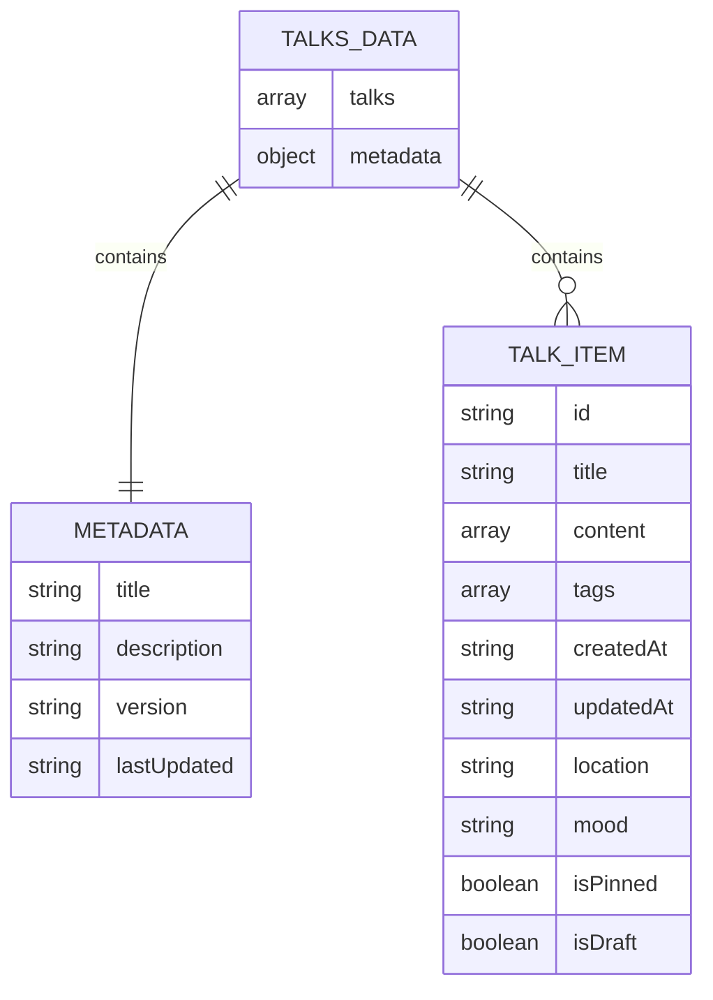
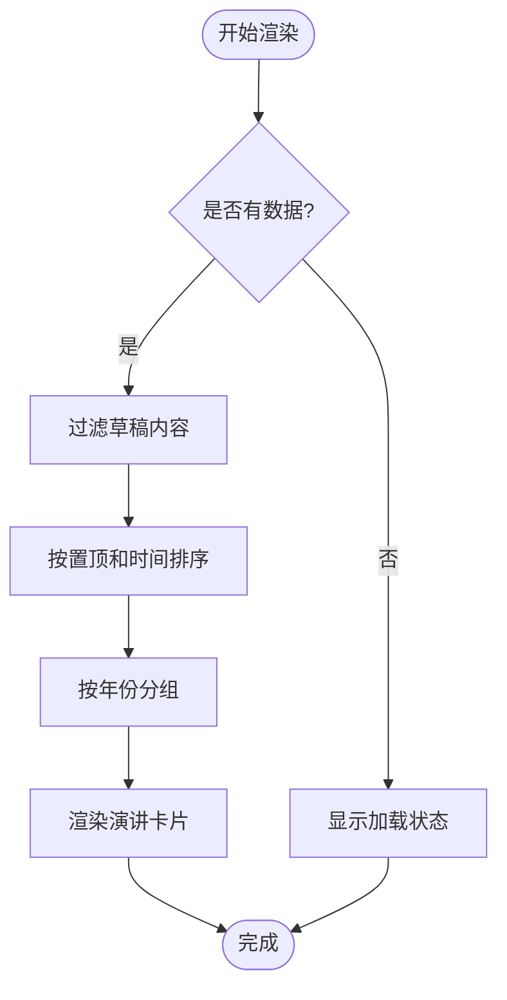

# 演讲内容 API

<cite>
**本文档引用的文件**
- [app/api/talks/route.ts](file://app/api/talks/route.ts)
- [data/talks.json](file://data/talks.json)
- [types/talks.ts](file://types/talks.ts)
- [data_templates/TALKS_FORMAT.md](file://data_templates/TALKS_FORMAT.md)
- [app/talks/page.tsx](file://app/talks/page.tsx)
- [components/talks/TalkCard.tsx](file://components/talks/TalkCard.tsx)
- [components/talks/ContentRenderer.tsx](file://components/talks/ContentRenderer.tsx)
- [lib/rate-limit.ts](file://lib/rate-limit.ts)
</cite>

## 目录
1. [简介](#简介)
2. [项目结构](#项目结构)
3. [核心组件](#核心组件)
4. [架构概览](#架构概览)
5. [详细组件分析](#详细组件分析)
6. [数据模型](#数据模型)
7. [API 接口规范](#api-接口规范)
8. [数据文件格式](#数据文件格式)
9. [前端集成指南](#前端集成指南)
10. [错误处理机制](#错误处理机制)
11. [性能考虑](#性能考虑)
12. [故障排除指南](#故障排除指南)
13. [结论](#结论)

## 简介

演讲内容 API 是一个基于 Next.js 构建的 RESTful API 接口，用于提供演讲内容数据服务。该系统采用静态数据文件驱动的方式，通过 `/api/talks` 端点提供标准化的 JSON 格式响应，支持多种内容类型的展示，包括文本、图片、链接、引用和视频等。

系统设计遵循以下核心原则：
- **静态数据驱动**：使用 JSON 文件作为数据源，简化部署和维护
- **类型安全**：通过 TypeScript 定义完整的数据结构和类型约束
- **响应式设计**：支持前端框架如 React 的实时数据更新
- **速率限制**：内置 API 访问控制机制，防止滥用
- **内容丰富**：支持多种内容类型，满足多样化的展示需求

## 项目结构

该项目采用模块化架构，主要包含以下关键目录和文件：



**图表来源**
- [app/api/talks/route.ts:1-36](file://app/api/talks/route.ts#L1-L36)
- [data/talks.json:1-203](file://data/talks.json#L1-L203)
- [types/talks.ts:1-230](file://types/talks.ts#L1-L230)

**章节来源**
- [app/api/talks/route.ts:1-36](file://app/api/talks/route.ts#L1-L36)
- [data/talks.json:1-203](file://data/talks.json#L1-L203)
- [types/talks.ts:1-230](file://types/talks.ts#L1-L230)

## 核心组件

### API 路由组件

API 路由组件位于 `app/api/talks/route.ts`，负责处理 HTTP GET 请求并返回标准化的演讲数据。

**主要功能特性：**
- 速率限制控制（每分钟 100 次请求）
- 错误处理和异常捕获
- 标准化 JSON 响应格式
- 实时数据读取和缓存

### 数据类型定义

类型定义文件 `types/talks.ts` 提供了完整的 TypeScript 类型系统，确保数据结构的一致性和完整性。

**核心类型包括：**
- `TalkItem`：单个演讲条目的完整数据结构
- `TalkContentItem`：内容项联合类型
- `TalksData`：完整的数据集合结构
- `TalksFilter`：筛选选项接口

### 前端渲染组件

前端组件位于 `components/talks/` 目录，提供丰富的用户界面展示：

- **TalkCard**：演讲卡片组件，负责单个演讲条目的渲染
- **ContentRenderer**：内容渲染器，根据内容类型动态渲染不同组件
- **页面组件**：主页面组件，管理数据获取、筛选和布局

**章节来源**
- [app/api/talks/route.ts:11-35](file://app/api/talks/route.ts#L11-L35)
- [types/talks.ts:113-181](file://types/talks.ts#L113-L181)
- [components/talks/TalkCard.tsx:18-93](file://components/talks/TalkCard.tsx#L18-L93)

## 架构概览

系统采用分层架构设计，清晰分离关注点：



**图表来源**
- [app/api/talks/route.ts:11-35](file://app/api/talks/route.ts#L11-L35)
- [lib/rate-limit.ts:150-197](file://lib/rate-limit.ts#L150-L197)

**章节来源**
- [app/api/talks/route.ts:1-36](file://app/api/talks/route.ts#L1-L36)
- [lib/rate-limit.ts:1-214](file://lib/rate-limit.ts#L1-L214)

## 详细组件分析

### API 路由实现

API 路由组件实现了完整的 RESTful 接口，具有以下特点：

#### 速率限制机制
- 使用内存存储的速率限制器
- 支持多种预设配置（严格、中等、宽松）
- 自动清理过期记录，避免内存泄漏

#### 错误处理策略
- 捕获数据读取异常
- 返回标准化的错误响应
- 记录详细的错误日志

#### 响应头信息
- `X-RateLimit-Limit`：请求限制总数
- `X-RateLimit-Remaining`：剩余请求次数
- `X-RateLimit-Reset`：重置时间

**章节来源**
- [app/api/talks/route.ts:11-35](file://app/api/talks/route.ts#L11-L35)
- [lib/rate-limit.ts:26-95](file://lib/rate-limit.ts#L26-L95)

### 数据类型系统

TypeScript 类型系统提供了强大的类型安全保障：

#### 内容类型层次结构


**图表来源**
- [types/talks.ts:29-86](file://types/talks.ts#L29-L86)

#### 演讲条目结构
`TalkItem` 接口定义了完整的演讲条目数据结构，包括必需字段和可选字段。

**章节来源**
- [types/talks.ts:113-181](file://types/talks.ts#L113-L181)

### 前端渲染组件

前端组件提供了丰富的用户交互体验：

#### 内容渲染器
`ContentRenderer` 组件根据内容类型动态选择合适的渲染组件：
- 文本内容：支持代码块高亮显示
- 图片内容：支持灯箱放大查看
- 链接内容：显示网站 favicon 和预览信息
- 引用内容：优雅的引用样式
- 视频内容：嵌入式视频播放

#### 演讲卡片组件
`TalkCard` 组件负责单个演讲条目的完整渲染，包括：
- 时间轴标记和装饰
- 标题和元信息显示
- 内容块渲染
- 标签胶囊显示
- 动画效果和过渡

**章节来源**
- [components/talks/ContentRenderer.tsx:11-26](file://components/talks/ContentRenderer.tsx#L11-L26)
- [components/talks/TalkCard.tsx:18-93](file://components/talks/TalkCard.tsx#L18-L93)

## 数据模型

### 顶层数据结构

完整的数据模型由两部分组成：



**图表来源**
- [types/talks.ts:188-199](file://types/talks.ts#L188-L199)

### 内容类型定义

每种内容类型都有其特定的字段要求和用途：

#### 文本内容 (text)
- 用于纯文本内容的展示
- 支持代码块语法高亮
- 自动换行和格式保持

#### 图片内容 (image)
- 支持懒加载优化
- 灯箱放大功能
- 可选的替代文本和说明

#### 链接内容 (link)
- 自动提取网站 favicon
- 显示标题、描述和站点名称
- 外部链接安全打开

#### 引用内容 (quote)
- 优雅的引用样式
- 支持作者和来源标注
- 断句和格式化

#### 视频内容 (video)
- 嵌入式视频播放
- 支持多种视频平台
- 可选的缩略图和时长显示

**章节来源**
- [types/talks.ts:19-86](file://types/talks.ts#L19-L86)

## API 接口规范

### 基本信息

- **端点**: `/api/talks`
- **方法**: `GET`
- **响应格式**: JSON
- **内容类型**: `application/json`

### 请求参数

| 参数名 | 类型 | 必需 | 默认值 | 描述 |
|--------|------|------|--------|------|
| 无 |  |  |  | 该接口不需要任何查询参数 |

### 响应结构

#### 成功响应 (200 OK)
```json
{
  "talks": [
    {
      "id": "string",
      "title": "string",
      "content": [],
      "tags": ["string"],
      "createdAt": "string",
      "updatedAt": "string",
      "location": "string",
      "mood": "string",
      "isPinned": boolean,
      "isDraft": boolean
    }
  ],
  "metadata": {
    "title": "string",
    "description": "string",
    "version": "string",
    "lastUpdated": "string"
  }
}
```

#### 速率限制响应 (429 Too Many Requests)
```json
{
  "error": "string",
  "message": "string",
  "limit": number,
  "remaining": number,
  "resetTime": "string"
}
```

#### 服务器错误响应 (500 Internal Server Error)
```json
{
  "error": "Internal server error"
}
```

### 响应头信息

| 头部名称 | 类型 | 描述 |
|----------|------|------|
| `Content-Type` | string | `application/json` |
| `X-RateLimit-Limit` | string | 请求限制总数 |
| `X-RateLimit-Remaining` | string | 剩余请求次数 |
| `X-RateLimit-Reset` | string | 重置时间（ISO 8601） |

**章节来源**
- [app/api/talks/route.ts:21-27](file://app/api/talks/route.ts#L21-L27)
- [lib/rate-limit.ts:167-184](file://lib/rate-limit.ts#L167-L184)

## 数据文件格式

### 文件位置和结构

数据文件位于 `data/talks.json`，采用标准的 JSON 格式：

```json
{
  "talks": [
    {
      "id": "talk-001",
      "title": "关于编程的思考",
      "content": [
        {
          "type": "text",
          "id": "content-001",
          "content": "今天在写代码的时候突然想到..."
        }
      ],
      "tags": ["编程", "思考", "技术"],
      "createdAt": "2024-12-15T10:30:00Z",
      "location": "家里",
      "mood": "思考",
      "isPinned": true
    }
  ],
  "metadata": {
    "title": "碎碎念",
    "description": "记录生活中的点滴思考，分享日常的所见所闻。",
    "version": "1.0.0",
    "lastUpdated": "2024-12-15T10:30:00Z"
  }
}
```

### 字段详细说明

#### 必填字段

| 字段名 | 类型 | 说明 | 示例 |
|--------|------|------|------|
| `id` | string | 唯一标识符，格式为 `"talk-XXX"` | `"talk-001"` |
| `content` | array | 内容数组，至少包含一个内容项 | `[{"type": "text", ...}]` |
| `createdAt` | string | 创建时间，ISO 8601 格式 | `"2024-12-15T10:30:00Z"` |

#### 可选字段

| 字段名 | 类型 | 说明 | 示例 |
|--------|------|------|------|
| `title` | string | 标题，显示在内容上方 | `"今日天气"` |
| `tags` | array | 标签数组，用于分类筛选 | `["生活", "天气"]` |
| `mood` | string | 心情状态，支持预定义值 | `"愉快"` |
| `location` | string | 发布地点 | `"咖啡馆"` |
| `isPinned` | boolean | 是否置顶显示 | `true` |
| `isDraft` | boolean | 是否为草稿（不显示） | `false` |
| `updatedAt` | string | 更新时间，ISO 8601 格式 | `"2024-12-16T08:00:00Z"` |

### 内容类型字段

#### 文本内容 (text)
| 字段名 | 类型 | 必需 | 说明 |
|--------|------|------|------|
| `type` | "text" | ✓ | 固定值 |
| `id` | string | ✓ | 唯一标识符 |
| `content` | string | ✓ | 文本内容，支持换行 |

#### 图片内容 (image)
| 字段名 | 类型 | 必需 | 说明 |
|--------|------|------|------|
| `type` | "image" | ✓ | 固定值 |
| `id` | string | ✓ | 唯一标识符 |
| `url` | string | ✓ | 图片 URL |
| `alt` | string |  | 替代文本 |
| `caption` | string |  | 图片说明 |

#### 链接内容 (link)
| 字段名 | 类型 | 必需 | 说明 |
|--------|------|------|------|
| `type` | "link" | ✓ | 固定值 |
| `id` | string | ✓ | 唯一标识符 |
| `url` | string | ✓ | 链接地址 |
| `title` | string |  | 链接标题 |
| `description` | string |  | 链接描述 |
| `siteName` | string |  | 网站名称 |

#### 引用内容 (quote)
| 字段名 | 类型 | 必需 | 说明 |
|--------|------|------|------|
| `type` | "quote" | ✓ | 固定值 |
| `id` | string | ✓ | 唯一标识符 |
| `text` | string | ✓ | 引用文本 |
| `author` | string |  | 作者名称 |
| `source` | string |  | 来源信息 |

#### 视频内容 (video)
| 字段名 | 类型 | 必需 | 说明 |
|--------|------|------|------|
| `type` | "video" | ✓ | 固定值 |
| `id` | string | ✓ | 唯一标识符 |
| `url` | string | ✓ | 视频嵌入 URL |
| `title` | string |  | 视频标题 |
| `thumbnail` | string |  | 缩略图 URL |
| `duration` | string |  | 视频时长 |

### 数据验证规则

#### 字符串验证
- `id`：必须唯一且符合 `"talk-XXX"` 格式
- `createdAt`：必须为有效的 ISO 8601 时间戳
- `url`：必须为有效的 URL 格式
- `type`：必须为预定义的枚举值之一

#### 数组验证
- `content`：至少包含一个内容项
- `tags`：字符串数组，每个元素不能为空

#### 布尔值验证
- `isPinned`：布尔值，`true` 表示置顶
- `isDraft`：布尔值，`true` 表示隐藏

#### 时间格式验证
- 使用 ISO 8601 标准格式
- 支持 UTC 时间戳
- 时区信息必须包含

**章节来源**
- [data/talks.json:1-203](file://data/talks.json#L1-L203)
- [data_templates/TALKS_FORMAT.md:29-58](file://data_templates/TALKS_FORMAT.md#L29-L58)

## 前端集成指南

### 基础集成示例

前端组件使用 SWR 库进行数据获取和缓存管理：

```typescript
// 使用 SWR 获取演讲数据
const { data, error, isLoading, mutate } = useSWR<TalksData>('/api/talks', fetcher, {
  revalidateOnFocus: false,
  revalidateOnReconnect: true,
  shouldRetryOnError: true,
  errorRetryCount: 3,
  errorRetryInterval: 3000,
});
```

### 数据获取和处理

前端页面组件实现了完整的数据处理逻辑：

#### 数据过滤和排序
- 过滤草稿内容（`isDraft: true` 的条目）
- 按置顶状态优先级排序
- 按创建时间降序排列

#### 筛选功能
- 按心情状态筛选
- 按标签筛选
- 实时筛选结果更新

#### 分组显示
- 按年份对演讲内容进行分组
- 时间轴样式展示
- 年份标题自动生成

### 组件集成模式

#### 内容渲染流程


**图表来源**
- [app/talks/page.tsx:134-143](file://app/talks/page.tsx#L134-L143)

#### 错误处理机制
- 网络错误：显示重试按钮
- 404 错误：提示接口不存在
- 服务器错误：显示错误信息
- 自动重试：最多 3 次重试

### 最佳实践

#### 性能优化
- 使用 SWR 进行缓存管理
- 实现骨架屏提升用户体验
- 图片懒加载减少初始加载时间
- 防抖和节流优化筛选操作

#### 用户体验
- 渐进式动画效果
- 响应式设计适配移动端
- 无障碍访问支持
- 加载状态和错误状态明确提示

#### 数据一致性
- 严格的类型检查
- 数据验证和清理
- 错误边界处理
- 状态同步和更新

**章节来源**
- [app/talks/page.tsx:122-259](file://app/talks/page.tsx#L122-L259)
- [components/talks/ContentRenderer.tsx:11-26](file://components/talks/ContentRenderer.tsx#L11-L26)

## 错误处理机制

### API 错误处理

API 路由实现了多层次的错误处理机制：

#### 速率限制错误
当请求超过设定限制时，返回 429 状态码和详细的错误信息：

```json
{
  "error": "Too many requests",
  "message": "Rate limit exceeded. Try again in 60 seconds.",
  "limit": 100,
  "remaining": 0,
  "resetTime": "2024-12-15T10:30:00Z"
}
```

#### 服务器内部错误
当数据读取或处理过程中发生异常时，返回 500 状态码：

```json
{
  "error": "Internal server error"
}
```

### 前端错误处理

前端组件实现了完善的错误处理策略：

#### 网络错误处理
- 检测 HTTP 状态码
- 显示友好的错误消息
- 提供重试机制
- 自动错误恢复

#### 数据错误处理
- 类型验证失败
- 数据格式错误
- 缺失必要字段
- 数据转换异常

#### 用户界面反馈
- 错误状态指示器
- 重试按钮
- 清晰的错误描述
- 自动恢复机制

**章节来源**
- [app/api/talks/route.ts:28-34](file://app/api/talks/route.ts#L28-L34)
- [lib/rate-limit.ts:164-189](file://lib/rate-limit.ts#L164-L189)
- [app/talks/page.tsx:73-116](file://app/talks/page.tsx#L73-L116)

## 性能考虑

### 速率限制策略

系统实现了灵活的速率限制机制：

#### 配置选项
- **严格模式**：每分钟 10 次请求
- **中等模式**：每分钟 30 次请求  
- **宽松模式**：每分钟 100 次请求
- **小时模式**：每小时 1000 次请求
- **日模式**：每天 10000 次请求

#### 内存管理
- 自动清理过期记录
- 定期任务每分钟执行
- 避免内存泄漏
- 支持生产环境扩展

### 前端性能优化

#### 数据获取优化
- SWR 缓存机制
- 预取和预渲染
- 错误边界处理
- 状态管理优化

#### 渲染性能
- 虚拟滚动（可选）
- 组件懒加载
- 图片优化
- CSS 动画优化

#### 网络优化
- HTTP 缓存头
- 压缩传输
- 连接复用
- CDN 支持

## 故障排除指南

### 常见问题诊断

#### API 无法访问
1. **检查路由配置**：确认 `/api/talks` 路由存在
2. **验证文件权限**：确保 `data/talks.json` 可读
3. **检查网络连接**：确认服务器网络正常
4. **查看日志**：检查服务器错误日志

#### 数据格式错误
1. **验证 JSON 格式**：使用在线 JSON 验证器
2. **检查必需字段**：确认 `id`、`content`、`createdAt` 存在
3. **验证时间格式**：确保 ISO 8601 格式正确
4. **检查数组格式**：确认 `tags` 和 `content` 为数组

#### 前端渲染问题
1. **检查类型定义**：确认 TypeScript 类型匹配
2. **验证组件导入**：确保组件路径正确
3. **检查样式文件**：确认 CSS 类名存在
4. **调试控制台**：查看 JavaScript 错误

### 调试工具和技巧

#### 开发工具
- 浏览器开发者工具
- 网络面板监控
- 控制台错误输出
- 断点调试

#### 日志记录
- API 请求日志
- 错误堆栈跟踪
- 性能指标监控
- 用户行为分析

#### 性能分析
- 加载时间测量
- 内存使用分析
- 网络请求优化
- 缓存命中率统计

**章节来源**
- [app/api/talks/route.ts:29-34](file://app/api/talks/route.ts#L29-L34)
- [data_templates/TALKS_FORMAT.md:239-245](file://data_templates/TALKS_FORMAT.md#L239-L245)

## 结论

演讲内容 API 提供了一个完整、健壮且易于使用的数据服务解决方案。通过静态数据文件驱动的方式，系统实现了简单而高效的架构设计，同时保持了良好的扩展性和维护性。

### 主要优势

1. **简单易用**：基于 JSON 文件的数据源，部署和维护极其简单
2. **类型安全**：完整的 TypeScript 类型定义确保数据一致性
3. **性能优秀**：合理的缓存策略和优化措施保证响应速度
4. **错误处理**：完善的错误处理机制提升系统稳定性
5. **用户体验**：丰富的前端组件提供优秀的用户界面

### 技术特色

- **模块化设计**：清晰的分层架构便于理解和扩展
- **类型系统**：强类型约束确保数据质量
- **响应式渲染**：现代化的前端技术栈
- **性能优化**：多层面的性能优化策略
- **错误处理**：全面的异常处理和恢复机制

### 未来发展方向

1. **数据库集成**：可选的数据库存储方案
2. **实时更新**：WebSocket 或 Server-Sent Events
3. **搜索功能**：全文搜索和高级筛选
4. **内容管理**：可视化的内容编辑界面
5. **多语言支持**：国际化和本地化功能

该系统为构建个人博客、演讲展示和其他内容管理系统提供了坚实的技术基础，具有良好的可扩展性和实用性。