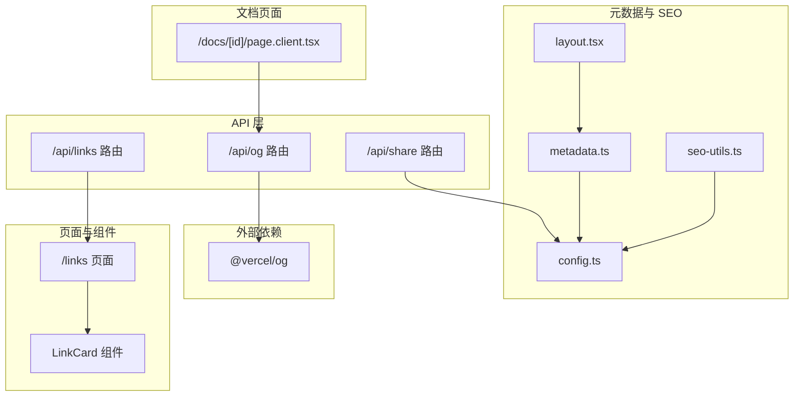
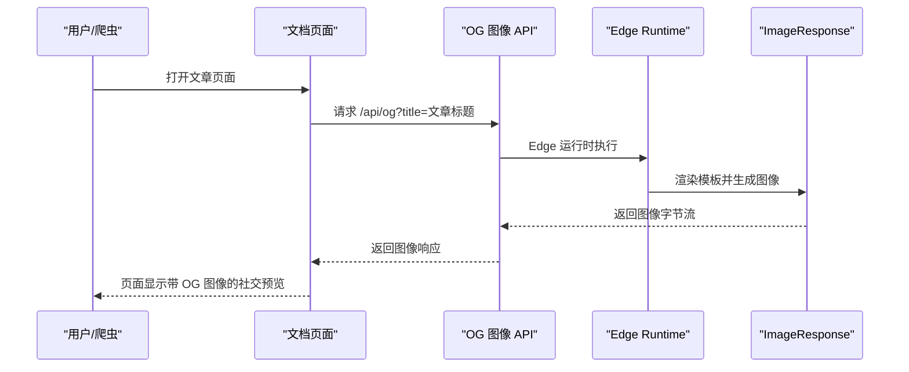
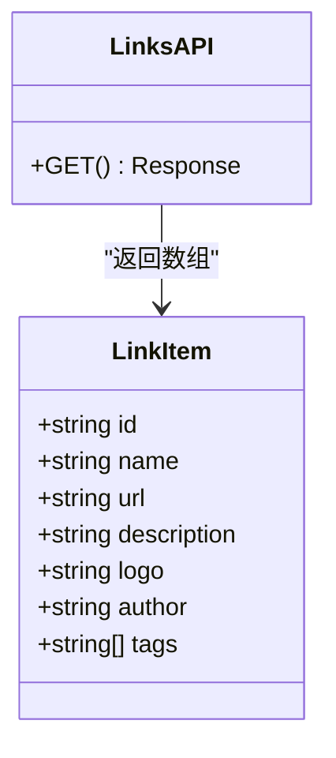
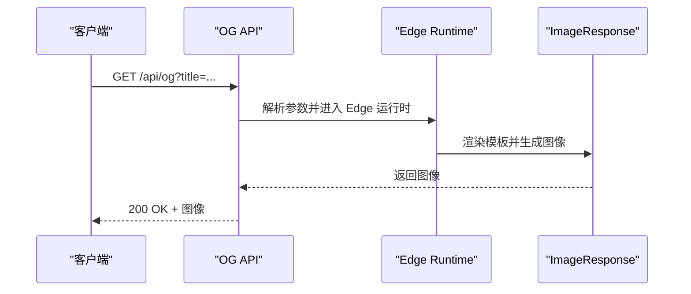
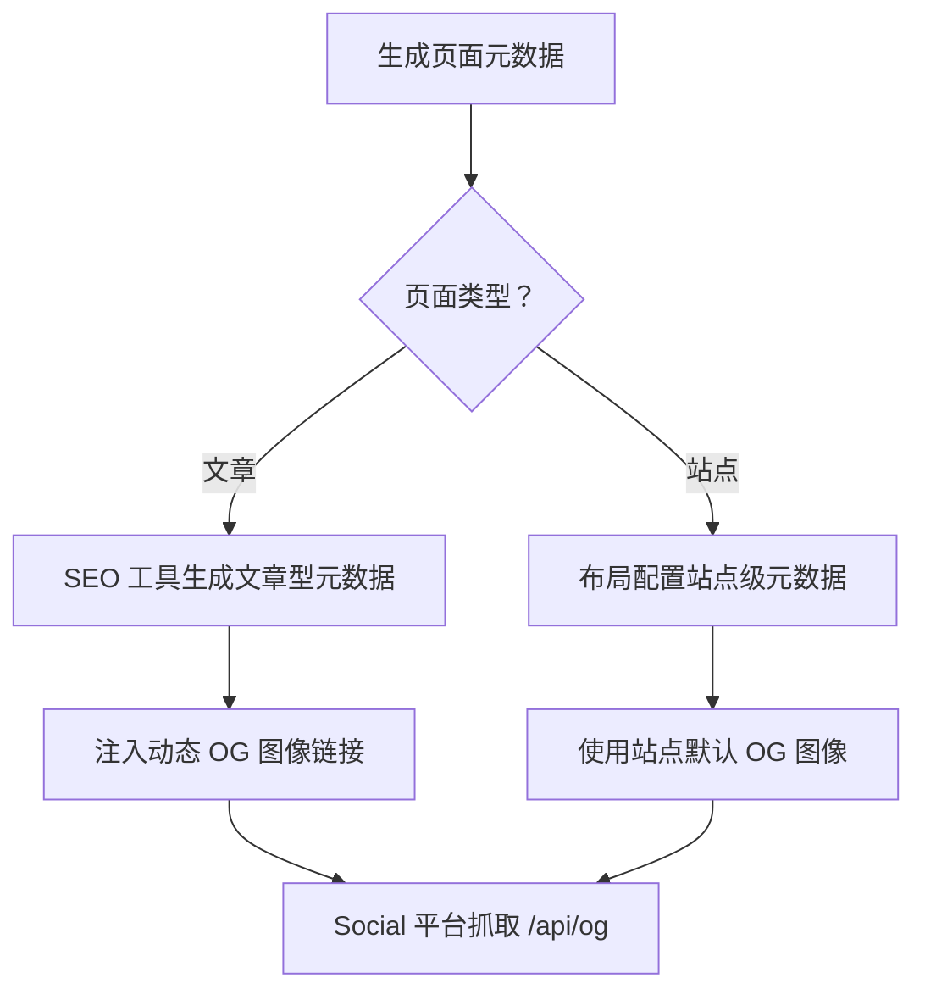
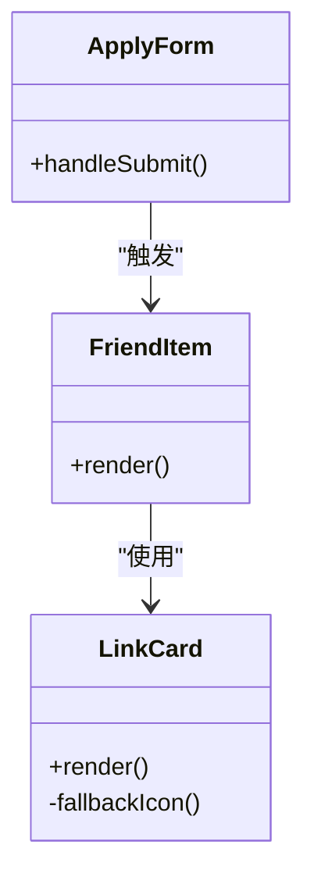
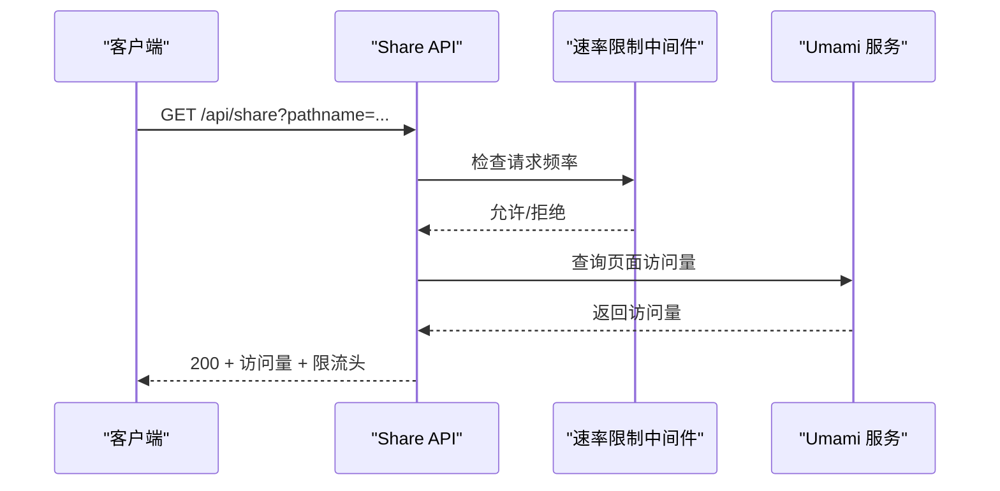
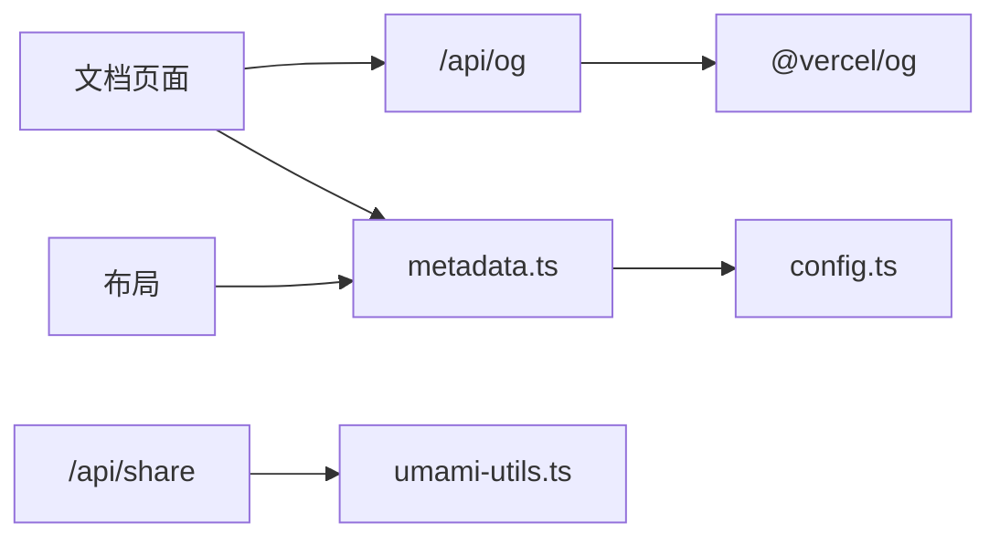

# 链接分享 API

<cite>
**本文引用的文件**
- [app/api/links/route.ts](file://app/api/links/route.ts)
- [app/api/og/route.tsx](file://app/api/og/route.tsx)
- [lib/metadata.ts](file://lib/metadata.ts)
- [lib/seo-utils.ts](file://lib/seo-utils.ts)
- [lib/config.ts](file://lib/config.ts)
- [app/layout.tsx](file://app/layout.tsx)
- [app/links/page.tsx](file://app/links/page.tsx)
- [components/unused/LinkCard.tsx](file://components/unused/LinkCard.tsx)
- [app/api/share/route.ts](file://app/api/share/route.ts)
- [lib/umami-utils.ts](file://lib/umami-utils.ts)
- [docs/[id]/page.client.tsx](file://docs/[id]/page.client.tsx)
- [package.json](file://package.json)
</cite>

## 目录
1. [简介](#简介)
2. [项目结构](#项目结构)
3. [核心组件](#核心组件)
4. [架构总览](#架构总览)
5. [详细组件分析](#详细组件分析)
6. [依赖关系分析](#依赖关系分析)
7. [性能考量](#性能考量)
8. [故障排查指南](#故障排查指南)
9. [结论](#结论)
10. [附录](#附录)

## 简介
本文件面向“链接分享”与“Open Graph 图像生成”的接口实现，重点覆盖：
- GET /api/links：返回链接列表数据，包含标题、描述、图标、作者、标签等元数据字段。
- GET /api/og：基于 Vercel OG 生成器动态渲染社交预览图，支持自定义标题参数。
- 元数据与社交预览：统一的 Open Graph/Twitter 元数据生成策略，以及在页面中正确注入 OG 图像。
- 性能与缓存：图像生成的运行时配置、缓存策略与性能优化建议。
- 最佳实践：链接格式标准化、元数据优化、在各社交平台正确显示链接预览。

## 项目结构
围绕链接分享与 OG 图像生成的相关模块分布如下：
- API 层：/app/api/links、/app/api/og、/app/api/share
- 元数据与 SEO 工具：/lib/metadata.ts、/lib/seo-utils.ts、/lib/config.ts、/app/layout.tsx
- 页面与组件：/app/links/page.tsx、/components/unused/LinkCard.tsx
- 文档页面示例：/docs/[id]/page.client.tsx
- 依赖：/package.json 中包含 @vercel/og

图表来源
- [app/api/links/route.ts:1-42](file://app/api/links/route.ts#L1-L42)
- [app/api/og/route.tsx:1-86](file://app/api/og/route.tsx#L1-L86)
- [lib/metadata.ts:1-160](file://lib/metadata.ts#L1-L160)
- [lib/seo-utils.ts:1-54](file://lib/seo-utils.ts#L1-L54)
- [lib/config.ts:1-108](file://lib/config.ts#L1-L108)
- [app/layout.tsx:1-108](file://app/layout.tsx#L1-L108)
- [app/links/page.tsx:1-205](file://app/links/page.tsx#L1-L205)
- [components/unused/LinkCard.tsx:1-61](file://components/unused/LinkCard.tsx#L1-L61)
- [docs/[id]/page.client.tsx](file://docs/[id]/page.client.tsx#L86-L122)
- [package.json:16-45](file://package.json#L16-L45)

章节来源
- [app/api/links/route.ts:1-42](file://app/api/links/route.ts#L1-L42)
- [app/api/og/route.tsx:1-86](file://app/api/og/route.tsx#L1-L86)
- [lib/metadata.ts:1-160](file://lib/metadata.ts#L1-L160)
- [lib/seo-utils.ts:1-54](file://lib/seo-utils.ts#L1-L54)
- [lib/config.ts:1-108](file://lib/config.ts#L1-L108)
- [app/layout.tsx:1-108](file://app/layout.tsx#L1-L108)
- [app/links/page.tsx:1-205](file://app/links/page.tsx#L1-L205)
- [components/unused/LinkCard.tsx:1-61](file://components/unused/LinkCard.tsx#L1-L61)
- [docs/[id]/page.client.tsx](file://docs/[id]/page.client.tsx#L86-L122)
- [package.json:16-45](file://package.json#L16-L45)

## 核心组件
- 链接列表 API：提供标准化的链接数据结构，便于前端展示与社交分享。
- OG 图像生成 API：基于 Vercel OG 的 Edge Runtime，动态生成符合社交平台规范的预览图。
- 元数据生成工具：统一生成 Open Graph/Twitter 元数据，支持文章与站点级配置。
- 页面集成：在文档页面中通过 meta 标签指向 /api/og，实现动态 OG 图像注入。

章节来源
- [app/api/links/route.ts:8-37](file://app/api/links/route.ts#L8-L37)
- [app/api/og/route.tsx:9-85](file://app/api/og/route.tsx#L9-L85)
- [lib/metadata.ts:25-79](file://lib/metadata.ts#L25-L79)
- [docs/[id]/page.client.tsx](file://docs/[id]/page.client.tsx#L86-L94)

## 架构总览
下图展示了“链接分享”与“OG 图像生成”的关键交互流程，包括数据来源、渲染与缓存策略。

图表来源
- [docs/[id]/page.client.tsx](file://docs/[id]/page.client.tsx#L86-L94)
- [app/api/og/route.tsx:11-85](file://app/api/og/route.tsx#L11-L85)

## 详细组件分析

### 链接列表 API：GET /api/links
- 数据结构
  - 字段：id、name、url、description（可选）、logo（可选）、author（可选）、tags（可选）
  - 返回：标准 JSON 数组，每个元素为一个链接条目
- 用途
  - 为“友情链接”页面提供数据源，也可用于社交分享时的链接卡片元数据
- 前端消费
  - 可结合 LinkCard 组件进行展示，自动回退到站点 favicon 或占位图

图表来源
- [app/api/links/route.ts:8-37](file://app/api/links/route.ts#L8-L37)

章节来源
- [app/api/links/route.ts:8-41](file://app/api/links/route.ts#L8-L41)
- [components/unused/LinkCard.tsx:14-58](file://components/unused/LinkCard.tsx#L14-L58)

### OG 图像生成 API：GET /api/og
- 运行时
  - 使用 Edge Runtime，适合低延迟、高并发的图像生成场景
- 参数
  - title：标题文本（默认值为站点名称）
- 渲染
  - 固定尺寸 1200x630 像素，采用简洁的中文字体与品牌色系
  - 包含站点名称、标题与日期等元素
- 输出
  - ImageResponse 返回 PNG/JPEG 图像字节流

图表来源
- [app/api/og/route.tsx:9-85](file://app/api/og/route.tsx#L9-L85)

章节来源
- [app/api/og/route.tsx:11-85](file://app/api/og/route.tsx#L11-L85)
- [package.json](file://package.json#L20)

### 元数据与社交预览：Open Graph/Twitter
- 站点级元数据
  - 在根布局中统一配置 openGraph 与 twitter 字段，使用站点配置中的默认 OG 图像
- 页面级元数据
  - 文章页面通过 SEO 工具生成文章型 openGraph，包含发布时间、标签等
- 动态 OG 图像
  - 文档页面通过 meta 标签指向 /api/og，并传入文章标题作为参数
- 关键字段
  - openGraph.type、openGraph.title、openGraph.description、openGraph.images、openGraph.url、openGraph.siteName
  - twitter.card、twitter.images

图表来源
- [lib/metadata.ts:25-79](file://lib/metadata.ts#L25-L79)
- [lib/seo-utils.ts:9-53](file://lib/seo-utils.ts#L9-L53)
- [app/layout.tsx:35-56](file://app/layout.tsx#L35-L56)
- [docs/[id]/page.client.tsx](file://docs/[id]/page.client.tsx#L86-L94)

章节来源
- [lib/metadata.ts:25-79](file://lib/metadata.ts#L25-L79)
- [lib/seo-utils.ts:9-53](file://lib/seo-utils.ts#L9-L53)
- [app/layout.tsx:35-56](file://app/layout.tsx#L35-L56)
- [docs/[id]/page.client.tsx](file://docs/[id]/page.client.tsx#L86-L94)

### 页面与组件：链接展示与图标回退
- 友链页面
  - 展示一组友链，支持随机排序与申请入口
- LinkCard 组件
  - 自动从 logo 或站点 favicon 生成图标；异常时回退到占位图
  - 支持标签展示与“Visit”按钮

图表来源
- [app/links/page.tsx:44-61](file://app/links/page.tsx#L44-L61)
- [app/links/page.tsx:64-118](file://app/links/page.tsx#L64-L118)
- [components/unused/LinkCard.tsx:14-58](file://components/unused/LinkCard.tsx#L14-L58)

章节来源
- [app/links/page.tsx:44-118](file://app/links/page.tsx#L44-L118)
- [components/unused/LinkCard.tsx:14-58](file://components/unused/LinkCard.tsx#L14-L58)

### 访问量统计 API：GET /api/share
- 作用
  - 根据 pathname 获取页面访问量，对接 Umami 分析服务
- 速率限制
  - 应用中等强度的速率限制中间件
- 错误处理
  - 参数缺失、配置缺失、第三方服务异常均有明确响应

图表来源
- [app/api/share/route.ts:15-72](file://app/api/share/route.ts#L15-L72)
- [lib/umami-utils.ts:260-311](file://lib/umami-utils.ts#L260-L311)

章节来源
- [app/api/share/route.ts:15-72](file://app/api/share/route.ts#L15-L72)
- [lib/umami-utils.ts:260-311](file://lib/umami-utils.ts#L260-L311)

## 依赖关系分析
- 外部依赖
  - @vercel/og：用于在 Edge Runtime 中渲染图像
- 内部依赖
  - 元数据生成依赖站点配置
  - 文档页面依赖 OG API 生成社交预览
  - 访问量 API 依赖 Umami 工具与速率限制中间件

图表来源
- [docs/[id]/page.client.tsx](file://docs/[id]/page.client.tsx#L86-L94)
- [lib/metadata.ts:25-79](file://lib/metadata.ts#L25-L79)
- [lib/config.ts:13-60](file://lib/config.ts#L13-L60)
- [app/api/share/route.ts:7-9](file://app/api/share/route.ts#L7-L9)
- [lib/umami-utils.ts:1-326](file://lib/umami-utils.ts#L1-L326)
- [package.json](file://package.json#L20)

章节来源
- [package.json:16-45](file://package.json#L16-L45)
- [lib/config.ts:13-60](file://lib/config.ts#L13-L60)
- [lib/metadata.ts:25-79](file://lib/metadata.ts#L25-L79)
- [docs/[id]/page.client.tsx](file://docs/[id]/page.client.tsx#L86-L94)
- [app/api/share/route.ts:7-9](file://app/api/share/route.ts#L7-L9)
- [lib/umami-utils.ts:1-326](file://lib/umami-utils.ts#L1-L326)

## 性能考量
- OG 图像生成
  - Edge Runtime：低延迟、就近部署，适合高频请求
  - 固定尺寸与简洁模板：减少渲染复杂度
  - 建议：在社交平台缓存 OG 图像，避免重复生成
- 速率限制
  - /api/share 应用中等强度限流，防止滥用
- 缓存策略
  - Umami 工具对 token 与统计数据做内存缓存，TTL 1 小时
  - 建议：OG 图像可结合 CDN 缓存，或在应用层做短期缓存
- 字体与资源
  - 使用系统字体（Noto Sans SC），减少字体加载开销

章节来源
- [app/api/og/route.tsx:9-85](file://app/api/og/route.tsx#L9-L85)
- [lib/umami-utils.ts:8-326](file://lib/umami-utils.ts#L8-L326)
- [app/api/share/route.ts:16-21](file://app/api/share/route.ts#L16-L21)

## 故障排查指南
- /api/og 无法生成图像
  - 检查 Edge Runtime 配置与 @vercel/og 版本
  - 确认请求参数 title 是否为空
- 社交平台不显示 OG 图像
  - 确认文档页面 meta 标签指向 /api/og 且传入了正确的 title
  - 检查社交平台缓存，尝试清理缓存或强制刷新
- /api/share 返回 500
  - 检查站点配置中的 Umami 基础 URL、用户名、密码、网站 ID 是否齐全
  - 查看限流状态头，确认是否被限流
- 友链图标显示异常
  - 确认 logo 字段或站点 favicon 可访问
  - 组件内置了回退逻辑与错误处理

章节来源
- [app/api/og/route.tsx:11-18](file://app/api/og/route.tsx#L11-L18)
- [docs/[id]/page.client.tsx](file://docs/[id]/page.client.tsx#L86-L94)
- [app/api/share/route.ts:36-44](file://app/api/share/route.ts#L36-L44)
- [components/unused/LinkCard.tsx:18-36](file://components/unused/LinkCard.tsx#L18-L36)

## 结论
本项目通过统一的元数据生成与 /api/og 动态图像生成，实现了在社交平台上的高质量链接预览。配合 /api/links 的标准化数据结构与 /api/share 的访问量统计，形成了完整的“链接分享”能力闭环。建议在生产环境中结合 CDN 与社交平台缓存策略进一步提升性能与稳定性。

## 附录

### 链接数据格式与字段说明
- id：唯一标识符
- name：站点/链接名称
- url：目标链接
- description：简要描述（可选）
- logo：图标地址（可选）
- author：作者/团队（可选）
- tags：标签数组（可选）

章节来源
- [app/api/links/route.ts:8-16](file://app/api/links/route.ts#L8-L16)

### OG 图像生成参数与样式配置
- 参数
  - title：标题文本，默认站点名称
- 尺寸
  - 1200x630 像素（符合主流社交平台要求）
- 样式
  - 背景色、字体、品牌色、绝对定位的站点名称与域名水印
- 自定义建议
  - 可扩展为支持背景图、作者名、时间戳等更多字段
  - 可引入主题变量与多语言支持

章节来源
- [app/api/og/route.tsx:11-85](file://app/api/og/route.tsx#L11-L85)

### 在社交平台正确显示链接预览
- 确保页面 meta 标签包含：
  - og:image 指向 /api/og?title=文章标题
  - twitter:image 同步设置
- 发布前检查：
  - 使用社交平台的预览工具（如 Facebook Sharing Debugger、Twitter Card Validator）
  - 清理平台缓存，强制刷新预览

章节来源
- [docs/[id]/page.client.tsx](file://docs/[id]/page.client.tsx#L86-L94)