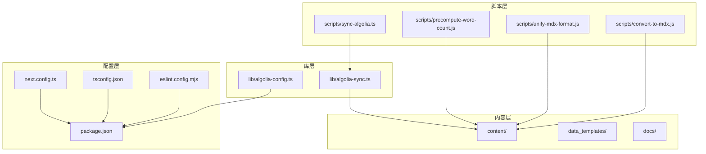
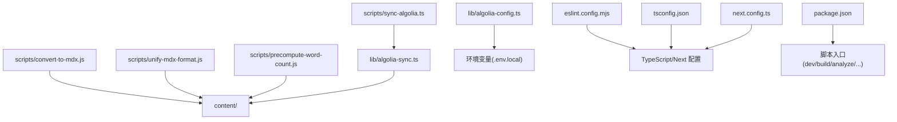
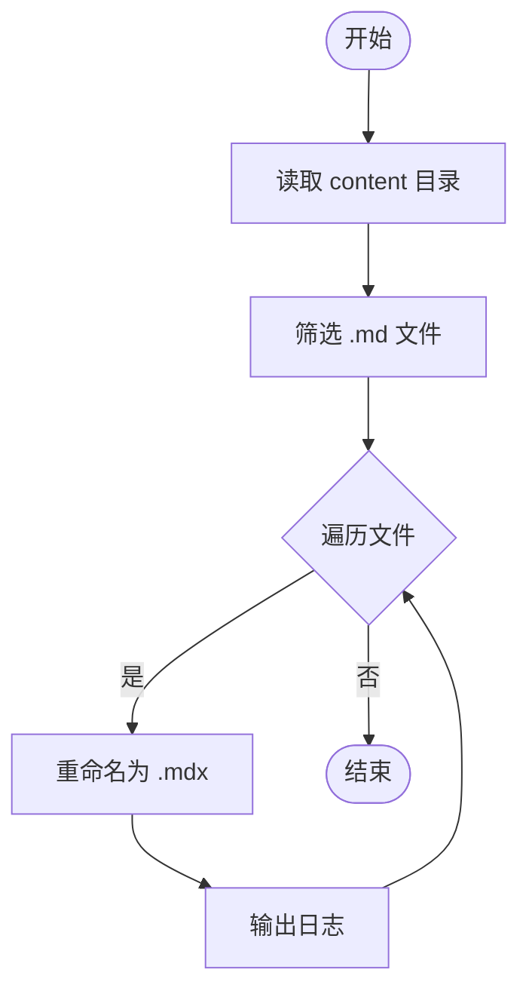
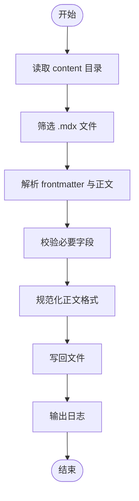
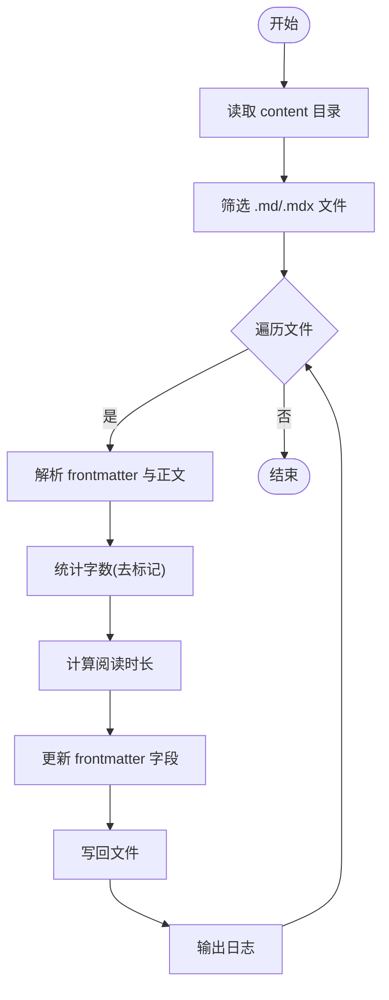
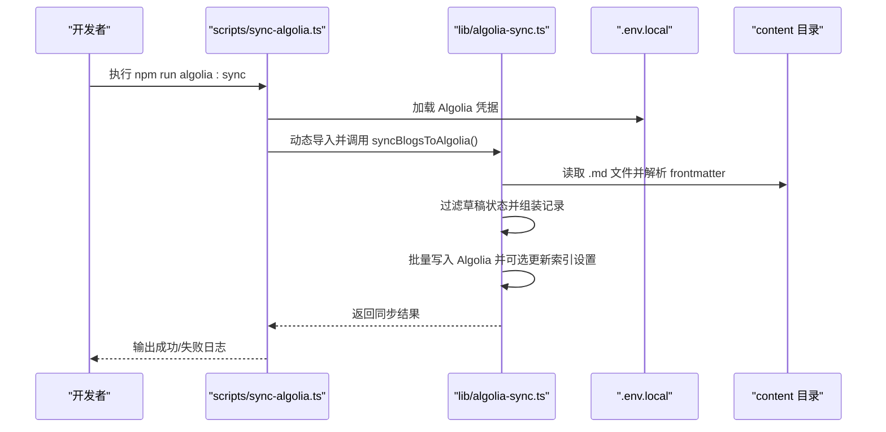
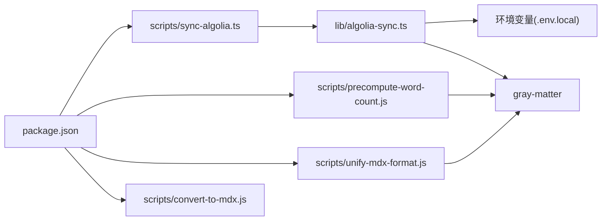

# 开发工具与脚本

<cite>
**本文引用的文件**
- [package.json](file://package.json)
- [scripts/convert-to-mdx.js](file://scripts/convert-to-mdx.js)
- [scripts/precompute-word-count.js](file://scripts/precompute-word-count.js)
- [scripts/sync-algolia.ts](file://scripts/sync-algolia.ts)
- [scripts/unify-mdx-format.js](file://scripts/unify-mdx-format.js)
- [lib/algolia-sync.ts](file://lib/algolia-sync.ts)
- [lib/algolia-config.ts](file://lib/algolia-config.ts)
- [eslint.config.mjs](file://eslint.config.mjs)
- [tsconfig.json](file://tsconfig.json)
- [next.config.ts](file://next.config.ts)
- [docs/ALGOLIA_README.md](file://docs/ALGOLIA_README.md)
- [docs/ALGOLIA_SETUP.md](file://docs/ALGOLIA_SETUP.md)
- [README.md](file://README.md)
- [OPTIMIZATION_SUMMARY.md](file://OPTIMIZATION_SUMMARY.md)
- [dependency-component-analysis.md](file://dependency-component-analysis.md)
- [extract-links.js](file://extract-links.js)
</cite>

## 目录
1. [简介](#简介)
2. [项目结构](#项目结构)
3. [核心组件](#核心组件)
4. [架构总览](#架构总览)
5. [详细组件分析](#详细组件分析)
6. [依赖分析](#依赖分析)
7. [性能考量](#性能考量)
8. [故障排查指南](#故障排查指南)
9. [结论](#结论)
10. [附录](#附录)

## 简介
本文件系统性梳理博客项目的开发工具与脚本体系，覆盖内容处理脚本、自动化工具与开发辅助工具的使用方法；详解 MDX 格式统一、字数统计预计算、Algolia 同步等脚本的功能与配置；记录 ESLint 配置、TypeScript 设置、构建分析等开发工具的使用；提供脚本执行示例与参数说明；解释脚本间的依赖关系与执行顺序；并给出常见问题排查与性能优化建议，确保开发工具文档的实用性与可维护性。

## 项目结构
项目采用 Next.js App Router 结构，开发工具与脚本主要位于 scripts 目录，Algolia 同步逻辑位于 lib 目录，开发工具配置集中在根目录的配置文件中。内容文件位于 content 目录，模板位于 data_templates 目录，文档位于 docs 目录。

图表来源
- [package.json:1-64](file://package.json#L1-L64)
- [scripts/convert-to-mdx.js:1-34](file://scripts/convert-to-mdx.js#L1-L34)
- [scripts/unify-mdx-format.js:1-63](file://scripts/unify-mdx-format.js#L1-L63)
- [scripts/precompute-word-count.js:1-147](file://scripts/precompute-word-count.js#L1-L147)
- [scripts/sync-algolia.ts:1-30](file://scripts/sync-algolia.ts#L1-L30)
- [lib/algolia-sync.ts:1-133](file://lib/algolia-sync.ts#L1-L133)
- [lib/algolia-config.ts:1-33](file://lib/algolia-config.ts#L1-L33)
- [eslint.config.mjs:1-26](file://eslint.config.mjs#L1-L26)
- [tsconfig.json:1-35](file://tsconfig.json#L1-L35)
- [next.config.ts:1-38](file://next.config.ts#L1-L38)

章节来源
- [package.json:1-64](file://package.json#L1-L64)
- [README.md:1-159](file://README.md#L1-L159)

## 核心组件
- 内容处理脚本
  - MDX 文件转换：将 content 目录下的 .md 文件批量重命名为 .mdx，便于统一处理。
  - MDX 格式统一：对 .mdx 文件进行排版规范化，确保标题、段落、列表、代码块等前后空行一致，同时校验必要 frontmatter 字段。
  - 字数统计预计算：扫描 content 目录下的 .md/.mdx 文件，统计字数并计算阅读时长，更新到 frontmatter 中。
- 自动化工具
  - Algolia 同步：在本地或 CI 中将博客内容同步至 Algolia 搜索索引，并设置索引属性与排序策略。
- 开发辅助工具
  - ESLint 配置：基于 Next.js 推荐配置，结合项目规则与忽略项。
  - TypeScript 设置：严格类型检查、增量编译、路径别名等。
  - 构建分析：通过 ANALYZE 环境变量启用打包体积分析。
  - 链接提取：从测试 MDX 文件中提取所有链接，便于内容审计与外链检测。

章节来源
- [scripts/convert-to-mdx.js:1-34](file://scripts/convert-to-mdx.js#L1-L34)
- [scripts/unify-mdx-format.js:1-63](file://scripts/unify-mdx-format.js#L1-L63)
- [scripts/precompute-word-count.js:1-147](file://scripts/precompute-word-count.js#L1-L147)
- [scripts/sync-algolia.ts:1-30](file://scripts/sync-algolia.ts#L1-L30)
- [lib/algolia-sync.ts:1-133](file://lib/algolia-sync.ts#L1-L133)
- [eslint.config.mjs:1-26](file://eslint.config.mjs#L1-L26)
- [tsconfig.json:1-35](file://tsconfig.json#L1-L35)
- [next.config.ts:1-38](file://next.config.ts#L1-L38)
- [extract-links.js:1-26](file://extract-links.js#L1-L26)

## 架构总览
下图展示了脚本与库之间的交互关系，以及与内容目录的关系。脚本通过 Node.js 读取 content 目录，对内容进行处理；Algolia 同步脚本通过动态导入 lib/algolia-sync.ts 执行同步逻辑；开发工具配置贯穿于构建与运行阶段。

图表来源
- [scripts/convert-to-mdx.js:1-34](file://scripts/convert-to-mdx.js#L1-L34)
- [scripts/unify-mdx-format.js:1-63](file://scripts/unify-mdx-format.js#L1-L63)
- [scripts/precompute-word-count.js:1-147](file://scripts/precompute-word-count.js#L1-L147)
- [scripts/sync-algolia.ts:1-30](file://scripts/sync-algolia.ts#L1-L30)
- [lib/algolia-sync.ts:1-133](file://lib/algolia-sync.ts#L1-L133)
- [lib/algolia-config.ts:1-33](file://lib/algolia-config.ts#L1-L33)
- [eslint.config.mjs:1-26](file://eslint.config.mjs#L1-L26)
- [tsconfig.json:1-35](file://tsconfig.json#L1-L35)
- [next.config.ts:1-38](file://next.config.ts#L1-L38)
- [package.json:1-64](file://package.json#L1-L64)

## 详细组件分析

### MDX 文件转换脚本
- 功能概述
  - 将 content 目录下的 .md 文件重命名为 .mdx，便于统一处理与渲染。
- 关键流程
  - 读取 content 目录，筛选 .md 文件。
  - 遍历并重命名，输出转换结果。
- 执行方式
  - 直接运行 Node 脚本。
- 注意事项
  - 转换前请备份 content 目录，避免误操作导致内容丢失。
  - 确保内容文件命名唯一，避免重命名冲突。

图表来源
- [scripts/convert-to-mdx.js:1-34](file://scripts/convert-to-mdx.js#L1-L34)

章节来源
- [scripts/convert-to-mdx.js:1-34](file://scripts/convert-to-mdx.js#L1-L34)

### MDX 格式统一脚本
- 功能概述
  - 统一 .mdx 文件的排版格式，确保标题、段落、列表、代码块前后空行一致；校验必要 frontmatter 字段（title、date、excerpt、tags、readTime）。
- 关键流程
  - 读取 content 目录，筛选 .mdx 文件。
  - 使用 gray-matter 解析 frontmatter 与正文。
  - 规范化正文格式（标题后空行、段落间空行、列表前空行、代码块前后空行）。
  - 重新组合并写回文件。
- 执行方式
  - 直接运行 Node 脚本。
- 参数说明
  - 无命令行参数，直接对 content 目录生效。
- 常见问题
  - 缺失 frontmatter 字段会输出警告，需按要求补齐。
  - 正则替换可能影响特殊格式，建议先备份再执行。

图表来源
- [scripts/unify-mdx-format.js:1-63](file://scripts/unify-mdx-format.js#L1-L63)

章节来源
- [scripts/unify-mdx-format.js:1-63](file://scripts/unify-mdx-format.js#L1-L63)

### 字数统计预计算脚本
- 功能概述
  - 扫描 content 目录下的 .md/.mdx 文件，统计字数与阅读时长，更新 frontmatter 中的 wordCount 与 readTime 字段。
- 关键流程
  - 读取 content 目录，筛选 .md/.mdx 文件。
  - 解析 frontmatter 与正文，去除 Markdown 标记后统计字数（英文单词、中文字符、数字）。
  - 计算阅读时长（平均 300 字/分钟），更新 frontmatter。
  - 写回文件并输出结果。
- 执行方式
  - 直接运行 Node 脚本。
- 参数说明
  - 无命令行参数，直接对 content 目录生效。
- 性能建议
  - 大量文件时建议分批执行或在 CI 中定时运行，避免阻塞开发流程。

图表来源
- [scripts/precompute-word-count.js:1-147](file://scripts/precompute-word-count.js#L1-L147)

章节来源
- [scripts/precompute-word-count.js:1-147](file://scripts/precompute-word-count.js#L1-L147)

### Algolia 同步脚本
- 功能概述
  - 将博客内容同步到 Algolia 搜索索引，支持在构建时或内容更新时运行；可配置索引设置（搜索属性、排序、分面等）。
- 关键流程
  - 通过 dotenv 加载 .env.local 中的 Algolia 凭据。
  - 动态导入 lib/algolia-sync.ts 并调用同步函数。
  - 读取 content 目录中的 .md 文件，解析 frontmatter 与正文，过滤草稿状态，批量写入 Algolia。
  - 可选更新索引设置（如中文搜索优化、排序策略等）。
- 执行方式
  - 通过 package.json 中的脚本命令运行。
- 参数说明
  - 无命令行参数，依赖环境变量与 content 目录。
- 环境变量
  - NEXT_PUBLIC_ALGOLIA_APP_ID、NEXT_PUBLIC_ALGOLIA_SEARCH_API_KEY、ALGOLIA_ADMIN_API_KEY、NEXT_PUBLIC_ALGOLIA_INDEX_NAME。
- 常见问题
  - 未配置凭据时跳过同步；确认 .env.local 存在且值正确。
  - 若索引无数据，确认已运行同步命令并检查状态字段。

图表来源
- [scripts/sync-algolia.ts:1-30](file://scripts/sync-algolia.ts#L1-L30)
- [lib/algolia-sync.ts:1-133](file://lib/algolia-sync.ts#L1-L133)

章节来源
- [scripts/sync-algolia.ts:1-30](file://scripts/sync-algolia.ts#L1-L30)
- [lib/algolia-sync.ts:1-133](file://lib/algolia-sync.ts#L1-L133)
- [docs/ALGOLIA_README.md:1-95](file://docs/ALGOLIA_README.md#L1-L95)
- [docs/ALGOLIA_SETUP.md:1-131](file://docs/ALGOLIA_SETUP.md#L1-L131)

### 开发工具配置

#### ESLint 配置
- 配置要点
  - 基于 eslint-config-next 的 core-web-vitals 与 typescript 规则集。
  - 自定义规则覆盖与全局忽略项调整，确保 CI 与本地一致。
- 使用方式
  - 运行 npm run lint 或 npm run lint:fix。
- 建议
  - 在提交前执行 lint:fix，减少 CI 失败风险。

章节来源
- [eslint.config.mjs:1-26](file://eslint.config.mjs#L1-L26)
- [README.md:58-70](file://README.md#L58-L70)

#### TypeScript 设置
- 配置要点
  - 严格模式、增量编译、路径别名 @/*、ESM 解析、JSX 支持等。
- 使用方式
  - 运行 npm run typecheck 进行类型检查。
- 建议
  - 新增文件时保持类型安全，避免 any。

章节来源
- [tsconfig.json:1-35](file://tsconfig.json#L1-L35)
- [README.md:96-102](file://README.md#L96-L102)

#### 构建分析
- 配置要点
  - 通过 ANALYZE=true 环境变量启用打包体积分析。
- 使用方式
  - 运行 npm run analyze。
- 建议
  - 在 PR 或发布前进行分析，识别大体积模块并优化。

章节来源
- [package.json:12-12](file://package.json#L12-L12)
- [README.md:69-69](file://README.md#L69-L69)

#### Next.js MDX 配置
- 配置要点
  - 启用 MDX 支持，扩展名包含 md、mdx；图片优化与生产源码映射控制。
- 使用方式
  - 直接构建与运行，无需额外脚本。
- 建议
  - 在 CI 中缓存依赖，提升构建速度。

章节来源
- [next.config.ts:1-38](file://next.config.ts#L1-L38)

#### 链接提取工具
- 功能概述
  - 从测试 MDX 文件中提取所有链接，便于审计与外链检测。
- 使用方式
  - 直接运行 Node 脚本。
- 建议
  - 在内容审核流程中定期执行，确保外链可用性。

章节来源
- [extract-links.js:1-26](file://extract-links.js#L1-L26)

## 依赖分析
- 脚本与库的耦合关系
  - scripts/sync-algolia.ts 通过动态导入 lib/algolia-sync.ts 执行同步逻辑，耦合度低，便于独立维护。
  - scripts/unify-mdx-format.js 与 scripts/precompute-word-count.js 直接读取 content 目录，无外部库依赖，简单可靠。
  - scripts/convert-to-mdx.js 仅做文件重命名，无复杂逻辑。
- 外部依赖与集成点
  - Algolia 同步依赖 algoliasearch、gray-matter、dotenv。
  - MDX 渲染依赖 @next/mdx、react-markdown、rehype-sanitize 等。
- 潜在循环依赖
  - 未发现脚本与库之间存在循环依赖。
- 配置文件接口契约
  - .env.local 提供 Algolia 凭据；package.json 提供脚本入口；tsconfig.json/next.config.ts 提供编译与构建配置。

图表来源
- [package.json:1-64](file://package.json#L1-L64)
- [scripts/sync-algolia.ts:1-30](file://scripts/sync-algolia.ts#L1-L30)
- [lib/algolia-sync.ts:1-133](file://lib/algolia-sync.ts#L1-L133)
- [scripts/unify-mdx-format.js:1-63](file://scripts/unify-mdx-format.js#L1-L63)
- [scripts/precompute-word-count.js:1-147](file://scripts/precompute-word-count.js#L1-L147)

章节来源
- [package.json:1-64](file://package.json#L1-L64)
- [dependency-component-analysis.md:1-143](file://dependency-component-analysis.md#L1-L143)

## 性能考量
- 内容处理脚本
  - 批量文件操作建议在 CI 或离线环境下执行，避免影响开发体验。
  - 对大文件进行字数统计时，注意 I/O 与正则匹配的性能，必要时拆分任务。
- Algolia 同步
  - 批量写入时尽量合并请求，减少往返次数；仅同步已发布内容，降低索引压力。
  - 索引设置可按需调整，避免过度复杂的 ranking 与 snippet 配置。
- 构建与分析
  - 使用 ANALYZE=true 进行体积分析，定位大依赖后再优化；避免在开发阶段频繁开启分析。
- 代码质量
  - ESLint 与 TypeScript 严格配置有助于早期发现问题，减少运行时错误与性能隐患。

## 故障排查指南
- Algolia 同步失败
  - 检查 .env.local 是否存在且包含正确的 Algolia 凭据。
  - 确认索引名称与权限设置正确；若无数据，确认 content 目录中 .md 文件状态字段非 draft。
  - 参考文档中的故障排除章节，逐项核对。
- ESLint/TypeScript 报错
  - 使用 npm run lint:fix 与 npm run typecheck 修复与检查问题。
  - 检查 eslint.config.mjs 与 tsconfig.json 的配置是否符合项目需求。
- 构建体积过大
  - 使用 npm run analyze 查看依赖体积分布，移除未使用依赖或拆分包。
- 内容格式异常
  - 使用 scripts/unify-mdx-format.js 统一格式；必要时手动补充缺失的 frontmatter 字段。

章节来源
- [docs/ALGOLIA_README.md:87-102](file://docs/ALGOLIA_README.md#L87-L102)
- [docs/ALGOLIA_SETUP.md:87-103](file://docs/ALGOLIA_SETUP.md#L87-L103)
- [README.md:58-70](file://README.md#L58-L70)
- [OPTIMIZATION_SUMMARY.md:185-193](file://OPTIMIZATION_SUMMARY.md#L185-L193)

## 结论
本项目围绕内容处理与搜索同步建立了完善的开发工具链：通过 MDX 转换、格式统一与字数统计预计算保障内容质量；通过 Algolia 同步与配置实现高效搜索；通过 ESLint、TypeScript 与构建分析维持开发效率与质量。建议在 CI 中集成这些脚本，形成自动化的内容发布与质量保障流程。

## 附录

### 脚本执行顺序与依赖关系
- 内容准备阶段
  - convert-to-mdx.js（如有需要）→ unify-mdx-format.js → precompute-word-count.js
- 搜索同步阶段
  - sync-algolia.ts（依赖 .env.local 与 content 目录）
- 开发质量阶段
  - lint/typecheck/analyze（按需执行）

章节来源
- [scripts/convert-to-mdx.js:1-34](file://scripts/convert-to-mdx.js#L1-L34)
- [scripts/unify-mdx-format.js:1-63](file://scripts/unify-mdx-format.js#L1-L63)
- [scripts/precompute-word-count.js:1-147](file://scripts/precompute-word-count.js#L1-L147)
- [scripts/sync-algolia.ts:1-30](file://scripts/sync-algolia.ts#L1-L30)
- [package.json:5-14](file://package.json#L5-L14)