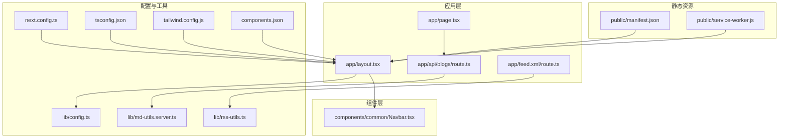
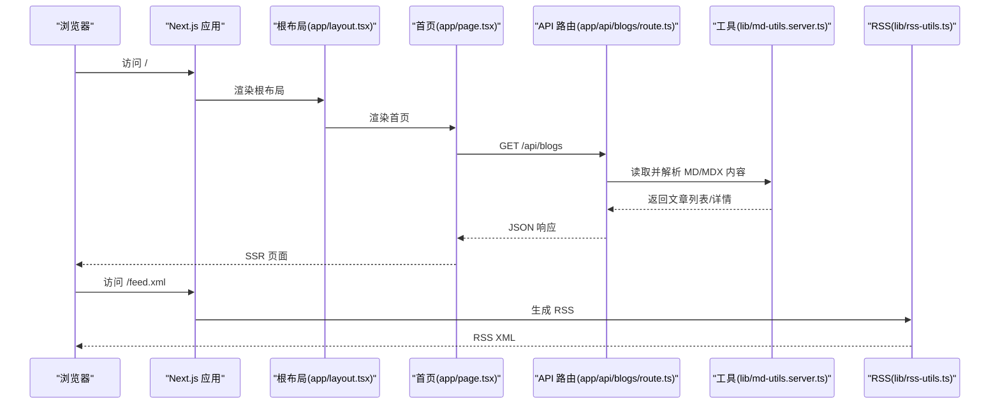
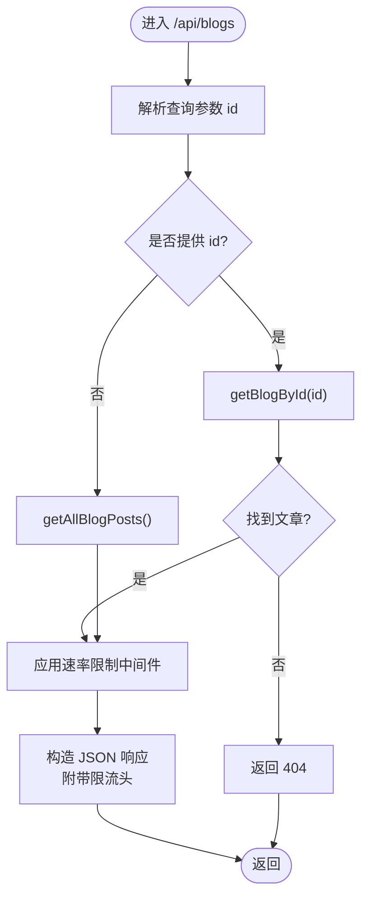
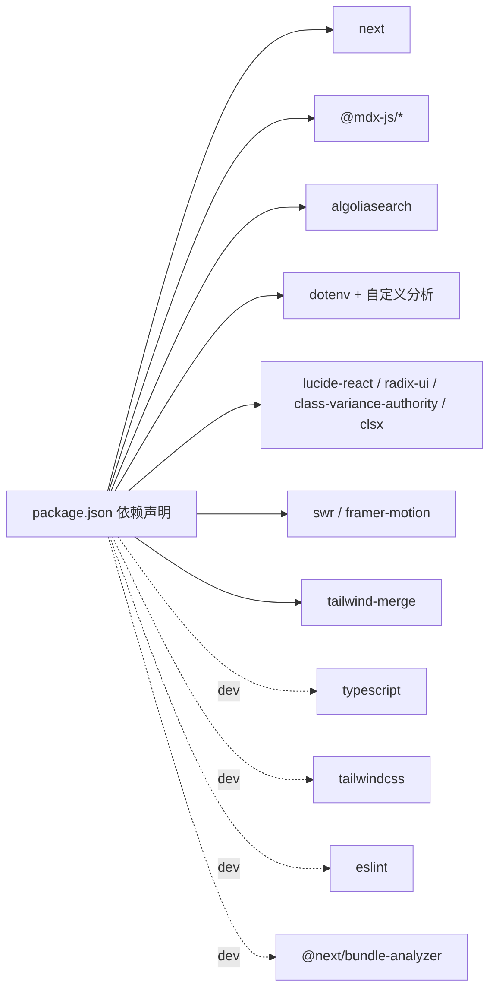

# 快速开始

<cite>
**本文引用的文件**
- [package.json](file://package.json)
- [next.config.ts](file://next.config.ts)
- [tsconfig.json](file://tsconfig.json)
- [tailwind.config.js](file://tailwind.config.js)
- [components.json](file://components.json)
- [lib/config.ts](file://lib/config.ts)
- [app/layout.tsx](file://app/layout.tsx)
- [app/page.tsx](file://app/page.tsx)
- [app/api/blogs/route.ts](file://app/api/blogs/route.ts)
- [app/feed.xml/route.ts](file://app/feed.xml/route.ts)
- [public/manifest.json](file://public/manifest.json)
- [public/service-worker.js](file://public/service-worker.js)
- [lib/md-utils.server.ts](file://lib/md-utils.server.ts)
- [lib/rss-utils.ts](file://lib/rss-utils.ts)
- [components/common/Navbar.tsx](file://components/common/Navbar.tsx)
</cite>

## 目录
1. [引言](#引言)
2. [项目结构](#项目结构)
3. [核心组件](#核心组件)
4. [架构总览](#架构总览)
5. [详细组件分析](#详细组件分析)
6. [依赖关系分析](#依赖关系分析)
7. [性能注意事项](#性能注意事项)
8. [故障排除指南](#故障排除指南)
9. [结论](#结论)
10. [附录](#附录)

## 引言
本指南面向希望快速搭建并运行该博客项目的开发者，覆盖环境要求、项目克隆与安装、环境变量配置、开发服务器启动流程、常见初始化问题排查以及加速设置建议。文档以仓库现有配置与实现为基础，提供可执行的命令行步骤与预期行为说明，帮助新手在最短时间内成功运行项目。

## 项目结构
该项目基于 Next.js 16（App Router），采用 TypeScript、Tailwind CSS 4、MDX 支持与 PWA 清单与 Service Worker。关键目录与职责概览如下：
- app：应用入口与页面路由，包含 API 路由、页面组件与元数据配置
- components：通用组件库，含导航、评论、UI 组件与 PWA 注册
- content：静态内容（博客与手记）以 MD/MDX 文件形式存放
- lib：业务工具与配置（站点配置、RSS、MDX 解析、分析等）
- public：PWA 清单与 Service Worker 资源
- scripts：构建与同步辅助脚本
- docs：文档与配置说明

图表来源
- [app/layout.tsx:1-108](file://app/layout.tsx#L1-L108)
- [app/page.tsx:1-16](file://app/page.tsx#L1-L16)
- [app/api/blogs/route.ts:1-62](file://app/api/blogs/route.ts#L1-L62)
- [app/feed.xml/route.ts:1-15](file://app/feed.xml/route.ts#L1-L15)
- [lib/config.ts:1-108](file://lib/config.ts#L1-L108)
- [lib/md-utils.server.ts:1-218](file://lib/md-utils.server.ts#L1-L218)
- [lib/rss-utils.ts:1-58](file://lib/rss-utils.ts#L1-L58)
- [next.config.ts:1-38](file://next.config.ts#L1-L38)
- [tsconfig.json:1-35](file://tsconfig.json#L1-L35)
- [tailwind.config.js:1-22](file://tailwind.config.js#L1-L22)
- [components.json:1-24](file://components.json#L1-L24)
- [public/manifest.json:1-22](file://public/manifest.json#L1-L22)
- [public/service-worker.js:1-131](file://public/service-worker.js#L1-L131)

章节来源
- [package.json:1-64](file://package.json#L1-L64)
- [next.config.ts:1-38](file://next.config.ts#L1-L38)
- [tsconfig.json:1-35](file://tsconfig.json#L1-L35)
- [tailwind.config.js:1-22](file://tailwind.config.js#L1-L22)
- [components.json:1-24](file://components.json#L1-L24)

## 核心组件
- 站点配置：集中管理站点名称、描述、作者、社交链接、导航、SEO 关键词、分析工具等，支持运行时读取环境变量。
- 布局与元数据：根布局负责注入全局样式、PWA 清单、分析脚本、导航栏、页脚与加载条。
- 首页：渲染博客文章列表组件。
- API 路由：提供博客文章列表与详情查询，内置速率限制中间件。
- RSS：按最新时间排序生成 RSS 内容。
- PWA：提供清单与 Service Worker，支持离线缓存与推送通知。

章节来源
- [lib/config.ts:1-108](file://lib/config.ts#L1-L108)
- [app/layout.tsx:1-108](file://app/layout.tsx#L1-L108)
- [app/page.tsx:1-16](file://app/page.tsx#L1-L16)
- [app/api/blogs/route.ts:1-62](file://app/api/blogs/route.ts#L1-L62)
- [lib/rss-utils.ts:1-58](file://lib/rss-utils.ts#L1-L58)
- [public/manifest.json:1-22](file://public/manifest.json#L1-L22)
- [public/service-worker.js:1-131](file://public/service-worker.js#L1-L131)

## 架构总览
下图展示了从浏览器请求到服务端渲染与 API 调用的关键交互：

图表来源
- [app/layout.tsx:1-108](file://app/layout.tsx#L1-L108)
- [app/page.tsx:1-16](file://app/page.tsx#L1-L16)
- [app/api/blogs/route.ts:1-62](file://app/api/blogs/route.ts#L1-L62)
- [lib/md-utils.server.ts:1-218](file://lib/md-utils.server.ts#L1-L218)
- [lib/rss-utils.ts:1-58](file://lib/rss-utils.ts#L1-L58)

## 详细组件分析

### 环境与依赖
- Node.js：项目使用 Next.js 16，建议使用长期支持版本（如 18 或 20）。具体引擎版本请参考包管理器与 Next.js 的兼容性要求。
- 包管理器：npm（仓库脚本使用 npm run dev/build/start）。
- 构建与运行脚本：dev、build、start、lint、typecheck、analyze、algolia:sync、precompute:wordcount。
- Next 配置：启用 MDX 扩展、图片优化与 WebP/AVIF 格式、生产移除控制台、输出 standalone。
- TypeScript：严格模式、ESNext 模块解析、路径别名 @/*。
- Tailwind CSS：内容扫描范围覆盖 app 与 components 目录，主题扩展字体与色彩。

章节来源
- [package.json:1-64](file://package.json#L1-L64)
- [next.config.ts:1-38](file://next.config.ts#L1-L38)
- [tsconfig.json:1-35](file://tsconfig.json#L1-L35)
- [tailwind.config.js:1-22](file://tailwind.config.js#L1-L22)
- [components.json:1-24](file://components.json#L1-L24)

### 站点配置与分析
- 站点配置集中于 lib/config.ts，包含站点信息、作者、社交链接、导航、关键词、OG 图、Favicon、主题色、语言与时区、分页参数与分析工具配置（Google Analytics 与 Umami）。
- Umami 分析与 Vercel Speed Insights 在根布局中注入，支持运行时读取 NEXT_PUBLIC_* 与普通环境变量。

章节来源
- [lib/config.ts:1-108](file://lib/config.ts#L1-L108)
- [app/layout.tsx:1-108](file://app/layout.tsx#L1-L108)

### 首页与布局
- 首页页面组件引入服务端组件以渲染博客列表，并设置页面元数据。
- 根布局负责注入 PWA 清单、分析脚本、导航栏、页脚与加载条，同时设置 Open Graph 与 Twitter 卡片元数据。

章节来源
- [app/page.tsx:1-16](file://app/page.tsx#L1-L16)
- [app/layout.tsx:1-108](file://app/layout.tsx#L1-L108)

### API 路由与内容读取
- 博客 API 路由提供列表与详情查询，支持查询参数 id；内部集成速率限制中间件，对每个请求进行限流判断并在响应头中携带限流状态。
- 内容读取通过 lib/md-utils.server.ts 完成，统一解析 content/blogs 与 content/notes 下的 MD/MDX 文件，提取 frontmatter 与正文，格式化日期与字数统计，支持缓存。

图表来源
- [app/api/blogs/route.ts:1-62](file://app/api/blogs/route.ts#L1-L62)
- [lib/md-utils.server.ts:1-218](file://lib/md-utils.server.ts#L1-L218)

章节来源
- [app/api/blogs/route.ts:1-62](file://app/api/blogs/route.ts#L1-L62)
- [lib/md-utils.server.ts:1-218](file://lib/md-utils.server.ts#L1-L218)

### RSS 订阅
- RSS 路由根据站点配置与内容生成 RSS XML，按发布时间倒序排列，包含标题、链接、描述、发布日期与标签等字段。

章节来源
- [app/feed.xml/route.ts:1-15](file://app/feed.xml/route.ts#L1-L15)
- [lib/rss-utils.ts:1-58](file://lib/rss-utils.ts#L1-L58)

### PWA 与 Service Worker
- 清单文件提供应用名称、起始路径、显示模式、主题色与图标集合。
- Service Worker 实现静态资源缓存、离线回退、GET 请求网络优先缓存策略与推送通知展示。

章节来源
- [public/manifest.json:1-22](file://public/manifest.json#L1-L22)
- [public/service-worker.js:1-131](file://public/service-worker.js#L1-L131)

### 导航栏
- 导航栏组件负责桌面端与移动端菜单、活动标签高亮、滚动行为与键盘交互，数据来源于站点配置。

章节来源
- [components/common/Navbar.tsx:1-234](file://components/common/Navbar.tsx#L1-L234)
- [lib/config.ts:1-108](file://lib/config.ts#L1-L108)

## 依赖关系分析
- 运行时依赖：Next.js、React、MDX 相关生态、Algolia、Umami、Framer Motion、Radix UI、SWR、Tailwind Merge 等。
- 开发依赖：TypeScript、Tailwind CSS、ESLint、shadcn 工具链等。
- 构建与分析：Next Bundle Analyzer、Tailwind PostCSS 插件、imagemin-cli 等。

图表来源
- [package.json:1-64](file://package.json#L1-L64)

章节来源
- [package.json:1-64](file://package.json#L1-L64)

## 性能注意事项
- 生产环境移除控制台日志，减少体积与运行开销。
- 图片优化：启用 WebP/AVIF 格式与远程图片白名单，降低带宽占用。
- 代码分割与懒加载：利用 Next.js App Router 的并发特性与 Suspense。
- 本地缓存：首页与内容读取使用 React 缓存装饰器，避免重复 IO。
- 构建分析：使用 ANALYZE=true 运行构建，定位体积热点。

章节来源
- [next.config.ts:1-38](file://next.config.ts#L1-L38)
- [lib/md-utils.server.ts:1-218](file://lib/md-utils.server.ts#L1-L218)
- [package.json:1-64](file://package.json#L1-L64)

## 故障排除指南
- Node.js 版本不兼容
  - 现象：安装或运行时报错，或构建失败。
  - 处理：升级至推荐的 LTS 版本（如 18/20），确保包管理器与 Node 版本匹配。
- 依赖安装失败
  - 现象：npm install 报错或卡住。
  - 处理：清理缓存与锁文件后重试；更换镜像源；确认网络稳定。
- 环境变量未生效
  - 现象：分析工具（Umami/Google Analytics）未统计。
  - 处理：在运行环境中正确设置 NEXT_PUBLIC_* 与普通环境变量；重启开发服务器使变更生效。
- 无法访问 /feed.xml
  - 现象：RSS 订阅地址返回空白或报错。
  - 处理：确认内容目录存在且包含 MD/MDX 文件；检查 RSS 生成逻辑与时间格式。
- Service Worker 缓存异常
  - 现象：离线不可用或资源未缓存。
  - 处理：检查清单与 SW 文件路径；清除浏览器缓存；确认 HTTPS 环境。
- 速率限制导致请求失败
  - 现象：API 返回限流错误。
  - 处理：降低请求频率；调整限流策略；在开发阶段临时禁用中间件进行调试。

章节来源
- [app/feed.xml/route.ts:1-15](file://app/feed.xml/route.ts#L1-L15)
- [lib/rss-utils.ts:1-58](file://lib/rss-utils.ts#L1-L58)
- [public/manifest.json:1-22](file://public/manifest.json#L1-L22)
- [public/service-worker.js:1-131](file://public/service-worker.js#L1-L131)
- [app/api/blogs/route.ts:1-62](file://app/api/blogs/route.ts#L1-L62)

## 结论
本指南基于仓库现有配置与实现，提供了从环境准备到开发运行的完整路径。建议先完成环境与依赖准备，再按步骤启动开发服务器并验证首页、API 与 RSS 功能。遇到问题时，优先核对环境变量与内容目录结构，结合日志与构建分析定位瓶颈。

## 附录

### 环境要求
- Node.js：建议使用 LTS 版本（如 18/20）
- 包管理器：npm（仓库脚本基于 npm）
- 浏览器：现代浏览器（支持 ES2017+、WebP/AVIF）

章节来源
- [package.json:1-64](file://package.json#L1-L64)
- [next.config.ts:1-38](file://next.config.ts#L1-L38)
- [tsconfig.json:1-35](file://tsconfig.json#L1-L35)

### 克隆与安装
- 克隆仓库后，在项目根目录执行依赖安装命令。
- 安装完成后，执行开发服务器启动命令。

章节来源
- [package.json:1-64](file://package.json#L1-L64)

### 环境变量配置
- NEXT_PUBLIC_GOOGLE_ANALYTICS_ID：可选，用于 Google Analytics
- NEXT_PUBLIC_UMAMI_BASE_URL：可选，Umami 自托管实例基础地址
- UMAMI_USERNAME：可选，Umami 用户名
- UMAMI_PASSWORD：可选，Umami 密码
- NEXT_PUBLIC_UMAMI_WEBSITE_ID：可选，Umami 网站 ID
- NODE_ENV：开发环境建议使用 development，生产使用 production

章节来源
- [lib/config.ts:1-108](file://lib/config.ts#L1-L108)

### 启动开发服务器
- 开发模式：运行 dev 脚本，监听端口并热更新。
- 构建产物：运行 build 脚本生成静态/服务端产物。
- 生产启动：运行 start 脚本启动生产服务器。
- 类型检查：运行 typecheck 确保 TypeScript 类型安全。
- 代码质量：运行 lint 与 lint:fix 进行 ESLint 检查与自动修复。

章节来源
- [package.json:1-64](file://package.json#L1-L64)

### 常见初始化问题与解决
- 无内容显示
  - 检查 content/blogs 与 content/notes 是否存在有效 MD/MDX 文件。
  - 确认 frontmatter 字段（如 title、date）完整。
- RSS 为空
  - 确认内容目录存在且文件可读；检查时间字段格式。
- 分析工具未统计
  - 设置 NEXT_PUBLIC_* 与普通环境变量；重启开发服务器。
- PWA 未生效
  - 确认清单与 Service Worker 路径；在 HTTPS 环境下测试。

章节来源
- [lib/md-utils.server.ts:1-218](file://lib/md-utils.server.ts#L1-L218)
- [lib/rss-utils.ts:1-58](file://lib/rss-utils.ts#L1-L58)
- [lib/config.ts:1-108](file://lib/config.ts#L1-L108)
- [public/manifest.json:1-22](file://public/manifest.json#L1-L22)
- [public/service-worker.js:1-131](file://public/service-worker.js#L1-L131)

### 加速设置提示（面向有经验开发者）
- 使用 npm ci 或 pnpm install 以获得更快的依赖安装速度。
- 启用 ANALYZE=true 运行构建，定位体积热点并进行拆分。
- 预计算字数：运行预计算脚本以减少运行时开销。
- 使用 Next.js 16 的新特性（如 App Router 并发渲染）优化首屏性能。
- Tailwind CSS：仅在必要时扩展主题，避免过度扫描目录。

章节来源
- [package.json:1-64](file://package.json#L1-L64)
- [next.config.ts:1-38](file://next.config.ts#L1-L38)
- [tailwind.config.js:1-22](file://tailwind.config.js#L1-L22)