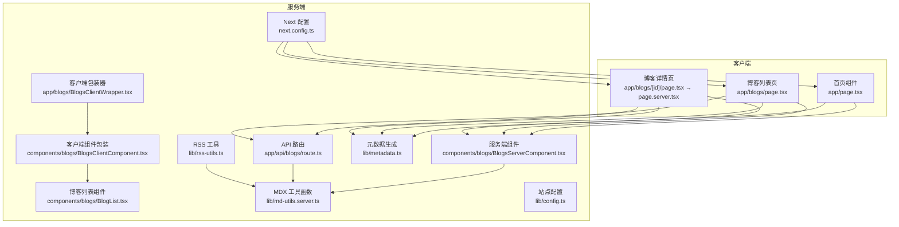
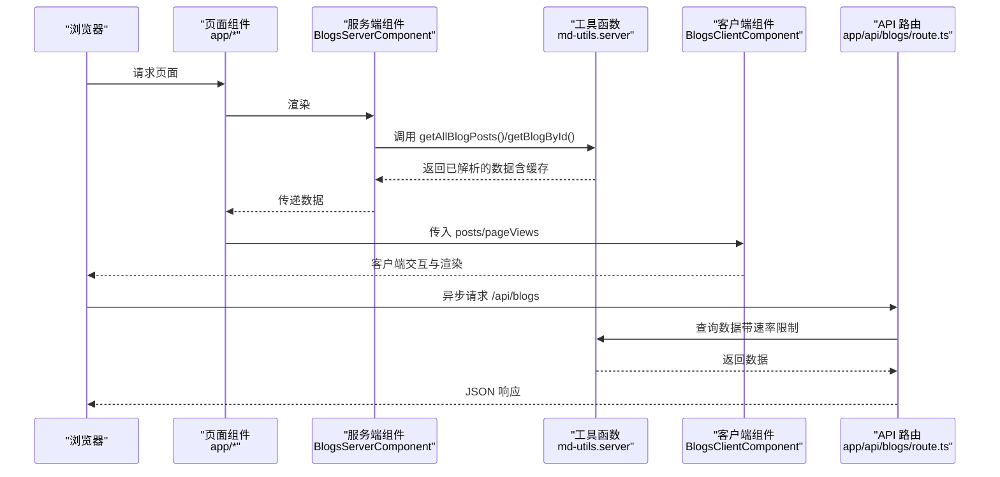
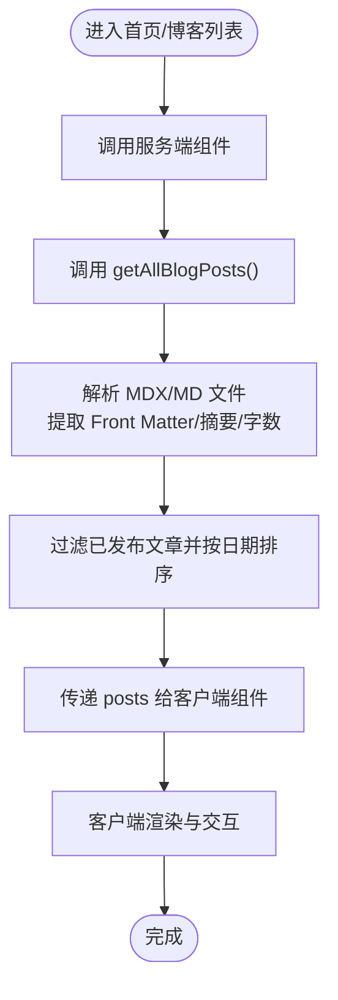
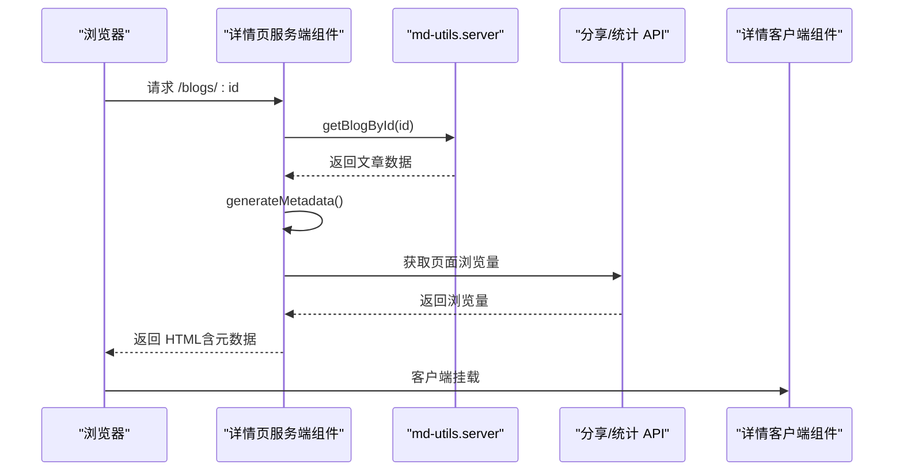
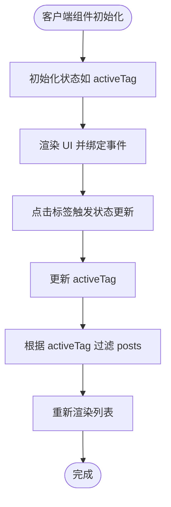
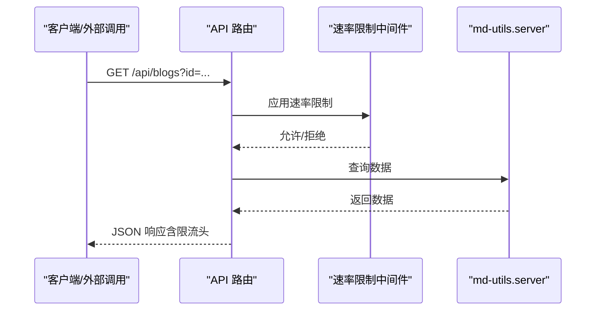
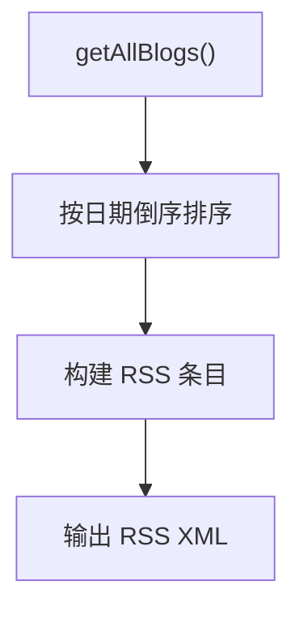
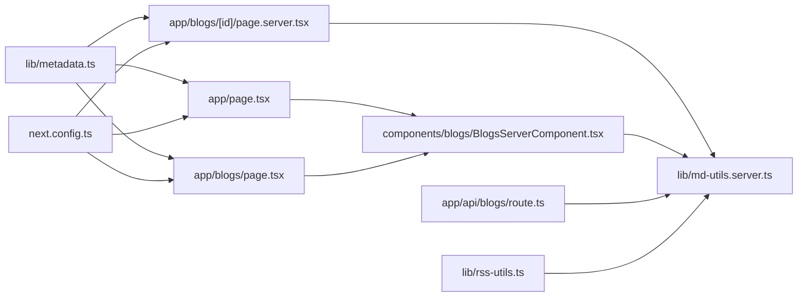

# 数据流设计

<cite>
**本文引用的文件**
- [app/page.tsx](file://app/page.tsx)
- [app/blogs/page.tsx](file://app/blogs/page.tsx)
- [app/blogs/[id]/page.tsx](file://app/blogs/[id]/page.tsx)
- [app/blogs/[id]/page.server.tsx](file://app/blogs/[id]/page.server.tsx)
- [components/blogs/BlogsServerComponent.tsx](file://components/blogs/BlogsServerComponent.tsx)
- [components/blogs/BlogsClientComponent.tsx](file://components/blogs/BlogsClientComponent.tsx)
- [components/blogs/BlogList.tsx](file://components/blogs/BlogList.tsx)
- [app/blogs/BlogsClientWrapper.tsx](file://app/blogs/BlogsClientWrapper.tsx)
- [lib/md-utils.server.ts](file://lib/md-utils.server.ts)
- [lib/metadata.ts](file://lib/metadata.ts)
- [lib/config.ts](file://lib/config.ts)
- [lib/rss-utils.ts](file://lib/rss-utils.ts)
- [app/api/blogs/ route.ts](file://app/api/blogs/ route.ts)
- [next.config.ts](file://next.config.ts)
</cite>

## 目录
1. [引言](#引言)
2. [项目结构](#项目结构)
3. [核心组件](#核心组件)
4. [架构总览](#架构总览)
5. [详细组件分析](#详细组件分析)
6. [依赖关系分析](#依赖关系分析)
7. [性能考虑](#性能考虑)
8. [故障排除指南](#故障排除指南)
9. [结论](#结论)
10. [附录](#附录)

## 引言
本设计文档聚焦于博客系统中的“数据流”，涵盖内容数据的获取、处理与缓存机制；阐述 Server Components 的数据获取与预渲染方式；说明 Client Components 的用户交互与状态管理；并给出内存缓存、浏览器缓存与 CDN 缓存的使用策略，以及数据同步与一致性的保障方法。文档同时提供数据流图与时序图，帮助读者快速把握关键数据操作的执行流程，并配套性能优化与错误处理建议。

## 项目结构
该博客系统采用 Next.js App Router 架构，内容数据来源于本地 Markdown/MDX 文件，通过服务端工具函数读取与解析，再由 Server Components 在构建时或请求时完成数据获取与预渲染，最终由 Client Components 承担交互与状态管理。API 层提供受速率限制的接口以供外部调用或客户端异步拉取。RSS 订阅由服务端工具生成，sitemap 亦由服务端路由生成。

图表来源
- [app/page.tsx:1-16](file://app/page.tsx#L1-L16)
- [app/blogs/page.tsx:1-92](file://app/blogs/page.tsx#L1-L92)
- [app/blogs/[id]/page.tsx:1-4](file://app/blogs/[id]/page.tsx#L1-L4)
- [app/blogs/[id]/page.server.tsx:1-53](file://app/blogs/[id]/page.server.tsx#L1-L53)
- [components/blogs/BlogsServerComponent.tsx:1-8](file://components/blogs/BlogsServerComponent.tsx#L1-L8)
- [components/blogs/BlogsClientComponent.tsx:1-67](file://components/blogs/BlogsClientComponent.tsx#L1-L67)
- [components/blogs/BlogList.tsx:1-68](file://components/blogs/BlogList.tsx#L1-L68)
- [app/blogs/BlogsClientWrapper.tsx:1-27](file://app/blogs/BlogsClientWrapper.tsx#L1-L27)
- [app/api/blogs/ route.ts:1-62](file://app/api/blogs/ route.ts#L1-L62)
- [lib/md-utils.server.ts:1-218](file://lib/md-utils.server.ts#L1-L218)
- [lib/metadata.ts:1-160](file://lib/metadata.ts#L1-L160)
- [lib/config.ts:1-108](file://lib/config.ts#L1-L108)
- [lib/rss-utils.ts:1-58](file://lib/rss-utils.ts#L1-L58)
- [next.config.ts:1-38](file://next.config.ts#L1-L38)

章节来源
- [app/page.tsx:1-16](file://app/page.tsx#L1-L16)
- [app/blogs/page.tsx:1-92](file://app/blogs/page.tsx#L1-L92)
- [app/blogs/[id]/page.tsx:1-4](file://app/blogs/[id]/page.tsx#L1-L4)
- [app/blogs/[id]/page.server.tsx:1-53](file://app/blogs/[id]/page.server.tsx#L1-L53)
- [components/blogs/BlogsServerComponent.tsx:1-8](file://components/blogs/BlogsServerComponent.tsx#L1-L8)
- [components/blogs/BlogsClientComponent.tsx:1-67](file://components/blogs/BlogsClientComponent.tsx#L1-L67)
- [components/blogs/BlogList.tsx:1-68](file://components/blogs/BlogList.tsx#L1-L68)
- [app/blogs/BlogsClientWrapper.tsx:1-27](file://app/blogs/BlogsClientWrapper.tsx#L1-L27)
- [app/api/blogs/ route.ts:1-62](file://app/api/blogs/ route.ts#L1-L62)
- [lib/md-utils.server.ts:1-218](file://lib/md-utils.server.ts#L1-L218)
- [lib/metadata.ts:1-160](file://lib/metadata.ts#L1-L160)
- [lib/config.ts:1-108](file://lib/config.ts#L1-L108)
- [lib/rss-utils.ts:1-58](file://lib/rss-utils.ts#L1-L58)
- [next.config.ts:1-38](file://next.config.ts#L1-L38)

## 核心组件
- 内容数据源与缓存
  - 本地 Markdown/MDX 文件作为内容源，位于 content/blogs 与 content/notes。
  - 通过服务端工具函数读取、解析 Front Matter、摘要、字数统计等，使用 React 缓存装饰器实现内存级缓存。
- Server Components 数据获取与预渲染
  - 首页与博客列表页通过服务端组件直接调用工具函数获取数据，完成 SSR 预渲染。
  - 博客详情页在服务端根据 id 查询内容，并生成页面元数据。
- Client Components 交互与状态管理
  - 列表组件负责展示与分页切片；包装器负责标签筛选与浮动侧边栏状态；客户端组件承担动画与交互。
- API 层与速率限制
  - 提供统一的博客数据查询接口，支持按 id 查询与全量查询，内置速率限制中间件。
- 元数据与站点配置
  - 统一的元数据生成函数，结合站点配置生成 Open Graph、Twitter Card 等。
- RSS 与静态资源
  - 服务端生成 RSS 订阅；Next 配置启用 MDX 扩展与图片优化。

章节来源
- [lib/md-utils.server.ts:136-218](file://lib/md-utils.server.ts#L136-L218)
- [components/blogs/BlogsServerComponent.tsx:4-8](file://components/blogs/BlogsServerComponent.tsx#L4-L8)
- [app/blogs/[id]/page.server.tsx:31-52](file://app/blogs/[id]/page.server.tsx#L31-L52)
- [components/blogs/BlogsClientComponent.tsx:39-67](file://components/blogs/BlogsClientComponent.tsx#L39-L67)
- [app/api/blogs/ route.ts:10-61](file://app/api/blogs/ route.ts#L10-L61)
- [lib/metadata.ts:25-79](file://lib/metadata.ts#L25-L79)
- [lib/config.ts:13-98](file://lib/config.ts#L13-L98)
- [lib/rss-utils.ts:13-43](file://lib/rss-utils.ts#L13-L43)
- [next.config.ts:11-35](file://next.config.ts#L11-L35)

## 架构总览
下图展示了从页面请求到数据呈现的整体流程，包括服务端数据获取、缓存命中、客户端渲染与 API 接口调用。

图表来源
- [app/page.tsx:12-14](file://app/page.tsx#L12-L14)
- [app/blogs/page.tsx:15-91](file://app/blogs/page.tsx#L15-L91)
- [components/blogs/BlogsServerComponent.tsx:4-8](file://components/blogs/BlogsServerComponent.tsx#L4-L8)
- [lib/md-utils.server.ts:136-218](file://lib/md-utils.server.ts#L136-L218)
- [components/blogs/BlogsClientComponent.tsx:39-67](file://components/blogs/BlogsClientComponent.tsx#L39-L67)
- [app/api/blogs/ route.ts:10-61](file://app/api/blogs/ route.ts#L10-L61)

## 详细组件分析

### 首页与博客列表页的数据流
- 首页与博客列表页均通过服务端组件在服务端完成数据获取与预渲染，减少首屏 JS 体积与白屏时间。
- 服务端组件调用工具函数获取所有文章，进行过滤与排序，随后将数据传递给客户端组件进行渲染与交互。

图表来源
- [app/page.tsx:12-14](file://app/page.tsx#L12-L14)
- [app/blogs/page.tsx:15-91](file://app/blogs/page.tsx#L15-L91)
- [components/blogs/BlogsServerComponent.tsx:4-8](file://components/blogs/BlogsServerComponent.tsx#L4-L8)
- [lib/md-utils.server.ts:136-154](file://lib/md-utils.server.ts#L136-L154)

章节来源
- [app/page.tsx:12-14](file://app/page.tsx#L12-L14)
- [app/blogs/page.tsx:15-91](file://app/blogs/page.tsx#L15-L91)
- [components/blogs/BlogsServerComponent.tsx:4-8](file://components/blogs/BlogsServerComponent.tsx#L4-L8)
- [lib/md-utils.server.ts:136-154](file://lib/md-utils.server.ts#L136-L154)

### 博客详情页的数据流与元数据生成
- 详情页在服务端根据 id 查询文章，若不存在则返回 404。
- 同时在服务端生成页面元数据（Open Graph/Twitter），确保 SEO 与分享卡片正确显示。
- 详情页还通过 API 获取页面浏览量，体现数据同步与跨层协作。

图表来源
- [app/blogs/[id]/page.server.tsx:6-52](file://app/blogs/[id]/page.server.tsx#L6-L52)
- [lib/md-utils.server.ts:156-218](file://lib/md-utils.server.ts#L156-L218)
- [lib/metadata.ts:86-104](file://lib/metadata.ts#L86-L104)

章节来源
- [app/blogs/[id]/page.server.tsx:6-52](file://app/blogs/[id]/page.server.tsx#L6-L52)
- [lib/md-utils.server.ts:156-218](file://lib/md-utils.server.ts#L156-L218)
- [lib/metadata.ts:86-104](file://lib/metadata.ts#L86-L104)

### 客户端组件与状态管理
- 客户端组件负责交互与状态管理，如标签筛选、浮动侧边栏、动画与滚动行为。
- 列表组件仅展示最新若干文章，其余由客户端包装器控制筛选与清空条件。

图表来源
- [app/blogs/BlogsClientWrapper.tsx:15-26](file://app/blogs/BlogsClientWrapper.tsx#L15-L26)
- [components/blogs/BlogsClientComponent.tsx:39-67](file://components/blogs/BlogsClientComponent.tsx#L39-L67)
- [components/blogs/BlogList.tsx:24-67](file://components/blogs/BlogList.tsx#L24-L67)

章节来源
- [app/blogs/BlogsClientWrapper.tsx:15-26](file://app/blogs/BlogsClientWrapper.tsx#L15-L26)
- [components/blogs/BlogsClientComponent.tsx:39-67](file://components/blogs/BlogsClientComponent.tsx#L39-L67)
- [components/blogs/BlogList.tsx:24-67](file://components/blogs/BlogList.tsx#L24-L67)

### API 层与速率限制
- API 路由提供统一的数据查询入口，支持按 id 查询与全量查询。
- 采用速率限制中间件，防止滥用并保护服务端资源。

图表来源
- [app/api/blogs/ route.ts:10-61](file://app/api/blogs/ route.ts#L10-L61)
- [lib/rate-limit.ts](file://lib/rate-limit.ts)

章节来源
- [app/api/blogs/ route.ts:10-61](file://app/api/blogs/ route.ts#L10-L61)

### RSS 与站点配置
- RSS 工具基于全量文章生成订阅内容，按日期倒序排列。
- 站点配置集中管理关键词、社交链接、分页参数等，供元数据与页面使用。

图表来源
- [lib/rss-utils.ts:13-43](file://lib/rss-utils.ts#L13-L43)
- [lib/md-utils.server.ts:149-154](file://lib/md-utils.server.ts#L149-L154)
- [lib/config.ts:13-98](file://lib/config.ts#L13-L98)

章节来源
- [lib/rss-utils.ts:13-43](file://lib/rss-utils.ts#L13-L43)
- [lib/md-utils.server.ts:149-154](file://lib/md-utils.server.ts#L149-L154)
- [lib/config.ts:13-98](file://lib/config.ts#L13-L98)

## 依赖关系分析
- 组件耦合与内聚
  - 服务端组件与客户端组件通过 props 解耦，服务端负责数据准备，客户端负责交互。
  - 列表组件与包装器组件职责清晰，包装器专注状态与筛选，列表专注展示。
- 直接与间接依赖
  - 页面组件依赖服务端组件；服务端组件依赖工具函数；API 路由同样依赖工具函数。
  - 元数据生成依赖站点配置；RSS 生成依赖工具函数与站点配置。
- 外部依赖与集成点
  - Next.js MDX 支持与图片优化配置；外部图片域名白名单；生产环境输出模式。
- 接口契约与实现细节
  - 工具函数提供统一的数据模型与缓存策略；API 路由提供标准化响应格式与限流头。

图表来源
- [app/page.tsx:12-14](file://app/page.tsx#L12-L14)
- [app/blogs/page.tsx:15-91](file://app/blogs/page.tsx#L15-L91)
- [app/blogs/[id]/page.server.tsx:31-52](file://app/blogs/[id]/page.server.tsx#L31-L52)
- [components/blogs/BlogsServerComponent.tsx:4-8](file://components/blogs/BlogsServerComponent.tsx#L4-L8)
- [lib/md-utils.server.ts:136-218](file://lib/md-utils.server.ts#L136-L218)
- [app/api/blogs/ route.ts:10-61](file://app/api/blogs/ route.ts#L10-L61)
- [lib/metadata.ts:152-160](file://lib/metadata.ts#L152-L160)
- [lib/rss-utils.ts:13-43](file://lib/rss-utils.ts#L13-L43)
- [next.config.ts:11-35](file://next.config.ts#L11-L35)

章节来源
- [app/page.tsx:12-14](file://app/page.tsx#L12-L14)
- [app/blogs/page.tsx:15-91](file://app/blogs/page.tsx#L15-L91)
- [app/blogs/[id]/page.server.tsx:31-52](file://app/blogs/[id]/page.server.tsx#L31-L52)
- [components/blogs/BlogsServerComponent.tsx:4-8](file://components/blogs/BlogsServerComponent.tsx#L4-L8)
- [lib/md-utils.server.ts:136-218](file://lib/md-utils.server.ts#L136-L218)
- [app/api/blogs/ route.ts:10-61](file://app/api/blogs/ route.ts#L10-L61)
- [lib/metadata.ts:152-160](file://lib/metadata.ts#L152-L160)
- [lib/rss-utils.ts:13-43](file://lib/rss-utils.ts#L13-L43)
- [next.config.ts:11-35](file://next.config.ts#L11-L35)

## 性能考虑
- 内存缓存
  - 工具函数使用 React 缓存装饰器对数据读取进行缓存，避免重复 IO 与解析开销。
- 预渲染与首屏优化
  - 首页与博客列表页在服务端完成数据获取与渲染，降低首屏 JS 体积与白屏时间。
- 客户端渲染与交互
  - 列表组件仅渲染最新若干文章，减少 DOM 体量；包装器负责筛选，避免全量重排。
- API 与限流
  - API 层应用速率限制，保护服务端资源；客户端可按需异步拉取数据。
- 图片与构建优化
  - Next 配置启用 WebP/AVIF 格式与远程图片白名单；生产环境移除 console。
- 分页与索引
  - 站点配置包含分页参数，便于后续扩展分页加载与搜索索引。

章节来源
- [lib/md-utils.server.ts:9,136-154](file://lib/md-utils.server.ts#L9,L136-L154)
- [app/blogs/page.tsx:19-21](file://app/blogs/page.tsx#L19-L21)
- [components/blogs/BlogList.tsx:25-26](file://components/blogs/BlogList.tsx#L25-L26)
- [app/api/blogs/ route.ts:10-22](file://app/api/blogs/ route.ts#L10-L22)
- [next.config.ts:13-35](file://next.config.ts#L13-L35)
- [lib/config.ts:75-77](file://lib/config.ts#L75-L77)

## 故障排除指南
- 404 页面
  - 详情页在未找到文章时返回 404，确保 SEO 与用户体验。
- 错误降级
  - 工具函数在解析文件时捕获异常并告警，避免中断整体渲染。
- API 错误处理
  - API 路由在查询不到文章时返回 404；限流中间件异常时记录日志并继续处理。
- 元数据缺失
  - 若文章缺少某些字段，元数据生成函数提供默认值，避免渲染失败。

章节来源
- [app/blogs/[id]/page.server.tsx:35-37](file://app/blogs/[id]/page.server.tsx#L35-L37)
- [lib/md-utils.server.ts:125-128,214-217](file://lib/md-utils.server.ts#L125-L128,L214-L217)
- [app/api/blogs/ route.ts:42-46](file://app/api/blogs/ route.ts#L42-L46)

## 结论
本博客系统通过服务端组件与客户端组件的分工协作，实现了高效的内容数据获取与渲染。服务端负责数据准备与预渲染，客户端负责交互与状态管理；工具函数提供统一的数据模型与内存缓存；API 层提供受限流保护的接口；元数据与站点配置确保 SEO 与一致性。整体设计兼顾性能、可维护性与可扩展性。

## 附录
- 数据模型与字段
  - 文章模型包含标题、摘要、内容、日期、阅读时长、浏览量、评论数、封面图、slug、标签、状态、字数等字段。
- 关键流程路径
  - 首页与列表页：app/page.tsx → components/blogs/BlogsServerComponent.tsx → lib/md-utils.server.ts → components/blogs/BlogsClientComponent.tsx
  - 详情页：app/blogs/[id]/page.server.tsx → lib/md-utils.server.ts → lib/metadata.ts
  - API：app/api/blogs/route.ts → lib/md-utils.server.ts
  - RSS：lib/rss-utils.ts → lib/md-utils.server.ts

章节来源
- [lib/md-utils.server.ts:11-28](file://lib/md-utils.server.ts#L11-L28)
- [app/page.tsx:12-14](file://app/page.tsx#L12-L14)
- [components/blogs/BlogsServerComponent.tsx:4-8](file://components/blogs/BlogsServerComponent.tsx#L4-L8)
- [components/blogs/BlogsClientComponent.tsx:39-67](file://components/blogs/BlogsClientComponent.tsx#L39-L67)
- [app/blogs/[id]/page.server.tsx:6-52](file://app/blogs/[id]/page.server.tsx#L6-L52)
- [lib/metadata.ts:86-104](file://lib/metadata.ts#L86-L104)
- [app/api/blogs/ route.ts:10-61](file://app/api/blogs/ route.ts#L10-L61)
- [lib/rss-utils.ts:13-43](file://lib/rss-utils.ts#L13-L43)