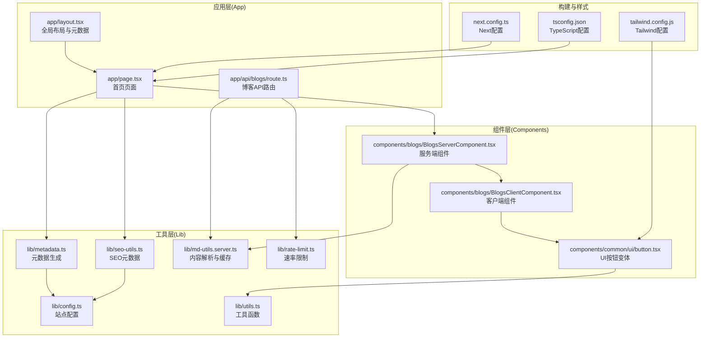
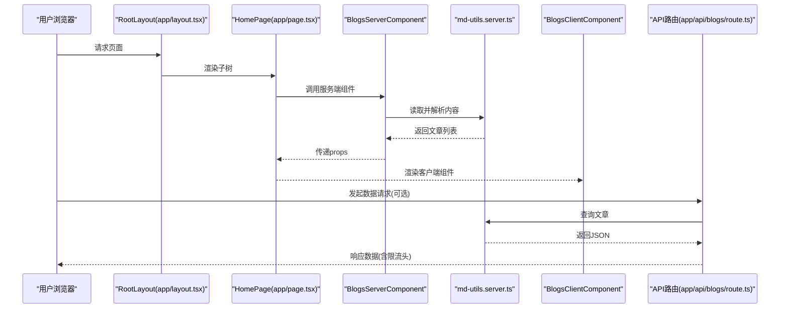
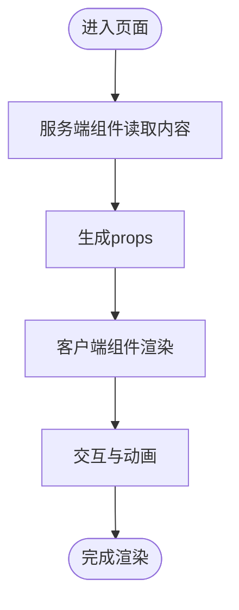
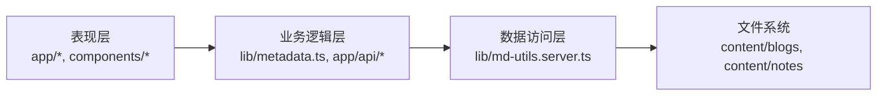
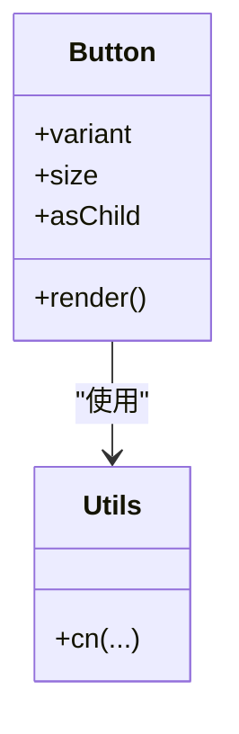
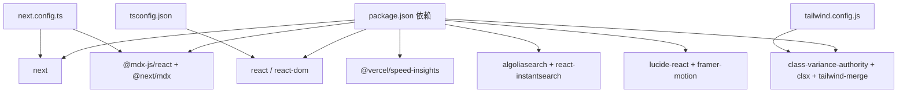

# 整体架构概览

<cite>
**本文引用的文件**
- [package.json](file://package.json)
- [next.config.ts](file://next.config.ts)
- [tsconfig.json](file://tsconfig.json)
- [tailwind.config.js](file://tailwind.config.js)
- [app/layout.tsx](file://app/layout.tsx)
- [app/page.tsx](file://app/page.tsx)
- [lib/config.ts](file://lib/config.ts)
- [lib/utils.ts](file://lib/utils.ts)
- [lib/metadata.ts](file://lib/metadata.ts)
- [lib/seo-utils.ts](file://lib/seo-utils.ts)
- [lib/md-utils.server.ts](file://lib/md-utils.server.ts)
- [lib/rate-limit.ts](file://lib/rate-limit.ts)
- [components/blogs/BlogsServerComponent.tsx](file://components/blogs/BlogsServerComponent.tsx)
- [components/blogs/BlogsClientComponent.tsx](file://components/blogs/BlogsClientComponent.tsx)
- [components/common/ui/button.tsx](file://components/common/ui/button.tsx)
- [app/api/blogs/route.ts](file://app/api/blogs/route.ts)
</cite>

## 目录
1. [引言](#引言)
2. [项目结构](#项目结构)
3. [核心组件](#核心组件)
4. [架构总览](#架构总览)
5. [详细组件分析](#详细组件分析)
6. [依赖分析](#依赖分析)
7. [性能考量](#性能考量)
8. [故障排查指南](#故障排查指南)
9. [结论](#结论)
10. [附录](#附录)

## 引言
本文件面向博客系统整体架构概览，重点阐述基于 Next.js 16 App Router 的设计理念与实现方式，系统性说明 Server Components 与 Client Components 的混合架构模式、分层架构设计（表现层、业务逻辑层、数据访问层）、组件化与模块化组织方式，并给出技术选型的动机与权衡。文档同时提供系统架构图与组件关系图，帮助读者快速把握各模块之间的依赖关系与数据流向。

## 项目结构
该项目采用 Next.js 16 App Router 的 App Directory 结构，以功能域与职责为中心进行模块化组织。根目录下包含应用入口、API 路由、共享组件、业务工具库、静态资源与配置文件。App Router 将页面、布局、错误边界、加载状态等概念统一到 app 目录内，便于语义化组织与增量采用。

- 应用入口与全局布局：app/layout.tsx 提供站点级元数据、主题、导航、页脚与错误边界包装。
- 页面与客户端组件：app/page.tsx 展示首页内容，通过 Server Component 读取数据后传递给 Client Component 渲染交互。
- 共享组件与UI原子：components/common 下提供通用 UI 组件与业务组件，如按钮、导航、页脚、评论等。
- 工具与配置：lib 目录集中存放网站配置、元数据生成、SEO 工具、Markdown/MDX 解析、速率限制等。
- API 路由：app/api 下提供 REST 接口，负责数据查询与安全控制。
- 样式与主题：tailwind.config.js 定义设计系统；components/common/ui/button.tsx 展示基于 class-variance-authority 的变体体系。
- 构建与运行：next.config.ts 启用 MDX 支持与图片优化；package.json 定义脚本与依赖；tsconfig.json 配置 TypeScript 严格模式与路径别名。

图表来源
- [app/layout.tsx:1-108](file://app/layout.tsx#L1-L108)
- [app/page.tsx:1-16](file://app/page.tsx#L1-L16)
- [app/api/blogs/route.ts:1-62](file://app/api/blogs/route.ts#L1-L62)
- [components/blogs/BlogsServerComponent.tsx:1-8](file://components/blogs/BlogsServerComponent.tsx#L1-L8)
- [components/blogs/BlogsClientComponent.tsx:1-67](file://components/blogs/BlogsClientComponent.tsx#L1-L67)
- [components/common/ui/button.tsx:1-65](file://components/common/ui/button.tsx#L1-L65)
- [lib/config.ts:1-108](file://lib/config.ts#L1-L108)
- [lib/metadata.ts:1-160](file://lib/metadata.ts#L1-L160)
- [lib/seo-utils.ts:1-54](file://lib/seo-utils.ts#L1-L54)
- [lib/md-utils.server.ts:1-218](file://lib/md-utils.server.ts#L1-L218)
- [lib/rate-limit.ts](file://lib/rate-limit.ts)
- [lib/utils.ts:1-12](file://lib/utils.ts#L1-L12)
- [next.config.ts:1-38](file://next.config.ts#L1-L38)
- [tsconfig.json:1-35](file://tsconfig.json#L1-L35)
- [tailwind.config.js:1-22](file://tailwind.config.js#L1-L22)

章节来源
- [package.json:1-64](file://package.json#L1-L64)
- [next.config.ts:1-38](file://next.config.ts#L1-L38)
- [tsconfig.json:1-35](file://tsconfig.json#L1-L35)
- [tailwind.config.js:1-22](file://tailwind.config.js#L1-L22)

## 核心组件
- 全局布局与元数据：app/layout.tsx 提供站点级元数据、Viewport、导航、页脚、加载条、分析与 Service Worker 注册等，统一承载于根布局之下。
- 首页页面：app/page.tsx 通过 Server Component 读取博客列表，再交给 Client Component 进行渲染与交互。
- 服务端组件：components/blogs/BlogsServerComponent.tsx 调用 lib/md-utils.server.ts 读取 Markdown/MDX 内容，利用 React 缓存机制提升性能。
- 客户端组件：components/blogs/BlogsClientComponent.tsx 负责交互元素（动画、统计、留言墙等）与子组件组合。
- UI 变体体系：components/common/ui/button.tsx 使用 class-variance-authority 与 radix-ui，提供多尺寸与多语义的按钮变体。
- 元数据与 SEO：lib/metadata.ts 与 lib/seo-utils.ts 统一生成 Open Graph、Twitter Card、canonical 等 SEO 元数据。
- API 路由：app/api/blogs/route.ts 提供博客数据查询接口，集成 lib/rate-limit.ts 进行速率限制与响应头透传。

章节来源
- [app/layout.tsx:1-108](file://app/layout.tsx#L1-L108)
- [app/page.tsx:1-16](file://app/page.tsx#L1-L16)
- [components/blogs/BlogsServerComponent.tsx:1-8](file://components/blogs/BlogsServerComponent.tsx#L1-L8)
- [components/blogs/BlogsClientComponent.tsx:1-67](file://components/blogs/BlogsClientComponent.tsx#L1-L67)
- [components/common/ui/button.tsx:1-65](file://components/common/ui/button.tsx#L1-L65)
- [lib/metadata.ts:1-160](file://lib/metadata.ts#L1-L160)
- [lib/seo-utils.ts:1-54](file://lib/seo-utils.ts#L1-L54)
- [app/api/blogs/route.ts:1-62](file://app/api/blogs/route.ts#L1-L62)

## 架构总览
本系统采用 Next.js 16 App Router 的混合架构模式：在服务端执行数据获取与内容解析，将结果传递给客户端组件进行交互渲染。该模式兼顾首屏性能与交互体验，同时保持开发体验与可维护性。

图表来源
- [app/layout.tsx:1-108](file://app/layout.tsx#L1-L108)
- [app/page.tsx:1-16](file://app/page.tsx#L1-L16)
- [components/blogs/BlogsServerComponent.tsx:1-8](file://components/blogs/BlogsServerComponent.tsx#L1-L8)
- [lib/md-utils.server.ts:1-218](file://lib/md-utils.server.ts#L1-L218)
- [components/blogs/BlogsClientComponent.tsx:1-67](file://components/blogs/BlogsClientComponent.tsx#L1-L67)
- [app/api/blogs/route.ts:1-62](file://app/api/blogs/route.ts#L1-L62)

## 详细组件分析

### Server Components 与 Client Components 混合架构
- 数据获取与渲染分离：服务端组件负责读取内容、生成元数据与 SEO，客户端组件负责交互与动态行为。
- 缓存与性能：服务端组件通过 React 缓存函数减少重复 IO，提升重复请求性能。
- 交互与样式：客户端组件引入动画、第三方 UI 组件与交互逻辑，避免在服务端渲染中产生副作用。

图表来源
- [components/blogs/BlogsServerComponent.tsx:1-8](file://components/blogs/BlogsServerComponent.tsx#L1-L8)
- [lib/md-utils.server.ts:1-218](file://lib/md-utils.server.ts#L1-L218)
- [components/blogs/BlogsClientComponent.tsx:1-67](file://components/blogs/BlogsClientComponent.tsx#L1-L67)

章节来源
- [components/blogs/BlogsServerComponent.tsx:1-8](file://components/blogs/BlogsServerComponent.tsx#L1-L8)
- [components/blogs/BlogsClientComponent.tsx:1-67](file://components/blogs/BlogsClientComponent.tsx#L1-L67)
- [lib/md-utils.server.ts:1-218](file://lib/md-utils.server.ts#L1-L218)

### 分层架构设计
- 表现层（Presentation Layer）
  - app/* 页面与布局：负责路由与页面结构。
  - components/* 客户端组件：负责交互与视觉呈现。
- 业务逻辑层（Business Logic Layer）
  - lib/metadata.ts、lib/seo-utils.ts：统一生成 SEO 与页面元数据。
  - app/api/*：封装数据访问与安全策略（如速率限制）。
- 数据访问层（Data Access Layer）
  - lib/md-utils.server.ts：读取本地 Markdown/MDX 文件，解析 Front Matter 并缓存结果。

图表来源
- [lib/metadata.ts:1-160](file://lib/metadata.ts#L1-L160)
- [lib/seo-utils.ts:1-54](file://lib/seo-utils.ts#L1-L54)
- [app/api/blogs/route.ts:1-62](file://app/api/blogs/route.ts#L1-L62)
- [lib/md-utils.server.ts:1-218](file://lib/md-utils.server.ts#L1-L218)

章节来源
- [lib/metadata.ts:1-160](file://lib/metadata.ts#L1-L160)
- [lib/seo-utils.ts:1-54](file://lib/seo-utils.ts#L1-L54)
- [app/api/blogs/route.ts:1-62](file://app/api/blogs/route.ts#L1-L62)
- [lib/md-utils.server.ts:1-218](file://lib/md-utils.server.ts#L1-L218)

### 组件化设计原则与模块化组织
- 单一职责：每个组件聚焦单一功能，如按钮、导航、页脚、评论等。
- 变体体系：UI 组件通过变体（variant/size）扩展，结合 Tailwind 与 class-variance-authority 实现一致的设计语言。
- 路径别名：tsconfig.json 配置 @/* 路径别名，简化导入路径，提升可维护性。
- 设计系统：tailwind.config.js 扩展字体与色彩，形成统一的主题风格。

图表来源
- [components/common/ui/button.tsx:1-65](file://components/common/ui/button.tsx#L1-L65)
- [lib/utils.ts:1-12](file://lib/utils.ts#L1-L12)

章节来源
- [components/common/ui/button.tsx:1-65](file://components/common/ui/button.tsx#L1-L65)
- [lib/utils.ts:1-12](file://lib/utils.ts#L1-L12)
- [tsconfig.json:1-35](file://tsconfig.json#L1-L35)
- [tailwind.config.js:1-22](file://tailwind.config.js#L1-L22)

### 技术选型与权衡
- Next.js 16 与 App Router
  - 优势：路由与布局一体化、渐进增强、更好的性能与开发体验。
  - 权衡：对传统 Pages Router 的迁移成本与生态适配。
- React 18
  - 优势：并发特性、自动批处理、更好的 Suspense 与缓存支持。
  - 权衡：对旧版组件的兼容性与升级成本。
- TypeScript
  - 优势：类型安全、IDE 支持、长期可维护性。
  - 权衡：编译与类型检查开销，团队学习成本。
- Tailwind CSS
  - 优势：实用优先、主题一致性、易于定制。
  - 权衡：CSS 类名膨胀与样式覆盖复杂度。
- MDX
  - 优势：在 Markdown 中嵌入 React 组件，内容与交互融合。
  - 权衡：构建与运行时复杂度增加。

章节来源
- [package.json:16-45](file://package.json#L16-L45)
- [next.config.ts:1-38](file://next.config.ts#L1-L38)
- [tsconfig.json:1-35](file://tsconfig.json#L1-L35)
- [tailwind.config.js:1-22](file://tailwind.config.js#L1-L22)

## 依赖分析
- 运行时依赖
  - next、react、react-dom：框架与运行时。
  - @mdx-js/react、@next/mdx：MDX 支持。
  - @vercel/speed-insights：性能观测。
  - algoliasearch、react-instantsearch：搜索能力。
  - lucide-react、framer-motion：图标与动效。
  - class-variance-authority、clsx、tailwind-merge：UI 变体与样式合并。
- 开发依赖
  - typescript、@types/*：类型声明。
  - tailwindcss、eslint、@next/eslint-plugin-next：样式与质量保障。
- 构建配置
  - next.config.ts：启用 MDX、图片优化与输出模式。
  - tsconfig.json：严格模式、路径别名与 JSX 配置。
  - tailwind.config.js：内容扫描与主题扩展。

图表来源
- [package.json:16-61](file://package.json#L16-L61)
- [next.config.ts:1-38](file://next.config.ts#L1-L38)
- [tsconfig.json:1-35](file://tsconfig.json#L1-L35)
- [tailwind.config.js:1-22](file://tailwind.config.js#L1-L22)

章节来源
- [package.json:1-64](file://package.json#L1-L64)
- [next.config.ts:1-38](file://next.config.ts#L1-L38)
- [tsconfig.json:1-35](file://tsconfig.json#L1-L35)
- [tailwind.config.js:1-22](file://tailwind.config.js#L1-L22)

## 性能考量
- 服务端渲染与缓存
  - 利用 React 缓存函数减少重复 IO，提升重复请求性能。
  - 通过全局 Suspense 与错误边界包裹，保证首屏稳定。
- 图片优化与输出
  - next.config.ts 启用现代图片格式与远程图片白名单，降低带宽与提升加载速度。
  - 输出模式为 standalone，便于容器化部署。
- 样式与体积
  - Tailwind 仅扫描实际使用文件，减少未使用样式。
  - class-variance-authority 与 tailwind-merge 合并类名，避免重复样式。
- API 限流
  - app/api/blogs/route.ts 集成速率限制中间件，透传限流头，保护后端资源。

章节来源
- [lib/md-utils.server.ts:1-218](file://lib/md-utils.server.ts#L1-L218)
- [app/layout.tsx:1-108](file://app/layout.tsx#L1-L108)
- [next.config.ts:11-35](file://next.config.ts#L11-L35)
- [tailwind.config.js:1-22](file://tailwind.config.js#L1-L22)
- [app/api/blogs/route.ts:1-62](file://app/api/blogs/route.ts#L1-L62)

## 故障排查指南
- 页面元数据异常
  - 检查 lib/metadata.ts 与 lib/seo-utils.ts 的参数与默认值，确认站点配置是否正确。
- 404 或数据为空
  - app/api/blogs/route.ts 在未找到文章时返回 404，需确认内容目录与文件命名。
- 速率限制导致请求失败
  - app/api/blogs/route.ts 会根据预设策略返回限流响应，检查限流头与服务端日志。
- 样式不生效或冲突
  - 检查 tailwind.config.js 的 content 扫描范围与 class-variance-authority 的变体使用。
- 构建报错
  - 确认 tsconfig.json 的严格模式与路径别名配置，确保类型检查通过。

章节来源
- [lib/metadata.ts:1-160](file://lib/metadata.ts#L1-L160)
- [lib/seo-utils.ts:1-54](file://lib/seo-utils.ts#L1-L54)
- [app/api/blogs/route.ts:1-62](file://app/api/blogs/route.ts#L1-L62)
- [tailwind.config.js:1-22](file://tailwind.config.js#L1-L22)
- [tsconfig.json:1-35](file://tsconfig.json#L1-L35)

## 结论
本博客系统以 Next.js 16 App Router 为核心，采用 Server Components 与 Client Components 的混合架构，在保证首屏性能的同时提供良好的交互体验。通过清晰的分层设计、组件化与模块化组织、以及合理的技术选型与配置，系统实现了内容驱动、可扩展且易维护的博客平台。建议在后续迭代中持续关注性能指标、SEO 优化与可访问性，以进一步提升用户体验。

## 附录
- 关键流程回顾
  - 首页渲染：app/page.tsx -> BlogsServerComponent -> BlogsClientComponent -> 交互渲染。
  - API 查询：app/api/blogs/route.ts -> md-utils.server.ts -> JSON 响应（含限流头）。
  - SEO 元数据：lib/metadata.ts 与 lib/seo-utils.ts 统一生成 Open Graph/Twitter/Card 等。