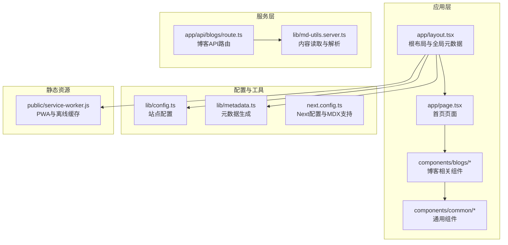
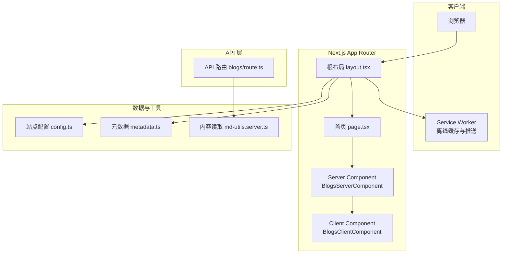
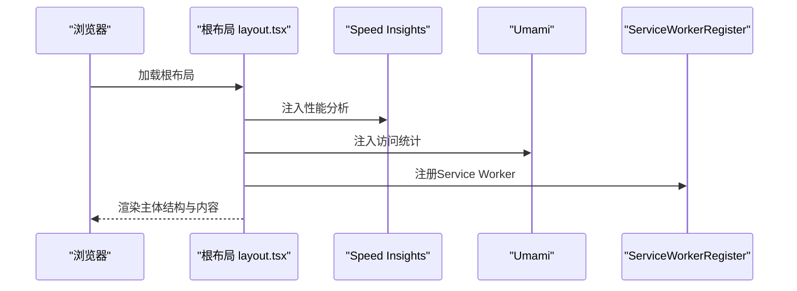
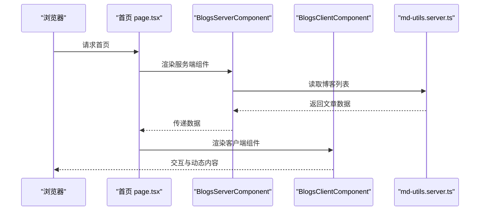
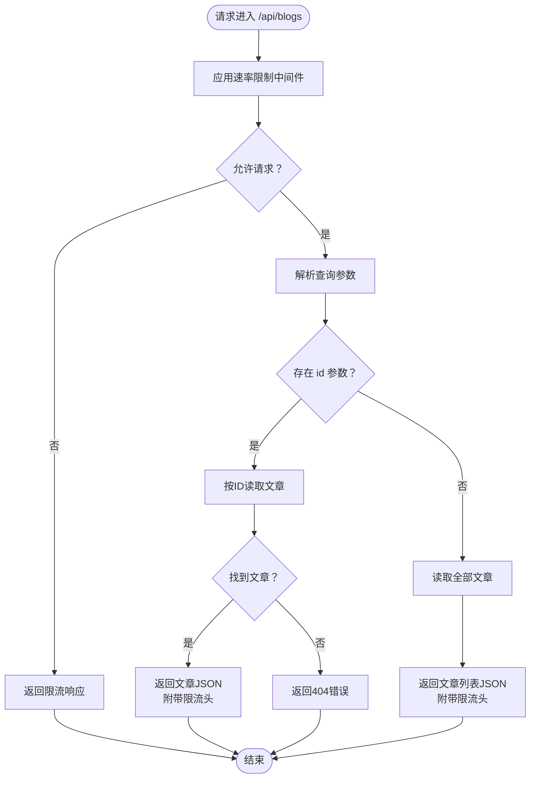
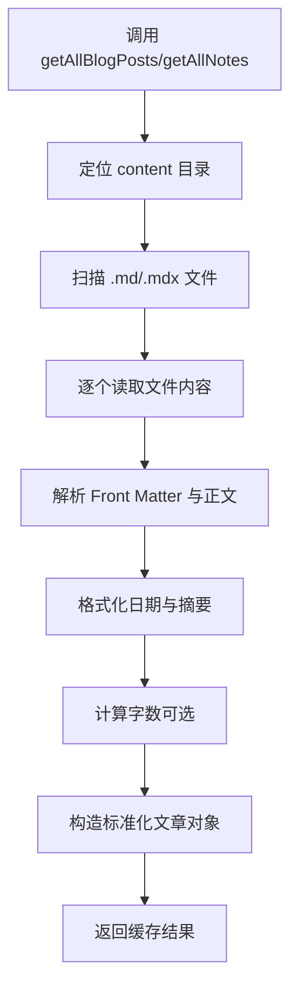
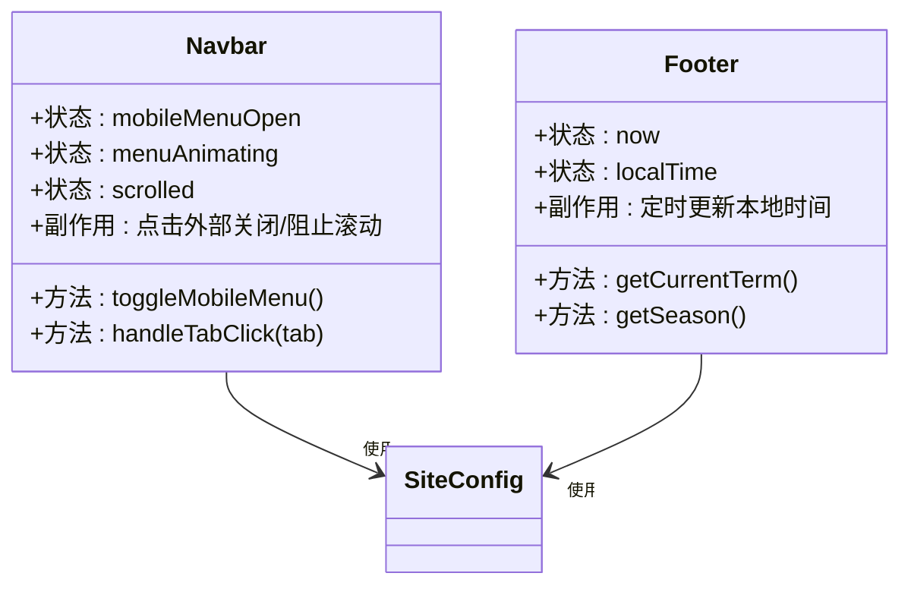
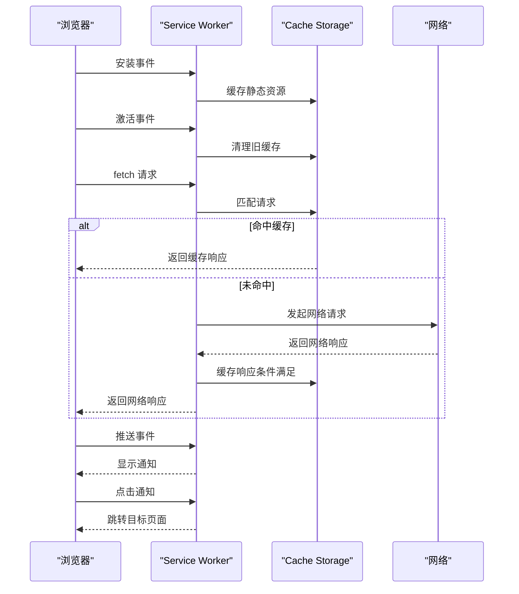
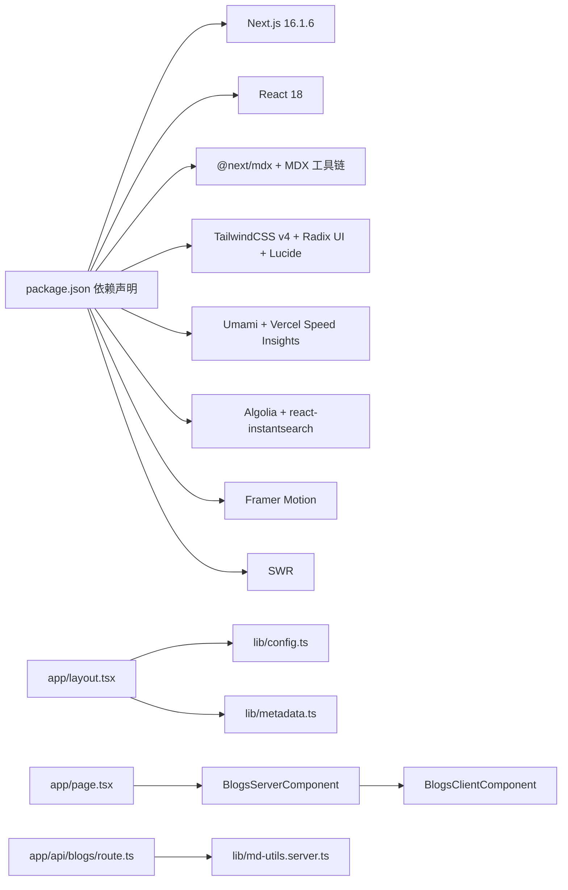

# 架构设计

<cite>
**本文引用的文件**
- [package.json](file://package.json)
- [next.config.ts](file://next.config.ts)
- [app/layout.tsx](file://app/layout.tsx)
- [lib/config.ts](file://lib/config.ts)
- [lib/metadata.ts](file://lib/metadata.ts)
- [app/page.tsx](file://app/page.tsx)
- [components/blogs/BlogsServerComponent.tsx](file://components/blogs/BlogsServerComponent.tsx)
- [components/blogs/BlogsClientComponent.tsx](file://components/blogs/BlogsClientComponent.tsx)
- [lib/md-utils.server.ts](file://lib/md-utils.server.ts)
- [app/api/blogs/route.ts](file://app/api/blogs/route.ts)
- [components/common/Navbar.tsx](file://components/common/Navbar.tsx)
- [components/common/footer/Footer.tsx](file://components/common/footer/Footer.tsx)
- [public/service-worker.js](file://public/service-worker.js)
</cite>

## 目录
1. [引言](#引言)
2. [项目结构](#项目结构)
3. [核心组件](#核心组件)
4. [架构总览](#架构总览)
5. [详细组件分析](#详细组件分析)
6. [依赖关系分析](#依赖关系分析)
7. [性能考量](#性能考量)
8. [故障排查指南](#故障排查指南)
9. [结论](#结论)
10. [附录](#附录)

## 引言
本架构文档面向博客系统，围绕 Next.js App Router 架构、Server Components 与 Client Components 的混合模式、组件化设计原则进行系统性阐述。文档覆盖高层设计、架构模式与系统边界，解释技术决策、权衡与约束，并给出基础设施要求、可扩展性考虑与部署拓扑建议。同时，涵盖安全、监控与灾难恢复等横切关注点，记录技术栈、第三方依赖与版本兼容性。

## 项目结构
该博客系统采用 Next.js App Router 的文件系统路由与约定式页面组织方式，结合 Server Components 与 Client Components 的混合渲染策略。整体结构以 app 为核心入口，按功能域划分页面与组件，lib 存放通用工具与配置，public 提供静态资源与 Service Worker，content 存放 Markdown/MDX 内容。

图表来源
- [app/layout.tsx:1-108](file://app/layout.tsx#L1-L108)
- [app/page.tsx:1-16](file://app/page.tsx#L1-L16)
- [components/blogs/BlogsServerComponent.tsx:1-8](file://components/blogs/BlogsServerComponent.tsx#L1-L8)
- [components/blogs/BlogsClientComponent.tsx:1-67](file://components/blogs/BlogsClientComponent.tsx#L1-L67)
- [app/api/blogs/route.ts:1-62](file://app/api/blogs/route.ts#L1-L62)
- [lib/md-utils.server.ts:1-218](file://lib/md-utils.server.ts#L1-L218)
- [lib/config.ts:1-108](file://lib/config.ts#L1-L108)
- [lib/metadata.ts:1-160](file://lib/metadata.ts#L1-L160)
- [next.config.ts:1-38](file://next.config.ts#L1-L38)
- [public/service-worker.js:1-131](file://public/service-worker.js#L1-L131)

章节来源
- [package.json:1-64](file://package.json#L1-L64)
- [next.config.ts:1-38](file://next.config.ts#L1-L38)
- [app/layout.tsx:1-108](file://app/layout.tsx#L1-L108)
- [lib/config.ts:1-108](file://lib/config.ts#L1-L108)
- [lib/metadata.ts:1-160](file://lib/metadata.ts#L1-L160)

## 核心组件
- 根布局与全局元数据：负责站点主题、SEO、分析与 PWA 注册，统一注入 Speed Insights、Umami、Service Worker 与加载条。
- 首页页面：通过 Server Component 读取内容并传递给 Client Component 渲染。
- 博客组件：BlogsServerComponent 在服务端聚合数据，BlogsClientComponent 承载交互与动态内容。
- API 路由：提供博客内容的统一接口，内置速率限制与错误处理。
- 通用组件：导航栏、页脚等跨页面复用组件，具备响应式与无障碍特性。
- 配置与元数据：集中管理站点配置、导航、关键词与页面元数据生成。
- Next 配置：启用 MDX 支持、图片优化与生产构建输出。

章节来源
- [app/layout.tsx:1-108](file://app/layout.tsx#L1-L108)
- [app/page.tsx:1-16](file://app/page.tsx#L1-L16)
- [components/blogs/BlogsServerComponent.tsx:1-8](file://components/blogs/BlogsServerComponent.tsx#L1-L8)
- [components/blogs/BlogsClientComponent.tsx:1-67](file://components/blogs/BlogsClientComponent.tsx#L1-L67)
- [app/api/blogs/route.ts:1-62](file://app/api/blogs/route.ts#L1-L62)
- [lib/config.ts:1-108](file://lib/config.ts#L1-L108)
- [lib/metadata.ts:1-160](file://lib/metadata.ts#L1-L160)
- [next.config.ts:1-38](file://next.config.ts#L1-L38)

## 架构总览
系统采用“服务端聚合 + 客户端渲染”的混合模式：
- 服务端：负责内容读取、数据聚合与首屏渲染，减少客户端负担，提升首屏性能与 SEO 友好性。
- 客户端：负责交互、动画与动态行为，确保用户体验流畅。
- API 层：提供受速率限制的内容接口，保障服务稳定性。
- 配置与工具：集中化配置与元数据生成，降低重复逻辑与维护成本。
- PWA：通过 Service Worker 提供离线缓存与推送能力。

图表来源
- [app/layout.tsx:1-108](file://app/layout.tsx#L1-L108)
- [app/page.tsx:1-16](file://app/page.tsx#L1-L16)
- [components/blogs/BlogsServerComponent.tsx:1-8](file://components/blogs/BlogsServerComponent.tsx#L1-L8)
- [components/blogs/BlogsClientComponent.tsx:1-67](file://components/blogs/BlogsClientComponent.tsx#L1-L67)
- [app/api/blogs/route.ts:1-62](file://app/api/blogs/route.ts#L1-L62)
- [lib/config.ts:1-108](file://lib/config.ts#L1-L108)
- [lib/metadata.ts:1-160](file://lib/metadata.ts#L1-L160)
- [lib/md-utils.server.ts:1-218](file://lib/md-utils.server.ts#L1-L218)
- [public/service-worker.js:1-131](file://public/service-worker.js#L1-L131)

## 详细组件分析

### 根布局与全局元数据
- 职责：提供站点整体结构、SEO 元数据、主题与分析埋点、PWA 注册与加载指示器。
- 关键点：使用 Suspense 包裹分析组件，避免阻塞首屏；注入 Speed Insights 与 Umami；注册 Service Worker；提供 manifest 与 RSS 链接；统一 viewport 与主题色。
- 设计原则：最小化客户端状态，最大化服务端渲染收益；集中化配置与元数据生成。

图表来源
- [app/layout.tsx:1-108](file://app/layout.tsx#L1-L108)

章节来源
- [app/layout.tsx:1-108](file://app/layout.tsx#L1-L108)
- [lib/config.ts:1-108](file://lib/config.ts#L1-L108)
- [lib/metadata.ts:1-160](file://lib/metadata.ts#L1-L160)

### 首页页面与混合渲染
- 职责：首页作为入口，通过 Server Component 读取内容并传入 Client Component，实现“服务端聚合 + 客户端渲染”。
- 关键点：Server Component 调用内容工具函数获取数据；Client Component 负责交互与动态内容；页面元数据通过统一方法生成。

图表来源
- [app/page.tsx:1-16](file://app/page.tsx#L1-L16)
- [components/blogs/BlogsServerComponent.tsx:1-8](file://components/blogs/BlogsServerComponent.tsx#L1-L8)
- [components/blogs/BlogsClientComponent.tsx:1-67](file://components/blogs/BlogsClientComponent.tsx#L1-L67)
- [lib/md-utils.server.ts:1-218](file://lib/md-utils.server.ts#L1-L218)

章节来源
- [app/page.tsx:1-16](file://app/page.tsx#L1-L16)
- [components/blogs/BlogsServerComponent.tsx:1-8](file://components/blogs/BlogsServerComponent.tsx#L1-L8)
- [components/blogs/BlogsClientComponent.tsx:1-67](file://components/blogs/BlogsClientComponent.tsx#L1-L67)
- [lib/md-utils.server.ts:1-218](file://lib/md-utils.server.ts#L1-L218)

### 博客 API 路由与速率限制
- 职责：提供博客内容的统一接口，支持按 ID 查询与全量查询。
- 关键点：集成速率限制中间件，对异常进行降级处理；在响应头中返回限流状态；对未找到内容返回标准错误响应。
- 安全与稳定性：通过速率限制保护后端资源；错误处理保证接口健壮性。

图表来源
- [app/api/blogs/route.ts:1-62](file://app/api/blogs/route.ts#L1-L62)
- [lib/rate-limit.ts](file://lib/rate-limit.ts)

章节来源
- [app/api/blogs/route.ts:1-62](file://app/api/blogs/route.ts#L1-L62)

### 内容读取与解析（Server）
- 职责：从 content 目录读取 Markdown/MDX 文件，解析 Front Matter，生成标准化文章对象。
- 关键点：使用 React 缓存装饰器缓存 IO 结果；支持博客与手记两类内容；提供按 ID 查找与全量读取；计算字数与摘要提取。
- 性能：通过缓存减少重复 IO；按需解析，避免不必要的处理。

图表来源
- [lib/md-utils.server.ts:1-218](file://lib/md-utils.server.ts#L1-L218)

章节来源
- [lib/md-utils.server.ts:1-218](file://lib/md-utils.server.ts#L1-L218)

### 导航栏与页脚（通用组件）
- 导航栏：支持桌面与移动端菜单，具备滚动透明效果、键盘与点击外部关闭等交互；使用配置驱动导航项。
- 页脚：展示节气、地图与时钟等本地化信息，具备季节主题与博客运行时长展示；仅在客户端渲染以避免 SSR 不一致。

图表来源
- [components/common/Navbar.tsx:1-234](file://components/common/Navbar.tsx#L1-L234)
- [components/common/footer/Footer.tsx:1-250](file://components/common/footer/Footer.tsx#L1-L250)
- [lib/config.ts:1-108](file://lib/config.ts#L1-L108)

章节来源
- [components/common/Navbar.tsx:1-234](file://components/common/Navbar.tsx#L1-L234)
- [components/common/footer/Footer.tsx:1-250](file://components/common/footer/Footer.tsx#L1-L250)
- [lib/config.ts:1-108](file://lib/config.ts#L1-L108)

### PWA 与离线缓存
- Service Worker：安装阶段缓存静态资源；激活阶段清理旧缓存；fetch 阶段优先缓存命中，否则网络回源并缓存响应；导航请求失败时回退首页；支持推送通知与点击跳转。

图表来源
- [public/service-worker.js:1-131](file://public/service-worker.js#L1-L131)

章节来源
- [public/service-worker.js:1-131](file://public/service-worker.js#L1-L131)

## 依赖关系分析
- 技术栈与版本：基于 Next.js 16.1.6 与 React 18，启用 MDX 支持；使用 Tailwind CSS v4、Radix UI、Lucide 图标等生态组件。
- 外部依赖：Algolia 搜索、Umami 自托管分析、Vercel OG 图片生成、Framer Motion 动画、SWR 数据获取等。
- 配置耦合：根布局依赖站点配置与元数据模块；页面依赖 Server Component 与 Client Component；API 路由依赖内容工具函数。

图表来源
- [package.json:1-64](file://package.json#L1-L64)
- [next.config.ts:1-38](file://next.config.ts#L1-L38)
- [app/layout.tsx:1-108](file://app/layout.tsx#L1-L108)
- [lib/config.ts:1-108](file://lib/config.ts#L1-L108)
- [lib/metadata.ts:1-160](file://lib/metadata.ts#L1-L160)
- [app/page.tsx:1-16](file://app/page.tsx#L1-L16)
- [components/blogs/BlogsServerComponent.tsx:1-8](file://components/blogs/BlogsServerComponent.tsx#L1-L8)
- [components/blogs/BlogsClientComponent.tsx:1-67](file://components/blogs/BlogsClientComponent.tsx#L1-L67)
- [app/api/blogs/route.ts:1-62](file://app/api/blogs/route.ts#L1-L62)
- [lib/md-utils.server.ts:1-218](file://lib/md-utils.server.ts#L1-L218)

章节来源
- [package.json:1-64](file://package.json#L1-L64)
- [next.config.ts:1-38](file://next.config.ts#L1-L38)

## 性能考量
- 首屏性能：服务端聚合数据，减少客户端 IO；使用 Suspense 与渐进式渲染；图片优化与 WebP/AVIF 格式支持。
- 缓存策略：React 缓存装饰器减少重复 IO；Service Worker 缓存静态资源与响应；CDN 加速与边缘缓存。
- 交互体验：客户端组件按需加载；动画与过渡使用轻量方案；滚动与焦点管理避免重排。
- 可观测性：集成 Speed Insights 与 Umami；API 返回限流状态便于监控；日志与错误边界捕获异常。

## 故障排查指南
- 服务端渲染问题：检查根布局与页面元数据生成逻辑；确认配置模块导出正确；验证内容工具函数返回值。
- API 限流与错误：查看速率限制中间件返回状态；确认错误响应格式与状态码；检查文件路径与内容解析异常。
- 客户端交互异常：排查导航栏与页脚的客户端副作用；确认 DOM 操作时机与事件绑定；检查本地存储与系统偏好。
- PWA 与缓存：确认 Service Worker 注册与激活流程；验证静态资源清单与缓存策略；测试离线场景与推送通知。

章节来源
- [app/layout.tsx:1-108](file://app/layout.tsx#L1-L108)
- [app/api/blogs/route.ts:1-62](file://app/api/blogs/route.ts#L1-L62)
- [components/common/Navbar.tsx:1-234](file://components/common/Navbar.tsx#L1-L234)
- [components/common/footer/Footer.tsx:1-250](file://components/common/footer/Footer.tsx#L1-L250)
- [public/service-worker.js:1-131](file://public/service-worker.js#L1-L131)

## 结论
该博客系统以 Next.js App Router 为基础，采用 Server Components 与 Client Components 的混合渲染模式，结合集中化配置与元数据生成、API 限流与 PWA 缓存，形成高性能、可维护与可扩展的架构。通过明确的系统边界与组件职责划分，系统在保证良好用户体验的同时，兼顾了安全性、可观测性与可运维性。

## 附录
- 技术栈与版本：Next.js 16.1.6、React 18、MDX、Tailwind CSS v4、Radix UI、Lucide、Algolia、Umami、Vercel OG、Framer Motion、SWR。
- 第三方依赖：@next/mdx、algoliasearch、react-instantsearch、@vercel/speed-insights、@vercel/og、framer-motion、swr 等。
- 版本兼容性：遵循 Next.js 16.x 生态；Tailwind CSS v4 配置；TypeScript 类型检查；ESLint 规范。