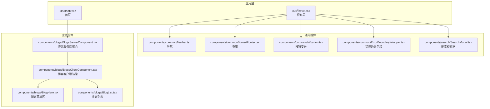
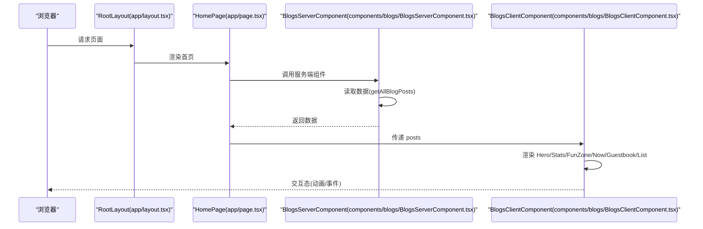
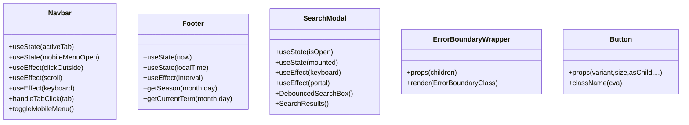
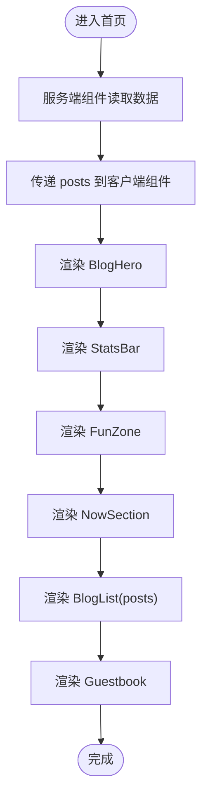
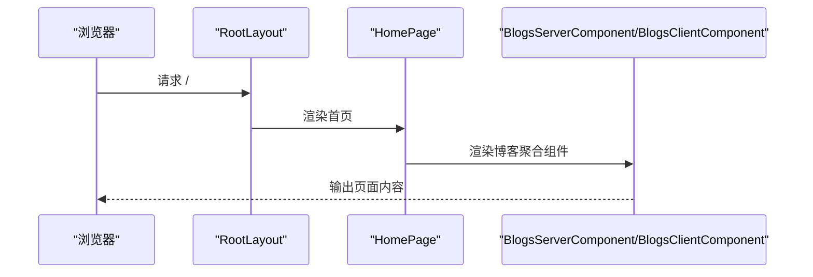
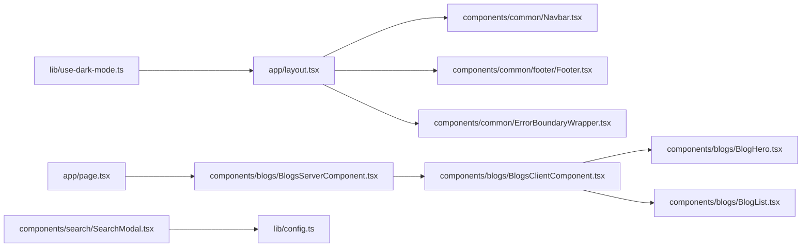

# 组件架构设计

<cite>
**本文引用的文件**
- [app/layout.tsx](file://app/layout.tsx)
- [app/page.tsx](file://app/page.tsx)
- [components/blogs/BlogHero.tsx](file://components/blogs/BlogHero.tsx)
- [components/blogs/BlogList.tsx](file://components/blogs/BlogList.tsx)
- [components/blogs/BlogsServerComponent.tsx](file://components/blogs/BlogsServerComponent.tsx)
- [components/blogs/BlogsClientComponent.tsx](file://components/blogs/BlogsClientComponent.tsx)
- [components/common/Navbar.tsx](file://components/common/Navbar.tsx)
- [components/common/footer/Footer.tsx](file://components/common/footer/Footer.tsx)
- [components/common/ui/button.tsx](file://components/common/ui/button.tsx)
- [components/search/SearchModal.tsx](file://components/search/SearchModal.tsx)
- [components/common/ErrorBoundaryWrapper.tsx](file://components/common/ErrorBoundaryWrapper.tsx)
- [lib/config.ts](file://lib/config.ts)
- [lib/use-dark-mode.ts](file://lib/use-dark-mode.ts)
</cite>

## 目录
1. [引言](#引言)
2. [项目结构](#项目结构)
3. [核心组件](#核心组件)
4. [架构总览](#架构总览)
5. [详细组件分析](#详细组件分析)
6. [依赖关系分析](#依赖关系分析)
7. [性能考量](#性能考量)
8. [故障排查指南](#故障排查指南)
9. [结论](#结论)
10. [附录](#附录)

## 引言
本文件面向博客系统的组件架构，系统采用 Next.js App Router 与 React Server Components/Client Components 混合模式。文档从“通用组件、业务组件、页面组件”的分类视角出发，梳理组件职责、通信方式、复用与组合策略，并结合实际代码路径给出可操作的最佳实践与优化建议。

## 项目结构
- 页面入口与布局
  - 应用根布局负责全局元数据、主题、分析与 SW 注册、骨架与错误边界包裹等。
  - 首页通过服务端组件拉取数据，再交给客户端组件渲染交互与动态内容。
- 组件分层
  - 通用组件：跨页面复用的基础 UI 与通用能力（如导航、页脚、按钮、搜索模态框、错误边界）。
  - 业务组件：围绕博客域的组合组件（如博客英雄区、博客列表、博客聚合组件）。
  - 页面组件：页面级容器，负责数据获取与组件编排。

图表来源
- [app/layout.tsx:64-107](file://app/layout.tsx#L64-L107)
- [app/page.tsx:12-14](file://app/page.tsx#L12-L14)
- [components/blogs/BlogsServerComponent.tsx:4-7](file://components/blogs/BlogsServerComponent.tsx#L4-L7)
- [components/blogs/BlogsClientComponent.tsx:39-66](file://components/blogs/BlogsClientComponent.tsx#L39-L66)
- [components/blogs/BlogHero.tsx:15-58](file://components/blogs/BlogHero.tsx#L15-L58)
- [components/blogs/BlogList.tsx:24-66](file://components/blogs/BlogList.tsx#L24-L66)
- [components/common/Navbar.tsx:46-233](file://components/common/Navbar.tsx#L46-L233)
- [components/common/footer/Footer.tsx:93-249](file://components/common/footer/Footer.tsx#L93-L249)
- [components/common/ui/button.tsx:41-64](file://components/common/ui/button.tsx#L41-L64)
- [components/search/SearchModal.tsx:69-178](file://components/search/SearchModal.tsx#L69-L178)
- [components/common/ErrorBoundaryWrapper.tsx:18-23](file://components/common/ErrorBoundaryWrapper.tsx#L18-L23)

章节来源
- [app/layout.tsx:64-107](file://app/layout.tsx#L64-L107)
- [app/page.tsx:12-14](file://app/page.tsx#L12-L14)

## 核心组件
- 根布局与页面
  - 根布局负责注入分析、注册 Service Worker、骨架加载条、导航、错误边界包裹与页脚。
  - 首页通过服务端组件拉取数据，再将数据透传给客户端组件进行渲染与交互。
- 通用组件
  - 导航栏：响应式菜单、激活态高亮、移动端遮罩与键盘交互、滚动行为控制。
  - 页脚：本地时间与时钟、节气与季节主题、地图与城市标记、导航与社交链接。
  - 搜索模态框：Algolia InstantSearch、防抖输入、命中项点击跳转、Portal 挂载。
  - 错误边界包装：在服务端组件中安全地使用客户端错误边界。
  - 按钮变体：基于变体与尺寸的类名组合，支持 asChild 渲染。
- 业务组件
  - 博客聚合组件：服务端组件负责数据获取，客户端组件负责渲染与交互。
  - 博客英雄区：作者信息与社交入口。
  - 博客列表：展示最新文章、标签、日期等信息。

章节来源
- [app/layout.tsx:64-107](file://app/layout.tsx#L64-L107)
- [app/page.tsx:12-14](file://app/page.tsx#L12-L14)
- [components/common/Navbar.tsx:46-233](file://components/common/Navbar.tsx#L46-L233)
- [components/common/footer/Footer.tsx:93-249](file://components/common/footer/Footer.tsx#L93-L249)
- [components/search/SearchModal.tsx:69-178](file://components/search/SearchModal.tsx#L69-L178)
- [components/common/ErrorBoundaryWrapper.tsx:18-23](file://components/common/ErrorBoundaryWrapper.tsx#L18-L23)
- [components/common/ui/button.tsx:41-64](file://components/common/ui/button.tsx#L41-L64)
- [components/blogs/BlogsServerComponent.tsx:4-7](file://components/blogs/BlogsServerComponent.tsx#L4-L7)
- [components/blogs/BlogsClientComponent.tsx:39-66](file://components/blogs/BlogsClientComponent.tsx#L39-L66)
- [components/blogs/BlogHero.tsx:15-58](file://components/blogs/BlogHero.tsx#L15-L58)
- [components/blogs/BlogList.tsx:24-66](file://components/blogs/BlogList.tsx#L24-L66)

## 架构总览
系统采用“服务端聚合 + 客户端渲染”的混合架构：
- 服务端组件负责数据获取与静态渲染，降低首屏负载。
- 客户端组件负责交互、动画、状态与动态行为。
- 通用组件与业务组件通过 props 传递数据，通过事件回调实现状态提升与解耦。

图表来源
- [app/layout.tsx:64-107](file://app/layout.tsx#L64-L107)
- [app/page.tsx:12-14](file://app/page.tsx#L12-L14)
- [components/blogs/BlogsServerComponent.tsx:4-7](file://components/blogs/BlogsServerComponent.tsx#L4-L7)
- [components/blogs/BlogsClientComponent.tsx:39-66](file://components/blogs/BlogsClientComponent.tsx#L39-L66)

## 详细组件分析

### 通用组件分析
- 导航栏组件
  - 职责：响应式导航、移动端菜单、激活态高亮、滚动行为、键盘与点击外部关闭。
  - 关键点：受控状态、useEffect 生命周期、动画样式注入、点击外部关闭、滚动锁定。
- 页脚组件
  - 职责：本地时间与时钟、节气与季节主题、地图与城市标记、导航与社交链接。
  - 关键点：本地时间定时器、节气计算、SVG 地图绘制、CSS 变量主题。
- 搜索模态框
  - 职责：Algolia 搜索、防抖输入、命中项点击跳转、Portal 挂载、Esc 关闭。
  - 关键点：InstantSearch、防抖 refine、键盘事件、滚动锁定、预取路由。
- 错误边界包装
  - 职责：在服务端组件中安全使用客户端错误边界。
- 按钮变体
  - 职责：统一按钮外观与尺寸，支持 asChild 渲染。

图表来源
- [components/common/Navbar.tsx:46-233](file://components/common/Navbar.tsx#L46-L233)
- [components/common/footer/Footer.tsx:93-249](file://components/common/footer/Footer.tsx#L93-L249)
- [components/search/SearchModal.tsx:69-178](file://components/search/SearchModal.tsx#L69-L178)
- [components/common/ErrorBoundaryWrapper.tsx:18-23](file://components/common/ErrorBoundaryWrapper.tsx#L18-L23)
- [components/common/ui/button.tsx:41-64](file://components/common/ui/button.tsx#L41-L64)

章节来源
- [components/common/Navbar.tsx:46-233](file://components/common/Navbar.tsx#L46-L233)
- [components/common/footer/Footer.tsx:93-249](file://components/common/footer/Footer.tsx#L93-L249)
- [components/search/SearchModal.tsx:69-178](file://components/search/SearchModal.tsx#L69-L178)
- [components/common/ErrorBoundaryWrapper.tsx:18-23](file://components/common/ErrorBoundaryWrapper.tsx#L18-L23)
- [components/common/ui/button.tsx:41-64](file://components/common/ui/button.tsx#L41-L64)

### 业务组件分析
- 博客聚合组件
  - 服务端组件：负责读取数据并传递给客户端组件。
  - 客户端组件：负责渲染 Hero、统计、FunZone、Now、Guestbook、文章列表与交互。
- 博客英雄区
  - 展示作者信息、社交入口与图片回退逻辑。
- 博客列表
  - 展示最新文章、标签、日期等，支持空状态。

图表来源
- [components/blogs/BlogsServerComponent.tsx:4-7](file://components/blogs/BlogsServerComponent.tsx#L4-L7)
- [components/blogs/BlogsClientComponent.tsx:39-66](file://components/blogs/BlogsClientComponent.tsx#L39-L66)
- [components/blogs/BlogHero.tsx:15-58](file://components/blogs/BlogHero.tsx#L15-L58)
- [components/blogs/BlogList.tsx:24-66](file://components/blogs/BlogList.tsx#L24-L66)

章节来源
- [components/blogs/BlogsServerComponent.tsx:4-7](file://components/blogs/BlogsServerComponent.tsx#L4-L7)
- [components/blogs/BlogsClientComponent.tsx:39-66](file://components/blogs/BlogsClientComponent.tsx#L39-L66)
- [components/blogs/BlogHero.tsx:15-58](file://components/blogs/BlogHero.tsx#L15-L58)
- [components/blogs/BlogList.tsx:24-66](file://components/blogs/BlogList.tsx#L24-L66)

### 页面组件分析
- 根布局
  - 职责：注入元数据、分析、SW 注册、骨架、导航、错误边界包裹、页脚。
- 首页
  - 职责：调用博客聚合组件，生成页面内容。

图表来源
- [app/layout.tsx:64-107](file://app/layout.tsx#L64-L107)
- [app/page.tsx:12-14](file://app/page.tsx#L12-L14)
- [components/blogs/BlogsServerComponent.tsx:4-7](file://components/blogs/BlogsServerComponent.tsx#L4-L7)
- [components/blogs/BlogsClientComponent.tsx:39-66](file://components/blogs/BlogsClientComponent.tsx#L39-L66)

章节来源
- [app/layout.tsx:64-107](file://app/layout.tsx#L64-L107)
- [app/page.tsx:12-14](file://app/page.tsx#L12-L14)

## 依赖关系分析
- 组件依赖
  - 根布局依赖导航、页脚、错误边界、分析与 SW 注册。
  - 首页依赖博客聚合组件。
  - 博客聚合组件依赖博客英雄区与博客列表。
  - 搜索模态框依赖 Algolia 客户端库与路由。
- 配置与主题
  - 导航与页脚使用站点配置，深色模式通过 Hook 管理并同步到 HTML。

图表来源
- [app/layout.tsx:64-107](file://app/layout.tsx#L64-L107)
- [app/page.tsx:12-14](file://app/page.tsx#L12-L14)
- [components/blogs/BlogsServerComponent.tsx:4-7](file://components/blogs/BlogsServerComponent.tsx#L4-L7)
- [components/blogs/BlogsClientComponent.tsx:39-66](file://components/blogs/BlogsClientComponent.tsx#L39-L66)
- [components/blogs/BlogHero.tsx:15-58](file://components/blogs/BlogHero.tsx#L15-L58)
- [components/blogs/BlogList.tsx:24-66](file://components/blogs/BlogList.tsx#L24-L66)
- [components/search/SearchModal.tsx:69-178](file://components/search/SearchModal.tsx#L69-L178)
- [lib/config.ts:13-98](file://lib/config.ts#L13-L98)
- [lib/use-dark-mode.ts:14-58](file://lib/use-dark-mode.ts#L14-L58)

章节来源
- [lib/config.ts:13-98](file://lib/config.ts#L13-L98)
- [lib/use-dark-mode.ts:14-58](file://lib/use-dark-mode.ts#L14-L58)

## 性能考量
- 服务端渲染与数据拉取
  - 在服务端组件中完成数据读取，减少首屏 JS 体积与交互延迟。
- 客户端组件最小化
  - 将交互与动画放在客户端组件，避免在服务端组件中引入副作用。
- 图片与资源
  - 图片懒加载与回退策略，减少失败重试与闪烁。
- 搜索与网络
  - 搜索输入防抖、结果空状态提示、加载覆盖层，避免闪烁与重复请求。
- 主题与分析
  - 深色模式状态持久化与系统偏好回退，分析脚本按需注入。

章节来源
- [components/blogs/BlogsServerComponent.tsx:4-7](file://components/blogs/BlogsServerComponent.tsx#L4-L7)
- [components/blogs/BlogsClientComponent.tsx:39-66](file://components/blogs/BlogsClientComponent.tsx#L39-L66)
- [components/blogs/BlogHero.tsx:15-58](file://components/blogs/BlogHero.tsx#L15-L58)
- [components/search/SearchModal.tsx:69-178](file://components/search/SearchModal.tsx#L69-L178)
- [lib/use-dark-mode.ts:14-58](file://lib/use-dark-mode.ts#L14-L58)

## 故障排查指南
- 混合模式注意事项
  - 服务端组件中禁止直接使用浏览器 API；如需，请在客户端组件中封装。
- 错误边界
  - 在服务端组件中使用错误边界包装器，确保异常被捕获并降级显示。
- 深色模式不生效
  - 检查 HTML 上的 dark 类是否同步，确认 localStorage 与系统偏好设置。
- 搜索无结果
  - 确认 Algolia 环境变量与索引名称正确，检查网络请求与空状态提示。
- 导航高亮不准确
  - 确认路径匹配与派生激活态逻辑一致，避免 SSR 与 CSR 不一致导致的闪烁。

章节来源
- [components/common/ErrorBoundaryWrapper.tsx:18-23](file://components/common/ErrorBoundaryWrapper.tsx#L18-L23)
- [lib/use-dark-mode.ts:14-58](file://lib/use-dark-mode.ts#L14-L58)
- [components/search/SearchModal.tsx:69-178](file://components/search/SearchModal.tsx#L69-L178)
- [components/common/Navbar.tsx:46-233](file://components/common/Navbar.tsx#L46-L233)

## 结论
该博客系统通过明确的服务端/客户端职责划分，实现了“快首屏 + 强交互”的平衡。通用组件提供一致的体验与能力，业务组件聚焦领域模型，页面组件承担编排职责。配合配置中心与主题管理，系统具备良好的可维护性与扩展性。

## 附录
- 组件分类与设计原则
  - 通用组件：低耦合、高内聚、可复用；通过 props 与事件解耦。
  - 业务组件：以领域为核心，组合通用组件；通过数据驱动渲染。
  - 页面组件：负责数据获取与组件编排；尽量薄化逻辑。
- Server Components 与 Client Components 的使用场景
  - 服务端组件：数据读取、静态渲染、SEO 友好。
  - 客户端组件：交互、动画、状态、浏览器 API。
- 组件通信与状态提升
  - props 自上而下传递；事件回调向上冒泡；必要时提升到最近公共祖先。
- 复用与组合
  - 通过变体与尺寸的统一风格（如按钮），以及组合多个小组件形成复合组件。
- 生命周期与性能
  - 合理拆分组件，避免不必要的重渲染；对长列表与搜索输入进行防抖与空状态提示。