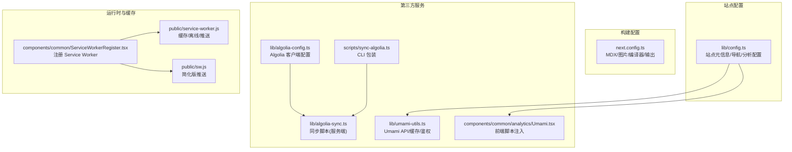
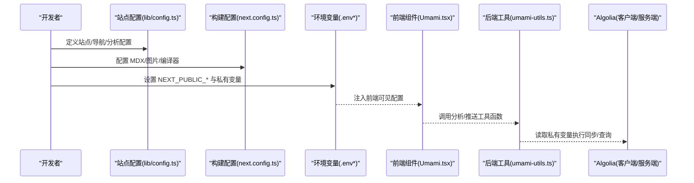
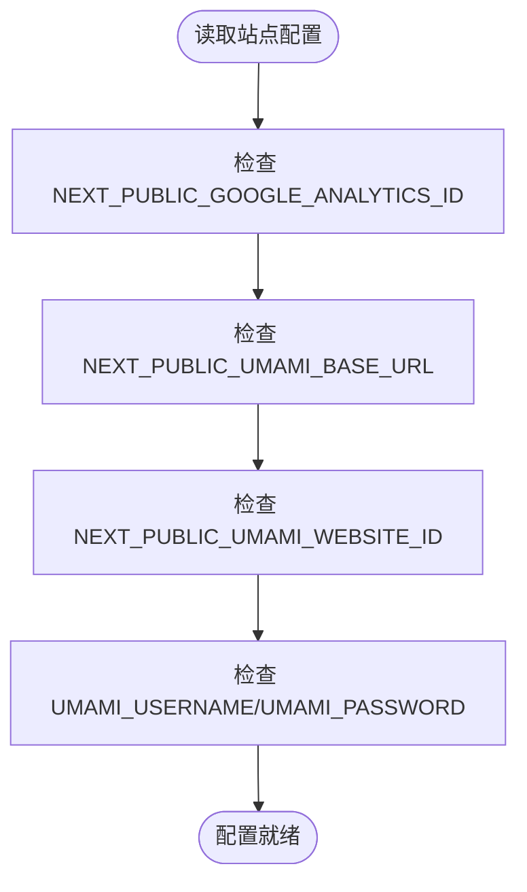
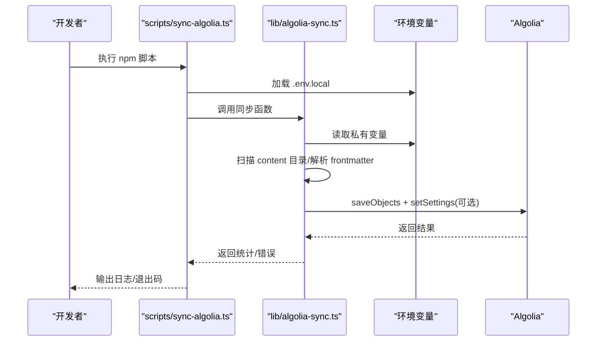
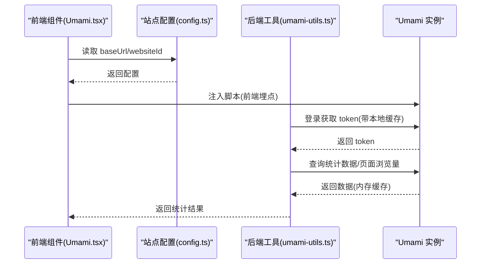
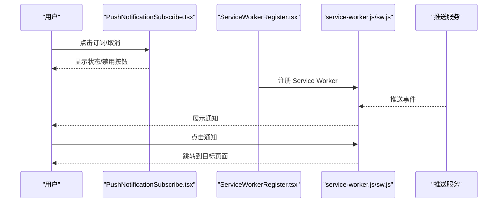
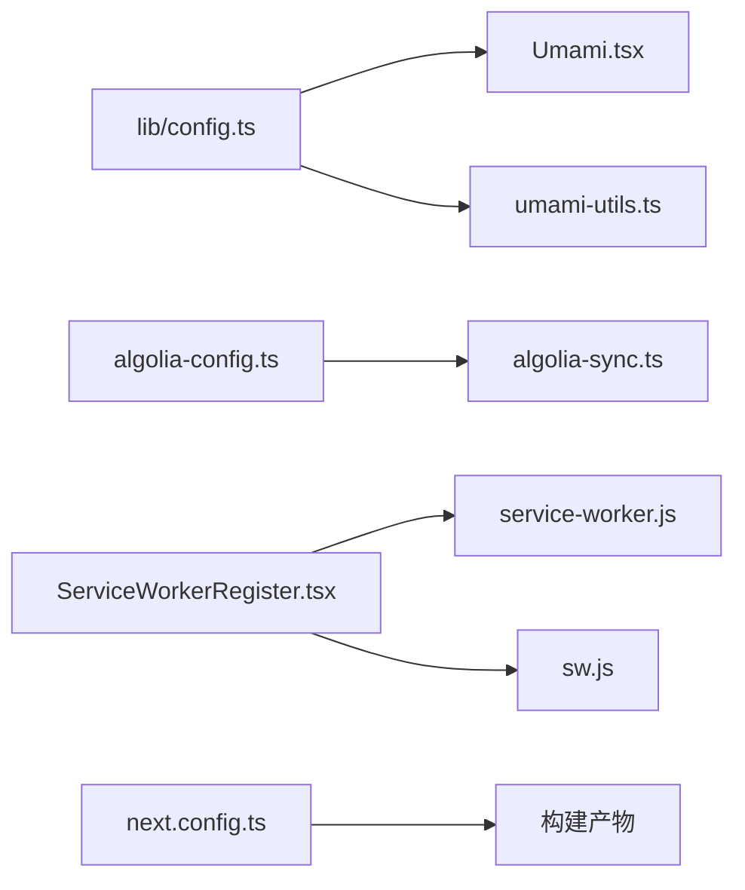

# 配置管理

<cite>
**本文引用的文件**
- [lib/config.ts](file://lib/config.ts)
- [next.config.ts](file://next.config.ts)
- [lib/algolia-config.ts](file://lib/algolia-config.ts)
- [lib/algolia-sync.ts](file://lib/algolia-sync.ts)
- [scripts/sync-algolia.ts](file://scripts/sync-algolia.ts)
- [lib/umami-utils.ts](file://lib/umami-utils.ts)
- [components/common/analytics/Umami.tsx](file://components/common/analytics/Umami.tsx)
- [components/common/PushNotificationSubscribe.tsx](file://components/common/PushNotificationSubscribe.tsx)
- [public/service-worker.js](file://public/service-worker.js)
- [public/sw.js](file://public/sw.js)
- [components/common/ServiceWorkerRegister.tsx](file://components/common/ServiceWorkerRegister.tsx)
- [package.json](file://package.json)
</cite>

## 目录
1. [简介](#简介)
2. [项目结构](#项目结构)
3. [核心组件](#核心组件)
4. [架构总览](#架构总览)
5. [详细组件分析](#详细组件分析)
6. [依赖关系分析](#依赖关系分析)
7. [性能考量](#性能考量)
8. [故障排查指南](#故障排查指南)
9. [结论](#结论)
10. [附录](#附录)

## 简介
本文件系统性梳理博客系统的配置管理体系，覆盖站点配置、构建配置与运行时配置的组织方式；解释配置文件的层次结构与优先级规则；说明环境变量的使用与管理策略；阐述第三方服务（Algolia 搜索、Umami 分析、Push Notification）的集成配置；提供配置验证与默认值处理机制；并给出配置热更新与动态配置的实现方案与最佳实践。

## 项目结构
本项目采用“按职责分层”的配置组织方式：
- 站点配置：集中于 lib/config.ts，统一管理站点元信息、导航、SEO 关键词、分析工具等。
- 构建配置：集中在 next.config.ts，定义 MDX 扩展、图片优化、编译器选项与输出模式等。
- 第三方服务配置：分别在 lib/algolia-config.ts、lib/umami-utils.ts 中进行客户端与服务端配置与校验；Umami 前端脚本通过组件注入。
- 运行时配置：通过环境变量注入，区分公共变量（NEXT_PUBLIC_*）与私有变量（非前缀），并在运行时按需读取。
- 工具与脚本：scripts/sync-algolia.ts 与 lib/algolia-sync.ts 提供 Algolia 内容同步能力，支持 CI/CD 流水线。

图表来源
- [lib/config.ts:13-98](file://lib/config.ts#L13-L98)
- [next.config.ts:11-35](file://next.config.ts#L11-L35)
- [lib/algolia-config.ts:7-11](file://lib/algolia-config.ts#L7-L11)
- [lib/algolia-sync.ts:15-109](file://lib/algolia-sync.ts#L15-L109)
- [scripts/sync-algolia.ts:9-29](file://scripts/sync-algolia.ts#L9-L29)
- [lib/umami-utils.ts:83-133](file://lib/umami-utils.ts#L83-L133)
- [components/common/analytics/Umami.tsx:6-21](file://components/common/analytics/Umami.tsx#L6-L21)
- [components/common/ServiceWorkerRegister.tsx:5-18](file://components/common/ServiceWorkerRegister.tsx#L5-L18)
- [public/service-worker.js:18-43](file://public/service-worker.js#L18-L43)
- [public/sw.js:26-34](file://public/sw.js#L26-L34)

章节来源
- [lib/config.ts:13-98](file://lib/config.ts#L13-L98)
- [next.config.ts:11-35](file://next.config.ts#L11-L35)

## 核心组件
- 站点配置中心：集中管理站点名称、描述、URL、作者、社交链接、导航、关键词、OG 图片、Favicon、主题色、语言与时区、分页等；同时包含分析工具配置（Google Analytics ID 与 Umami 的公共与私有配置项）。
- 构建配置：启用 MDX 支持、扩展页面后缀、配置图片源与格式、生产环境移除 console、输出 standalone。
- Algolia 配置与同步：提供客户端配置与服务端同步脚本，支持 CI/CD 自动化；包含配置完整性检查与调试日志。
- Umami 分析：前端通过组件注入脚本，后端通过工具函数封装鉴权、缓存与 API 请求，支持重试与过期处理。
- 推送通知与 Service Worker：提供订阅组件与两个 Service Worker 实现（缓存/离线/推送），以及注册组件。

章节来源
- [lib/config.ts:13-98](file://lib/config.ts#L13-L98)
- [next.config.ts:4-35](file://next.config.ts#L4-L35)
- [lib/algolia-config.ts:7-32](file://lib/algolia-config.ts#L7-L32)
- [lib/algolia-sync.ts:15-109](file://lib/algolia-sync.ts#L15-L109)
- [lib/umami-utils.ts:83-325](file://lib/umami-utils.ts#L83-L325)
- [components/common/analytics/Umami.tsx:6-21](file://components/common/analytics/Umami.tsx#L6-L21)
- [components/common/PushNotificationSubscribe.tsx:1-79](file://components/common/PushNotificationSubscribe.tsx#L1-L79)
- [public/service-worker.js:18-131](file://public/service-worker.js#L18-L131)
- [public/sw.js:26-34](file://public/sw.js#L26-L34)
- [components/common/ServiceWorkerRegister.tsx:5-18](file://components/common/ServiceWorkerRegister.tsx#L5-L18)

## 架构总览
配置体系由“集中式站点配置 + 构建期配置 + 运行时注入 + 第三方服务适配”构成，形成“声明式配置 + 环境变量注入 + 工具函数封装”的闭环。

图表来源
- [lib/config.ts:13-98](file://lib/config.ts#L13-L98)
- [next.config.ts:4-35](file://next.config.ts#L4-L35)
- [components/common/analytics/Umami.tsx:6-21](file://components/common/analytics/Umami.tsx#L6-L21)
- [lib/umami-utils.ts:83-133](file://lib/umami-utils.ts#L83-L133)
- [lib/algolia-sync.ts:15-109](file://lib/algolia-sync.ts#L15-L109)

## 详细组件分析

### 站点配置（lib/config.ts）
- 职责：集中管理站点元信息、导航、关键词、OG 图片、Favicon、主题色、语言与时区、分页等；同时包含分析工具配置（NEXT_PUBLIC_* 用于前端可见，私有变量用于后端）。
- 环境变量策略：
  - 前端可见：NEXT_PUBLIC_GOOGLE_ANALYTICS_ID、NEXT_PUBLIC_UMAMI_BASE_URL、NEXT_PUBLIC_UMAMI_WEBSITE_ID
  - 私有变量：UMAMI_USERNAME、UMAMI_PASSWORD（仅后端使用）
- 验证与默认值：通过条件判断与空值合并确保前端可用性；建议在部署时补充缺失项，避免运行时降级。

图表来源
- [lib/config.ts:80-97](file://lib/config.ts#L80-L97)

章节来源
- [lib/config.ts:13-98](file://lib/config.ts#L13-L98)

### 构建配置（next.config.ts）
- 职责：启用 MDX、扩展页面后缀、配置图片远程模式与格式、生产移除 console、输出 standalone。
- 影响范围：影响打包体积、图片优化与运行时性能。

章节来源
- [next.config.ts:4-35](file://next.config.ts#L4-L35)

### Algolia 搜索配置与同步
- 客户端配置：lib/algolia-config.ts 提供 appId、apiKey、indexName 的读取与完整性检查。
- 服务端同步：lib/algolia-sync.ts 读取私有变量（ALGOLIA_ADMIN_API_KEY、NEXT_PUBLIC_ALGOLIA_APP_ID、NEXT_PUBLIC_ALGOLIA_INDEX_NAME），扫描 content 目录，解析 frontmatter，过滤草稿，批量写入 Algolia 并可选设置索引规则。
- CLI 包装：scripts/sync-algolia.ts 在运行前加载 .env.local，再调用同步函数，便于 CI/CD 使用。

图表来源
- [scripts/sync-algolia.ts:9-29](file://scripts/sync-algolia.ts#L9-L29)
- [lib/algolia-sync.ts:15-109](file://lib/algolia-sync.ts#L15-L109)
- [lib/algolia-config.ts:7-11](file://lib/algolia-config.ts#L7-L11)

章节来源
- [lib/algolia-config.ts:7-32](file://lib/algolia-config.ts#L7-L32)
- [lib/algolia-sync.ts:15-109](file://lib/algolia-sync.ts#L15-L109)
- [scripts/sync-algolia.ts:9-29](file://scripts/sync-algolia.ts#L9-L29)

### Umami 分析集成
- 前端注入：components/common/analytics/Umami.tsx 读取站点配置中的 baseUrl 与 websiteId，若未配置则不注入脚本。
- 后端工具：lib/umami-utils.ts 封装鉴权流程（本地存储缓存 token，TTL 1 小时）、内存缓存统计数据、自动重试 401 场景、提供统计数据与页面浏览量查询接口。

图表来源
- [components/common/analytics/Umami.tsx:6-21](file://components/common/analytics/Umami.tsx#L6-L21)
- [lib/config.ts:84-96](file://lib/config.ts#L84-L96)
- [lib/umami-utils.ts:83-133](file://lib/umami-utils.ts#L83-L133)
- [lib/umami-utils.ts:198-311](file://lib/umami-utils.ts#L198-L311)

章节来源
- [components/common/analytics/Umami.tsx:6-21](file://components/common/analytics/Umami.tsx#L6-L21)
- [lib/umami-utils.ts:83-325](file://lib/umami-utils.ts#L83-L325)

### 推送通知与 Service Worker
- 订阅组件：components/common/PushNotificationSubscribe.tsx 提供订阅/取消订阅 UI 与交互逻辑（当前为模拟实现，建议接入真实推送服务）。
- Service Worker：public/service-worker.js 提供缓存、离线回退与推送通知展示；public/sw.js 提供简化版推送与激活逻辑；components/common/ServiceWorkerRegister.tsx 在客户端注册 SW。

图表来源
- [components/common/PushNotificationSubscribe.tsx:5-79](file://components/common/PushNotificationSubscribe.tsx#L5-L79)
- [components/common/ServiceWorkerRegister.tsx:5-18](file://components/common/ServiceWorkerRegister.tsx#L5-L18)
- [public/service-worker.js:92-131](file://public/service-worker.js#L92-L131)
- [public/sw.js:26-34](file://public/sw.js#L26-L34)

章节来源
- [components/common/PushNotificationSubscribe.tsx:1-79](file://components/common/PushNotificationSubscribe.tsx#L1-L79)
- [public/service-worker.js:18-131](file://public/service-worker.js#L18-L131)
- [public/sw.js:26-34](file://public/sw.js#L26-L34)
- [components/common/ServiceWorkerRegister.tsx:5-18](file://components/common/ServiceWorkerRegister.tsx#L5-L18)

## 依赖关系分析
- 站点配置被前端组件与后端工具共同依赖，形成“配置驱动”的耦合关系。
- 构建配置影响打包产物与运行时行为，对性能与兼容性有直接影响。
- 第三方服务配置通过环境变量解耦，避免硬编码；同步脚本与分析工具分别在服务端与前端运行，职责清晰。

图表来源
- [lib/config.ts:13-98](file://lib/config.ts#L13-L98)
- [components/common/analytics/Umami.tsx:6-21](file://components/common/analytics/Umami.tsx#L6-L21)
- [lib/umami-utils.ts:83-133](file://lib/umami-utils.ts#L83-L133)
- [lib/algolia-config.ts:7-11](file://lib/algolia-config.ts#L7-L11)
- [lib/algolia-sync.ts:15-109](file://lib/algolia-sync.ts#L15-L109)
- [components/common/ServiceWorkerRegister.tsx:5-18](file://components/common/ServiceWorkerRegister.tsx#L5-L18)
- [public/service-worker.js:18-43](file://public/service-worker.js#L18-L43)
- [public/sw.js:26-34](file://public/sw.js#L26-L34)
- [next.config.ts:4-35](file://next.config.ts#L4-L35)

章节来源
- [package.json:16-44](file://package.json#L16-L44)

## 性能考量
- 生产移除 console：next.config.ts 中根据 NODE_ENV 控制，减少包体与运行时开销。
- 图片优化：配置 remotePatterns 与 formats，结合 CDN 提升加载速度。
- 缓存策略：Umami 工具函数内置内存缓存与本地存储令牌缓存，降低重复请求与鉴权成本。
- Service Worker 缓存：静态资源预缓存与离线回退，提升弱网与离线体验。

章节来源
- [next.config.ts:30-32](file://next.config.ts#L30-L32)
- [lib/umami-utils.ts:8-38](file://lib/umami-utils.ts#L8-L38)
- [public/service-worker.js:18-43](file://public/service-worker.js#L18-L43)

## 故障排查指南
- Algolia 同步失败
  - 确认私有变量 ALGOLIA_ADMIN_API_KEY、NEXT_PUBLIC_ALGOLIA_APP_ID、NEXT_PUBLIC_ALGOLIA_INDEX_NAME 是否齐全。
  - 查看同步脚本输出与返回值，确认索引设置是否成功。
- Umami 无法注入或统计异常
  - 检查 NEXT_PUBLIC_UMAMI_BASE_URL 与 NEXT_PUBLIC_UMAMI_WEBSITE_ID 是否正确。
  - 若出现 401，工具函数会自动清除缓存并重试，观察控制台日志定位问题。
- 推送通知无响应
  - 确认 Service Worker 已成功注册，查看控制台错误。
  - 检查推送事件与通知点击事件处理逻辑。
- 构建异常
  - 检查 next.config.ts 中的 MDX 插件与图片配置是否与实际资源匹配。

章节来源
- [lib/algolia-sync.ts:15-109](file://lib/algolia-sync.ts#L15-L109)
- [lib/umami-utils.ts:170-186](file://lib/umami-utils.ts#L170-L186)
- [components/common/ServiceWorkerRegister.tsx:5-18](file://components/common/ServiceWorkerRegister.tsx#L5-L18)
- [public/service-worker.js:92-131](file://public/service-worker.js#L92-L131)

## 结论
本项目通过“集中式站点配置 + 构建期配置 + 环境变量注入 + 第三方服务工具函数”的组合，实现了清晰、可维护、可扩展的配置体系。建议在团队内明确环境变量命名规范与 CI/CD 流程，持续完善第三方服务的监控与告警，逐步将推送通知等组件接入真实后端，以获得更完整的运行时体验。

## 附录

### 配置层次与优先级
- 站点配置（lib/config.ts）：最高优先级，集中声明式配置。
- 构建配置（next.config.ts）：构建期生效，影响打包与运行时行为。
- 环境变量（NEXT_PUBLIC_* 与私有变量）：运行时注入，前端可见与不可见分离。
- 第三方服务配置：通过工具函数封装，优先读取环境变量，其次使用默认值或降级逻辑。

章节来源
- [lib/config.ts:80-97](file://lib/config.ts#L80-L97)
- [next.config.ts:30-32](file://next.config.ts#L30-L32)

### 环境变量清单与用途
- NEXT_PUBLIC_GOOGLE_ANALYTICS_ID：前端可见，用于 Google Analytics。
- NEXT_PUBLIC_UMAMI_BASE_URL：前端可见，Umami 实例基础 URL。
- NEXT_PUBLIC_UMAMI_WEBSITE_ID：前端可见，Umami 网站 ID。
- UMAMI_USERNAME / UMAMI_PASSWORD：私有变量，后端鉴权使用。
- NEXT_PUBLIC_ALGOLIA_APP_ID：前端可见，Algolia 应用 ID。
- NEXT_PUBLIC_ALGOLIA_SEARCH_API_KEY：前端可见，Algolia 搜索 API Key。
- NEXT_PUBLIC_ALGOLIA_INDEX_NAME：前端可见，Algolia 索引名称。
- ALGOLIA_ADMIN_API_KEY：私有变量，服务端同步使用。

章节来源
- [lib/config.ts:80-97](file://lib/config.ts#L80-L97)
- [lib/algolia-config.ts:7-11](file://lib/algolia-config.ts#L7-L11)
- [lib/algolia-sync.ts:17-24](file://lib/algolia-sync.ts#L17-L24)

### 配置验证与默认值处理
- Algolia 客户端配置：isAlgoliaConfigured 检查 appId、apiKey、indexName 是否齐全，并在浏览器端打印调试信息。
- Umami 前端注入：若 baseUrl 或 websiteId 缺失则不注入脚本，避免无效请求。
- 构建期开关：根据 NODE_ENV 控制生产移除 console，减少冗余日志。

章节来源
- [lib/algolia-config.ts:13-32](file://lib/algolia-config.ts#L13-L32)
- [components/common/analytics/Umami.tsx:9-11](file://components/common/analytics/Umami.tsx#L9-L11)
- [next.config.ts:30-32](file://next.config.ts#L30-L32)

### 配置热更新与动态配置
- 站点配置（lib/config.ts）：属于构建期常量，不支持热更新；可在构建时注入不同环境的变量以达到“环境切换”的效果。
- 运行时配置：通过环境变量注入，可在重启后生效；Umami 工具函数内置缓存与重试，降低频繁变更的影响。
- Service Worker：注册后在激活阶段生效，可通过更新 sw.js 并触发 activate 事件实现灰度或强制更新。

章节来源
- [lib/config.ts:13-98](file://lib/config.ts#L13-L98)
- [lib/umami-utils.ts:27-29](file://lib/umami-utils.ts#L27-L29)
- [public/service-worker.js:29-43](file://public/service-worker.js#L29-L43)

### 最佳实践
- 明确区分 NEXT_PUBLIC_* 与私有变量，敏感信息仅保留在后端。
- 在 CI/CD 中统一注入环境变量，避免本地差异。
- 对第三方服务配置进行最小化暴露，前端仅使用必要字段。
- 为关键配置提供默认值与降级逻辑，保证系统在部分配置缺失时仍可运行。
- 对缓存与重试策略进行监控与告警，确保分析与搜索服务稳定。