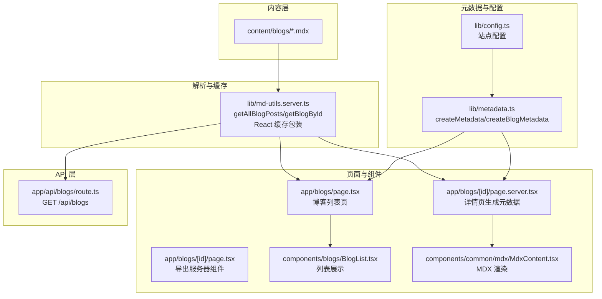
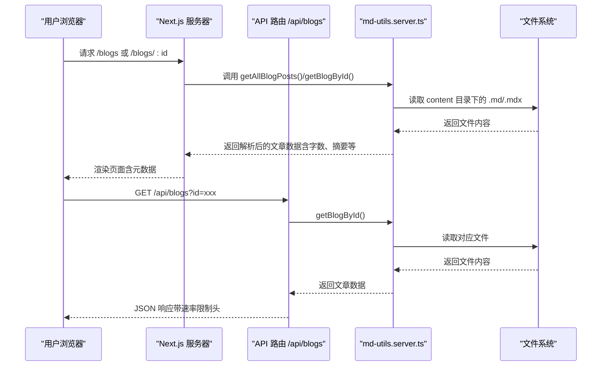
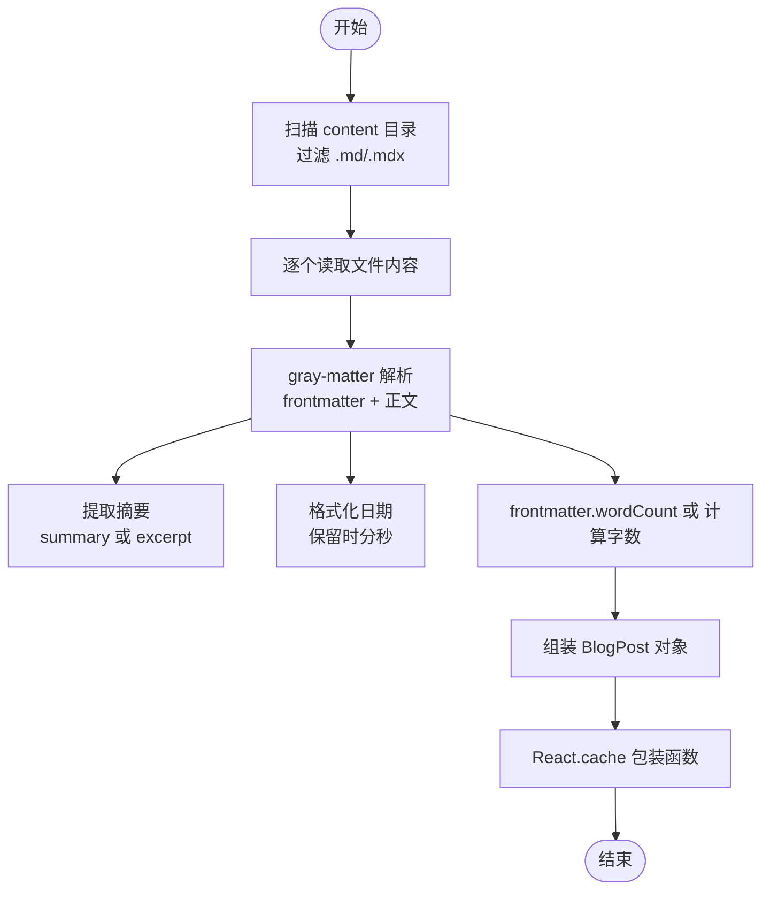
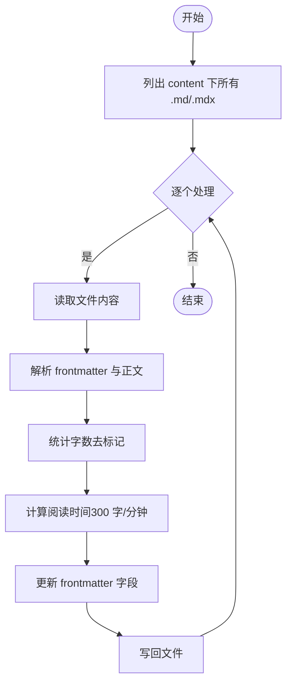
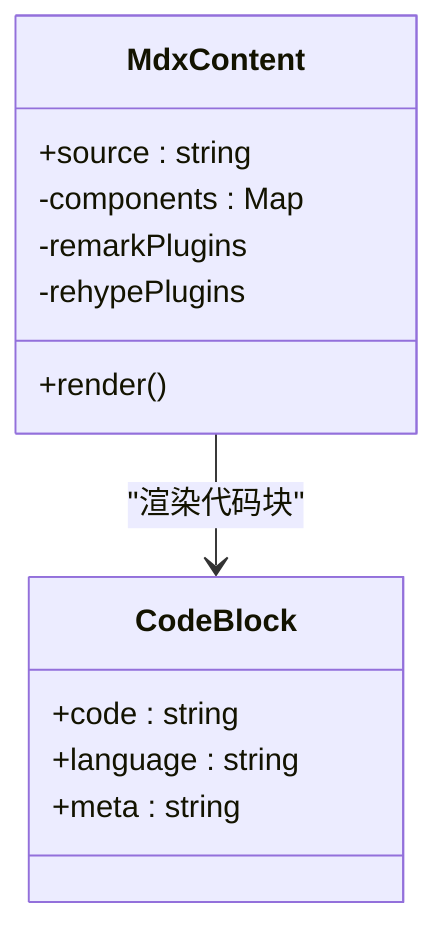
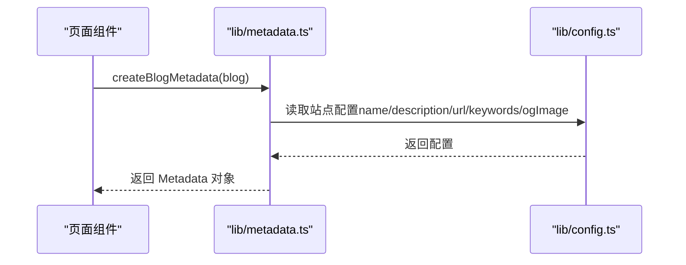
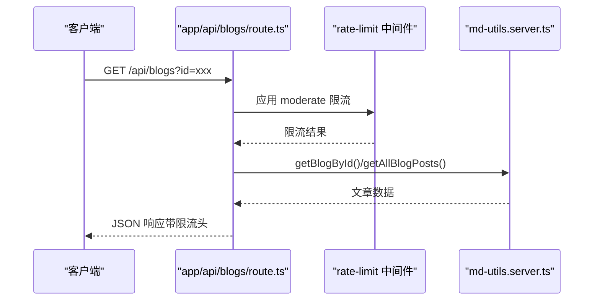
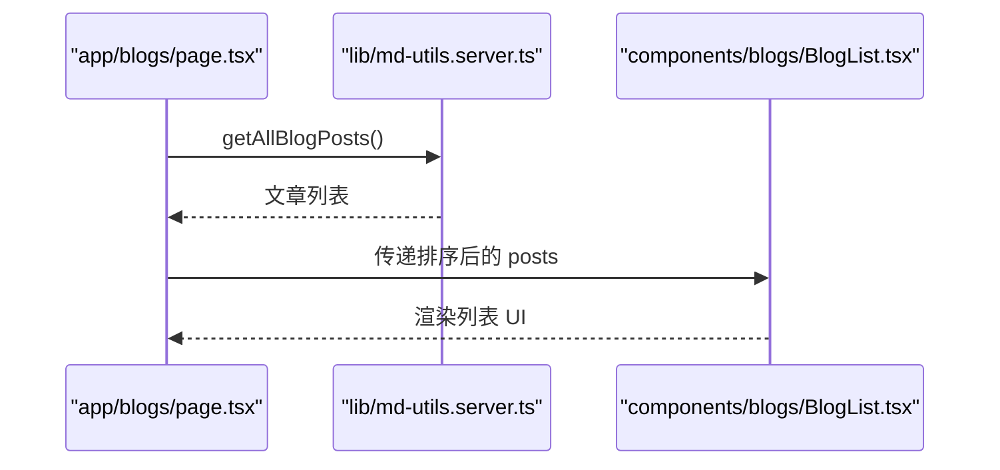
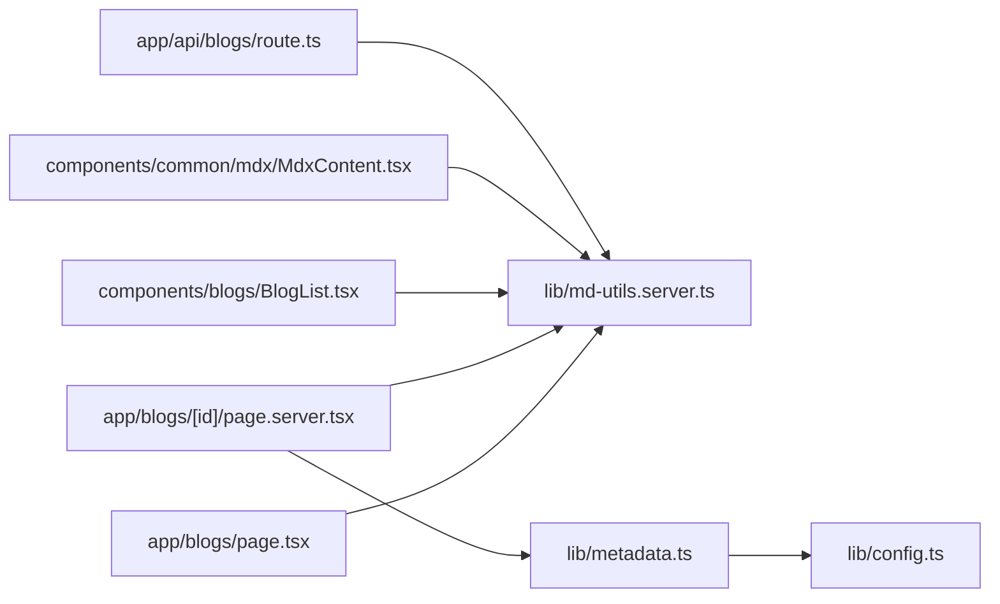

# 内容管理系统

<cite>
**本文引用的文件**
- [lib/md-utils.server.ts](file://lib/md-utils.server.ts)
- [lib/metadata.ts](file://lib/metadata.ts)
- [lib/config.ts](file://lib/config.ts)
- [scripts/precompute-word-count.js](file://scripts/precompute-word-count.js)
- [components/common/mdx/MdxContent.tsx](file://components/common/mdx/MdxContent.tsx)
- [app/blogs/page.tsx](file://app/blogs/page.tsx)
- [app/blogs/[id]/page.tsx](file://app/blogs/[id]/page.tsx)
- [app/blogs/[id]/page.server.tsx](file://app/blogs/[id]/page.server.tsx)
- [components/blogs/BlogList.tsx](file://components/blogs/BlogList.tsx)
- [app/api/blogs/route.ts](file://app/api/blogs/route.ts)
- [data_templates/blog-template.mdx](file://data_templates/blog-template.mdx)
- [data_templates/note-template.mdx](file://data_templates/note-template.mdx)
- [content/blogs/test-features.mdx](file://content/blogs/test-features.mdx)
</cite>

## 目录
1. [引言](#引言)
2. [项目结构](#项目结构)
3. [核心组件](#核心组件)
4. [架构总览](#架构总览)
5. [详细组件分析](#详细组件分析)
6. [依赖分析](#依赖分析)
7. [性能考虑](#性能考虑)
8. [故障排查指南](#故障排查指南)
9. [结论](#结论)
10. [附录](#附录)

## 引言
本文件面向内容管理系统，聚焦于 MDX 文件处理机制、元数据提取、字数统计与缓存策略，系统性阐述内容文件的读取、解析与转换流程，解释 MDX 格式规范、模板系统与内容验证机制，并提供接口规范、调用关系、配置参数与常见问题解决方案。文档严格依据仓库现有代码进行分析与归纳，确保可追溯与可复现。

## 项目结构
该系统围绕“内容源（content）—解析工具（lib/md-utils.server.ts）—渲染组件（components/common/mdx/MdxContent.tsx）—页面路由（app/blogs/*）—API 接口（app/api/blogs/route.ts）—元数据（lib/metadata.ts）”构建，形成从静态内容到页面渲染与对外接口的完整链路。

图表来源
- [lib/md-utils.server.ts:136-154](file://lib/md-utils.server.ts#L136-L154)
- [app/blogs/page.tsx:15-21](file://app/blogs/page.tsx#L15-L21)
- [app/blogs/[id]/page.server.tsx:31-52](file://app/blogs/[id]/page.server.tsx#L31-L52)
- [components/common/mdx/MdxContent.tsx:140-219](file://components/common/mdx/MdxContent.tsx#L140-L219)
- [lib/metadata.ts:25-79](file://lib/metadata.ts#L25-L79)
- [lib/config.ts:13-98](file://lib/config.ts#L13-L98)
- [app/api/blogs/route.ts:10-61](file://app/api/blogs/route.ts#L10-L61)

章节来源
- [lib/md-utils.server.ts:136-154](file://lib/md-utils.server.ts#L136-L154)
- [app/blogs/page.tsx:15-21](file://app/blogs/page.tsx#L15-L21)
- [app/blogs/[id]/page.server.tsx:31-52](file://app/blogs/[id]/page.server.tsx#L31-L52)
- [components/common/mdx/MdxContent.tsx:140-219](file://components/common/mdx/MdxContent.tsx#L140-L219)
- [lib/metadata.ts:25-79](file://lib/metadata.ts#L25-L79)
- [lib/config.ts:13-98](file://lib/config.ts#L13-L98)
- [app/api/blogs/route.ts:10-61](file://app/api/blogs/route.ts#L10-L61)

## 核心组件
- 内容解析与缓存：提供统一的 MDX/MD 文件读取、frontmatter 解析、摘要提取、字数统计与缓存封装，支持按 ID 查询与全量聚合。
- MDX 渲染组件：基于 React-Markdown/Remark/GFM 与 Rehype Sanitize，提供安全、可定制的渲染能力，内置链接识别与特殊媒体嵌入。
- 元数据生成：统一生成 OpenGraph/Twitter 等 SEO 元数据，支持文章级元数据与页面级元数据。
- API 接口：提供博客列表与详情的受速率限制的 REST 接口。
- 模板系统：提供博客与手记的 Front Matter 与内容模板，规范字段与示例。

章节来源
- [lib/md-utils.server.ts:11-28](file://lib/md-utils.server.ts#L11-L28)
- [lib/md-utils.server.ts:136-218](file://lib/md-utils.server.ts#L136-L218)
- [components/common/mdx/MdxContent.tsx:140-219](file://components/common/mdx/MdxContent.tsx#L140-L219)
- [lib/metadata.ts:25-160](file://lib/metadata.ts#L25-L160)
- [app/api/blogs/route.ts:10-61](file://app/api/blogs/route.ts#L10-L61)
- [data_templates/blog-template.mdx:6-28](file://data_templates/blog-template.mdx#L6-L28)
- [data_templates/note-template.mdx:6-13](file://data_templates/note-template.mdx#L6-L13)

## 架构总览
系统采用“服务端渲染 + 客户端渲染”的混合模式：
- 列表页与详情页的元数据在服务器端生成，提升 SEO 与首屏体验。
- 内容渲染在客户端组件中完成，利用 React-Markdown 生态实现丰富的 Markdown/MDX 渲染。
- 数据访问通过 API 路由统一入口，配合速率限制中间件保障稳定性。

图表来源
- [app/blogs/page.tsx:15-21](file://app/blogs/page.tsx#L15-L21)
- [app/blogs/[id]/page.server.tsx:31-52](file://app/blogs/[id]/page.server.tsx#L31-L52)
- [lib/md-utils.server.ts:136-218](file://lib/md-utils.server.ts#L136-L218)
- [app/api/blogs/route.ts:10-61](file://app/api/blogs/route.ts#L10-L61)

## 详细组件分析

### MDX 文件处理与缓存
- 文件读取与解析
  - 读取 content/blogs 与 content/notes 目录，过滤 .md/.mdx 文件。
  - 使用 gray-matter 解析 frontmatter 与正文，提取摘要（summary/excerpt）。
  - 日期格式化保留时分秒；若 frontmatter 存在 wordCount，则直接使用，否则按正文统计字数。
- 缓存策略
  - 使用 React.cache 包装 getAllBlogPosts/getAllNotes/getAllBlogs/getBlogById，实现按请求上下文的 React 缓存，避免重复 IO。
- 输出模型
  - 统一返回 BlogPost 接口，包含 id、title、excerpt、content、mdxContent、date、readTime、views、comments、imageUrl、slug、tags、status、wordCount、aiInvolvement、noteType 等字段。

图表来源
- [lib/md-utils.server.ts:86-131](file://lib/md-utils.server.ts#L86-L131)
- [lib/md-utils.server.ts:136-218](file://lib/md-utils.server.ts#L136-L218)

章节来源
- [lib/md-utils.server.ts:36-70](file://lib/md-utils.server.ts#L36-L70)
- [lib/md-utils.server.ts:81-83](file://lib/md-utils.server.ts#L81-L83)
- [lib/md-utils.server.ts:136-218](file://lib/md-utils.server.ts#L136-L218)

### 字数统计与预计算
- 在线统计逻辑
  - 移除 Markdown 标记，按英文单词、中文字符与数字分别统计，累加得到总字数。
- 预计算脚本
  - 扫描 content 目录下所有 .md/.mdx 文件，解析 frontmatter，计算字数与阅读时间，更新 frontmatter 中的 wordCount 与 readTime 字段。
- 使用建议
  - 在 CI 或本地执行预计算脚本，减少运行时开销；若未预计算，系统会在读取时实时统计。

图表来源
- [scripts/precompute-word-count.js:102-119](file://scripts/precompute-word-count.js#L102-L119)
- [scripts/precompute-word-count.js:15-48](file://scripts/precompute-word-count.js#L15-L48)

章节来源
- [scripts/precompute-word-count.js:15-48](file://scripts/precompute-word-count.js#L15-L48)
- [scripts/precompute-word-count.js:102-119](file://scripts/precompute-word-count.js#L102-L119)

### MDX 渲染与模板系统
- 渲染管线
  - 使用 remark-gfm 与 rehype-sanitize，结合自定义 schema，保证安全与可控。
  - 自定义组件映射：标题、段落、列表、引用、表格、图片、代码块等。
  - 链接识别与增强：内部链接、外部链接、Bilibili 视频嵌入、图片直链、URL 书签卡片。
- 模板系统
  - 博客模板：提供 Front Matter 字段与示例内容，涵盖标题、日期、描述、标签、封面图、字数与阅读时间等。
  - 手记模板：提供 noteType、tags、date、readTime、status 等字段示例。

图表来源
- [components/common/mdx/MdxContent.tsx:140-219](file://components/common/mdx/MdxContent.tsx#L140-L219)
- [components/common/mdx/MdxContent.tsx:177-190](file://components/common/mdx/MdxContent.tsx#L177-L190)

章节来源
- [components/common/mdx/MdxContent.tsx:17-30](file://components/common/mdx/MdxContent.tsx#L17-L30)
- [components/common/mdx/MdxContent.tsx:140-219](file://components/common/mdx/MdxContent.tsx#L140-L219)
- [data_templates/blog-template.mdx:6-28](file://data_templates/blog-template.mdx#L6-L28)
- [data_templates/note-template.mdx:6-13](file://data_templates/note-template.mdx#L6-L13)

### 元数据生成与页面配置
- 通用元数据生成
  - createMetadata 接收标题、描述、关键词、URL、图像、类型、发布时间、标签等，统一输出 Next.js Metadata。
  - 支持 article 类型时补充 openGraph 的 publishedTime 与 tags。
- 页面级元数据
  - pageMetadata 提供首页、博客、归档、碎碎念、链接、手记等页面的默认配置，可与 createMetadata 组合使用。
- 博客文章元数据
  - createBlogMetadata 从 BlogPost 结构派生，自动拼接 URL、OG 图像、发布时间与标签。

图表来源
- [lib/metadata.ts:25-79](file://lib/metadata.ts#L25-L79)
- [lib/metadata.ts:86-104](file://lib/metadata.ts#L86-L104)
- [lib/config.ts:13-98](file://lib/config.ts#L13-L98)

章节来源
- [lib/metadata.ts:25-79](file://lib/metadata.ts#L25-L79)
- [lib/metadata.ts:86-104](file://lib/metadata.ts#L86-L104)
- [lib/config.ts:13-98](file://lib/config.ts#L13-L98)

### API 接口与速率限制
- 接口定义
  - GET /api/blogs?id=xxx：返回单篇文章；id 缺失时返回全量文章列表。
- 速率限制
  - 使用 rateLimitMiddleware 应用 moderate 预设（每分钟 30 次），并在响应头中返回限流状态。
- 错误处理
  - 未找到文章时返回 404 与错误信息；中间件异常时记录日志并继续处理。

图表来源
- [app/api/blogs/route.ts:10-61](file://app/api/blogs/route.ts#L10-L61)
- [lib/md-utils.server.ts:136-218](file://lib/md-utils.server.ts#L136-L218)

章节来源
- [app/api/blogs/route.ts:10-61](file://app/api/blogs/route.ts#L10-L61)

### 页面与组件交互
- 列表页
  - 服务器端读取文章，按发布日期倒序，筛选已发布状态，生成标签云，传递给客户端组件渲染。
- 详情页
  - 服务器端根据 id 获取文章并生成元数据；客户端组件负责渲染 MDX 内容与交互。
- 列表组件
  - 展示文章标题、标签、日期等，支持链接跳转。

图表来源
- [app/blogs/page.tsx:15-21](file://app/blogs/page.tsx#L15-L21)
- [lib/md-utils.server.ts:136-154](file://lib/md-utils.server.ts#L136-L154)
- [components/blogs/BlogList.tsx:24-67](file://components/blogs/BlogList.tsx#L24-L67)

章节来源
- [app/blogs/page.tsx:15-21](file://app/blogs/page.tsx#L15-L21)
- [components/blogs/BlogList.tsx:24-67](file://components/blogs/BlogList.tsx#L24-L67)

## 依赖分析
- 组件耦合
  - 页面层仅依赖解析工具与元数据模块，职责清晰；渲染组件独立于页面层，便于复用。
- 外部依赖
  - gray-matter：frontmatter 解析。
  - react-markdown/remark-gfm/rehype-sanitize：MDX/Markdown 渲染与安全。
  - github-slugger：标题锚点生成。
- 潜在循环依赖
  - 未发现直接循环导入；解析工具与页面/组件通过函数调用解耦。

图表来源
- [app/blogs/page.tsx:6-9](file://app/blogs/page.tsx#L6-L9)
- [app/blogs/[id]/page.server.tsx:1-4](file://app/blogs/[id]/page.server.tsx#L1-L4)
- [lib/md-utils.server.ts:136-218](file://lib/md-utils.server.ts#L136-L218)
- [lib/metadata.ts:25-79](file://lib/metadata.ts#L25-L79)
- [lib/config.ts:13-98](file://lib/config.ts#L13-L98)
- [components/blogs/BlogList.tsx:6](file://components/blogs/BlogList.tsx#L6)
- [components/common/mdx/MdxContent.tsx:140-219](file://components/common/mdx/MdxContent.tsx#L140-L219)
- [app/api/blogs/route.ts:7](file://app/api/blogs/route.ts#L7)

章节来源
- [lib/md-utils.server.ts:136-218](file://lib/md-utils.server.ts#L136-L218)
- [lib/metadata.ts:25-79](file://lib/metadata.ts#L25-L79)
- [lib/config.ts:13-98](file://lib/config.ts#L13-L98)
- [components/common/mdx/MdxContent.tsx:140-219](file://components/common/mdx/MdxContent.tsx#L140-L219)
- [app/api/blogs/route.ts:7](file://app/api/blogs/route.ts#L7)

## 性能考虑
- 缓存策略
  - 使用 React.cache 对 IO 密集的文件读取进行缓存，降低重复解析成本。
- 渲染优化
  - 使用 useMemo 缓存组件映射与插件数组，避免不必要的重渲染。
- 字数统计
  - 建议在 CI 或本地执行预计算脚本，减少运行时计算；若未预计算，建议在构建阶段生成静态数据。
- API 限流
  - moderate 预设控制请求频率，防止突发流量导致资源紧张。

章节来源
- [lib/md-utils.server.ts:136-218](file://lib/md-utils.server.ts#L136-L218)
- [components/common/mdx/MdxContent.tsx:205-206](file://components/common/mdx/MdxContent.tsx#L205-L206)
- [scripts/precompute-word-count.js:124-143](file://scripts/precompute-word-count.js#L124-L143)
- [app/api/blogs/route.ts:11-22](file://app/api/blogs/route.ts#L11-L22)

## 故障排查指南
- 文章未显示或为空
  - 检查 content 目录下是否为 .md/.mdx 文件，且 frontmatter 是否包含必要字段（如 title、date）。
  - 确认 status 为 published，列表页会过滤非已发布文章。
- 字数统计异常
  - 若 frontmatter 未包含 wordCount，系统会在线统计；若需一致结果，建议执行预计算脚本。
- 链接渲染不符合预期
  - 内部链接与外部链接、Bilibili 视频、图片直链、URL 书签卡片均有特定识别规则；请核对链接格式。
- API 返回 404
  - 确认 id 是否正确；检查文件是否存在且命名规范。
- 速率限制错误
  - 若频繁请求，注意 moderate 限流阈值；可在中间件配置中调整。

章节来源
- [lib/md-utils.server.ts:136-154](file://lib/md-utils.server.ts#L136-L154)
- [scripts/precompute-word-count.js:124-143](file://scripts/precompute-word-count.js#L124-L143)
- [components/common/mdx/MdxContent.tsx:37-138](file://components/common/mdx/MdxContent.tsx#L37-L138)
- [app/api/blogs/route.ts:42-46](file://app/api/blogs/route.ts#L42-L46)
- [app/api/blogs/route.ts:11-22](file://app/api/blogs/route.ts#L11-L22)

## 结论
本系统通过“文件读取 + frontmatter 解析 + 字数统计 + React 缓存 + MDX 渲染 + 元数据生成 + API 限流”的完整链路，实现了稳定、可扩展的内容管理与展示。模板系统与预计算脚本进一步提升了开发效率与运行性能。建议在生产环境中启用预计算与适度的限流策略，并保持 frontmatter 字段规范以获得最佳体验。

## 附录

### 接口规范与参数
- getBlogById(id: string): BlogPost | null
  - 输入：文章 ID
  - 输出：文章对象或 null
  - 作用：按 ID 查找文章，支持 blogs/notes 目录
- getAllBlogPosts(): BlogPost[]
  - 输入：无
  - 输出：已发布文章列表（按日期倒序）
- getAllNotes(): BlogPost[]
  - 输入：无
  - 输出：手记文章列表
- getAllBlogs(): BlogPost[]
  - 输入：无
  - 输出：博客与手记合并列表
- createBlogMetadata(blog: BlogPost): Metadata
  - 输入：文章对象
  - 输出：SEO 元数据
- createMetadata(options): Metadata
  - 输入：标题、描述、关键词、URL、图像、类型、发布时间、标签等
  - 输出：统一 Metadata 对象

章节来源
- [lib/md-utils.server.ts:136-218](file://lib/md-utils.server.ts#L136-L218)
- [lib/metadata.ts:25-104](file://lib/metadata.ts#L25-L104)

### 配置选项
- 站点配置（lib/config.ts）
  - name、description、url、author、social、navigation、keywords、ogImage、favicon、themeColor、language、timezone、pagination、analytics 等
- 页面元数据（lib/metadata.ts）
  - pageMetadata 提供各页面默认标题、描述与关键词
- API 限流（app/api/blogs/route.ts）
  - moderate 预设：每分钟 30 次

章节来源
- [lib/config.ts:13-98](file://lib/config.ts#L13-L98)
- [lib/metadata.ts:109-160](file://lib/metadata.ts#L109-L160)
- [app/api/blogs/route.ts:11-22](file://app/api/blogs/route.ts#L11-L22)

### 示例参考
- 内容示例：content/blogs/test-features.mdx
- 博客模板：data_templates/blog-template.mdx
- 手记模板：data_templates/note-template.mdx

章节来源
- [content/blogs/test-features.mdx:1-9](file://content/blogs/test-features.mdx#L1-L9)
- [data_templates/blog-template.mdx:6-28](file://data_templates/blog-template.mdx#L6-L28)
- [data_templates/note-template.mdx:6-13](file://data_templates/note-template.mdx#L6-L13)