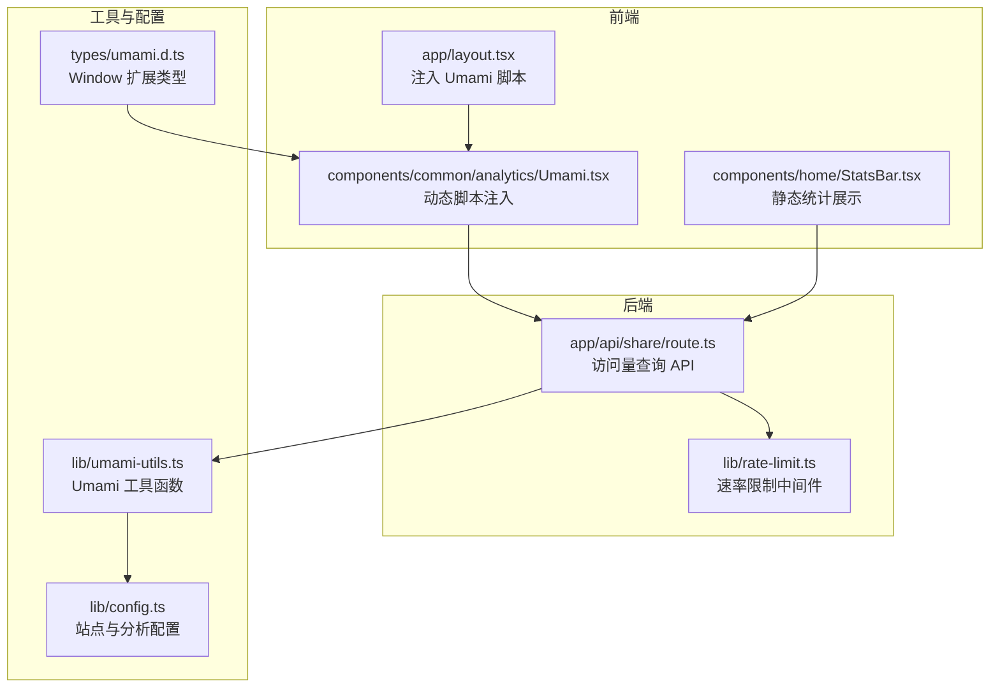
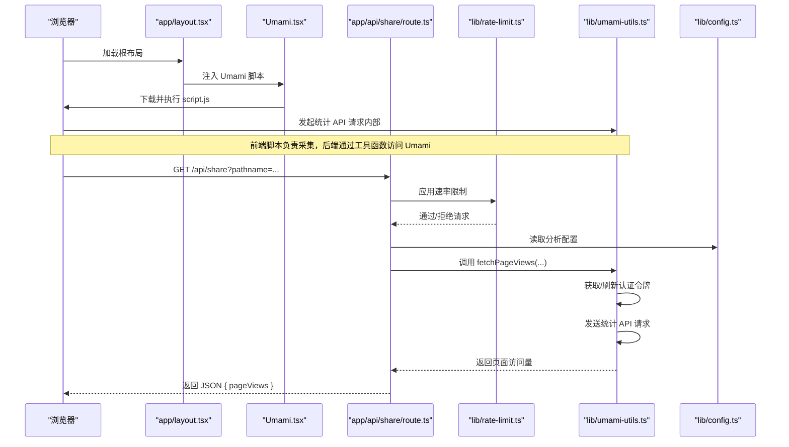
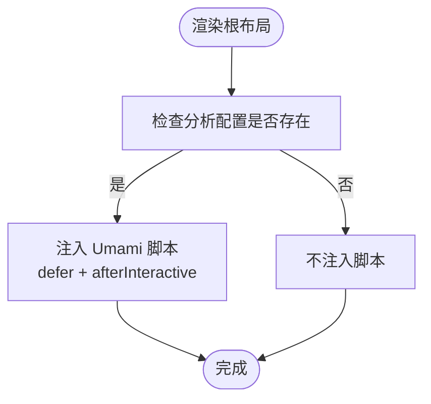
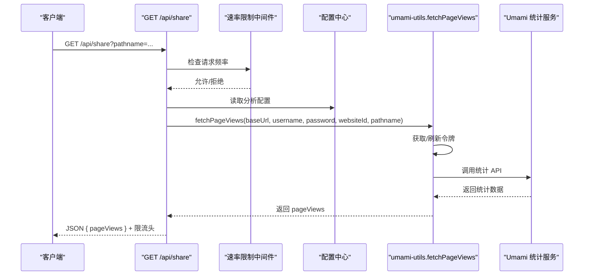
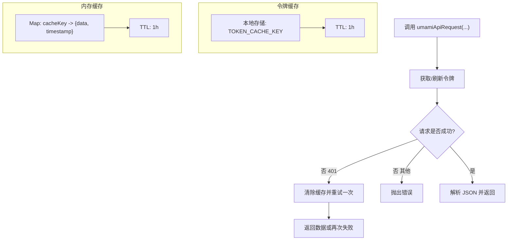
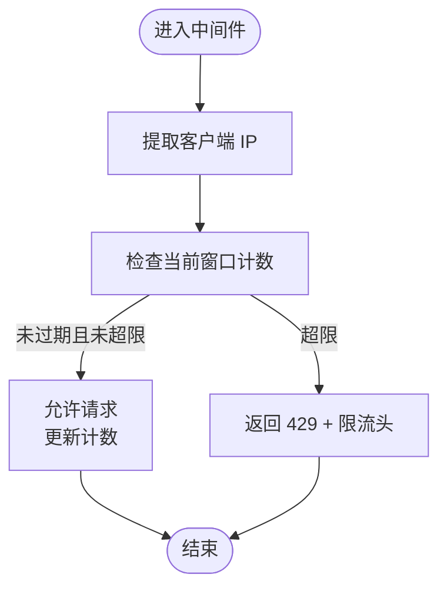
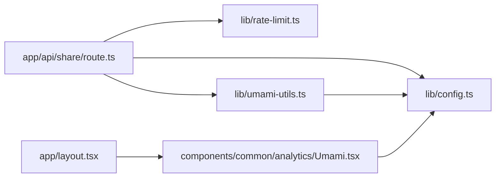

# 分析统计系统

<cite>
**本文引用的文件**
- [lib/umami-utils.ts](file://lib/umami-utils.ts)
- [components/common/analytics/Umami.tsx](file://components/common/analytics/Umami.tsx)
- [lib/config.ts](file://lib/config.ts)
- [app/api/share/route.ts](file://app/api/share/route.ts)
- [types/umami.d.ts](file://types/umami.d.ts)
- [app/layout.tsx](file://app/layout.tsx)
- [lib/rate-limit.ts](file://lib/rate-limit.ts)
- [components/home/StatsBar.tsx](file://components/home/StatsBar.tsx)
</cite>

## 目录
1. [引言](#引言)
2. [项目结构](#项目结构)
3. [核心组件](#核心组件)
4. [架构总览](#架构总览)
5. [详细组件分析](#详细组件分析)
6. [依赖分析](#依赖分析)
7. [性能考虑](#性能考虑)
8. [故障排查指南](#故障排查指南)
9. [结论](#结论)
10. [附录](#附录)

## 引言
本文件面向“分析统计系统”的设计与实现，聚焦于 Umami 分析工具的集成方式、访问量统计 API 的实现、数据采集与传输协议、缓存策略与隐私保护措施，并解释分析组件的架构设计、数据流处理与错误处理机制。文档同时提供来自实际代码库的具体示例与调用关系，帮助读者快速理解并正确使用该系统。

## 项目结构
分析统计系统由以下部分组成：
- 前端埋点与脚本注入：通过 Next.js 的动态脚本注入 Umami 前端脚本，自动采集访问行为。
- 后端 API：提供访问量查询接口，基于 Umami 自托管实例的认证与统计 API。
- 工具层：封装 Umami 认证、令牌缓存、请求重试与内存缓存。
- 配置层：集中管理站点与分析工具配置。
- 速率限制：对访问量查询接口进行限流控制。
- 类型定义：扩展浏览器 Window 接口以支持分析事件上报。

**图表来源**
- [app/layout.tsx:90-105](file://app/layout.tsx#L90-L105)
- [components/common/analytics/Umami.tsx:1-24](file://components/common/analytics/Umami.tsx#L1-L24)
- [app/api/share/route.ts:15-72](file://app/api/share/route.ts#L15-L72)
- [lib/rate-limit.ts:150-197](file://lib/rate-limit.ts#L150-L197)
- [lib/umami-utils.ts:198-311](file://lib/umami-utils.ts#L198-L311)
- [lib/config.ts:83-96](file://lib/config.ts#L83-L96)
- [types/umami.d.ts:6-8](file://types/umami.d.ts#L6-L8)
- [components/home/StatsBar.tsx:20-55](file://components/home/StatsBar.tsx#L20-L55)

**章节来源**
- [app/layout.tsx:90-105](file://app/layout.tsx#L90-L105)
- [lib/config.ts:83-96](file://lib/config.ts#L83-L96)

## 核心组件
- Umami 前端脚本注入：在根布局中按需注入 Umami 前端脚本，自动采集页面访问数据。
- 访问量查询 API：提供 GET /api/share 接口，根据 pathname 查询页面访问量。
- Umami 工具函数：封装认证、令牌缓存、请求重试、内存缓存与错误处理。
- 速率限制中间件：统一控制 API 请求频率，避免滥用。
- 配置中心：集中管理分析工具的 baseUrl、username、password、websiteId 等参数。
- 类型定义：扩展 Window 接口，支持在浏览器侧调用分析事件上报。

**章节来源**
- [components/common/analytics/Umami.tsx:6-21](file://components/common/analytics/Umami.tsx#L6-L21)
- [app/api/share/route.ts:15-72](file://app/api/share/route.ts#L15-L72)
- [lib/umami-utils.ts:198-311](file://lib/umami-utils.ts#L198-L311)
- [lib/rate-limit.ts:150-197](file://lib/rate-limit.ts#L150-L197)
- [lib/config.ts:83-96](file://lib/config.ts#L83-L96)
- [types/umami.d.ts:6-8](file://types/umami.d.ts#L6-L8)

## 架构总览
下图展示了从前端埋点到后端统计查询的完整流程，以及各模块之间的交互关系。

**图表来源**
- [app/layout.tsx:90-105](file://app/layout.tsx#L90-L105)
- [components/common/analytics/Umami.tsx:6-21](file://components/common/analytics/Umami.tsx#L6-L21)
- [app/api/share/route.ts:15-72](file://app/api/share/route.ts#L15-L72)
- [lib/rate-limit.ts:150-197](file://lib/rate-limit.ts#L150-L197)
- [lib/umami-utils.ts:198-311](file://lib/umami-utils.ts#L198-L311)
- [lib/config.ts:83-96](file://lib/config.ts#L83-L96)

## 详细组件分析

### Umami 前端集成
- 组件职责：在根布局中按条件注入 Umami 前端脚本，传入网站 ID，启用自动采集。
- 关键点：
  - 仅当配置存在 baseUrl 与 websiteId 时才注入。
  - 使用 Next.js 的动态脚本组件，延迟加载，提升首屏性能。
  - 通过 data-website-id 属性传递站点标识。

**图表来源**
- [app/layout.tsx:90-105](file://app/layout.tsx#L90-L105)
- [components/common/analytics/Umami.tsx:6-21](file://components/common/analytics/Umami.tsx#L6-L21)

**章节来源**
- [components/common/analytics/Umami.tsx:6-21](file://components/common/analytics/Umami.tsx#L6-L21)
- [app/layout.tsx:90-105](file://app/layout.tsx#L90-L105)

### 访问量统计 API（/api/share）
- 接口目标：对外提供页面访问量查询能力，供分享卡片等场景使用。
- 参数与校验：
  - 查询参数：pathname（必填），其他参数由工具函数默认填充。
- 速率限制：采用内存存储的限流器，默认每分钟 30 次。
- 数据来源：调用工具函数 fetchPageViews(...) 获取真实访问量。
- 返回值：JSON 对象包含 pageViews 字段；同时附带 X-RateLimit-* 响应头。

**图表来源**
- [app/api/share/route.ts:15-72](file://app/api/share/route.ts#L15-L72)
- [lib/rate-limit.ts:150-197](file://lib/rate-limit.ts#L150-L197)
- [lib/umami-utils.ts:260-311](file://lib/umami-utils.ts#L260-L311)
- [lib/config.ts:83-96](file://lib/config.ts#L83-L96)

**章节来源**
- [app/api/share/route.ts:15-72](file://app/api/share/route.ts#L15-L72)
- [lib/rate-limit.ts:150-197](file://lib/rate-limit.ts#L150-L197)

### Umami 工具函数（认证、缓存与请求）
- 认证与令牌缓存：
  - 通过登录接口获取 Bearer Token，并缓存至本地存储与内存。
  - 令牌缓存 TTL 为 1 小时；并发请求去重（避免重复登录）。
- 请求重试：
  - 当收到 401 且未超过重试次数时，清除缓存并重试一次。
- 内存缓存：
  - 针对统计查询与页面访问量查询分别建立缓存键，TTL 同样为 1 小时。
- 错误处理：
  - 统一抛出错误；失败时清理进行中的 Promise，避免悬挂状态。

**图表来源**
- [lib/umami-utils.ts:83-133](file://lib/umami-utils.ts#L83-L133)
- [lib/umami-utils.ts:145-187](file://lib/umami-utils.ts#L145-L187)
- [lib/umami-utils.ts:198-249](file://lib/umami-utils.ts#L198-L249)
- [lib/umami-utils.ts:260-311](file://lib/umami-utils.ts#L260-L311)

**章节来源**
- [lib/umami-utils.ts:83-133](file://lib/umami-utils.ts#L83-L133)
- [lib/umami-utils.ts:145-187](file://lib/umami-utils.ts#L145-L187)
- [lib/umami-utils.ts:198-249](file://lib/umami-utils.ts#L198-L249)
- [lib/umami-utils.ts:260-311](file://lib/umami-utils.ts#L260-L311)

### 速率限制中间件
- 设计要点：
  - 基于内存 Map 记录每个客户端 IP 在时间窗口内的请求次数。
  - 定时清理过期记录，避免内存泄漏。
  - 支持多种预设：严格、中等、宽松、小时级、日级。
- 行为：
  - 未超限时直接放行并返回剩余配额信息。
  - 超限时返回 429，并附带 Retry-After 与限流头。

**图表来源**
- [lib/rate-limit.ts:150-197](file://lib/rate-limit.ts#L150-L197)
- [lib/rate-limit.ts:202-213](file://lib/rate-limit.ts#L202-L213)

**章节来源**
- [lib/rate-limit.ts:150-197](file://lib/rate-limit.ts#L150-L197)
- [lib/rate-limit.ts:202-213](file://lib/rate-limit.ts#L202-L213)

### 配置中心与类型定义
- 配置中心：
  - 提供 analytics.umami 的完整配置项：baseUrl、username、password、websiteId。
  - 通过环境变量注入，便于部署与切换实例。
- 类型定义：
  - 扩展 Window 接口，声明 umami 方法签名，便于在浏览器侧进行事件上报。

**章节来源**
- [lib/config.ts:83-96](file://lib/config.ts#L83-L96)
- [types/umami.d.ts:6-8](file://types/umami.d.ts#L6-L8)

### 静态统计展示（非分析系统核心）
- 组件职责：展示博客运行天数、文章数量、累计字数等静态统计信息。
- 与分析系统关系：不依赖外部分析服务，仅作页面展示。

**章节来源**
- [components/home/StatsBar.tsx:20-55](file://components/home/StatsBar.tsx#L20-L55)

## 依赖分析
- 组件耦合：
  - 访问量 API 依赖速率限制中间件与配置中心。
  - 工具函数依赖配置中心提供的认证凭据。
  - 前端脚本依赖配置中心提供的 baseUrl 与 websiteId。
- 外部依赖：
  - Umami 自托管实例（通过 baseUrl 与认证凭据访问）。
  - 浏览器端 Next.js 动态脚本组件。
- 循环依赖：
  - 未发现循环导入；模块间通过函数调用解耦。

**图表来源**
- [app/api/share/route.ts:15-72](file://app/api/share/route.ts#L15-L72)
- [lib/rate-limit.ts:150-197](file://lib/rate-limit.ts#L150-L197)
- [lib/umami-utils.ts:198-311](file://lib/umami-utils.ts#L198-L311)
- [lib/config.ts:83-96](file://lib/config.ts#L83-L96)
- [app/layout.tsx:90-105](file://app/layout.tsx#L90-L105)
- [components/common/analytics/Umami.tsx:6-21](file://components/common/analytics/Umami.tsx#L6-L21)

**章节来源**
- [app/api/share/route.ts:15-72](file://app/api/share/route.ts#L15-L72)
- [lib/rate-limit.ts:150-197](file://lib/rate-limit.ts#L150-L197)
- [lib/umami-utils.ts:198-311](file://lib/umami-utils.ts#L198-L311)
- [lib/config.ts:83-96](file://lib/config.ts#L83-L96)
- [app/layout.tsx:90-105](file://app/layout.tsx#L90-L105)
- [components/common/analytics/Umami.tsx:6-21](file://components/common/analytics/Umami.tsx#L6-L21)

## 性能考虑
- 前端脚本注入：
  - 使用 defer 与 afterInteractive 策略，减少对首屏渲染的影响。
- 令牌与数据缓存：
  - 本地存储与内存缓存结合，降低重复认证与请求开销。
  - TTL 控制确保数据新鲜度与资源占用平衡。
- 限流策略：
  - 默认每分钟 30 次，可根据业务压力调整预设或自定义配置。
- 并发控制：
  - 令牌获取过程使用 Promise 去重，避免重复登录风暴。

[本节为通用性能讨论，无需具体文件引用]

## 故障排查指南
- 访问量 API 返回 400：
  - 缺少 pathname 参数。请在查询字符串中提供 pathname。
- 访问量 API 返回 500：
  - 分析配置缺失（baseUrl/username/password/websiteId）。请检查环境变量与配置中心。
- 访问量 API 返回 429：
  - 请求过于频繁。请降低调用频率或调整速率限制预设。
- 访问量为 0 或异常：
  - 检查前端脚本是否正确注入与执行。
  - 确认 Umami 实例中网站 ID 与域名匹配。
  - 清除缓存后重试：调用工具函数的清空缓存方法。
- 认证失败或 401：
  - 令牌过期或凭据错误。工具函数会在首次 401 时自动重试一次；若仍失败，请检查用户名与密码。

**章节来源**
- [app/api/share/route.ts:29-44](file://app/api/share/route.ts#L29-L44)
- [lib/rate-limit.ts:164-189](file://lib/rate-limit.ts#L164-L189)
- [lib/umami-utils.ts:170-177](file://lib/umami-utils.ts#L170-L177)
- [lib/umami-utils.ts:316-325](file://lib/umami-utils.ts#L316-L325)

## 结论
本分析统计系统以 Umami 自托管实例为核心，结合前端脚本自动采集与后端 API 查询，形成完整的访问量统计链路。系统通过令牌缓存、内存缓存与速率限制保障性能与稳定性；通过配置中心与类型定义提升可维护性与安全性。整体架构清晰、模块职责明确，适合在生产环境中稳定运行。

[本节为总结性内容，无需具体文件引用]

## 附录

### 接口规范（/api/share）
- 方法与路径：GET /api/share
- 查询参数：
  - pathname（必填）：页面路径
- 成功响应：
  - 状态码：200
  - 返回体：{ pageViews: number }
  - 响应头：X-RateLimit-Limit、X-RateLimit-Remaining、X-RateLimit-Reset
- 错误响应：
  - 400：缺少 pathname
  - 500：分析配置缺失或内部错误
  - 429：超出速率限制

**章节来源**
- [app/api/share/route.ts:15-72](file://app/api/share/route.ts#L15-L72)

### 配置项清单
- 站点配置（analytics.umami）：
  - baseUrl：Umami 实例基础 URL
  - username：Umami 用户名
  - password：Umami 密码
  - websiteId：网站 ID

**章节来源**
- [lib/config.ts:83-96](file://lib/config.ts#L83-L96)

### 缓存策略
- 令牌缓存（本地存储）：
  - 键：固定缓存键
  - TTL：1 小时
- 数据缓存（内存）：
  - 统计查询缓存键：baseUrl|websiteId|params
  - 页面访问量缓存键：baseUrl|websiteId|pageviews|path
  - TTL：1 小时
- 清空缓存：
  - 清除本地存储令牌、内存缓存与进行中的令牌请求

**章节来源**
- [lib/umami-utils.ts:8-10](file://lib/umami-utils.ts#L8-L10)
- [lib/umami-utils.ts:198-249](file://lib/umami-utils.ts#L198-L249)
- [lib/umami-utils.ts:260-311](file://lib/umami-utils.ts#L260-L311)
- [lib/umami-utils.ts:316-325](file://lib/umami-utils.ts#L316-L325)

### 速率限制预设
- 严格：每分钟 10 次
- 中等：每分钟 30 次
- 宽松：每分钟 100 次
- 每小时：1000 次
- 每天：10000 次

**章节来源**
- [lib/rate-limit.ts:202-213](file://lib/rate-limit.ts#L202-L213)