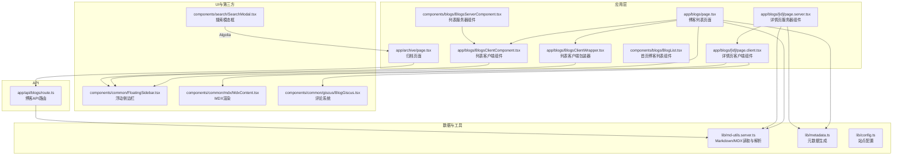
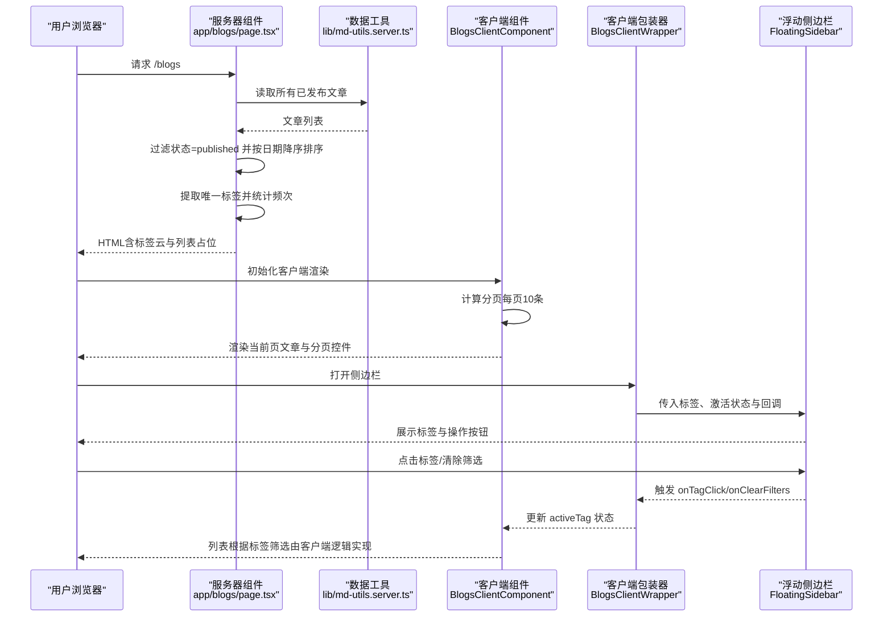
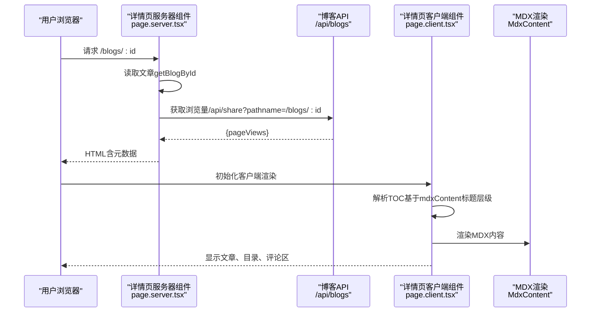
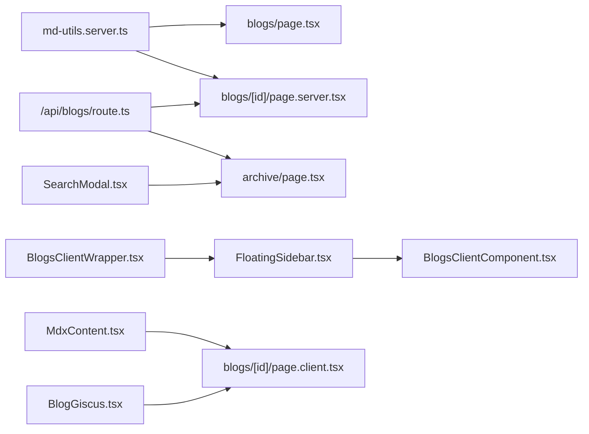

# 博客系统

<cite>
**本文引用的文件**
- [app/blogs/page.tsx](file://app/blogs/page.tsx)
- [app/blogs/BlogsClientComponent.tsx](file://app/blogs/BlogsClientComponent.tsx)
- [app/blogs/BlogsClientWrapper.tsx](file://app/blogs/BlogsClientWrapper.tsx)
- [components/blogs/BlogsServerComponent.tsx](file://components/blogs/BlogsServerComponent.tsx)
- [components/blogs/BlogList.tsx](file://components/blogs/BlogList.tsx)
- [app/blogs/[id]/page.tsx](file://app/blogs/[id]/page.tsx)
- [app/blogs/[id]/page.server.tsx](file://app/blogs/[id]/page.server.tsx)
- [app/blogs/[id]/page.client.tsx](file://app/blogs/[id]/page.client.tsx)
- [lib/md-utils.server.ts](file://lib/md-utils.server.ts)
- [components/common/FloatingSidebar.tsx](file://components/common/FloatingSidebar.tsx)
- [app/api/blogs/route.ts](file://app/api/blogs/route.ts)
- [components/search/SearchModal.tsx](file://components/search/SearchModal.tsx)
- [lib/metadata.ts](file://lib/metadata.ts)
- [components/common/mdx/MdxContent.tsx](file://components/common/mdx/MdxContent.tsx)
- [app/archive/page.tsx](file://app/archive/page.tsx)
- [lib/config.ts](file://lib/config.ts)
- [components/common/giscus/BlogGiscus.tsx](file://components/common/giscus/BlogGiscus.tsx)
</cite>

## 目录
1. [简介](#简介)
2. [项目结构](#项目结构)
3. [核心组件](#核心组件)
4. [架构总览](#架构总览)
5. [详细组件分析](#详细组件分析)
6. [依赖分析](#依赖分析)
7. [性能考量](#性能考量)
8. [故障排查指南](#故障排查指南)
9. [结论](#结论)
10. [附录](#附录)

## 简介
本文件面向博客系统，围绕以下目标进行系统化文档化：
- 博客文章列表展示、文章详情页面、标签云功能的实现与协作
- Server Components 与 Client Components 的协作模式（数据获取、状态管理、用户交互）
- 博客页面的渲染流程、排序算法与过滤机制
- 接口规范、配置项、参数与返回值
- 组件调用关系与与其他模块的集成
- 常见问题与解决方案

## 项目结构
博客系统采用 Next.js App Router 结构，核心入口位于 app/blogs 与 app/blogs/[id]，数据处理集中在 lib/md-utils.server.ts，UI 组件分布在 components 目录下，API 路由位于 app/api。

图表来源
- [app/blogs/page.tsx:1-92](file://app/blogs/page.tsx#L1-L92)
- [app/blogs/[id]/page.server.tsx:1-53](file://app/blogs/[id]/page.server.tsx#L1-L53)
- [app/blogs/[id]/page.client.tsx:1-498](file://app/blogs/[id]/page.client.tsx#L1-L498)
- [app/blogs/BlogsClientComponent.tsx:1-151](file://app/blogs/BlogsClientComponent.tsx#L1-L151)
- [app/blogs/BlogsClientWrapper.tsx:1-27](file://app/blogs/BlogsClientWrapper.tsx#L1-L27)
- [components/blogs/BlogsServerComponent.tsx:1-8](file://components/blogs/BlogsServerComponent.tsx#L1-L8)
- [components/blogs/BlogList.tsx:1-68](file://components/blogs/BlogList.tsx#L1-L68)
- [app/archive/page.tsx:1-257](file://app/archive/page.tsx#L1-L257)
- [lib/md-utils.server.ts:1-218](file://lib/md-utils.server.ts#L1-L218)
- [lib/metadata.ts:1-160](file://lib/metadata.ts#L1-L160)
- [lib/config.ts:1-108](file://lib/config.ts#L1-L108)
- [components/common/FloatingSidebar.tsx:1-216](file://components/common/FloatingSidebar.tsx#L1-L216)
- [components/common/mdx/MdxContent.tsx:1-220](file://components/common/mdx/MdxContent.tsx#L1-L220)
- [components/search/SearchModal.tsx:1-179](file://components/search/SearchModal.tsx#L1-L179)
- [components/common/giscus/BlogGiscus.tsx:1-44](file://components/common/giscus/BlogGiscus.tsx#L1-L44)
- [app/api/blogs/route.ts:1-62](file://app/api/blogs/route.ts#L1-L62)

章节来源
- [app/blogs/page.tsx:1-92](file://app/blogs/page.tsx#L1-L92)
- [lib/md-utils.server.ts:1-218](file://lib/md-utils.server.ts#L1-L218)

## 核心组件
- 博客列表页面（服务器组件）：负责读取文章、排序、聚合标签、渲染列表与标签云，并注入元数据。
- 列表客户端组件：负责分页、移动端适配、侧边栏控制。
- 列表客户端包装器：负责标签筛选状态与侧边栏交互。
- 详情页服务器组件：负责生成元数据、读取文章、调用 API 获取浏览量。
- 详情页客户端组件：负责阅读进度、目录（TOC）、滚动定位、评论区集成。
- MDX 内容渲染：负责安全渲染、链接处理、视频与外链卡片、表格等。
- 浮动侧边栏：提供标签选择、搜索、推送订阅、回到顶部等交互。
- 归档页面：基于 API 数据按年份分组展示文章。
- 元数据与配置：统一生成页面元信息，集中管理站点配置。

章节来源
- [app/blogs/page.tsx:14-91](file://app/blogs/page.tsx#L14-L91)
- [app/blogs/BlogsClientComponent.tsx:30-151](file://app/blogs/BlogsClientComponent.tsx#L30-L151)
- [app/blogs/BlogsClientWrapper.tsx:15-27](file://app/blogs/BlogsClientWrapper.tsx#L15-L27)
- [app/blogs/[id]/page.server.tsx:31-53](file://app/blogs/[id]/page.server.tsx#L31-L53)
- [app/blogs/[id]/page.client.tsx:186-498](file://app/blogs/[id]/page.client.tsx#L186-L498)
- [components/common/mdx/MdxContent.tsx:140-220](file://components/common/mdx/MdxContent.tsx#L140-L220)
- [components/common/FloatingSidebar.tsx:43-216](file://components/common/FloatingSidebar.tsx#L43-L216)
- [app/archive/page.tsx:109-257](file://app/archive/page.tsx#L109-L257)
- [lib/metadata.ts:25-160](file://lib/metadata.ts#L25-L160)
- [lib/config.ts:13-108](file://lib/config.ts#L13-L108)

## 架构总览
博客系统采用“服务器组件 + 客户端组件”的混合渲染模式：
- 服务器组件负责数据读取、元数据生成与初始渲染，确保首屏性能与 SEO 友好。
- 客户端组件负责交互、状态管理（如分页、标签筛选、滚动进度、目录高亮）与第三方集成（搜索、评论）。

图表来源
- [app/blogs/page.tsx:14-91](file://app/blogs/page.tsx#L14-L91)
- [lib/md-utils.server.ts:136-154](file://lib/md-utils.server.ts#L136-L154)
- [app/blogs/BlogsClientComponent.tsx:30-151](file://app/blogs/BlogsClientComponent.tsx#L30-L151)
- [app/blogs/BlogsClientWrapper.tsx:15-27](file://app/blogs/BlogsClientWrapper.tsx#L15-L27)
- [components/common/FloatingSidebar.tsx:43-216](file://components/common/FloatingSidebar.tsx#L43-L216)

## 详细组件分析

### 博客列表页面（服务器组件）
职责与流程：
- 读取所有文章并过滤状态为已发布
- 按日期降序排序
- 提取唯一标签并按出现频次排序，截取前15个用于标签云
- 渲染页面头部、标签云、文章列表容器与空状态
- 注入元数据与浮动侧边栏包装器

关键点：
- 数据来源：getAllBlogPosts
- 排序：按 date 降序
- 标签云：统计频次、排序、截断
- 客户端渲染：BlogsClientComponent 负责分页与交互

章节来源
- [app/blogs/page.tsx:14-91](file://app/blogs/page.tsx#L14-L91)
- [lib/md-utils.server.ts:136-154](file://lib/md-utils.server.ts#L136-L154)

### 列表客户端组件（BlogsClientComponent）
职责与流程：
- 移动端自适应：监听窗口尺寸，控制侧边栏显示
- 分页：每页固定数量，计算当前页、总页数与切片
- 渲染文章列表：标题、摘要、元信息（日期、阅读时长、标签）
- 分页控件：上一页/页码/下一页
- 侧边栏：桌面端展示浮动侧边栏

交互与状态：
- currentPage：当前页码
- postsPerPage：每页条数（常量）
- isMobile：响应式显示

章节来源
- [app/blogs/BlogsClientComponent.tsx:30-151](file://app/blogs/BlogsClientComponent.tsx#L30-L151)

### 列表客户端包装器（BlogsClientWrapper）
职责与流程：
- 维护 activeTag 状态
- 将标签、激活状态与回调传递给浮动侧边栏
- 支持清除筛选

章节来源
- [app/blogs/BlogsClientWrapper.tsx:15-27](file://app/blogs/BlogsClientWrapper.tsx#L15-L27)
- [components/common/FloatingSidebar.tsx:43-216](file://components/common/FloatingSidebar.tsx#L43-L216)

### 服务器组件（BlogsServerComponent）
职责与流程：
- 读取文章并直接传递给客户端组件
- 简化服务器职责，将交互逻辑下沉至客户端

章节来源
- [components/blogs/BlogsServerComponent.tsx:4-8](file://components/blogs/BlogsServerComponent.tsx#L4-L8)

### 首页博客列表组件（BlogList）
职责与流程：
- 仅展示最新5篇文章
- 渲染标题、标签与日期

章节来源
- [components/blogs/BlogList.tsx:24-68](file://components/blogs/BlogList.tsx#L24-L68)

### 文章详情页面（服务器组件 + 客户端组件）
职责与流程：
- 服务器组件：
  - 生成动态元数据（标题、描述、OG 图、关键词）
  - 读取文章内容
  - 调用 API 获取浏览量
- 客户端组件：
  - 计算阅读进度条与目录（TOC）
  - 滚动时高亮活动标题
  - 渲染 MDX 内容与评论区

图表来源
- [app/blogs/[id]/page.server.tsx:31-53](file://app/blogs/[id]/page.server.tsx#L31-L53)
- [app/blogs/[id]/page.client.tsx:186-498](file://app/blogs/[id]/page.client.tsx#L186-L498)
- [components/common/mdx/MdxContent.tsx:140-220](file://components/common/mdx/MdxContent.tsx#L140-L220)
- [app/api/blogs/route.ts:10-61](file://app/api/blogs/route.ts#L10-L61)

章节来源
- [app/blogs/[id]/page.tsx:1-4](file://app/blogs/[id]/page.tsx#L1-L4)
- [app/blogs/[id]/page.server.tsx:6-29](file://app/blogs/[id]/page.server.tsx#L6-L29)
- [app/blogs/[id]/page.client.tsx:186-498](file://app/blogs/[id]/page.client.tsx#L186-L498)

### MDX 内容渲染（MdxContent）
职责与流程：
- 自定义组件映射（h1/h2/h3/h4、段落、列表、块引用、表格、代码块）
- 安全渲染（rehypeSanitize）
- 链接处理：内部链接、外部链接、Bilibili 视频卡片、外链卡片
- 自动生成标题锚点 ID，支持滚动定位

章节来源
- [components/common/mdx/MdxContent.tsx:140-220](file://components/common/mdx/MdxContent.tsx#L140-L220)

### 浮动侧边栏（FloatingSidebar）
职责与流程：
- 回到顶部、标签选择、搜索、推送通知
- 根据滚动位置与底部元素调整吸附距离
- 支持清除筛选

章节来源
- [components/common/FloatingSidebar.tsx:43-216](file://components/common/FloatingSidebar.tsx#L43-L216)

### 归档页面（ArchivePage）
职责与流程：
- 通过 /api/blogs 获取全部文章
- 按年份分组并按日期倒序排序
- 使用 IntersectionObserver 控制年份区块入场动画

章节来源
- [app/archive/page.tsx:109-257](file://app/archive/page.tsx#L109-L257)
- [app/api/blogs/route.ts:10-61](file://app/api/blogs/route.ts#L10-L61)

### 元数据与配置（metadata、config）
- metadata：统一生成 OpenGraph、Twitter、文章类型扩展字段
- config：站点名称、描述、导航、关键词、分页配置、分析配置等

章节来源
- [lib/metadata.ts:25-160](file://lib/metadata.ts#L25-L160)
- [lib/config.ts:13-108](file://lib/config.ts#L13-L108)

## 依赖分析
- 数据依赖：lib/md-utils.server.ts 提供 getAllBlogPosts、getBlogById、getAllBlogs 等缓存接口
- 渲染依赖：BlogsClientComponent 依赖 FloatingSidebar 实现筛选与交互
- API 依赖：详情页通过 /api/blogs 获取文章列表；详情页通过 /api/share 获取浏览量
- 搜索依赖：SearchModal 通过 Algolia 实现搜索
- 评论依赖：BlogGiscus 通过 Giscus 提供评论

图表来源
- [lib/md-utils.server.ts:136-218](file://lib/md-utils.server.ts#L136-L218)
- [app/blogs/page.tsx:14-91](file://app/blogs/page.tsx#L14-L91)
- [app/blogs/[id]/page.server.tsx:31-53](file://app/blogs/[id]/page.server.tsx#L31-L53)
- [app/api/blogs/route.ts:10-61](file://app/api/blogs/route.ts#L10-L61)
- [app/archive/page.tsx:109-257](file://app/archive/page.tsx#L109-L257)
- [components/common/FloatingSidebar.tsx:43-216](file://components/common/FloatingSidebar.tsx#L43-L216)
- [app/blogs/BlogsClientComponent.tsx:30-151](file://app/blogs/BlogsClientComponent.tsx#L30-L151)
- [app/blogs/BlogsClientWrapper.tsx:15-27](file://app/blogs/BlogsClientWrapper.tsx#L15-L27)
- [components/common/mdx/MdxContent.tsx:140-220](file://components/common/mdx/MdxContent.tsx#L140-L220)
- [components/search/SearchModal.tsx:69-179](file://components/search/SearchModal.tsx#L69-L179)
- [components/common/giscus/BlogGiscus.tsx:3-44](file://components/common/giscus/BlogGiscus.tsx#L3-L44)

## 性能考量
- 缓存策略：md-utils.server.ts 对读取函数使用 React cache，减少重复 IO
- 服务器渲染：列表页与详情页服务器组件负责首屏渲染与 SEO，降低客户端首屏压力
- 客户端分页：BlogsClientComponent 在客户端进行分页，避免服务器端复杂分页逻辑
- 滚动与目录：详情页客户端仅在需要时计算 TOC，避免不必要的重排
- API 限流：/api/blogs 路由内置速率限制中间件，防止滥用
- 归档懒加载：archive 页面按需拉取数据并使用 IntersectionObserver 控制动画触发

章节来源
- [lib/md-utils.server.ts:136-154](file://lib/md-utils.server.ts#L136-L154)
- [app/api/blogs/route.ts:10-22](file://app/api/blogs/route.ts#L10-L22)
- [app/blogs/[id]/page.client.tsx:191-229](file://app/blogs/[id]/page.client.tsx#L191-L229)
- [app/archive/page.tsx:118-155](file://app/archive/page.tsx#L118-L155)

## 故障排查指南
- 文章未显示或为空
  - 检查 content/blogs 目录下是否存在 .md/.mdx 文件
  - 确认 frontmatter 中的 date、status、tags、title 等字段
  - 参考：getAllBlogPosts 与 getBlogById 的错误处理与返回 null 的情况
- 标签云不正确
  - 确认文章 tags 字段为字符串数组
  - 检查排序与截断逻辑（按出现频次降序、取前15）
- 详情页 404 或元数据异常
  - 确认文章文件存在且命名与 id 一致
  - 检查 generateMetadata 的返回值与 openGraph 字段
- 目录不显示或无法滚动
  - 确认 mdxContent 存在且包含标题（#/##/####）
  - 检查滚动事件绑定与标题元素可见性
- 浏览量获取失败
  - 检查 /api/share 是否可用，确认 pathname 参数格式
- 评论区不可用
  - 检查 NEXT_PUBLIC_GISCUS_* 环境变量是否配置完整
- 搜索无结果
  - 确认 Algolia 环境变量与索引名称正确
  - 检查 SearchModal 的 InstantSearch 初始化

章节来源
- [lib/md-utils.server.ts:156-218](file://lib/md-utils.server.ts#L156-L218)
- [app/blogs/page.tsx:44-68](file://app/blogs/page.tsx#L44-L68)
- [app/blogs/[id]/page.server.tsx:6-29](file://app/blogs/[id]/page.server.tsx#L6-L29)
- [app/blogs/[id]/page.client.tsx:191-241](file://app/blogs/[id]/page.client.tsx#L191-L241)
- [app/blogs/[id]/page.server.tsx:40-49](file://app/blogs/[id]/page.server.tsx#L40-L49)
- [components/common/giscus/BlogGiscus.tsx:5-44](file://components/common/giscus/BlogGiscus.tsx#L5-L44)
- [components/search/SearchModal.tsx:17-21](file://components/search/SearchModal.tsx#L17-L21)

## 结论
该博客系统通过清晰的服务器组件与客户端组件分工，实现了高性能、可交互、SEO 友好的博客页面。数据读取与缓存策略确保了稳定性，标签云、分页与目录等功能提升了用户体验。API 与第三方组件（搜索、评论）的集成增强了可扩展性。建议在后续迭代中进一步完善筛选与排序的客户端状态持久化与路由参数同步，以提升多页面场景下的一致性体验。

## 附录

### 接口与数据模型

- 博客文章数据模型（BlogPost）
  - 字段：id、title、excerpt、content、mdxContent、date、readTime、views、comments、imageUrl、slug、tags、status、wordCount、aiInvolvement、noteType
  - 来源：lib/md-utils.server.ts

- 博客列表页面（服务器组件）
  - 输入：无（读取 content/blogs）
  - 输出：HTML（标签云、文章列表、空状态）
  - 关键逻辑：过滤 published、按 date 降序、标签统计与排序、分页参数

- 详情页服务器组件
  - 输入：params.id
  - 输出：HTML（含元数据），调用 API 获取浏览量
  - 关键逻辑：generateMetadata、getBlogById、notFound()

- 详情页客户端组件
  - 输入：blog、pageViews
  - 输出：文章主体、目录、评论区
  - 关键逻辑：TOC 解析、滚动进度、标题高亮、滚动定位

- API 路由（/api/blogs）
  - GET：无参返回全部文章；带 id 返回单篇文章；带速率限制头

章节来源
- [lib/md-utils.server.ts:11-28](file://lib/md-utils.server.ts#L11-L28)
- [app/blogs/page.tsx:14-91](file://app/blogs/page.tsx#L14-L91)
- [app/blogs/[id]/page.server.tsx:31-53](file://app/blogs/[id]/page.server.tsx#L31-L53)
- [app/blogs/[id]/page.client.tsx:186-498](file://app/blogs/[id]/page.client.tsx#L186-L498)
- [app/api/blogs/route.ts:10-61](file://app/api/blogs/route.ts#L10-L61)