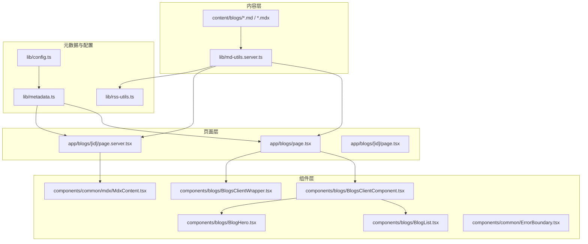
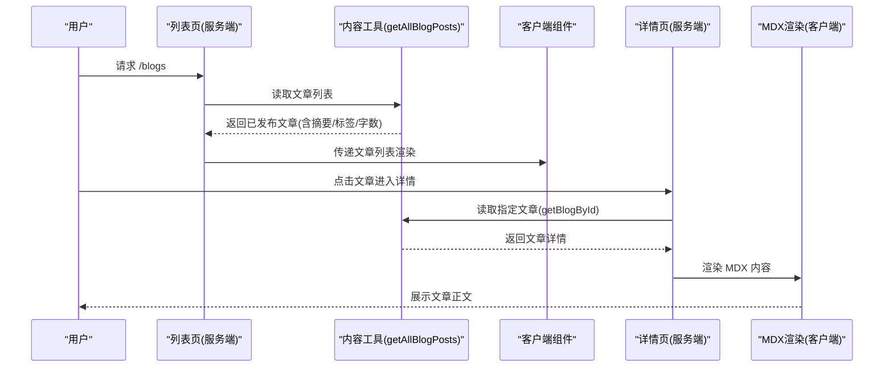
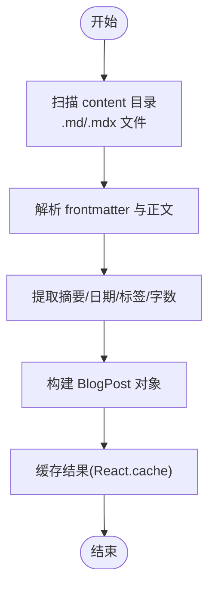
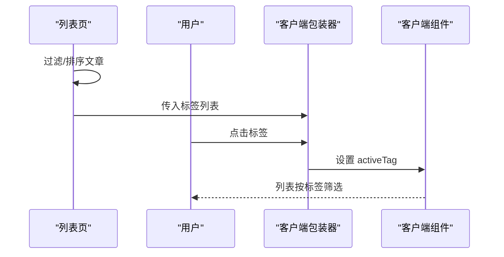
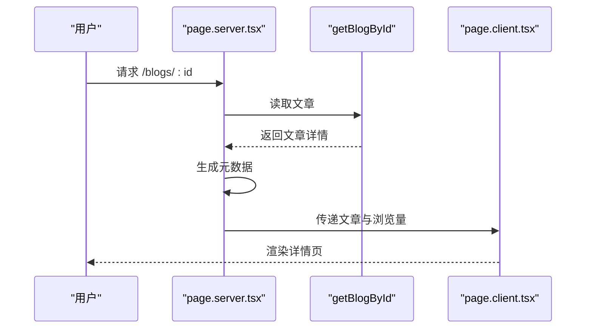
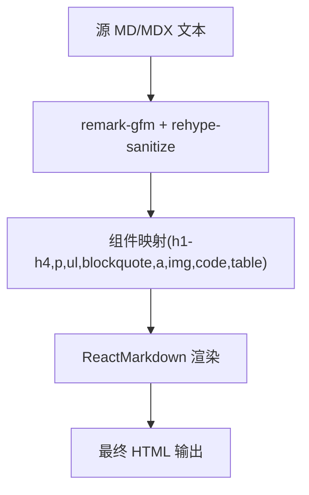
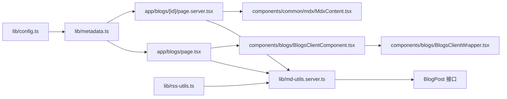

# 核心功能模块

<cite>
**本文引用的文件**
- [app/blogs/page.tsx](file://app/blogs/page.tsx)
- [components/blogs/BlogsClientComponent.tsx](file://components/blogs/BlogsClientComponent.tsx)
- [components/blogs/BlogsServerComponent.tsx](file://components/blogs/BlogsServerComponent.tsx)
- [components/blogs/BlogList.tsx](file://components/blogs/BlogList.tsx)
- [components/blogs/BlogHero.tsx](file://components/blogs/BlogHero.tsx)
- [components/blogs/BlogsClientWrapper.tsx](file://components/blogs/BlogsClientWrapper.tsx)
- [components/common/mdx/MdxContent.tsx](file://components/common/mdx/MdxContent.tsx)
- [components/common/ErrorBoundary.tsx](file://components/common/ErrorBoundary.tsx)
- [components/common/ErrorBoundaryWrapper.tsx](file://components/common/ErrorBoundaryWrapper.tsx)
- [lib/md-utils.server.ts](file://lib/md-utils.server.ts)
- [lib/metadata.ts](file://lib/metadata.ts)
- [lib/config.ts](file://lib/config.ts)
- [lib/rss-utils.ts](file://lib/rss-utils.ts)
- [app/blogs/[id]/page.tsx](file://app/blogs/[id]/page.tsx)
- [app/blogs/[id]/page.server.tsx](file://app/blogs/[id]/page.server.tsx)
- [scripts/precompute-word-count.js](file://scripts/precompute-word-count.js)
</cite>

## 目录
1. [引言](#引言)
2. [项目结构](#项目结构)
3. [核心组件](#核心组件)
4. [架构总览](#架构总览)
5. [详细组件分析](#详细组件分析)
6. [依赖分析](#依赖分析)
7. [性能考量](#性能考量)
8. [故障排查指南](#故障排查指南)
9. [结论](#结论)
10. [附录](#附录)

## 引言
本文件聚焦博客系统的核心功能模块，涵盖内容管理、文章展示与阅读体验、分类标签系统，以及 MDX 文件处理机制、元数据提取、字数统计与缓存策略。同时解释 Server Components 与 Client Components 的协作模式，给出接口规范、调用关系、配置项与常见问题的解决方案，帮助读者快速理解并高效使用该博客系统的实现。

## 项目结构
博客系统采用 Next.js App Router 架构，核心围绕“内容读取-元数据生成-组件渲染-客户端交互”展开。关键路径如下：
- 内容读取与处理：位于 lib/md-utils.server.ts，负责从 content 目录读取 MD/MDX 文件，解析 frontmatter，计算字数与阅读时长，并提供缓存接口。
- 页面与组件：app/blogs 下的页面与 components/blogs 下的组件共同完成列表页与详情页的渲染。
- 元数据：lib/metadata.ts 与 lib/config.ts 提供统一的页面元数据生成能力。
- MDX 渲染：components/common/mdx/MdxContent.tsx 将 Markdown/MDX 内容安全渲染为富文本。
- 客户端交互：BlogsClientWrapper.tsx、BlogsClientComponent.tsx 等负责标签筛选、浮动侧边栏、统计展示等交互。
- RSS 生成：lib/rss-utils.ts 生成站点 RSS 订阅。

图表来源
- [app/blogs/page.tsx:1-92](file://app/blogs/page.tsx#L1-L92)
- [app/blogs/[id]/page.server.tsx:1-53](file://app/blogs/[id]/page.server.tsx#L1-L53)
- [lib/md-utils.server.ts:1-218](file://lib/md-utils.server.ts#L1-L218)
- [lib/metadata.ts:1-160](file://lib/metadata.ts#L1-L160)
- [lib/config.ts:1-108](file://lib/config.ts#L1-L108)
- [lib/rss-utils.ts:1-58](file://lib/rss-utils.ts#L1-L58)
- [components/blogs/BlogList.tsx:1-68](file://components/blogs/BlogList.tsx#L1-L68)
- [components/blogs/BlogsClientComponent.tsx:1-67](file://components/blogs/BlogsClientComponent.tsx#L1-L67)
- [components/blogs/BlogHero.tsx:1-60](file://components/blogs/BlogHero.tsx#L1-L60)
- [components/blogs/BlogsClientWrapper.tsx:1-27](file://components/blogs/BlogsClientWrapper.tsx#L1-L27)
- [components/common/mdx/MdxContent.tsx:1-220](file://components/common/mdx/MdxContent.tsx#L1-L220)
- [components/common/ErrorBoundary.tsx:1-146](file://components/common/ErrorBoundary.tsx#L1-L146)

章节来源
- [app/blogs/page.tsx:1-92](file://app/blogs/page.tsx#L1-L92)
- [lib/md-utils.server.ts:1-218](file://lib/md-utils.server.ts#L1-L218)
- [lib/metadata.ts:1-160](file://lib/metadata.ts#L1-L160)
- [lib/config.ts:1-108](file://lib/config.ts#L1-L108)
- [lib/rss-utils.ts:1-58](file://lib/rss-utils.ts#L1-L58)
- [components/blogs/BlogList.tsx:1-68](file://components/blogs/BlogList.tsx#L1-L68)
- [components/blogs/BlogsClientComponent.tsx:1-67](file://components/blogs/BlogsClientComponent.tsx#L1-L67)
- [components/blogs/BlogHero.tsx:1-60](file://components/blogs/BlogHero.tsx#L1-L60)
- [components/blogs/BlogsClientWrapper.tsx:1-27](file://components/blogs/BlogsClientWrapper.tsx#L1-L27)
- [components/common/mdx/MdxContent.tsx:1-220](file://components/common/mdx/MdxContent.tsx#L1-L220)
- [components/common/ErrorBoundary.tsx:1-146](file://components/common/ErrorBoundary.tsx#L1-L146)

## 核心组件
- 内容读取与处理：提供 getAllBlogPosts、getAllNotes、getAllBlogs、getBlogById 等接口，使用 React 缓存装饰器进行缓存；解析 gray-matter frontmatter，提取摘要、日期、标签、字数等字段；支持 .md/.mdx 文件。
- 列表页与标签云：app/blogs/page.tsx 读取文章列表，过滤已发布文章并按日期倒序，生成标签云；传递给 BlogsClientComponent 展示 Hero、统计、列表与留言墙等。
- 详情页与元数据：app/blogs/[id]/page.server.tsx 通过 getBlogById 获取文章，生成 OpenGraph 元数据；调用客户端组件渲染正文。
- MDX 渲染：MdxContent.tsx 使用 remark-gfm 与 rehype-sanitize，安全渲染 Markdown/MDX，支持内链、外链、视频嵌入、图片、表格、代码块等。
- 客户端交互：BlogsClientWrapper.tsx 提供标签筛选与清空过滤；BlogsClientComponent.tsx 组合多个业务组件，如 BlogHero、BlogList、StatsBar、FunZone、NowSection、Guestbook。
- 错误边界：ErrorBoundary.tsx 捕获子树错误，提供友好降级 UI；ErrorBoundaryWrapper.tsx 用于服务端组件中包裹客户端错误边界。
- 元数据与配置：metadata.ts 提供 createMetadata/createBlogMetadata/pageMetadata；config.ts 提供站点配置与关键词、导航、分析等设置；rss-utils.ts 生成 RSS 订阅。

章节来源
- [lib/md-utils.server.ts:11-218](file://lib/md-utils.server.ts#L11-L218)
- [app/blogs/page.tsx:14-92](file://app/blogs/page.tsx#L14-L92)
- [app/blogs/[id]/page.server.tsx:31-53](file://app/blogs/[id]/page.server.tsx#L31-L53)
- [components/common/mdx/MdxContent.tsx:13-220](file://components/common/mdx/MdxContent.tsx#L13-L220)
- [components/blogs/BlogsClientWrapper.tsx:15-27](file://components/blogs/BlogsClientWrapper.tsx#L15-L27)
- [components/blogs/BlogsClientComponent.tsx:39-67](file://components/blogs/BlogsClientComponent.tsx#L39-L67)
- [components/common/ErrorBoundary.tsx:26-146](file://components/common/ErrorBoundary.tsx#L26-L146)
- [lib/metadata.ts:25-160](file://lib/metadata.ts#L25-L160)
- [lib/config.ts:13-108](file://lib/config.ts#L13-L108)
- [lib/rss-utils.ts:13-58](file://lib/rss-utils.ts#L13-L58)

## 架构总览
博客系统采用“服务端读取 + 客户端渲染”的模式：
- 服务端组件负责读取内容、生成元数据、触发客户端组件。
- 客户端组件负责交互逻辑（标签筛选、滚动锚点、动画等）。
- MDX 渲染在客户端完成，确保富文本与多媒体内容的安全展示。

图表来源
- [app/blogs/page.tsx:14-92](file://app/blogs/page.tsx#L14-L92)
- [lib/md-utils.server.ts:136-154](file://lib/md-utils.server.ts#L136-L154)
- [app/blogs/[id]/page.server.tsx:31-53](file://app/blogs/[id]/page.server.tsx#L31-L53)
- [components/common/mdx/MdxContent.tsx:140-220](file://components/common/mdx/MdxContent.tsx#L140-L220)

## 详细组件分析

### 内容读取与 MDX 处理（lib/md-utils.server.ts）
- 数据模型：BlogPost 接口包含 id、title、excerpt、content、mdxContent、date、readTime、views、comments、imageUrl、slug、tags、status、wordCount、aiInvolvement、noteType 等字段。
- 文件扫描：遍历 content/blogs 与 content/notes 目录，识别 .md/.mdx 文件。
- Frontmatter 解析：使用 gray-matter 提取元数据，支持 summary/excerpt 作为摘要来源；日期格式化保留时分秒；未提供 wordCount 时自动统计。
- 字数统计：去除 markdown 标记后分别统计英文单词、中文字符与数字，总和即为 wordCount；readTime 基于平均 300 字/分钟估算。
- 缓存策略：使用 React.cache 包装 getAllBlogPosts/getAllNotes/getAllBlogs/getBlogById，避免重复 IO。
- 查询逻辑：getBlogById 支持在 blogs/notes 目录中查找同名 .md/.mdx 文件，按顺序命中返回。

图表来源
- [lib/md-utils.server.ts:86-131](file://lib/md-utils.server.ts#L86-L131)
- [lib/md-utils.server.ts:136-218](file://lib/md-utils.server.ts#L136-L218)

章节来源
- [lib/md-utils.server.ts:11-218](file://lib/md-utils.server.ts#L11-L218)

### 列表页与标签云（app/blogs/page.tsx 与 BlogsClientComponent）
- 列表页职责：读取文章、过滤已发布、按日期倒序；生成标签云（按出现频次排序取前 15）；渲染 Hero、统计、FunZone、NowSection、文章列表、留言墙与浮动侧边栏。
- 标签云：遍历所有文章标签，统计频次并排序，点击跳转至对应标签锚点。
- 客户端组件组合：BlogsClientComponent 负责布局与样式注入，内部组合 BlogHero、BlogList、StatsBar、FunZone、NowSection、Guestbook 等。

图表来源
- [app/blogs/page.tsx:14-92](file://app/blogs/page.tsx#L14-L92)
- [components/blogs/BlogsClientWrapper.tsx:15-27](file://components/blogs/BlogsClientWrapper.tsx#L15-L27)
- [components/blogs/BlogsClientComponent.tsx:39-67](file://components/blogs/BlogsClientComponent.tsx#L39-L67)

章节来源
- [app/blogs/page.tsx:14-92](file://app/blogs/page.tsx#L14-L92)
- [components/blogs/BlogsClientWrapper.tsx:15-27](file://components/blogs/BlogsClientWrapper.tsx#L15-L27)
- [components/blogs/BlogsClientComponent.tsx:39-67](file://components/blogs/BlogsClientComponent.tsx#L39-L67)

### 详情页与元数据（app/blogs/[id]/page.server.tsx 与 page.tsx）
- 元数据生成：generateMetadata 读取文章，填充 OpenGraph 标准字段（标题、描述、发布时间、图片），关键字由标签拼接。
- 页面渲染：page.server.tsx 获取文章与浏览量，渲染客户端组件；page.tsx 导出服务器组件并复用元数据生成。
- 浏览量：通过 /api/share 接口查询当前文章的浏览次数，回退为 0。

图表来源
- [app/blogs/[id]/page.server.tsx:6-29](file://app/blogs/[id]/page.server.tsx#L6-L29)
- [app/blogs/[id]/page.server.tsx:31-53](file://app/blogs/[id]/page.server.tsx#L31-L53)
- [app/blogs/[id]/page.tsx:1-4](file://app/blogs/[id]/page.tsx#L1-L4)

章节来源
- [app/blogs/[id]/page.server.tsx:6-29](file://app/blogs/[id]/page.server.tsx#L6-L29)
- [app/blogs/[id]/page.server.tsx:31-53](file://app/blogs/[id]/page.server.tsx#L31-L53)
- [app/blogs/[id]/page.tsx:1-4](file://app/blogs/[id]/page.tsx#L1-L4)

### MDX 渲染与多媒体支持（components/common/mdx/MdxContent.tsx）
- 插件链：remark-gfm 提供 GitHub 风格表格等；rehype-sanitize 自定义 schema，允许 className/class 等安全属性。
- 自定义组件映射：h1/h2/h3/h4/p/ul/ol/li/blockquote/a/img/code/table/th/td/hr 等，统一样式与交互。
- 链接处理：内链、博客内链接、Bilibili 视频嵌入、外链图片展示卡片、普通外链等差异化处理。
- 图片优化：使用 Next/Image，限制最大高度，支持点击放大说明文案。
- 代码块：根据语言高亮，内联代码样式化。

图表来源
- [components/common/mdx/MdxContent.tsx:17-206](file://components/common/mdx/MdxContent.tsx#L17-L206)
- [components/common/mdx/MdxContent.tsx:140-220](file://components/common/mdx/MdxContent.tsx#L140-L220)

章节来源
- [components/common/mdx/MdxContent.tsx:13-220](file://components/common/mdx/MdxContent.tsx#L13-L220)

### 元数据与配置（lib/metadata.ts 与 lib/config.ts）
- createMetadata：统一生成 OpenGraph 与 Twitter 元数据，支持文章类型附加 publishedTime 与 tags。
- createBlogMetadata：针对博客文章的专用元数据生成器，自动拼接关键词与 URL。
- pageMetadata：集中管理各页面标题、描述与关键词。
- config.siteConfig：集中管理站点名称、描述、URL、社交链接、导航、关键词、OG 图、分页、分析等配置。

章节来源
- [lib/metadata.ts:25-160](file://lib/metadata.ts#L25-L160)
- [lib/config.ts:13-108](file://lib/config.ts#L13-L108)

### RSS 生成（lib/rss-utils.ts）
- 读取所有文章并按日期倒序；
- 生成 RSS XML，包含标题、描述、链接、发布日期、标签等；
- 使用 escapeXml 转义特殊字符，保证 XML 合法性。

章节来源
- [lib/rss-utils.ts:13-58](file://lib/rss-utils.ts#L13-L58)

### 字数统计与预计算（lib/md-utils.server.ts 与 scripts/precompute-word-count.js）
- 运行时统计：移除 markdown 标记后统计英文单词、中文字符与数字，得到 wordCount；readTime 基于 300 字/分钟估算。
- 预计算脚本：遍历 content 目录，解析 frontmatter，写回 wordCount 与 readTime，减少运行时开销。

章节来源
- [lib/md-utils.server.ts:49-70](file://lib/md-utils.server.ts#L49-L70)
- [scripts/precompute-word-count.js:15-48](file://scripts/precompute-word-count.js#L15-L48)
- [scripts/precompute-word-count.js:102-119](file://scripts/precompute-word-count.js#L102-L119)

### 错误边界与容错（components/common/ErrorBoundary.tsx 与 ErrorBoundaryWrapper.tsx）
- ErrorBoundaryClass：捕获子树错误，提供开发环境下的错误详情与重试/返回首页操作。
- ErrorBoundaryWrapper：在服务端组件中导入并使用错误边界，便于全局容错。

章节来源
- [components/common/ErrorBoundary.tsx:26-146](file://components/common/ErrorBoundary.tsx#L26-L146)
- [components/common/ErrorBoundaryWrapper.tsx:18-23](file://components/common/ErrorBoundaryWrapper.tsx#L18-L23)

## 依赖分析
- 组件耦合与内聚：列表页与详情页通过 lib/md-utils.server.ts 解耦内容读取；客户端组件通过 props 与状态解耦交互逻辑。
- 外部依赖：gray-matter、react-markdown、remark-gfm、rehype-sanitize、Next/Image、Lucide Icons 等。
- 循环依赖：未见明显循环依赖；组件间通过 props 与服务端读取接口传递数据。
- 接口契约：getBlogById 返回 BlogPost 或 null；getAllBlogPosts/getAllNotes/getAllBlogs 返回 BlogPost[]；createMetadata/createBlogMetadata 返回 Metadata。

图表来源
- [app/blogs/page.tsx:6-12](file://app/blogs/page.tsx#L6-L12)
- [app/blogs/[id]/page.server.tsx:1-4](file://app/blogs/[id]/page.server.tsx#L1-L4)
- [lib/md-utils.server.ts:11-28](file://lib/md-utils.server.ts#L11-L28)
- [lib/metadata.ts:25-79](file://lib/metadata.ts#L25-L79)
- [lib/config.ts:13-98](file://lib/config.ts#L13-L98)
- [lib/rss-utils.ts:6-17](file://lib/rss-utils.ts#L6-L17)
- [components/blogs/BlogsClientComponent.tsx:3-7](file://components/blogs/BlogsClientComponent.tsx#L3-L7)
- [components/blogs/BlogsClientWrapper.tsx:9](file://components/blogs/BlogsClientWrapper.tsx#L9)

章节来源
- [lib/md-utils.server.ts:11-218](file://lib/md-utils.server.ts#L11-L218)
- [lib/metadata.ts:25-160](file://lib/metadata.ts#L25-L160)
- [lib/config.ts:13-108](file://lib/config.ts#L13-L108)
- [lib/rss-utils.ts:13-58](file://lib/rss-utils.ts#L13-L58)
- [components/blogs/BlogsClientComponent.tsx:3-7](file://components/blogs/BlogsClientComponent.tsx#L3-L7)
- [components/blogs/BlogsClientWrapper.tsx:9](file://components/blogs/BlogsClientWrapper.tsx#L9)

## 性能考量
- 缓存策略：使用 React.cache 包装内容读取函数，避免重复文件 IO；建议在生产环境结合边缘缓存进一步提升性能。
- 字数统计：优先使用预计算的 wordCount，减少运行时解析成本；若未预计算，采用轻量正则统计，复杂度 O(n)。
- 渲染优化：MDX 渲染使用 useMemo 缓存组件映射与插件，减少重复计算；图片使用 Next/Image 自带优化。
- 列表截断：列表组件仅渲染前 N 条，降低 DOM 体积与首屏渲染压力。
- 元数据生成：集中配置与模板化，避免重复计算；RSS 生成仅在需要时触发。

## 故障排查指南
- 文章未显示或标签云为空
  - 检查 content 目录下是否为 .md/.mdx 文件且 frontmatter 正确；确认 status 为 published。
  - 章节来源
    - [lib/md-utils.server.ts:86-131](file://lib/md-utils.server.ts#L86-L131)
- 详情页 404 或元数据异常
  - 确认 id 是否存在于 blogs/notes 目录；检查 getBlogById 返回值；查看 generateMetadata 逻辑。
  - 章节来源
    - [app/blogs/[id]/page.server.tsx:31-53](file://app/blogs/[id]/page.server.tsx#L31-L53)
- MDX 渲染异常或被过滤
  - 检查 rehype-sanitize 自定义 schema 是否允许所需属性；确认 remark-gfm 插件启用。
  - 章节来源
    - [components/common/mdx/MdxContent.tsx:17-30](file://components/common/mdx/MdxContent.tsx#L17-L30)
- 浏览量显示为 0
  - 确认 /api/share 接口可用；检查返回 JSON 结构与键名；降级为 0 属于预期行为。
  - 章节来源
    - [app/blogs/[id]/page.server.tsx:40-49](file://app/blogs/[id]/page.server.tsx#L40-L49)
- 错误导致页面崩溃
  - 在根组件包裹 ErrorBoundary；开发环境可查看错误详情；生产环境提供重试与返回首页。
  - 章节来源
    - [components/common/ErrorBoundary.tsx:36-53](file://components/common/ErrorBoundary.tsx#L36-L53)
- RSS 订阅内容缺失
  - 检查 generateRssFeed 逻辑与 escapeXml；确认文章日期与标签正确。
  - 章节来源
    - [lib/rss-utils.ts:13-43](file://lib/rss-utils.ts#L13-L43)

## 结论
该博客系统通过清晰的服务端读取与客户端渲染分离，实现了高性能、可扩展的内容管理与展示。MDX 渲染与元数据生成模块化设计，配合缓存与预计算策略，兼顾了开发体验与运行效率。标签筛选、统计展示与错误边界等交互与容错机制，提升了整体的阅读体验与稳定性。

## 附录

### 接口规范与参数
- getBlogById(id: string): BlogPost | null
  - 输入：文章 id
  - 输出：文章详情或 null
  - 章节来源
    - [lib/md-utils.server.ts:156-218](file://lib/md-utils.server.ts#L156-L218)
- getAllBlogPosts(): BlogPost[]
  - 输入：无
  - 输出：已发布文章列表
  - 章节来源
    - [lib/md-utils.server.ts:136-138](file://lib/md-utils.server.ts#L136-L138)
- getAllNotes(): BlogPost[]
  - 输入：无
  - 输出：手记文章列表
  - 章节来源
    - [lib/md-utils.server.ts:143-145](file://lib/md-utils.server.ts#L143-L145)
- getAllBlogs(): BlogPost[]
  - 输入：无
  - 输出：博客与手记合并列表
  - 章节来源
    - [lib/md-utils.server.ts:150-154](file://lib/md-utils.server.ts#L150-L154)
- createBlogMetadata(blog: Partial<BlogPost>): Metadata
  - 输入：文章元数据片段
  - 输出：标准 Metadata
  - 章节来源
    - [lib/metadata.ts:86-104](file://lib/metadata.ts#L86-L104)
- generateRssFeed(): string
  - 输入：无
  - 输出：RSS XML 字符串
  - 章节来源
    - [lib/rss-utils.ts:13-43](file://lib/rss-utils.ts#L13-L43)

### 配置项与返回值
- siteConfig
  - 关键字段：name/description/url/social/navigation/keywords/ogImage/favicon/themeColor/language/timezone/pagination/analytics
  - 章节来源
    - [lib/config.ts:13-98](file://lib/config.ts#L13-L98)
- pageMetadata
  - 关键页面：home/blogs/archive/talks/links/notes/giscus
  - 章节来源
    - [lib/metadata.ts:109-145](file://lib/metadata.ts#L109-L145)