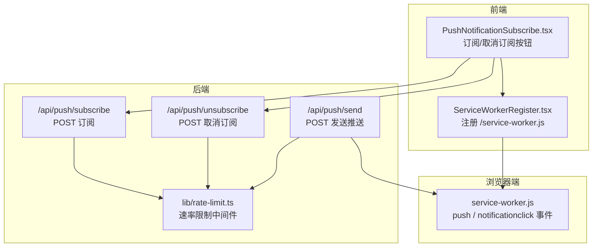
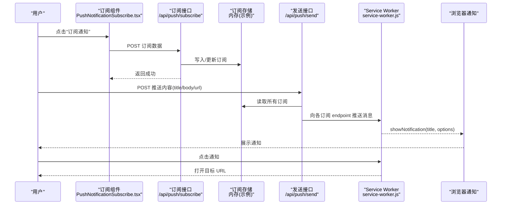
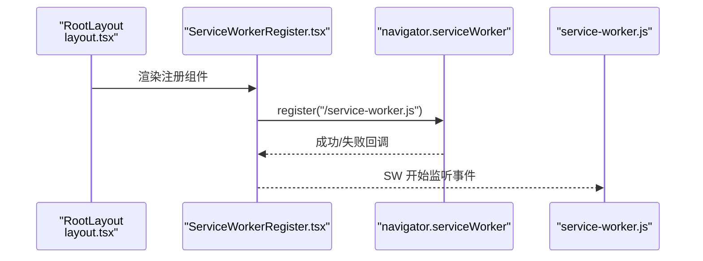
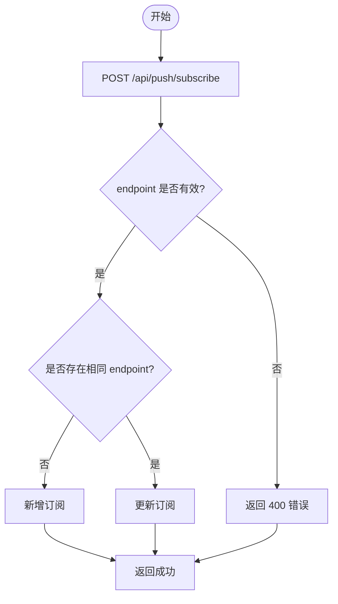
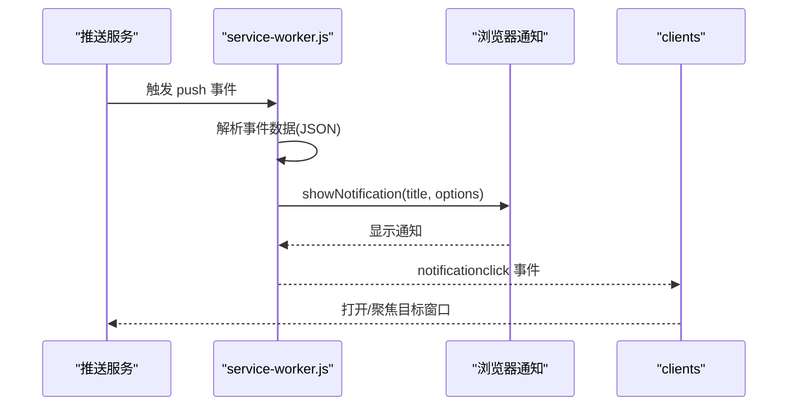
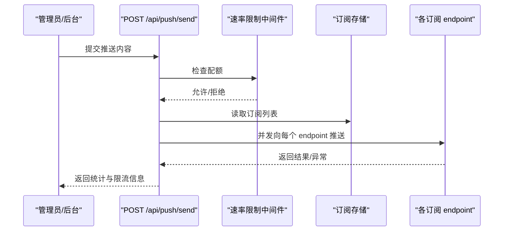
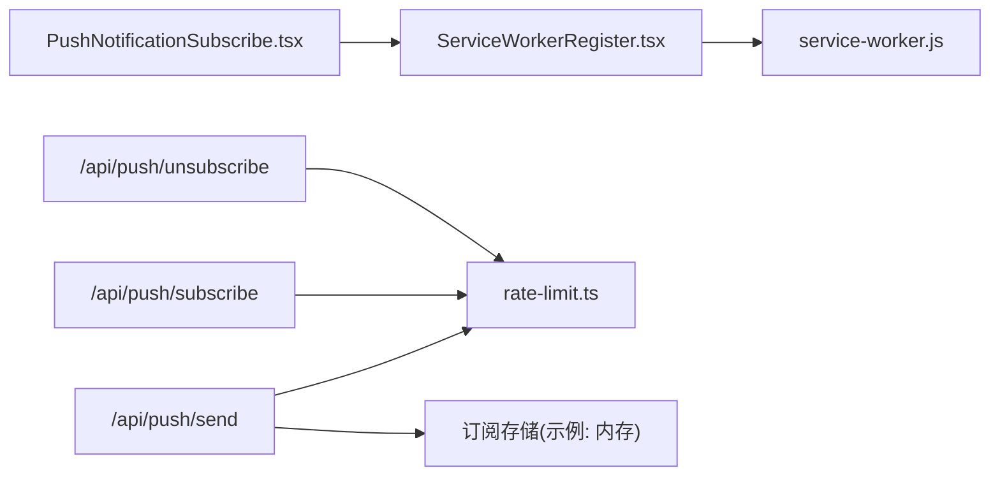

# 推送通知

<cite>
**本文引用的文件**
- [service-worker.js](file://public/service-worker.js)
- [sw.js](file://public/sw.js)
- [PushNotificationSubscribe.tsx](file://components/common/PushNotificationSubscribe.tsx)
- [ServiceWorkerRegister.tsx](file://components/common/ServiceWorkerRegister.tsx)
- [send/route.ts](file://app/api/push/send/route.ts)
- [subscribe/route.ts](file://app/api/push/subscribe/route.ts)
- [unsubscribe/route.ts](file://app/api/push/unsubscribe/route.ts)
- [rate-limit.ts](file://lib/rate-limit.ts)
- [manifest.json](file://public/manifest.json)
- [layout.tsx](file://app/layout.tsx)
</cite>

## 目录
1. [引言](#引言)
2. [项目结构](#项目结构)
3. [核心组件](#核心组件)
4. [架构总览](#架构总览)
5. [详细组件分析](#详细组件分析)
6. [依赖关系分析](#依赖关系分析)
7. [性能考量](#性能考量)
8. [故障排查指南](#故障排查指南)
9. [结论](#结论)
10. [附录](#附录)

## 引言
本文件面向“推送通知”系统，围绕 PWA 推送通知的技术架构与实现机制进行深入说明。内容涵盖 Service Worker 注册流程、推送订阅与取消订阅管理、消息处理、浏览器兼容性与权限请求、通知生命周期与离线体验、安全与 HTTPS 要求、VAPID 集成要点、发送接口与订阅存储、以及性能优化与最佳实践。文档以仓库中的真实代码为依据，配合可视化图示帮助读者快速理解与落地。

## 项目结构
推送通知相关能力由三部分组成：
- 前端界面与交互：订阅按钮组件与 Service Worker 注册组件
- 浏览器端 Service Worker：负责接收推送、展示通知、处理点击跳转
- 后端 API：负责订阅管理、取消订阅、以及向订阅者批量发送推送

图表来源
- [PushNotificationSubscribe.tsx:1-79](file://components/common/PushNotificationSubscribe.tsx#L1-L79)
- [ServiceWorkerRegister.tsx:1-21](file://components/common/ServiceWorkerRegister.tsx#L1-L21)
- [service-worker.js:1-131](file://public/service-worker.js#L1-L131)
- [subscribe/route.ts:1-66](file://app/api/push/subscribe/route.ts#L1-L66)
- [unsubscribe/route.ts:1-33](file://app/api/push/unsubscribe/route.ts#L1-L33)
- [send/route.ts:1-78](file://app/api/push/send/route.ts#L1-L78)
- [rate-limit.ts:1-214](file://lib/rate-limit.ts#L1-L214)

章节来源
- [layout.tsx:1-108](file://app/layout.tsx#L1-L108)
- [manifest.json:1-22](file://public/manifest.json#L1-L22)

## 核心组件
- Service Worker 注册组件：在页面加载完成后调用浏览器原生 Service Worker API 注册本地 SW 文件，确保后续推送与离线缓存可用。
- 推送订阅组件：提供订阅/取消订阅按钮，当前为占位实现，后续需接入浏览器推送接口与后端订阅 API。
- 推送 Service Worker：监听 push 与 notificationclick 事件，展示通知并根据通知数据跳转到目标页面。
- 后端推送 API：提供订阅、取消订阅、发送推送三个接口；发送接口采用 VAPID 授权并通过订阅者的 endpoint 推送消息；均集成速率限制中间件。

章节来源
- [ServiceWorkerRegister.tsx:1-21](file://components/common/ServiceWorkerRegister.tsx#L1-L21)
- [PushNotificationSubscribe.tsx:1-79](file://components/common/PushNotificationSubscribe.tsx#L1-L79)
- [service-worker.js:92-131](file://public/service-worker.js#L92-L131)
- [send/route.ts:1-78](file://app/api/push/send/route.ts#L1-L78)
- [subscribe/route.ts:1-66](file://app/api/push/subscribe/route.ts#L1-L66)
- [unsubscribe/route.ts:1-33](file://app/api/push/unsubscribe/route.ts#L1-L33)
- [rate-limit.ts:1-214](file://lib/rate-limit.ts#L1-L214)

## 架构总览
下图展示了从用户触发订阅到后端批量发送推送、再到浏览器端展示通知的完整链路。

图表来源
- [PushNotificationSubscribe.tsx:1-79](file://components/common/PushNotificationSubscribe.tsx#L1-L79)
- [subscribe/route.ts:1-66](file://app/api/push/subscribe/route.ts#L1-L66)
- [send/route.ts:1-78](file://app/api/push/send/route.ts#L1-L78)
- [service-worker.js:92-131](file://public/service-worker.js#L92-L131)

## 详细组件分析

### Service Worker 注册流程
- 在应用根布局中注入注册组件，确保页面加载后执行注册。
- 注册入口指向本地 SW 文件，注册成功后 SW 进入控制状态，可接收 push 与 notificationclick 事件。
- 注册失败时输出错误日志，便于排查浏览器支持与 HTTPS 等问题。

图表来源
- [layout.tsx:94-95](file://app/layout.tsx#L94-L95)
- [ServiceWorkerRegister.tsx:1-21](file://components/common/ServiceWorkerRegister.tsx#L1-L21)
- [service-worker.js:1-131](file://public/service-worker.js#L1-L131)

章节来源
- [layout.tsx:94-95](file://app/layout.tsx#L94-L95)
- [ServiceWorkerRegister.tsx:1-21](file://components/common/ServiceWorkerRegister.tsx#L1-L21)

### 推送订阅与取消订阅管理
- 订阅接口：接收订阅对象（含 endpoint），去重后写入内存存储；对重复 endpoint 更新订阅；集成速率限制。
- 取消订阅接口：按 endpoint 过滤移除订阅；若未找到也返回成功，避免前端误判。
- 前端订阅组件：当前为占位实现，后续需接入浏览器推送接口（如 PushManager）与后端订阅 API。

图表来源
- [subscribe/route.ts:1-66](file://app/api/push/subscribe/route.ts#L1-L66)

章节来源
- [subscribe/route.ts:1-66](file://app/api/push/subscribe/route.ts#L1-L66)
- [unsubscribe/route.ts:1-33](file://app/api/push/unsubscribe/route.ts#L1-L33)
- [PushNotificationSubscribe.tsx:1-79](file://components/common/PushNotificationSubscribe.tsx#L1-L79)

### 推送消息处理与通知展示
- push 事件：解析事件数据为 JSON，构造通知选项（标题、正文、图标、徽章、振动、跳转 URL），调用 showNotification 显示通知。
- notificationclick 事件：关闭通知，尝试聚焦已有窗口，否则新开窗口跳转至通知数据中的 URL。
- 离线场景：SW 本身不作为推送代理，但可结合离线页面策略（见离线与缓存章节）提升整体体验。

图表来源
- [service-worker.js:92-131](file://public/service-worker.js#L92-L131)

章节来源
- [service-worker.js:92-131](file://public/service-worker.js#L92-L131)

### 推送发送接口与 VAPID 集成
- 接口职责：接收标题、正文与可选 URL，向所有订阅者 endpoint 并发推送；异常时移除无效订阅。
- VAPID 授权：在请求头中携带 Authorization: Bearer <私钥>（示例中为占位值，实际应从环境变量读取）。
- 速率限制：发送接口采用严格速率限制（每分钟有限次数），并透传限流元信息。

图表来源
- [send/route.ts:1-78](file://app/api/push/send/route.ts#L1-L78)
- [rate-limit.ts:150-197](file://lib/rate-limit.ts#L150-L197)

章节来源
- [send/route.ts:1-78](file://app/api/push/send/route.ts#L1-L78)
- [rate-limit.ts:1-214](file://lib/rate-limit.ts#L1-L214)

### 浏览器兼容性、权限请求与用户授权
- 兼容性：现代浏览器普遍支持 Service Worker 与推送 API；需满足 HTTPS 条件（本地开发可使用 localhost）。
- 权限请求：浏览器通常会在用户首次访问时弹出权限提示，允许站点发送通知；若被拒绝，需引导用户手动开启。
- 授权流程：前端订阅组件需接入 PushManager（浏览器推送接口）完成订阅；后端接收订阅数据并持久化。

章节来源
- [PushNotificationSubscribe.tsx:1-79](file://components/common/PushNotificationSubscribe.tsx#L1-L79)

### 通知生命周期管理、离线处理与用户体验优化
- 生命周期：安装（install）、激活（activate）、推送（push）、点击（notificationclick）。
- 离线处理：SW 支持离线页面回退（导航请求失败时返回首页缓存），提升弱网/离线体验。
- 用户体验：通知包含图标、徽章、振动；点击后聚焦或打开目标页面；建议在 UI 中明确告知“仅发送重要通知”与“可随时取消”。

章节来源
- [service-worker.js:17-90](file://public/service-worker.js#L17-L90)
- [sw.js:1-34](file://public/sw.js#L1-L34)

## 依赖关系分析
- 前端依赖：订阅组件依赖 Service Worker 注册组件；注册组件依赖浏览器原生 Service Worker API。
- 后端依赖：订阅/取消订阅/发送接口依赖速率限制中间件；发送接口依赖订阅存储（示例为内存存储，生产建议数据库）。
- 浏览器端依赖：SW 依赖浏览器推送服务与通知 API。

图表来源
- [PushNotificationSubscribe.tsx:1-79](file://components/common/PushNotificationSubscribe.tsx#L1-L79)
- [ServiceWorkerRegister.tsx:1-21](file://components/common/ServiceWorkerRegister.tsx#L1-L21)
- [service-worker.js:1-131](file://public/service-worker.js#L1-L131)
- [send/route.ts:1-78](file://app/api/push/send/route.ts#L1-L78)
- [subscribe/route.ts:1-66](file://app/api/push/subscribe/route.ts#L1-L66)
- [unsubscribe/route.ts:1-33](file://app/api/push/unsubscribe/route.ts#L1-L33)
- [rate-limit.ts:1-214](file://lib/rate-limit.ts#L1-L214)

章节来源
- [layout.tsx:94-95](file://app/layout.tsx#L94-L95)
- [rate-limit.ts:1-214](file://lib/rate-limit.ts#L1-L214)

## 性能考量
- 并发推送：发送接口对所有订阅并发调用 endpoint，提高吞吐；注意下游推送服务的限流与重试策略。
- 速率限制：发送接口严格限流，避免滥用；订阅接口同样限流，保证稳定性。
- 缓存与离线：SW 预缓存关键静态资源，离线时返回首页，减少首屏等待。
- 通知体积：尽量精简推送负载，避免传输大字段；URL 由通知数据携带即可。

章节来源
- [send/route.ts:37-58](file://app/api/push/send/route.ts#L37-L58)
- [rate-limit.ts:150-197](file://lib/rate-limit.ts#L150-L197)
- [service-worker.js:17-90](file://public/service-worker.js#L17-L90)

## 故障排查指南
- Service Worker 注册失败
  - 检查是否在 HTTPS 下运行（localhost 可用）。
  - 查看浏览器控制台错误日志，确认 SW 文件路径正确。
- 推送无法显示
  - 确认浏览器已授予通知权限。
  - 检查 SW 是否监听到 push 事件；核对通知选项（标题、正文、图标）。
- 发送接口报错
  - 核对 VAPID 授权头格式与密钥配置。
  - 查看速率限制返回的剩余配额与重置时间。
  - 关注无效订阅的清理逻辑，避免残留 endpoint 影响后续发送。

章节来源
- [ServiceWorkerRegister.tsx:1-21](file://components/common/ServiceWorkerRegister.tsx#L1-L21)
- [service-worker.js:92-131](file://public/service-worker.js#L92-L131)
- [send/route.ts:1-78](file://app/api/push/send/route.ts#L1-L78)
- [rate-limit.ts:164-189](file://lib/rate-limit.ts#L164-L189)

## 结论
该推送通知系统以 PWA 为核心，前端通过 Service Worker 实现推送接收与通知展示，后端提供订阅、取消订阅与发送推送的 API，并集成速率限制保障稳定性。当前前端订阅组件仍为占位实现，后续需接入浏览器推送接口与后端订阅 API，完善权限请求与用户授权流程。建议在生产环境中替换内存存储为数据库、完善 VAPID 密钥管理与 HTTPS 部署，并持续优化推送内容与用户体验。

## 附录

### HTTPS 与 Manifest 要点
- HTTPS：推送 API 与 Service Worker 均要求 HTTPS 环境（localhost 可用）。
- Manifest：提供 PWA 必备元信息，增强安装与展示体验。

章节来源
- [manifest.json:1-22](file://public/manifest.json#L1-L22)
- [layout.tsx:78-85](file://app/layout.tsx#L78-L85)