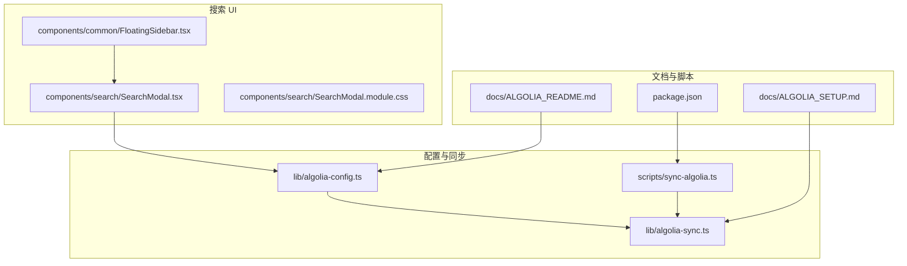
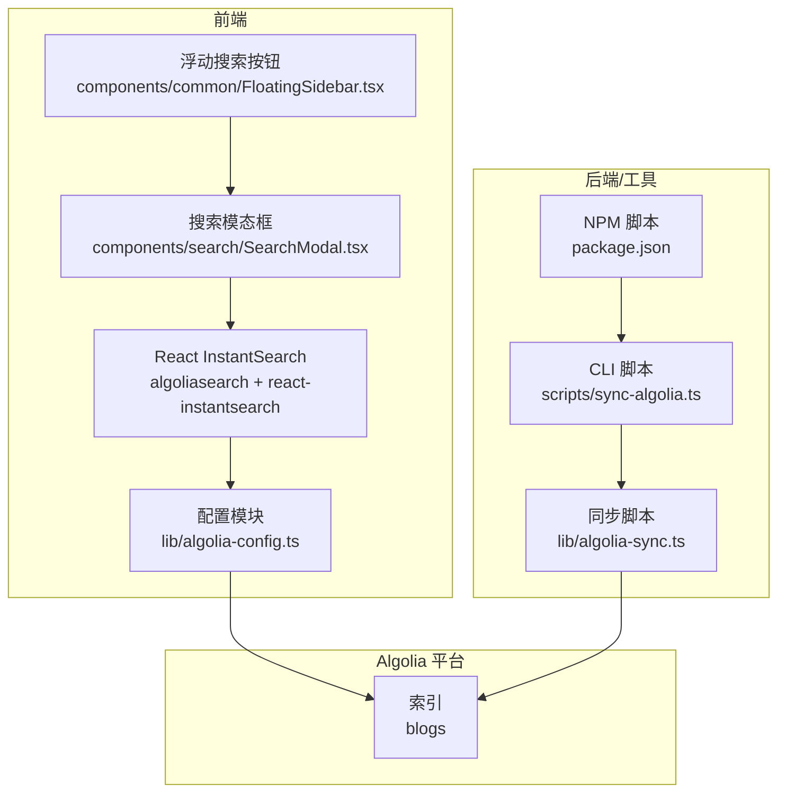
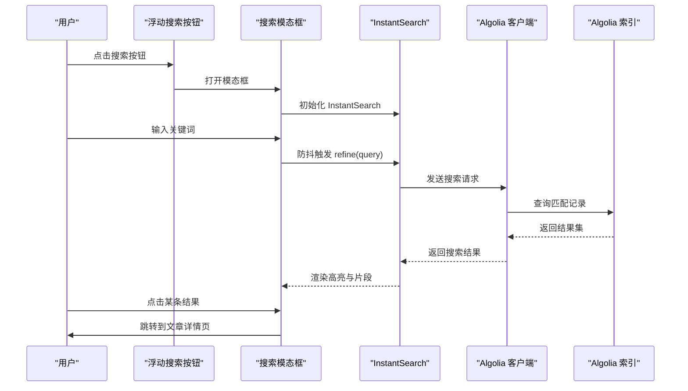
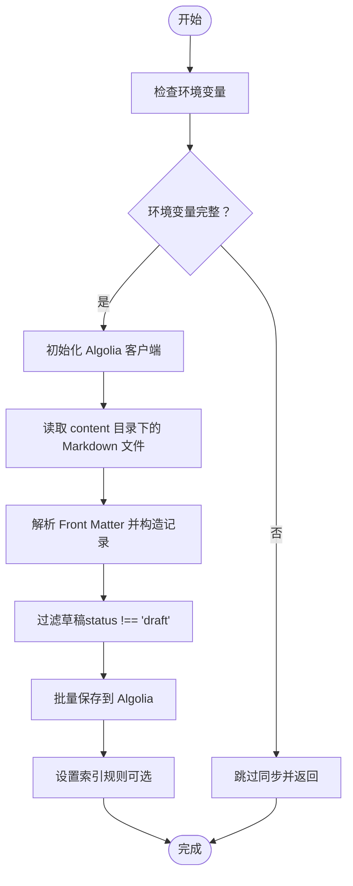
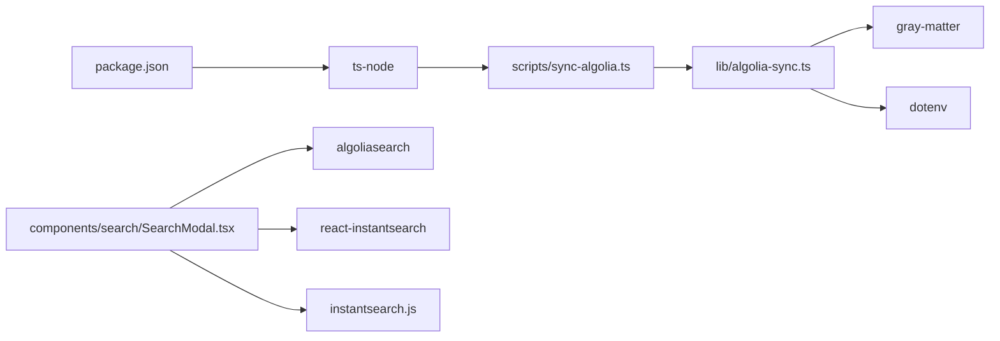

# 搜索功能

<cite>
**本文引用的文件**
- [lib/algolia-config.ts](file://lib/algolia-config.ts)
- [lib/algolia-sync.ts](file://lib/algolia-sync.ts)
- [scripts/sync-algolia.ts](file://scripts/sync-algolia.ts)
- [components/search/SearchModal.tsx](file://components/search/SearchModal.tsx)
- [components/search/SearchModal.module.css](file://components/search/SearchModal.module.css)
- [components/common/FloatingSidebar.tsx](file://components/common/FloatingSidebar.tsx)
- [docs/ALGOLIA_README.md](file://docs/ALGOLIA_README.md)
- [docs/ALGOLIA_SETUP.md](file://docs/ALGOLIA_SETUP.md)
- [package.json](file://package.json)
</cite>

## 目录
1. [简介](#简介)
2. [项目结构](#项目结构)
3. [核心组件](#核心组件)
4. [架构总览](#架构总览)
5. [详细组件分析](#详细组件分析)
6. [依赖关系分析](#依赖关系分析)
7. [性能考虑](#性能考虑)
8. [故障排查指南](#故障排查指南)
9. [结论](#结论)
10. [附录](#附录)

## 简介
本文件系统性介绍本博客项目中基于 Algolia 的全文搜索集成方案与实现细节，涵盖搜索模态框组件的设计、样式系统与交互逻辑；Algolia 配置参数、索引同步机制与搜索算法优化；搜索查询构建、结果过滤与排序策略；以及与内容管理系统的集成方式与数据同步机制。同时提供配置示例、API 调用路径、错误处理方案与性能优化建议，帮助开发者快速理解与维护搜索功能。

## 项目结构
搜索功能由以下关键部分组成：
- 配置模块：集中管理 Algolia 的应用 ID、搜索 API Key、索引名称与配置校验。
- 同步模块：从本地内容目录读取 Markdown 内容，解析 Front Matter，批量写入 Algolia，并设置索引规则。
- 搜索 UI 组件：提供搜索模态框，使用 React InstantSearch 与 Algolia 客户端进行实时搜索与结果高亮。
- 浮动搜索按钮：在页面右侧提供固定悬浮入口，打开搜索模态框。
- 文档与脚本：提供完整的配置指南、同步脚本与 npm 脚本。

图表来源
- [lib/algolia-config.ts:1-33](file://lib/algolia-config.ts#L1-L33)
- [lib/algolia-sync.ts:1-133](file://lib/algolia-sync.ts#L1-L133)
- [scripts/sync-algolia.ts:1-30](file://scripts/sync-algolia.ts#L1-L30)
- [components/search/SearchModal.tsx:1-179](file://components/search/SearchModal.tsx#L1-L179)
- [components/search/SearchModal.module.css:1-204](file://components/search/SearchModal.module.css#L1-L204)
- [components/common/FloatingSidebar.tsx:103-125](file://components/common/FloatingSidebar.tsx#L103-L125)
- [docs/ALGOLIA_README.md:1-95](file://docs/ALGOLIA_README.md#L1-L95)
- [docs/ALGOLIA_SETUP.md:1-131](file://docs/ALGOLIA_SETUP.md#L1-L131)
- [package.json:13-14](file://package.json#L13-L14)

章节来源
- [lib/algolia-config.ts:1-33](file://lib/algolia-config.ts#L1-L33)
- [lib/algolia-sync.ts:1-133](file://lib/algolia-sync.ts#L1-L133)
- [scripts/sync-algolia.ts:1-30](file://scripts/sync-algolia.ts#L1-L30)
- [components/search/SearchModal.tsx:1-179](file://components/search/SearchModal.tsx#L1-L179)
- [components/search/SearchModal.module.css:1-204](file://components/search/SearchModal.module.css#L1-L204)
- [components/common/FloatingSidebar.tsx:103-125](file://components/common/FloatingSidebar.tsx#L103-L125)
- [docs/ALGOLIA_README.md:1-95](file://docs/ALGOLIA_README.md#L1-L95)
- [docs/ALGOLIA_SETUP.md:1-131](file://docs/ALGOLIA_SETUP.md#L1-L131)
- [package.json:13-14](file://package.json#L13-L14)

## 核心组件
- Algolia 配置模块：集中管理 Algolia 的应用 ID、搜索 API Key、索引名称，并提供配置校验函数，便于在前端与同步脚本中复用。
- 同步模块：负责从 content 目录读取 Markdown 文件，解析 Front Matter，构造索引对象，过滤草稿状态，批量写入 Algolia，并设置索引的可搜索属性、高亮与排序等规则。
- 搜索模态框组件：基于 React InstantSearch，提供防抖搜索框、结果高亮与片段展示、加载状态覆盖层、键盘事件处理与路由跳转预取。
- 浮动搜索按钮：在页面右侧提供固定悬浮入口，打开搜索模态框，提升用户可达性。

章节来源
- [lib/algolia-config.ts:7-32](file://lib/algolia-config.ts#L7-L32)
- [lib/algolia-sync.ts:15-109](file://lib/algolia-sync.ts#L15-L109)
- [components/search/SearchModal.tsx:22-179](file://components/search/SearchModal.tsx#L22-L179)
- [components/common/FloatingSidebar.tsx:103-125](file://components/common/FloatingSidebar.tsx#L103-L125)

## 架构总览
下图展示了搜索功能的整体架构：前端通过搜索模态框与 Algolia 客户端交互，后端通过同步脚本将内容写入 Algolia 索引；配置模块在两端共享，确保一致性。

图表来源
- [components/search/SearchModal.tsx:17-20](file://components/search/SearchModal.tsx#L17-L20)
- [lib/algolia-config.ts:7-11](file://lib/algolia-config.ts#L7-L11)
- [lib/algolia-sync.ts:28-31](file://lib/algolia-sync.ts#L28-L31)
- [scripts/sync-algolia.ts:13-15](file://scripts/sync-algolia.ts#L13-L15)
- [package.json:13](file://package.json#L13)

## 详细组件分析

### 搜索模态框组件（SearchModal）
- 组件职责：提供全局搜索入口，支持防抖搜索、结果高亮与片段展示、加载状态覆盖层、键盘事件与路由预取。
- 关键实现点：
  - 使用 algoliasearch 初始化搜索客户端，读取配置模块中的应用 ID 与搜索 API Key。
  - 使用 InstantSearch 包裹搜索框与结果展示，结合 Highlight 与 Snippet 实现高亮与片段。
  - 防抖搜索框：通过 useRef 与 setTimeout 控制 refine 调用频率，默认延迟 300ms。
  - 加载状态覆盖层：在搜索进行且查询非空时显示中心加载覆盖层，避免闪烁。
  - 结果渲染：根据查询状态显示“请输入关键词”“无结果”或 Hits 列表。
  - 键盘事件：监听 Escape 关闭模态框；鼠标悬停时预取目标详情页路由。
  - Portal：使用 createPortal 将模态框挂载至 document.body，避免受父级样式影响。
- 样式系统：采用 CSS Modules，定义模态框布局、头部搜索框、滚动区域、加载覆盖层、高亮样式与底部版权等。

图表来源
- [components/common/FloatingSidebar.tsx:103-125](file://components/common/FloatingSidebar.tsx#L103-L125)
- [components/search/SearchModal.tsx:22-179](file://components/search/SearchModal.tsx#L22-L179)

章节来源
- [components/search/SearchModal.tsx:22-179](file://components/search/SearchModal.tsx#L22-L179)
- [components/search/SearchModal.module.css:1-204](file://components/search/SearchModal.module.css#L1-L204)

### Algolia 配置模块（algolia-config）
- 配置项：应用 ID、搜索 API Key、索引名称。
- 校验函数：isAlgoliaConfigured 用于判断配置是否完整，并在浏览器端输出调试日志。
- 使用场景：前端搜索组件与同步脚本均依赖该模块读取配置。

章节来源
- [lib/algolia-config.ts:7-32](file://lib/algolia-config.ts#L7-L32)

### 数据同步模块（algolia-sync）
- 同步流程：
  - 检查环境变量（Admin API Key、应用 ID、索引名）。
  - 初始化 Algolia 客户端（使用 Admin API Key）。
  - 读取 content 目录下的 Markdown 文件，解析 Front Matter，构造索引对象。
  - 过滤草稿状态（status !== 'draft'），批量写入 Algolia。
  - 设置索引规则：可搜索属性、高亮属性、片段长度、排序与分面。
- CLI 与脚本：
  - package.json 提供 npm run algolia:sync。
  - scripts/sync-algolia.ts 加载 .env.local 并动态执行同步逻辑。

图表来源
- [lib/algolia-sync.ts:15-109](file://lib/algolia-sync.ts#L15-L109)
- [scripts/sync-algolia.ts:9-29](file://scripts/sync-algolia.ts#L9-L29)
- [package.json:13](file://package.json#L13)

章节来源
- [lib/algolia-sync.ts:15-109](file://lib/algolia-sync.ts#L15-L109)
- [scripts/sync-algolia.ts:9-29](file://scripts/sync-algolia.ts#L9-L29)
- [package.json:13](file://package.json#L13)

### 浮动搜索按钮（FloatingSidebar）
- 触发逻辑：在页面右侧固定悬浮，点击放大镜图标打开搜索模态框。
- 与其他功能协作：与标签筛选、推送通知等侧边栏功能共用同一浮动侧边栏容器。

章节来源
- [components/common/FloatingSidebar.tsx:103-125](file://components/common/FloatingSidebar.tsx#L103-L125)

## 依赖关系分析
- 前端依赖：
  - algoliasearch：搜索客户端。
  - instantsearch.js 与 react-instantsearch：提供 UI 组件与搜索能力。
- 同步脚本依赖：
  - gray-matter：解析 Front Matter。
  - dotenv：加载 .env.local。
- NPM 脚本：
  - algolia:sync：通过 ts-node 执行同步脚本。

图表来源
- [package.json:13](file://package.json#L13)
- [scripts/sync-algolia.ts:6-15](file://scripts/sync-algolia.ts#L6-L15)
- [lib/algolia-sync.ts:8-9](file://lib/algolia-sync.ts#L8-L9)
- [components/search/SearchModal.tsx:11-12](file://components/search/SearchModal.tsx#L11-L12)

章节来源
- [package.json:13](file://package.json#L13)
- [scripts/sync-algolia.ts:6-15](file://scripts/sync-algolia.ts#L6-L15)
- [lib/algolia-sync.ts:8-9](file://lib/algolia-sync.ts#L8-L9)
- [components/search/SearchModal.tsx:11-12](file://components/search/SearchModal.tsx#L11-L12)

## 性能考虑
- 防抖搜索：搜索框默认 300ms 防抖，减少频繁请求，降低 Algolia 请求压力。
- 加载覆盖层：在搜索进行且查询非空时显示中心加载覆盖层，避免闪烁与视觉干扰。
- 路由预取：鼠标悬停结果项时预取详情页，缩短点击后的跳转等待时间。
- 样式优化：CSS Modules 与滚动条美化，提升交互体验。
- 索引优化：在同步阶段设置可搜索属性、高亮与排序规则，提高搜索质量与速度。
- 缓存策略：当前实现未显式引入客户端缓存，建议在业务需要时结合 SWR 或本地存储进行结果缓存与增量更新。

## 故障排查指南
- 搜索功能未配置：
  - 检查 .env.local 是否存在且包含 NEXT_PUBLIC_ALGOLIA_APP_ID、NEXT_PUBLIC_ALGOLIA_SEARCH_API_KEY、ALGOLIA_ADMIN_API_KEY、NEXT_PUBLIC_ALGOLIA_INDEX_NAME。
  - 重启开发服务器使环境变量生效。
- 搜索结果为空：
  - 确认已运行 npm run algolia:sync 同步数据。
  - 检查 Algolia 控制台中的索引是否已写入数据。
- API 错误：
  - 验证 API Key 是否正确。
  - 确认 Admin API Key 有权限写入索引。
  - 检查网络连接与 Algolia 控制台状态。
- 同步失败：
  - 查看同步脚本输出的错误日志。
  - 确认 content 目录下 Markdown 文件格式正确，Front Matter 分隔符兼容（脚本会自动替换）。

章节来源
- [docs/ALGOLIA_SETUP.md:88-102](file://docs/ALGOLIA_SETUP.md#L88-L102)
- [lib/algolia-sync.ts:105-108](file://lib/algolia-sync.ts#L105-L108)

## 结论
本项目通过集中配置、自动化同步与现代化 UI 组件，实现了稳定高效的全文搜索体验。前端使用 React InstantSearch 与 Algolia 客户端，具备良好的交互与性能表现；后端通过同步脚本将内容写入 Algolia，并设置合理的索引规则，确保搜索质量。建议在生产环境中结合缓存策略与监控指标进一步优化用户体验与系统稳定性。

## 附录

### 配置示例与 API 调用路径
- 环境变量配置示例：参考文档中的 .env.local 示例与安全提示。
- 同步脚本调用路径：npm run algolia:sync -> package.json 脚本 -> scripts/sync-algolia.ts -> lib/algolia-sync.ts。
- 搜索组件调用路径：components/search/SearchModal.tsx 读取 lib/algolia-config.ts 的配置，初始化 algoliasearch 并与 React InstantSearch 集成。

章节来源
- [docs/ALGOLIA_README.md:28-35](file://docs/ALGOLIA_README.md#L28-L35)
- [docs/ALGOLIA_SETUP.md:18-26](file://docs/ALGOLIA_SETUP.md#L18-L26)
- [package.json:13](file://package.json#L13)
- [scripts/sync-algolia.ts:13-15](file://scripts/sync-algolia.ts#L13-L15)
- [lib/algolia-sync.ts:28-31](file://lib/algolia-sync.ts#L28-L31)
- [components/search/SearchModal.tsx:17-20](file://components/search/SearchModal.tsx#L17-L20)