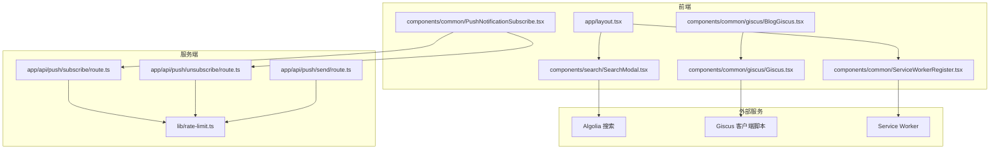
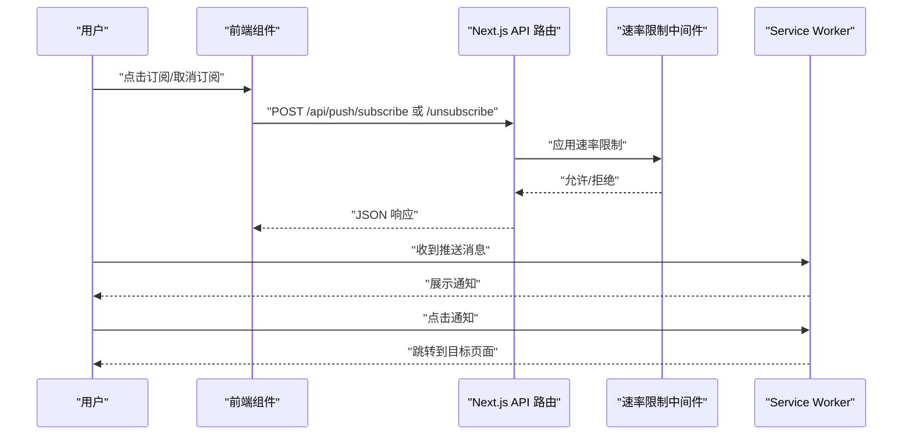
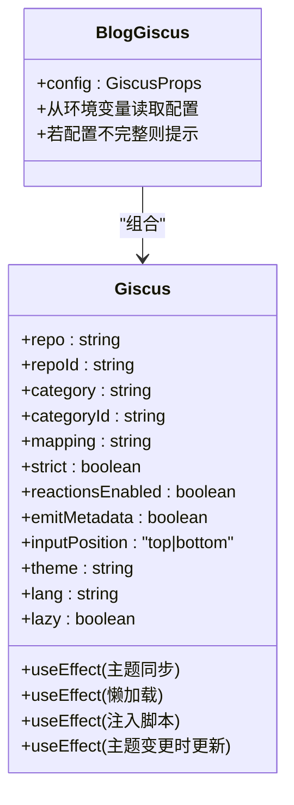
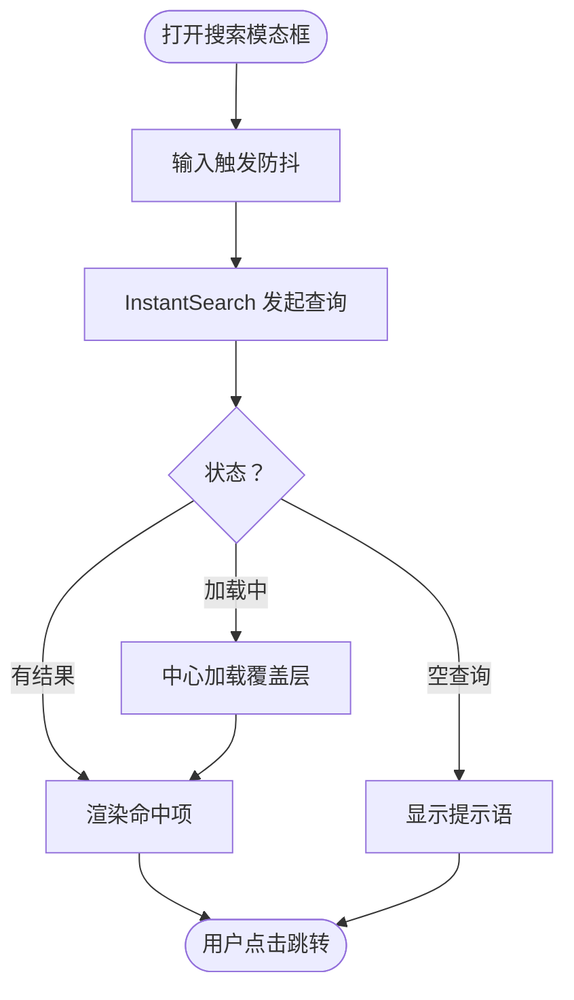
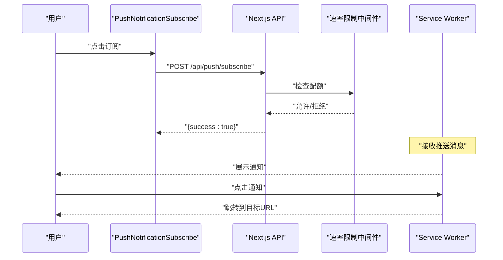
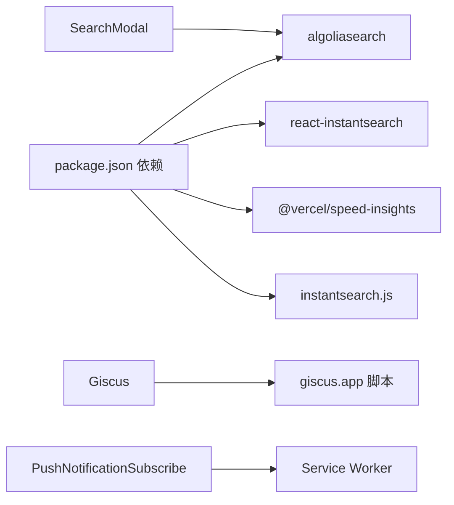

# 用户交互功能

<cite>
**本文引用的文件**
- [components/common/giscus/Giscus.tsx](file://components/common/giscus/Giscus.tsx)
- [components/common/giscus/BlogGiscus.tsx](file://components/common/giscus/BlogGiscus.tsx)
- [components/search/SearchModal.tsx](file://components/search/SearchModal.tsx)
- [lib/algolia-config.ts](file://lib/algolia-config.ts)
- [app/api/push/subscribe/route.ts](file://app/api/push/subscribe/route.ts)
- [app/api/push/unsubscribe/route.ts](file://app/api/push/unsubscribe/route.ts)
- [app/api/push/send/route.ts](file://app/api/push/send/route.ts)
- [components/common/PushNotificationSubscribe.tsx](file://components/common/PushNotificationSubscribe.tsx)
- [public/service-worker.js](file://public/service-worker.js)
- [public/sw.js](file://public/sw.js)
- [components/common/ServiceWorkerRegister.tsx](file://components/common/ServiceWorkerRegister.tsx)
- [lib/rate-limit.ts](file://lib/rate-limit.ts)
- [app/blogs/[id]/page.client.tsx](file://app/blogs/[id]/page.client.tsx)
- [app/layout.tsx](file://app/layout.tsx)
- [package.json](file://package.json)
- [docs/ALGOLIA_SETUP.md](file://docs/ALGOLIA_SETUP.md)
- [docs/ALGOLIA_README.md](file://docs/ALGOLIA_README.md)
</cite>

## 目录
1. [简介](#简介)
2. [项目结构](#项目结构)
3. [核心组件](#核心组件)
4. [架构总览](#架构总览)
5. [详细组件分析](#详细组件分析)
6. [依赖分析](#依赖分析)
7. [性能考虑](#性能考虑)
8. [故障排查指南](#故障排查指南)
9. [结论](#结论)
10. [附录](#附录)

## 简介
本章节面向“用户交互功能”的技术文档，涵盖三大核心能力：
- 评论系统：基于 Giscus 的 GitHub Discussions 集成，支持主题同步、懒加载与严格映射。
- 搜索功能：基于 Algolia 的即时搜索，提供防抖搜索框、结果展示与加载状态管理。
- 推送通知：基于浏览器 Web Push 的 PWA 通知，包含 Service Worker 注册、订阅/取消订阅与消息分发。

文档将从架构、组件设计、状态管理、性能优化、接口规范与常见问题等方面进行系统化说明，并给出来自实际代码库的实现路径与配置要点。

## 项目结构
围绕用户交互功能的关键文件组织如下：
- 评论系统：Giscus 组件封装与页面集成
- 搜索功能：SearchModal 模态框与 Algolia 客户端配置
- 推送通知：Service Worker、订阅 API 与前端订阅组件
- 基础设施：速率限制中间件与全局布局注册

图表来源
- [app/layout.tsx:64-107](file://app/layout.tsx#L64-L107)
- [components/common/ServiceWorkerRegister.tsx:1-21](file://components/common/ServiceWorkerRegister.tsx#L1-L21)
- [components/search/SearchModal.tsx:1-179](file://components/search/SearchModal.tsx#L1-L179)
- [components/common/giscus/Giscus.tsx:1-148](file://components/common/giscus/Giscus.tsx#L1-L148)
- [components/common/giscus/BlogGiscus.tsx:1-44](file://components/common/giscus/BlogGiscus.tsx#L1-L44)
- [components/common/PushNotificationSubscribe.tsx:1-79](file://components/common/PushNotificationSubscribe.tsx#L1-L79)
- [app/api/push/subscribe/route.ts:1-66](file://app/api/push/subscribe/route.ts#L1-L66)
- [app/api/push/unsubscribe/route.ts:1-33](file://app/api/push/unsubscribe/route.ts#L1-L33)
- [app/api/push/send/route.ts:1-78](file://app/api/push/send/route.ts#L1-L78)
- [lib/rate-limit.ts:1-214](file://lib/rate-limit.ts#L1-L214)

章节来源
- [app/layout.tsx:64-107](file://app/layout.tsx#L64-L107)
- [package.json:16-45](file://package.json#L16-L45)

## 核心组件
- Giscus 评论组件：负责注入 giscus.app 客户端脚本、主题同步、懒加载与配置传递。
- 搜索模态框：基于 react-instantsearch，提供防抖搜索、结果渲染与加载状态。
- Algolia 配置：读取 NEXT_PUBLIC_* 环境变量，检查配置完整性。
- 推送通知订阅组件：前端交互入口，配合服务端订阅/取消订阅 API。
- Service Worker：注册与推送处理，支持通知展示与点击跳转。
- 速率限制中间件：统一控制订阅、取消订阅与推送发送的请求频率。

章节来源
- [components/common/giscus/Giscus.tsx:21-148](file://components/common/giscus/Giscus.tsx#L21-L148)
- [components/search/SearchModal.tsx:69-179](file://components/search/SearchModal.tsx#L69-L179)
- [lib/algolia-config.ts:7-32](file://lib/algolia-config.ts#L7-L32)
- [components/common/PushNotificationSubscribe.tsx:5-79](file://components/common/PushNotificationSubscribe.tsx#L5-L79)
- [public/service-worker.js:1-131](file://public/service-worker.js#L1-L131)
- [lib/rate-limit.ts:150-197](file://lib/rate-limit.ts#L150-L197)

## 架构总览
用户交互功能由“前端组件 + 服务端 API + 外部服务”三层构成：
- 前端组件负责用户交互与状态管理；服务端 API 提供订阅、取消订阅与推送发送；外部服务包括 Algolia 搜索与 Giscus 客户端脚本。
- Service Worker 实现 PWA 推送通知的注册与消息处理。
- 速率限制中间件贯穿服务端 API，保障稳定性。

图表来源
- [components/common/PushNotificationSubscribe.tsx:9-40](file://components/common/PushNotificationSubscribe.tsx#L9-L40)
- [app/api/push/subscribe/route.ts:12-65](file://app/api/push/subscribe/route.ts#L12-L65)
- [app/api/push/unsubscribe/route.ts:11-32](file://app/api/push/unsubscribe/route.ts#L11-L32)
- [lib/rate-limit.ts:150-197](file://lib/rate-limit.ts#L150-L197)
- [public/service-worker.js:92-130](file://public/service-worker.js#L92-L130)

## 详细组件分析

### 评论系统（Giscus）
- 设计模式：函数组件 + Hooks 管理状态与副作用；通过动态注入脚本与 postMessage 通信实现第三方集成。
- 关键特性：
  - 主题同步：监听 html 根节点 class 变化，自动切换 light/dark_dimmed。
  - 懒加载：IntersectionObserver 在进入视口前延迟加载。
  - 配置项：repo/repoId/category/categoryId/mapping/strict/reactionsEnabled/emitMetadata/inputPosition/theme/lang/lazy。
- 与页面集成：BlogGiscus 从环境变量读取配置，缺失时提示配置指引。

图表来源
- [components/common/giscus/Giscus.tsx:5-19](file://components/common/giscus/Giscus.tsx#L5-L19)
- [components/common/giscus/Giscus.tsx:40-144](file://components/common/giscus/Giscus.tsx#L40-L144)
- [components/common/giscus/BlogGiscus.tsx:4-16](file://components/common/giscus/BlogGiscus.tsx#L4-L16)

章节来源
- [components/common/giscus/Giscus.tsx:21-148](file://components/common/giscus/Giscus.tsx#L21-L148)
- [components/common/giscus/BlogGiscus.tsx:1-44](file://components/common/giscus/BlogGiscus.tsx#L1-L44)

### 搜索功能（Algolia）
- 技术栈：algoliasearch + react-instantsearch。
- 关键点：
  - 防抖搜索框：debounce 延迟减少请求压力。
  - 结果渲染：Hits + Highlight/Snippet，支持空结果与加载状态。
  - 配置：从 NEXT_PUBLIC_* 环境变量读取 appId、apiKey、indexName；提供 isAlgoliaConfigured 检查。
- 与页面集成：SearchModal 作为独立组件，通过 Portal 渲染至 body，支持 ESC 关闭与键盘交互。

图表来源
- [components/search/SearchModal.tsx:23-66](file://components/search/SearchModal.tsx#L23-L66)
- [components/search/SearchModal.tsx:102-155](file://components/search/SearchModal.tsx#L102-L155)
- [lib/algolia-config.ts:7-32](file://lib/algolia-config.ts#L7-L32)

章节来源
- [components/search/SearchModal.tsx:1-179](file://components/search/SearchModal.tsx#L1-L179)
- [lib/algolia-config.ts:1-33](file://lib/algolia-config.ts#L1-L33)
- [docs/ALGOLIA_SETUP.md:1-131](file://docs/ALGOLIA_SETUP.md#L1-L131)
- [docs/ALGOLIA_README.md:85-95](file://docs/ALGOLIA_README.md#L85-L95)

### 推送通知系统（PWA）
- Service Worker 注册：RootLayout 中挂载 ServiceWorkerRegister，在浏览器支持时注册 /service-worker.js。
- 推送处理：service-worker.js 监听 push 事件展示通知，监听 notificationclick 打开目标页面。
- 订阅流程：前端 PushNotificationSubscribe 触发订阅/取消订阅；服务端 API 接收 PushSubscription 并持久化（内存）。
- 速率限制：订阅/取消订阅与发送推送均受 rateLimitMiddleware 保护。

图表来源
- [components/common/PushNotificationSubscribe.tsx:9-40](file://components/common/PushNotificationSubscribe.tsx#L9-L40)
- [app/api/push/subscribe/route.ts:12-65](file://app/api/push/subscribe/route.ts#L12-L65)
- [lib/rate-limit.ts:150-197](file://lib/rate-limit.ts#L150-L197)
- [public/service-worker.js:92-130](file://public/service-worker.js#L92-L130)

章节来源
- [components/common/ServiceWorkerRegister.tsx:1-21](file://components/common/ServiceWorkerRegister.tsx#L1-L21)
- [public/service-worker.js:1-131](file://public/service-worker.js#L1-L131)
- [components/common/PushNotificationSubscribe.tsx:1-79](file://components/common/PushNotificationSubscribe.tsx#L1-L79)
- [app/api/push/subscribe/route.ts:1-66](file://app/api/push/subscribe/route.ts#L1-L66)
- [app/api/push/unsubscribe/route.ts:1-33](file://app/api/push/unsubscribe/route.ts#L1-L33)
- [app/api/push/send/route.ts:1-78](file://app/api/push/send/route.ts#L1-L78)
- [lib/rate-limit.ts:1-214](file://lib/rate-limit.ts#L1-L214)

## 依赖分析
- 第三方库：algoliasearch、react-instantsearch、@vercel/speed-insights、instantsearch.js 等。
- 评论系统：依赖 giscus.app 客户端脚本，通过 data-* 属性传递配置。
- 搜索系统：依赖 Algolia 服务端索引，前端通过搜索 API Key 查询。
- 推送系统：依赖浏览器 Web Push API 与 Service Worker。

图表来源
- [package.json:16-45](file://package.json#L16-L45)
- [components/search/SearchModal.tsx:11-20](file://components/search/SearchModal.tsx#L11-L20)
- [components/common/giscus/Giscus.tsx:93-108](file://components/common/giscus/Giscus.tsx#L93-L108)
- [public/service-worker.js:1-131](file://public/service-worker.js#L1-L131)

章节来源
- [package.json:16-45](file://package.json#L16-L45)

## 性能考虑
- 评论系统
  - 懒加载：进入视口再注入脚本，降低首屏负担。
  - 主题同步：MutationObserver 监听根节点 class，避免重复渲染。
- 搜索系统
  - 防抖：默认 300ms，减少频繁请求。
  - 加载覆盖层：仅在首次加载且无命中时显示提示，避免闪烁。
- 推送系统
  - 速率限制：订阅/取消订阅每分钟 5 次，发送每分钟 3 次，防止滥用。
  - Service Worker：预缓存静态资源，提升离线体验。

章节来源
- [components/common/giscus/Giscus.tsx:63-84](file://components/common/giscus/Giscus.tsx#L63-L84)
- [components/search/SearchModal.tsx:23-33](file://components/search/SearchModal.tsx#L23-L33)
- [app/api/push/subscribe/route.ts:13-21](file://app/api/push/subscribe/route.ts#L13-L21)
- [app/api/push/send/route.ts:16-20](file://app/api/push/send/route.ts#L16-L20)
- [public/service-worker.js:17-27](file://public/service-worker.js#L17-L27)

## 故障排查指南
- Giscus 未显示或报错
  - 检查 NEXT_PUBLIC_GISCUS_* 环境变量是否完整。
  - 查看 BlogGiscus 是否输出配置提示。
- 搜索功能未生效
  - 确认 .env.local 中 Algolia 凭证齐全。
  - 运行数据同步脚本并将内容写入索引。
  - 检查 isAlgoliaConfigured 输出的调试信息。
- 推送通知无法订阅/发送
  - 确认 Service Worker 已注册成功。
  - 检查速率限制返回的 X-RateLimit-* 头。
  - 核对 VAPID 私钥与订阅数据格式。
- 评论主题不随系统切换
  - 确认根节点 html class 变更被监听，或手动传入 theme prop。

章节来源
- [components/common/giscus/BlogGiscus.tsx:18-36](file://components/common/giscus/BlogGiscus.tsx#L18-L36)
- [lib/algolia-config.ts:13-32](file://lib/algolia-config.ts#L13-L32)
- [docs/ALGOLIA_SETUP.md:87-102](file://docs/ALGOLIA_SETUP.md#L87-L102)
- [components/common/ServiceWorkerRegister.tsx:6-18](file://components/common/ServiceWorkerRegister.tsx#L6-L18)
- [lib/rate-limit.ts:164-189](file://lib/rate-limit.ts#L164-L189)
- [app/api/push/send/route.ts:12-14](file://app/api/push/send/route.ts#L12-L14)

## 结论
本项目在用户交互方面采用“组件 + 外部服务 + 服务端 API”的解耦架构：
- Giscus 提供即插即用的评论生态；
- Algolia 提供高性能的全文检索；
- Service Worker + Next.js API 实现可靠的推送通知。
通过懒加载、防抖、加载覆盖层与速率限制等策略，兼顾可用性与性能。建议在生产环境中：
- 使用 Redis 替代内存存储以持久化订阅；
- 为 Algolia Admin Key 设置最小权限；
- 为 Service Worker 配置 HTTPS 与正确的 MIME 类型。

## 附录

### 配置选项与参数清单
- Giscus
  - 必填：repo、repoId、categoryId
  - 可选：category、mapping、strict、reactionsEnabled、emitMetadata、inputPosition、theme、lang、lazy
- Algolia
  - NEXT_PUBLIC_ALGOLIA_APP_ID、NEXT_PUBLIC_ALGOLIA_SEARCH_API_KEY、NEXT_PUBLIC_ALGOLIA_INDEX_NAME
- 推送通知
  - VAPID 私钥（当前代码中为占位符）
  - 速率限制：订阅/取消订阅每分钟 5 次，发送每分钟 3 次

章节来源
- [components/common/giscus/Giscus.tsx:5-19](file://components/common/giscus/Giscus.tsx#L5-L19)
- [lib/algolia-config.ts:7-11](file://lib/algolia-config.ts#L7-L11)
- [app/api/push/send/route.ts:12-14](file://app/api/push/send/route.ts#L12-L14)
- [app/api/push/subscribe/route.ts:13-21](file://app/api/push/subscribe/route.ts#L13-L21)
- [app/api/push/send/route.ts:16-20](file://app/api/push/send/route.ts#L16-L20)