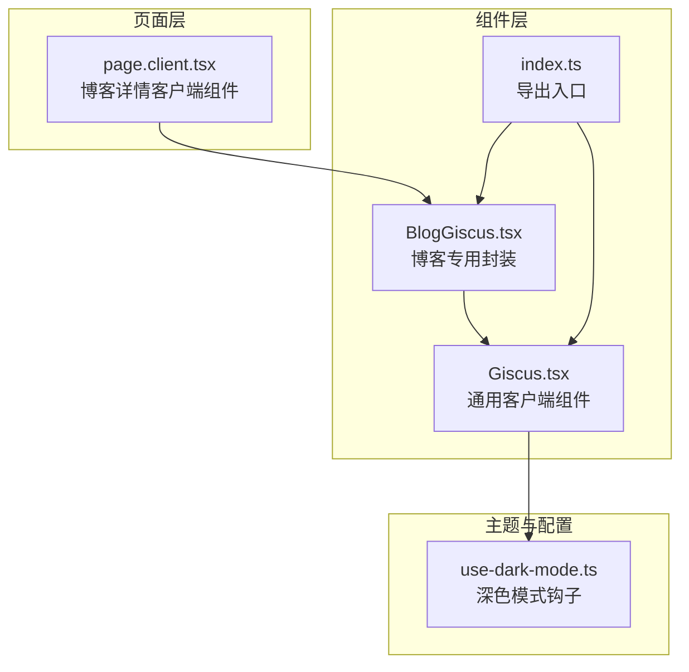
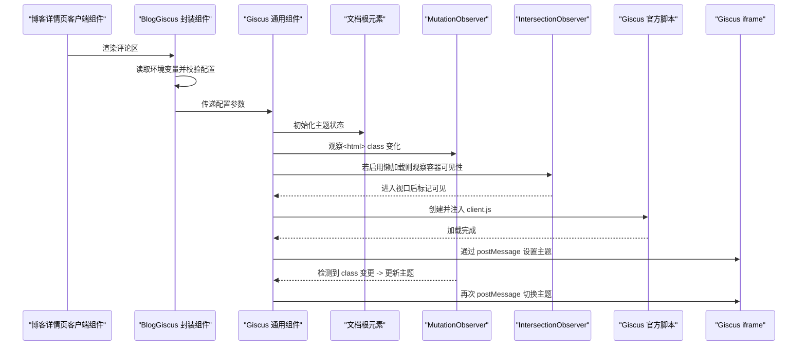
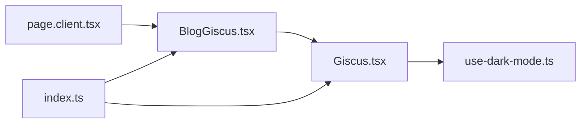

# 评论系统

<cite>
**本文引用的文件**
- [components/common/giscus/Giscus.tsx](file://components/common/giscus/Giscus.tsx)
- [components/common/giscus/BlogGiscus.tsx](file://components/common/giscus/BlogGiscus.tsx)
- [components/common/giscus/index.ts](file://components/common/giscus/index.ts)
- [app/blogs/[id]/page.client.tsx](file://app/blogs/[id]/page.client.tsx)
- [lib/use-dark-mode.ts](file://lib/use-dark-mode.ts)
- [dependency-component-analysis.md](file://dependency-component-analysis.md)
</cite>

## 目录
1. [简介](#简介)
2. [项目结构](#项目结构)
3. [核心组件](#核心组件)
4. [架构总览](#架构总览)
5. [详细组件分析](#详细组件分析)
6. [依赖关系分析](#依赖关系分析)
7. [性能考量](#性能考量)
8. [故障排查指南](#故障排查指南)
9. [结论](#结论)
10. [附录](#附录)

## 简介
本文件面向“评论系统”的技术文档，聚焦于 Giscus 评论系统的集成与实现。内容涵盖组件配置参数、主题同步机制、懒加载策略、响应式设计、评论数据映射规则、GitHub 仓库与分类管理、跨域通信（postMessage）、生命周期与内存清理、以及错误处理与性能优化建议。所有实现细节均来源于仓库中的实际代码。

## 项目结构
Giscus 评论系统在本项目中的组织方式如下：
- 组件层：提供可复用的 Giscus 客户端组件与博客专用封装组件
- 页面层：在博客详情页中引入评论组件
- 主题与环境：通过深色模式钩子与环境变量驱动主题与配置

图表来源
- [components/common/giscus/Giscus.tsx:1-148](file://components/common/giscus/Giscus.tsx#L1-L148)
- [components/common/giscus/BlogGiscus.tsx:1-44](file://components/common/giscus/BlogGiscus.tsx#L1-L44)
- [components/common/giscus/index.ts:1-3](file://components/common/giscus/index.ts#L1-L3)
- [app/blogs/[id]/page.client.tsx](file://app/blogs/[id]/page.client.tsx#L489-L493)
- [lib/use-dark-mode.ts:1-60](file://lib/use-dark-mode.ts#L1-L60)

章节来源
- [components/common/giscus/Giscus.tsx:1-148](file://components/common/giscus/Giscus.tsx#L1-L148)
- [components/common/giscus/BlogGiscus.tsx:1-44](file://components/common/giscus/BlogGiscus.tsx#L1-L44)
- [components/common/giscus/index.ts:1-3](file://components/common/giscus/index.ts#L1-L3)
- [app/blogs/[id]/page.client.tsx](file://app/blogs/[id]/page.client.tsx#L489-L493)
- [lib/use-dark-mode.ts:1-60](file://lib/use-dark-mode.ts#L1-L60)

## 核心组件
- Giscus.tsx：通用客户端组件，负责加载 Giscus 官方脚本、配置参数、主题同步、懒加载与跨域通信。
- BlogGiscus.tsx：博客专用封装，从环境变量读取配置，校验完整性并在页面中渲染 Giscus。
- index.ts：统一导出入口，便于按需导入或默认导入。
- page.client.tsx：博客详情页客户端组件，在文章底部引入评论区。
- use-dark-mode.ts：深色模式钩子，用于同步主题类名，驱动 Giscus 主题自动切换。

章节来源
- [components/common/giscus/Giscus.tsx:1-148](file://components/common/giscus/Giscus.tsx#L1-L148)
- [components/common/giscus/BlogGiscus.tsx:1-44](file://components/common/giscus/BlogGiscus.tsx#L1-L44)
- [components/common/giscus/index.ts:1-3](file://components/common/giscus/index.ts#L1-L3)
- [app/blogs/[id]/page.client.tsx](file://app/blogs/[id]/page.client.tsx#L489-L493)
- [lib/use-dark-mode.ts:1-60](file://lib/use-dark-mode.ts#L1-L60)

## 架构总览
下图展示 Giscus 在页面中的集成流程：页面客户端组件引入博客评论封装，封装组件读取环境变量并校验配置，最终由通用 Giscus 组件加载官方脚本、监听主题变化并通过 postMessage 实时更新主题。

图表来源
- [app/blogs/[id]/page.client.tsx](file://app/blogs/[id]/page.client.tsx#L489-L493)
- [components/common/giscus/BlogGiscus.tsx:1-44](file://components/common/giscus/BlogGiscus.tsx#L1-L44)
- [components/common/giscus/Giscus.tsx:40-144](file://components/common/giscus/Giscus.tsx#L40-L144)

## 详细组件分析

### Giscus.tsx 组件
- 职责与行为
  - 接收仓库、分类、映射、语言、主题、输入位置等参数
  - 基于 props 或深色模式自动选择主题
  - 使用 MutationObserver 监听文档根元素 class 变化以同步主题
  - 支持懒加载：通过 IntersectionObserver 在进入视口前不加载脚本
  - 注入 Giscus 官方脚本并设置 data-* 属性
  - 通过 postMessage 向 iframe 发送主题变更指令
  - 生命周期内清理：卸载时移除脚本节点，断开观察器

- 关键实现点
  - 主题同步：监听 document.documentElement 的 class 变更，动态计算当前主题值
  - 懒加载：设置 rootMargin 提前触发，减少首屏压力
  - 跨域通信：向 https://giscus.app 发送 postMessage 更新主题
  - 内存清理：在 effect cleanup 中断开观察器、清空容器内容

- 参数与映射规则
  - 映射字段支持多种模式，如 pathname、url、title、og:title、specific、number
  - 严格模式与反应表情、元数据发送、输入位置等均可配置

- 错误处理与健壮性
  - 当容器不存在或不可见时跳过脚本注入
  - 主题更新时先查询 iframe，再发送消息，避免空引用

章节来源
- [components/common/giscus/Giscus.tsx:1-148](file://components/common/giscus/Giscus.tsx#L1-L148)

### BlogGiscus.tsx 组件
- 职责与行为
  - 从 NEXT_PUBLIC_* 环境变量读取仓库、分类 ID 等关键配置
  - 校验配置完整性：若缺少必要项则提示配置指引
  - 将默认配置（如映射、严格模式、反应表情、语言等）传给 Giscus

- 配置要点
  - 映射采用 pathname
  - 严格模式开启，确保标题匹配
  - 输入位置设为顶部
  - 语言为 zh-CN

- 与页面集成
  - 在博客详情页客户端组件中引入，作为评论区容器

章节来源
- [components/common/giscus/BlogGiscus.tsx:1-44](file://components/common/giscus/BlogGiscus.tsx#L1-L44)
- [app/blogs/[id]/page.client.tsx](file://app/blogs/[id]/page.client.tsx#L489-L493)

### 主题同步与深色模式
- 主题来源优先级
  - 若外部传入 theme，则使用该值
  - 否则根据 document.documentElement 是否包含 'dark' 类判断深浅主题
- 同步机制
  - 使用 MutationObserver 监听根元素 class 变化
  - use-dark-mode.ts 负责在切换深色模式时同步根元素 class
- 主题切换流程
  - 主题变化 -> 更新内部状态 -> 通过 postMessage 通知 iframe

章节来源
- [components/common/giscus/Giscus.tsx:40-61](file://components/common/giscus/Giscus.tsx#L40-L61)
- [lib/use-dark-mode.ts:1-60](file://lib/use-dark-mode.ts#L1-L60)

### 懒加载策略
- 触发条件
  - 组件启用 lazy 且当前不可见
- 观察方式
  - 使用 IntersectionObserver，rootMargin 提前 200px 开始加载
- 生命周期
  - 进入视口后标记可见并断开观察器
  - 注入脚本后不再重复加载

章节来源
- [components/common/giscus/Giscus.tsx:63-84](file://components/common/giscus/Giscus.tsx#L63-L84)

### 响应式设计与布局
- 评论区容器采用语义化 div 并保留 className 以便样式扩展
- 输入位置可选顶部或底部，满足不同页面布局需求
- 与页面整体布局（目录、正文、侧栏）配合良好

章节来源
- [components/common/giscus/Giscus.tsx:1-148](file://components/common/giscus/Giscus.tsx#L1-L148)
- [app/blogs/[id]/page.client.tsx](file://app/blogs/[id]/page.client.tsx#L489-L493)

### 数据映射与 GitHub 分类管理
- 映射规则
  - 支持 pathname、url、title、og:title、specific、number 等映射键
  - 严格模式要求标题完全匹配，提升评论归属准确性
- 分类管理
  - 通过 repo、repoId、category、categoryId 与 GitHub Discussions 对接
  - 术语 term 可选，用于进一步限定讨论话题

章节来源
- [components/common/giscus/Giscus.tsx:5-19](file://components/common/giscus/Giscus.tsx#L5-L19)
- [components/common/giscus/BlogGiscus.tsx:5-16](file://components/common/giscus/BlogGiscus.tsx#L5-L16)

### 跨域通信（postMessage）
- 通信目标
  - https://giscus.app
- 通信内容
  - { giscus: { setConfig: { theme } } }
- 触发时机
  - 主题状态变化且 iframe 存在时

章节来源
- [components/common/giscus/Giscus.tsx:133-144](file://components/common/giscus/Giscus.tsx#L133-L144)

### 组件生命周期与内存清理
- 生命周期
  - 初始化：设置初始主题、建立观察器
  - 可见性：懒加载时等待 IntersectionObserver
  - 注入：创建并挂载脚本节点
  - 更新：主题变化时发送 postMessage
  - 卸载：断开观察器、清空容器内容
- 清理要点
  - 断开 MutationObserver 与 IntersectionObserver
  - 移除脚本节点，避免内存泄漏

章节来源
- [components/common/giscus/Giscus.tsx:40-144](file://components/common/giscus/Giscus.tsx#L40-L144)

## 依赖关系分析
- 组件依赖
  - page.client.tsx 依赖 BlogGiscus
  - BlogGiscus 依赖 Giscus
  - Giscus 依赖 use-dark-mode（通过根元素 class 同步主题）
- 导出与使用
  - index.ts 统一导出默认 BlogGiscus 与具名 Giscus
- 组件使用情况
  - Giscus 在博客详情页客户端组件中被使用

图表来源
- [app/blogs/[id]/page.client.tsx](file://app/blogs/[id]/page.client.tsx#L489-L493)
- [components/common/giscus/BlogGiscus.tsx:1-44](file://components/common/giscus/BlogGiscus.tsx#L1-L44)
- [components/common/giscus/Giscus.tsx:1-148](file://components/common/giscus/Giscus.tsx#L1-L148)
- [lib/use-dark-mode.ts:1-60](file://lib/use-dark-mode.ts#L1-L60)
- [components/common/giscus/index.ts:1-3](file://components/common/giscus/index.ts#L1-L3)

章节来源
- [dependency-component-analysis.md:58-58](file://dependency-component-analysis.md#L58-L58)
- [components/common/giscus/index.ts:1-3](file://components/common/giscus/index.ts#L1-L3)

## 性能考量
- 懒加载
  - IntersectionObserver 提前 200px 触发，降低首屏脚本加载压力
- 脚本注入
  - 异步加载，避免阻塞主线程
- 主题切换
  - 仅在主题变化时发送 postMessage，减少不必要的通信
- DOM 清理
  - 卸载时断开观察器与移除脚本，防止内存泄漏

章节来源
- [components/common/giscus/Giscus.tsx:63-84](file://components/common/giscus/Giscus.tsx#L63-L84)
- [components/common/giscus/Giscus.tsx:86-144](file://components/common/giscus/Giscus.tsx#L86-L144)

## 故障排查指南
- 配置缺失
  - 症状：显示配置提示而非评论区
  - 处理：检查 NEXT_PUBLIC_GISCUS_REPO、NEXT_PUBLIC_GISCUS_REPO_ID、NEXT_PUBLIC_GISCUS_CATEGORY_ID 是否正确设置
- 主题不生效
  - 症状：深色模式切换后评论区主题未更新
  - 处理：确认根元素 class 是否正确切换；检查 MutationObserver 是否正常工作；确认 postMessage 是否成功
- 懒加载无效
  - 症状：滚动到评论区仍不加载
  - 处理：检查容器是否正确挂载；确认 IntersectionObserver 的 rootMargin 设置；验证容器可见性
- 跨域通信失败
  - 症状：主题切换无响应
  - 处理：确认 iframe 已加载；检查 postMessage 目标源；确保主题状态已更新

章节来源
- [components/common/giscus/BlogGiscus.tsx:18-36](file://components/common/giscus/BlogGiscus.tsx#L18-L36)
- [components/common/giscus/Giscus.tsx:40-144](file://components/common/giscus/Giscus.tsx#L40-L144)

## 结论
本项目对 Giscus 评论系统的集成实现了以下关键能力：
- 通过 BlogGiscus 封装统一读取环境变量并进行配置校验
- 通过 Giscus 组件完成脚本注入、主题同步、懒加载与跨域通信
- 与深色模式钩子协同，实现自动主题切换
- 具备完善的生命周期管理与内存清理，保证运行时稳定性
- 面向生产环境提供了良好的性能与可维护性

## 附录

### 配置参数一览（来自 GiscusProps）
- 仓库与分类
  - repo、repoId、category、categoryId
- 映射与术语
  - mapping（支持 pathname/url/title/og:title/specific/number）、term
- 行为控制
  - strict、reactionsEnabled、emitMetadata、inputPosition
- 主题与语言
  - theme（可选，外部传入）、lang（默认 zh-CN）
- 懒加载
  - lazy（默认 false）

章节来源
- [components/common/giscus/Giscus.tsx:5-19](file://components/common/giscus/Giscus.tsx#L5-L19)

### 配置示例（来自 BlogGiscus）
- 仓库与分类
  - repo、repoId、category、categoryId
- 默认行为
  - mapping: 'pathname'
  - strict: true
  - reactionsEnabled: true
  - emitMetadata: false
  - inputPosition: 'top'
  - lang: 'zh-CN'

章节来源
- [components/common/giscus/BlogGiscus.tsx:5-16](file://components/common/giscus/BlogGiscus.tsx#L5-L16)

### 主题切换实现要点
- 主题来源优先级：外部 theme > 深色模式检测
- 同步机制：MutationObserver 监听根元素 class
- 切换触发：postMessage 向 iframe 发送 setConfig

章节来源
- [components/common/giscus/Giscus.tsx:40-61](file://components/common/giscus/Giscus.tsx#L40-L61)
- [components/common/giscus/Giscus.tsx:133-144](file://components/common/giscus/Giscus.tsx#L133-L144)
- [lib/use-dark-mode.ts:1-60](file://lib/use-dark-mode.ts#L1-L60)

### 性能优化技巧
- 合理设置懒加载阈值（当前为 200px 提前触发）
- 控制评论区数量与复杂度，避免大量 DOM
- 避免频繁主题切换，减少 postMessage 次数
- 在 SSR/CSR 边界明确评论区渲染时机，减少水合成本

章节来源
- [components/common/giscus/Giscus.tsx:63-84](file://components/common/giscus/Giscus.tsx#L63-L84)
- [components/common/giscus/Giscus.tsx:86-144](file://components/common/giscus/Giscus.tsx#L86-L144)