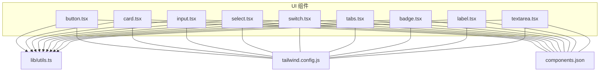
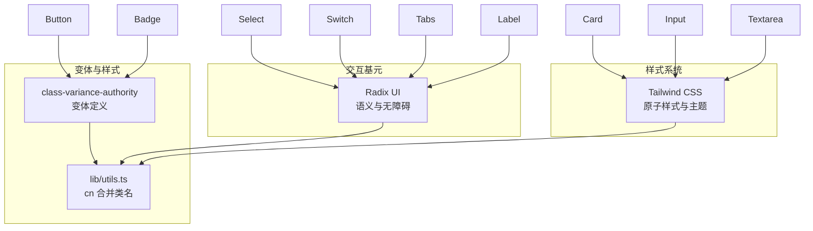
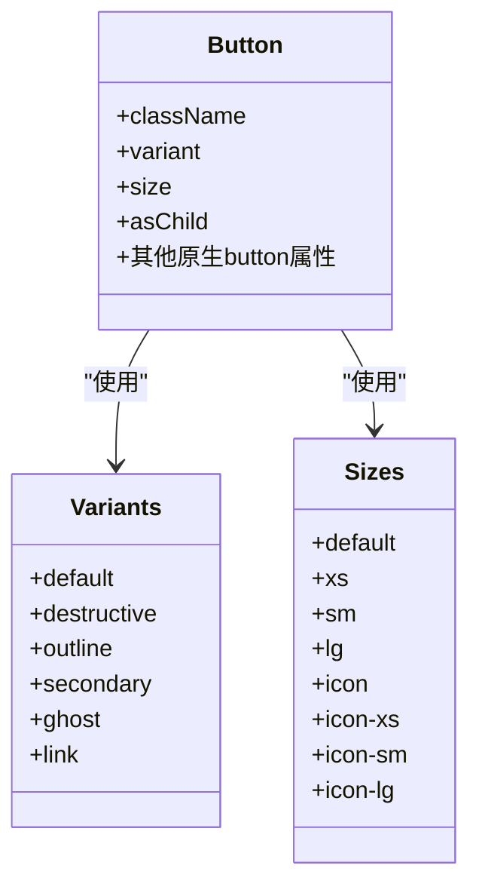
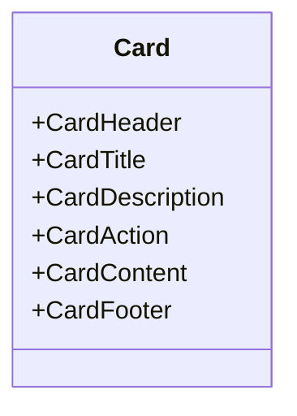
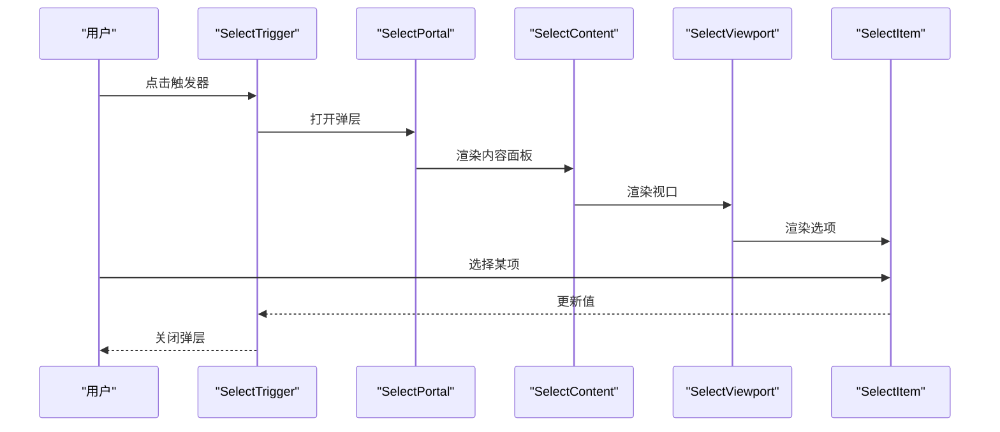
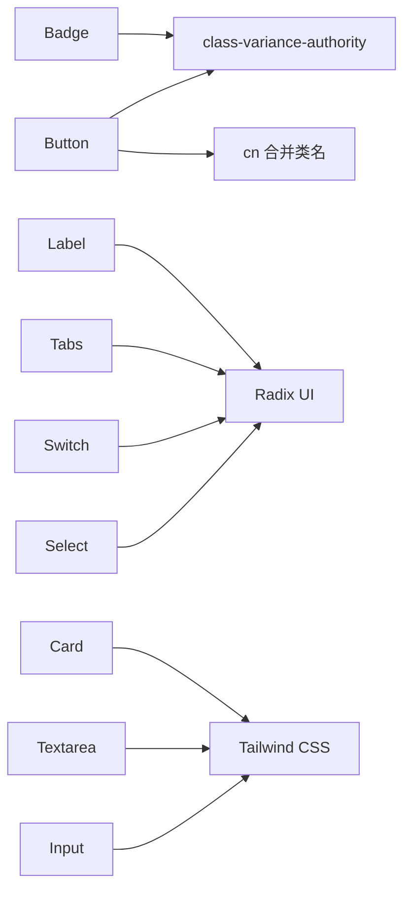

# UI 组件库

<cite>
**本文引用的文件**
- [button.tsx](file://components/common/ui/button.tsx)
- [card.tsx](file://components/common/ui/card.tsx)
- [input.tsx](file://components/common/ui/input.tsx)
- [select.tsx](file://components/common/ui/select.tsx)
- [switch.tsx](file://components/common/ui/switch.tsx)
- [tabs.tsx](file://components/common/ui/tabs.tsx)
- [badge.tsx](file://components/common/ui/badge.tsx)
- [label.tsx](file://components/common/ui/label.tsx)
- [textarea.tsx](file://components/common/ui/textarea.tsx)
- [utils.ts](file://lib/utils.ts)
- [tailwind.config.js](file://tailwind.config.js)
- [components.json](file://components.json)
- [alert-dialog.tsx](file://components/unused/alert-dialog.tsx)
</cite>

## 目录
1. [简介](#简介)
2. [项目结构](#项目结构)
3. [核心组件](#核心组件)
4. [架构总览](#架构总览)
5. [详细组件分析](#详细组件分析)
6. [依赖关系分析](#依赖关系分析)
7. [性能考量](#性能考量)
8. [无障碍与响应式支持](#无障碍与响应式支持)
9. [使用示例与最佳实践](#使用示例与最佳实践)
10. [故障排查指南](#故障排查指南)
11. [结论](#结论)
12. [附录](#附录)

## 简介
本文件系统性梳理博客系统中的 UI 组件库，基于 shadcn/ui 设计体系与 Tailwind CSS 实现，覆盖按钮、卡片、输入框、选择器、开关、标签页、徽章、标签、文本域等基础组件。文档重点说明各组件的属性接口、样式变体、尺寸选项、主题定制方法，并提供无障碍访问、响应式行为与动画效果说明，以及组件组合使用场景与与 Tailwind CSS 的集成方式。

## 项目结构
UI 组件集中于 components/common/ui 目录，采用“按功能模块化”的组织方式，每个组件独立文件，便于复用与维护。工具函数 cn 负责类名合并与冲突修复；Tailwind 配置定义了站点级设计系统；components.json 提供 shadcn/ui 的配置别名与注册路径。

**图表来源**
- [button.tsx:1-65](file://components/common/ui/button.tsx#L1-L65)
- [card.tsx:1-93](file://components/common/ui/card.tsx#L1-L93)
- [input.tsx:1-22](file://components/common/ui/input.tsx#L1-L22)
- [select.tsx:1-191](file://components/common/ui/select.tsx#L1-L191)
- [switch.tsx:1-36](file://components/common/ui/switch.tsx#L1-L36)
- [tabs.tsx:1-92](file://components/common/ui/tabs.tsx#L1-L92)
- [badge.tsx:1-49](file://components/common/ui/badge.tsx#L1-L49)
- [label.tsx:1-25](file://components/common/ui/label.tsx#L1-L25)
- [textarea.tsx:1-19](file://components/common/ui/textarea.tsx#L1-L19)
- [utils.ts:1-12](file://lib/utils.ts#L1-L12)
- [tailwind.config.js:1-22](file://tailwind.config.js#L1-L22)
- [components.json:1-24](file://components.json#L1-L24)

**章节来源**
- [tailwind.config.js:1-22](file://tailwind.config.js#L1-L22)
- [components.json:1-24](file://components.json#L1-L24)

## 核心组件
本节概述各组件的职责与共性特征：
- 按钮（Button）：支持多种变体与尺寸，可透传原生 button 属性，支持 asChild 渲染为任意元素。
- 卡片（Card）：提供卡片容器及头部/标题/描述/内容/操作/底部等子组件，便于布局组合。
- 输入框（Input）：统一边框、聚焦环、禁用态与无效态样式，适配表单场景。
- 选择器（Select）：基于 Radix UI，提供触发器、内容面板、滚动按钮、分组、标签、项与分隔符。
- 开关（Switch）：基于 Radix UI，支持尺寸控制与状态切换动画。
- 标签页（Tabs）：支持水平/垂直方向，列表支持默认/线状两种变体，触发器与内容区分离。
- 徽章（Badge）：强调性标签，支持多种变体与 asChild。
- 标签（Label）：基于 Radix UI Label，用于表单控件关联标签。
- 文本域（Textarea）：多行输入，统一边框、聚焦环、禁用态与无效态样式。

**章节来源**
- [button.tsx:1-65](file://components/common/ui/button.tsx#L1-L65)
- [card.tsx:1-93](file://components/common/ui/card.tsx#L1-L93)
- [input.tsx:1-22](file://components/common/ui/input.tsx#L1-L22)
- [select.tsx:1-191](file://components/common/ui/select.tsx#L1-L191)
- [switch.tsx:1-36](file://components/common/ui/switch.tsx#L1-L36)
- [tabs.tsx:1-92](file://components/common/ui/tabs.tsx#L1-L92)
- [badge.tsx:1-49](file://components/common/ui/badge.tsx#L1-L49)
- [label.tsx:1-25](file://components/common/ui/label.tsx#L1-L25)
- [textarea.tsx:1-19](file://components/common/ui/textarea.tsx#L1-L19)

## 架构总览
组件库采用“原子化样式 + 变体系统 + 原子组件”架构：
- 使用 class-variance-authority 定义变体与默认值，确保一致的视觉与交互。
- 使用 radix-ui 提供无障碍与语义化的交互基元。
- 使用 Tailwind CSS 提供原子化样式与主题扩展。
- 使用 cn 工具函数进行类名合并与冲突修复。

**图表来源**
- [button.tsx:7-39](file://components/common/ui/button.tsx#L7-L39)
- [badge.tsx:7-27](file://components/common/ui/badge.tsx#L7-L27)
- [tabs.tsx:28-41](file://components/common/ui/tabs.tsx#L28-L41)
- [utils.ts:9-11](file://lib/utils.ts#L9-L11)
- [select.tsx:1-191](file://components/common/ui/select.tsx#L1-L191)
- [switch.tsx:1-36](file://components/common/ui/switch.tsx#L1-L36)
- [tabs.tsx:1-92](file://components/common/ui/tabs.tsx#L1-L92)
- [label.tsx:1-25](file://components/common/ui/label.tsx#L1-L25)
- [tailwind.config.js:7-18](file://tailwind.config.js#L7-L18)

## 详细组件分析

### 按钮（Button）
- 属性接口
  - className: 自定义类名
  - variant: 变体（default、destructive、outline、secondary、ghost、link）
  - size: 尺寸（default、xs、sm、lg、icon、icon-xs、icon-sm、icon-lg）
  - asChild: 是否渲染为子元素（Slot.Root）
  - 其余继承自原生 button
- 样式变体
  - 默认背景色与悬停透明度变化；破坏性按钮强调危险动作；轮廓与次级按钮强调层级区分；幽灵与链接按钮强调轻量与可点击性。
- 尺寸选项
  - 数值高度与内边距组合，图标尺寸与间距随尺寸调整；icon 系列提供方形尺寸。
- 主题定制
  - 通过 Tailwind 主题 colors 扩展与 css 变量覆盖实现；支持暗色模式下的边框与环颜色差异。
- 无障碍与交互
  - 支持焦点可见边框与环；禁用态禁用事件与降低不透明度；无效态使用破坏性边框与环。
- 使用建议
  - 优先使用 outline 或 secondary 表示次要操作；destructive 仅用于危险操作；icon 仅在空间受限时使用。

**图表来源**
- [button.tsx:41-62](file://components/common/ui/button.tsx#L41-L62)

**章节来源**
- [button.tsx:1-65](file://components/common/ui/button.tsx#L1-L65)

### 卡片（Card）
- 子组件
  - CardHeader/CardTitle/CardDescription/CardAction/CardContent/CardFooter
- 布局特性
  - 头部支持网格布局与操作区对齐；内容区与底部区提供统一内边距与分隔线支持。
- 主题定制
  - 通过 card、muted、border 等 Tailwind 颜色变量控制背景与边框。
- 最佳实践
  - 使用 CardHeader 与 CardTitle 组合展示标题与辅助操作；CardDescription 用于简短说明；CardFooter 用于底部操作或统计信息。

**图表来源**
- [card.tsx:5-82](file://components/common/ui/card.tsx#L5-L82)

**章节来源**
- [card.tsx:1-93](file://components/common/ui/card.tsx#L1-L93)

### 输入框（Input）
- 样式要点
  - 边框、背景、占位符、选中态、禁用态与无效态统一处理；聚焦时显示 ring 边框与环。
- 主题定制
  - 通过 input、muted-foreground、primary 等颜色变量与暗色模式背景变量控制。
- 最佳实践
  - 与 Label 组合使用；在表单中配合错误提示与验证反馈。

**章节来源**
- [input.tsx:1-22](file://components/common/ui/input.tsx#L1-L22)

### 选择器（Select）
- 结构组成
  - Select/SelectTrigger/SelectValue/SelectContent/SelectPortal/SelectViewport/SelectItem/SelectLabel/SelectSeparator/SelectScrollUpButton/SelectScrollDownButton
- 交互与动画
  - 支持弹出位置与对齐；打开/关闭时提供淡入/淡出与缩放动画；滚动按钮支持上下滚动。
- 尺寸
  - 触发器支持 sm/default 两种尺寸。
- 主题定制
  - 通过 popover、border、accent 等颜色变量控制背景与高亮。
- 最佳实践
  - 大量选项时启用滚动按钮；分组与分隔符提升可读性；与表单校验结合使用。

**图表来源**
- [select.tsx:9-88](file://components/common/ui/select.tsx#L9-L88)

**章节来源**
- [select.tsx:1-191](file://components/common/ui/select.tsx#L1-L191)

### 开关（Switch）
- 特性
  - 支持 sm/default 两种尺寸；状态切换时提供平滑位移动画；聚焦时显示 ring。
- 主题定制
  - 通过 input、primary 等颜色变量控制未选中与选中态背景。
- 最佳实践
  - 用于布尔型设置项；与 Label 组合使用以明确语义。

**章节来源**
- [switch.tsx:1-36](file://components/common/ui/switch.tsx#L1-L36)

### 标签页（Tabs）
- 方向与变体
  - 支持 horizontal/vertical；TabsList 支持 default 与 line 两种变体；line 变体强调无背景与线条指示。
- 交互
  - 触发器激活态显示指示线；支持键盘导航与无障碍标签。
- 主题定制
  - 通过 muted、background、foreground、input 等颜色变量控制背景与边框。
- 最佳实践
  - 使用 line 变体减少视觉重量；垂直布局适合侧边导航。

**章节来源**
- [tabs.tsx:1-92](file://components/common/ui/tabs.tsx#L1-L92)

### 徽章（Badge）
- 变体
  - default、secondary、destructive、outline、ghost、link；支持链接变体的悬停效果。
- 最佳实践
  - 用于状态标识、标签分类；避免过度使用以免造成视觉噪音。

**章节来源**
- [badge.tsx:1-49](file://components/common/ui/badge.tsx#L1-L49)

### 标签（Label）
- 特性
  - 基于 Radix UI Label，支持禁用态与 peer 状态联动；与表单控件配合使用。
- 最佳实践
  - 与 Input/Select/Switch 等控件关联，提升可点击区域与可访问性。

**章节来源**
- [label.tsx:1-25](file://components/common/ui/label.tsx#L1-L25)

### 文本域（Textarea）
- 样式要点
  - 统一边框、背景、占位符、选中态、禁用态与无效态；聚焦时显示 ring 边框与环。
- 最佳实践
  - 与表单校验结合；在移动端注意自动调整高度与键盘遮挡问题。

**章节来源**
- [textarea.tsx:1-19](file://components/common/ui/textarea.tsx#L1-L19)

## 依赖关系分析
- 组件间耦合
  - 各组件低耦合，通过共享工具函数 cn 与主题变量保持一致性。
- 外部依赖
  - class-variance-authority：变体系统
  - radix-ui：无障碍与语义化交互
  - lucide：图标库
  - tailwind-merge/clsx：类名合并与冲突修复
- 集成点
  - components.json 中的别名与注册路径确保组件导入的一致性。

**图表来源**
- [button.tsx:1-6](file://components/common/ui/button.tsx#L1-L6)
- [select.tsx:1-7](file://components/common/ui/select.tsx#L1-L7)
- [switch.tsx:1-6](file://components/common/ui/switch.tsx#L1-L6)
- [tabs.tsx:1-7](file://components/common/ui/tabs.tsx#L1-L7)
- [input.tsx:1-3](file://components/common/ui/input.tsx#L1-L3)
- [textarea.tsx:1-3](file://components/common/ui/textarea.tsx#L1-L3)
- [card.tsx:1-3](file://components/common/ui/card.tsx#L1-L3)
- [badge.tsx:1-5](file://components/common/ui/badge.tsx#L1-L5)
- [label.tsx:1-4](file://components/common/ui/label.tsx#L1-L4)
- [utils.ts:6-11](file://lib/utils.ts#L6-L11)
- [components.json:15-22](file://components.json#L15-L22)

**章节来源**
- [utils.ts:1-12](file://lib/utils.ts#L1-L12)
- [components.json:1-24](file://components.json#L1-L24)

## 性能考量
- 类名合并优化：使用 twMerge 与 clsx 合并类名，避免重复与冲突，减少样式计算成本。
- 变体系统：通过 cva 定义有限变体，避免运行时动态拼接复杂样式字符串。
- 动画与过渡：选择器与标签页的动画采用 CSS 过渡与淡入淡出，尽量避免昂贵的重排与重绘。
- 按需加载：Radix UI 组件按需渲染，减少初始包体积。

## 无障碍与响应式支持
- 无障碍
  - 使用 Radix UI 提供的语义化标签与键盘导航；焦点可见边框与环增强可访问性；禁用态与无效态明确状态。
- 响应式
  - 组件广泛使用 Tailwind 响应式前缀与容器查询，适配不同屏幕尺寸。
- 动画效果
  - 选择器与标签页提供打开/关闭动画；开关提供平滑位移动画；按钮提供过渡动效。

## 使用示例与最佳实践
- 组合场景
  - 表单：Label + Input/Textarea + Button（提交/重置）
  - 下拉筛选：Label + Select（多选项分组与分隔符）
  - 设置面板：Switch + Badge（状态标识）
  - 内容分区：Card（头部/标题/描述/内容/底部）
  - 导航：Tabs（水平/垂直，line 变体）
- 最佳实践
  - 保持视觉一致性：统一使用组件库提供的变体与尺寸。
  - 明确语义：与 Label 关联控件，提供清晰的错误提示。
  - 控制密度：避免在同一区域堆叠过多组件，合理使用间距与留白。
  - 主题适配：通过 Tailwind 主题扩展与 css 变量覆盖实现品牌化定制。

**章节来源**
- [alert-dialog.tsx:1-10](file://components/unused/alert-dialog.tsx#L1-L10)

## 故障排查指南
- 类名冲突
  - 症状：样式异常或覆盖不生效
  - 排查：检查是否正确引入 cn；确认 tailwind.config.js 的 content 路径包含组件目录
- 变体不生效
  - 症状：指定 variant/size 未生效
  - 排查：确认 cva 默认值与传参顺序；检查 Tailwind 主题颜色变量
- 交互异常
  - 症状：Select/Tabs/Switch 无法正常切换
  - 排查：确认为客户端组件；检查 Radix UI 的 Portal 渲染与数据槽属性
- 无效态样式
  - 症状：aria-invalid 未显示破坏性样式
  - 排查：确认表单控件的 aria-invalid 属性与暗色模式下的 ring 颜色变量

**章节来源**
- [button.tsx:7-39](file://components/common/ui/button.tsx#L7-L39)
- [input.tsx:10-15](file://components/common/ui/input.tsx#L10-L15)
- [textarea.tsx:9-12](file://components/common/ui/textarea.tsx#L9-L12)
- [select.tsx:39-42](file://components/common/ui/select.tsx#L39-L42)
- [switch.tsx:19-22](file://components/common/ui/switch.tsx#L19-L22)
- [tabs.tsx:67-72](file://components/common/ui/tabs.tsx#L67-L72)
- [tailwind.config.js:3-6](file://tailwind.config.js#L3-L6)

## 结论
该 UI 组件库以 shadcn/ui 为基础，结合 Radix UI 与 Tailwind CSS，提供了高可访问性、可定制与高性能的基础组件集。通过变体系统与统一工具函数，确保在不同页面与场景下保持一致的视觉与交互体验。建议在实际项目中遵循组件组合与主题扩展的最佳实践，持续优化可访问性与响应式表现。

## 附录
- Tailwind 配置要点
  - content 包含 app 与 components 目录，确保样式扫描与摇树优化
  - 主题扩展 colors 与字体族定义站点级设计系统
- 组件别名与注册
  - components.json 中 aliases 指定 @/components、@/lib/utils、@/components/common/ui 等路径，便于全局导入与维护

**章节来源**
- [tailwind.config.js:3-18](file://tailwind.config.js#L3-L18)
- [components.json:15-22](file://components.json#L15-L22)