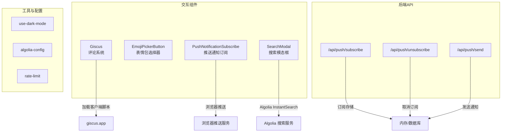
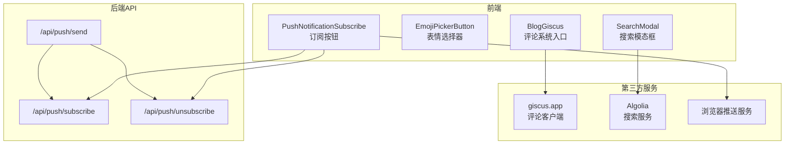
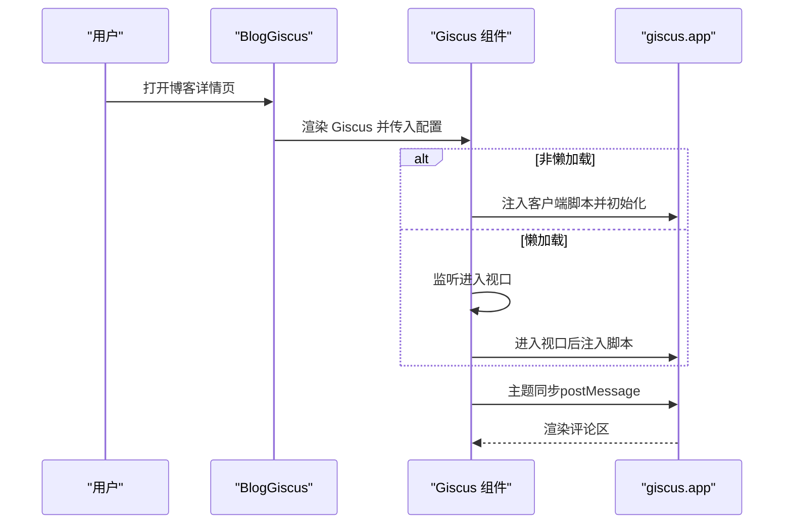
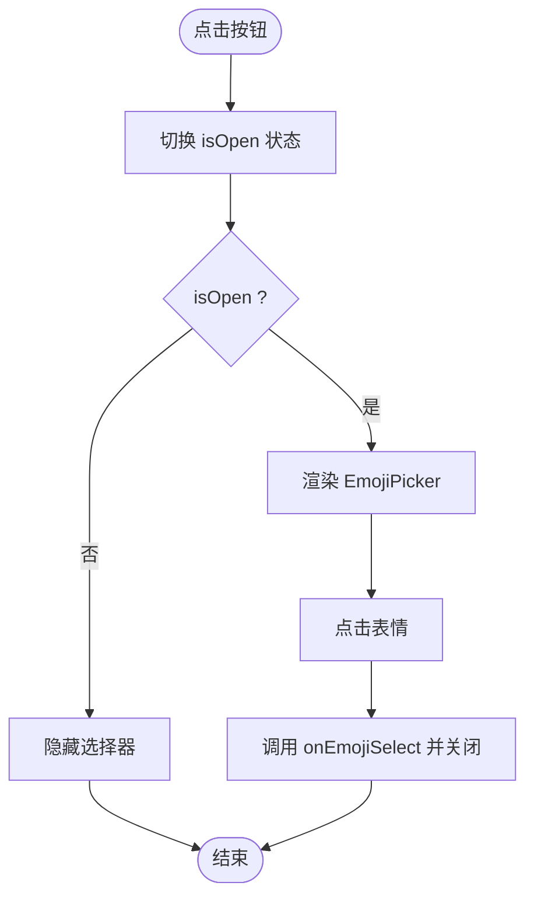
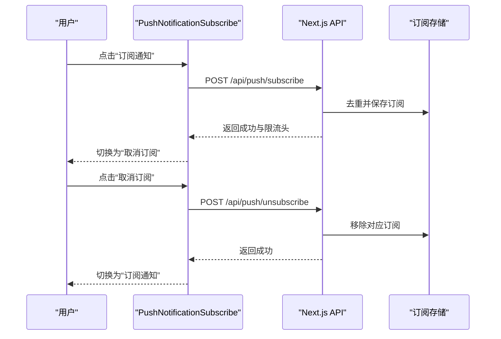
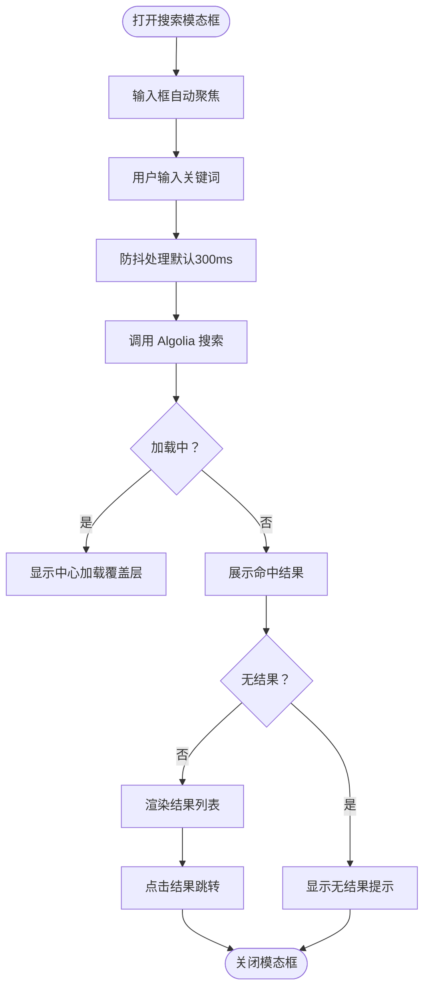

# 交互功能组件

<cite>
**本文引用的文件**
- [components/common/giscus/Giscus.tsx](file://components/common/giscus/Giscus.tsx)
- [components/common/giscus/BlogGiscus.tsx](file://components/common/giscus/BlogGiscus.tsx)
- [components/common/giscus/index.ts](file://components/common/giscus/index.ts)
- [components/common/emoji/EmojiPickerButton.tsx](file://components/common/emoji/EmojiPickerButton.tsx)
- [components/common/PushNotificationSubscribe.tsx](file://components/common/PushNotificationSubscribe.tsx)
- [components/search/SearchModal.tsx](file://components/search/SearchModal.tsx)
- [components/search/SearchModal.module.css](file://components/search/SearchModal.module.css)
- [app/api/push/subscribe/route.ts](file://app/api/push/subscribe/route.ts)
- [app/api/push/unsubscribe/route.ts](file://app/api/push/unsubscribe/route.ts)
- [app/api/push/send/route.ts](file://app/api/push/send/route.ts)
- [lib/use-dark-mode.ts](file://lib/use-dark-mode.ts)
- [lib/algolia-config.ts](file://lib/algolia-config.ts)
- [lib/rate-limit.ts](file://lib/rate-limit.ts)
- [package.json](file://package.json)
</cite>

## 目录
1. [简介](#简介)
2. [项目结构](#项目结构)
3. [核心组件](#核心组件)
4. [架构总览](#架构总览)
5. [详细组件分析](#详细组件分析)
6. [依赖分析](#依赖分析)
7. [性能考量](#性能考量)
8. [故障排查指南](#故障排查指南)
9. [结论](#结论)
10. [附录](#附录)

## 简介
本文件聚焦博客系统的交互功能组件，包括评论系统（Giscus）、表情包选择器、推送通知订阅、搜索模态框等，旨在帮助开发者快速理解各组件的集成方式、配置参数、用户交互流程及第三方服务集成细节。文档同时涵盖安全考虑、错误处理与性能优化策略，并说明响应式设计、无障碍访问支持与跨平台兼容性。

## 项目结构
交互功能组件主要分布在以下位置：
- 评论系统：components/common/giscus
- 表情包选择器：components/common/emoji
- 推送通知：components/common 与 app/api/push
- 搜索模态框：components/search
- 工具与配置：lib

图表来源
- [components/common/giscus/Giscus.tsx:1-148](file://components/common/giscus/Giscus.tsx#L1-L148)
- [components/common/emoji/EmojiPickerButton.tsx:1-59](file://components/common/emoji/EmojiPickerButton.tsx#L1-L59)
- [components/common/PushNotificationSubscribe.tsx:1-79](file://components/common/PushNotificationSubscribe.tsx#L1-L79)
- [components/search/SearchModal.tsx:1-179](file://components/search/SearchModal.tsx#L1-L179)
- [app/api/push/subscribe/route.ts:1-66](file://app/api/push/subscribe/route.ts#L1-L66)
- [app/api/push/unsubscribe/route.ts:1-33](file://app/api/push/unsubscribe/route.ts#L1-L33)
- [app/api/push/send/route.ts:1-78](file://app/api/push/send/route.ts#L1-L78)
- [lib/algolia-config.ts:1-33](file://lib/algolia-config.ts#L1-L33)
- [lib/use-dark-mode.ts:1-60](file://lib/use-dark-mode.ts#L1-L60)
- [lib/rate-limit.ts:1-214](file://lib/rate-limit.ts#L1-L214)

章节来源
- [components/common/giscus/Giscus.tsx:1-148](file://components/common/giscus/Giscus.tsx#L1-L148)
- [components/common/emoji/EmojiPickerButton.tsx:1-59](file://components/common/emoji/EmojiPickerButton.tsx#L1-L59)
- [components/common/PushNotificationSubscribe.tsx:1-79](file://components/common/PushNotificationSubscribe.tsx#L1-L79)
- [components/search/SearchModal.tsx:1-179](file://components/search/SearchModal.tsx#L1-L179)
- [app/api/push/subscribe/route.ts:1-66](file://app/api/push/subscribe/route.ts#L1-L66)
- [app/api/push/unsubscribe/route.ts:1-33](file://app/api/push/unsubscribe/route.ts#L1-L33)
- [app/api/push/send/route.ts:1-78](file://app/api/push/send/route.ts#L1-L78)
- [lib/algolia-config.ts:1-33](file://lib/algolia-config.ts#L1-L33)
- [lib/use-dark-mode.ts:1-60](file://lib/use-dark-mode.ts#L1-L60)
- [lib/rate-limit.ts:1-214](file://lib/rate-limit.ts#L1-L214)

## 核心组件
- 评论系统（Giscus）：基于 GitHub Discussions 的评论嵌入，支持主题同步、懒加载与严格映射。
- 表情包选择器：基于 emoji-picker-react 的弹出式选择器，支持深色/浅色主题与点击外部关闭。
- 推送通知订阅：前端按钮组件，演示订阅/取消订阅流程，配合后端 API 实现持久化与发送。
- 搜索模态框：基于 Algolia InstantSearch 的搜索体验，支持防抖、键盘交互与结果高亮。

章节来源
- [components/common/giscus/Giscus.tsx:1-148](file://components/common/giscus/Giscus.tsx#L1-L148)
- [components/common/emoji/EmojiPickerButton.tsx:1-59](file://components/common/emoji/EmojiPickerButton.tsx#L1-L59)
- [components/common/PushNotificationSubscribe.tsx:1-79](file://components/common/PushNotificationSubscribe.tsx#L1-L79)
- [components/search/SearchModal.tsx:1-179](file://components/search/SearchModal.tsx#L1-L179)

## 架构总览
下图展示了交互组件与第三方服务及后端 API 的关系：

图表来源
- [components/common/giscus/BlogGiscus.tsx:1-44](file://components/common/giscus/BlogGiscus.tsx#L1-L44)
- [components/common/emoji/EmojiPickerButton.tsx:1-59](file://components/common/emoji/EmojiPickerButton.tsx#L1-L59)
- [components/common/PushNotificationSubscribe.tsx:1-79](file://components/common/PushNotificationSubscribe.tsx#L1-L79)
- [components/search/SearchModal.tsx:1-179](file://components/search/SearchModal.tsx#L1-L179)
- [app/api/push/subscribe/route.ts:1-66](file://app/api/push/subscribe/route.ts#L1-L66)
- [app/api/push/unsubscribe/route.ts:1-33](file://app/api/push/unsubscribe/route.ts#L1-L33)
- [app/api/push/send/route.ts:1-78](file://app/api/push/send/route.ts#L1-L78)

## 详细组件分析

### 评论系统（Giscus）
- 组件职责
  - 在页面中按需加载 Giscus 客户端脚本。
  - 支持主题自动同步（深色/浅色），并可手动指定主题。
  - 支持懒加载（IntersectionObserver），提升首屏性能。
  - 通过 postMessage 动态更新主题配置。
- 关键配置参数
  - 仓库与分类：repo、repoId、category、categoryId
  - 映射规则：mapping（如 pathname/url/title 等）
  - 交互行为：strict、reactionsEnabled、emitMetadata、inputPosition
  - 主题与语言：theme、lang
  - 性能：lazy
- 用户交互流程
  - 页面渲染 → 判断是否启用懒加载 → 进入视口后注入脚本 → 初始化评论区 → 主题变更时通过 postMessage 同步。
- 第三方服务与安全
  - 通过 giscus.app 客户端脚本接入 GitHub Discussions；注意脚本加载与跨域通信。
  - 主题同步依赖 MutationObserver 监听 html 根元素 class 变化，确保与站点深色模式一致。
- 错误处理与边界
  - 若缺少必要配置（仓库/分类 ID），组件会提示配置指引。
  - 脚本注入与清理在副作用中进行，避免重复注入与内存泄漏。
- 性能优化
  - 懒加载减少非首屏开销；IntersectionObserver 提前 200px 触发加载。
  - 主题切换仅通过 postMessage 与 iframe 通信，避免全量重绘。
- 无障碍与兼容性
  - 作为 iframe 嵌入，遵循第三方服务的可访问性规范；组件本身提供最小交互容器。

图表来源
- [components/common/giscus/BlogGiscus.tsx:1-44](file://components/common/giscus/BlogGiscus.tsx#L1-L44)
- [components/common/giscus/Giscus.tsx:1-148](file://components/common/giscus/Giscus.tsx#L1-L148)

章节来源
- [components/common/giscus/Giscus.tsx:1-148](file://components/common/giscus/Giscus.tsx#L1-L148)
- [components/common/giscus/BlogGiscus.tsx:1-44](file://components/common/giscus/BlogGiscus.tsx#L1-L44)
- [components/common/giscus/index.ts:1-3](file://components/common/giscus/index.ts#L1-L3)

### 表情包选择器（EmojiPickerButton）
- 组件职责
  - 提供一个按钮触发弹出式表情选择器。
  - 支持点击外部自动关闭，避免遮挡页面。
  - 根据深色模式自动切换表情包主题。
- 关键配置参数
  - onEmojiSelect：选中回调，接收 emoji 字符串。
  - selectedEmoji：默认显示的表情。
- 用户交互流程
  - 点击按钮 → 弹出选择器 → 点击表情 → 触发回调并关闭面板。
- 错误处理与边界
  - 外部点击监听在组件挂载时注册，卸载时清理，避免内存泄漏。
  - 选择器宽度/高度与占位符文案由 props 控制，便于定制。
- 性能优化
  - 使用懒加载表情包，降低初始渲染成本。
  - 仅在打开时渲染选择器，减少 DOM 节点数量。
- 无障碍与兼容性
  - 按钮提供 aria-label，便于屏幕阅读器识别。
  - 与 use-dark-mode 钩子联动，确保主题一致性。

图表来源
- [components/common/emoji/EmojiPickerButton.tsx:1-59](file://components/common/emoji/EmojiPickerButton.tsx#L1-L59)
- [lib/use-dark-mode.ts:1-60](file://lib/use-dark-mode.ts#L1-L60)

章节来源
- [components/common/emoji/EmojiPickerButton.tsx:1-59](file://components/common/emoji/EmojiPickerButton.tsx#L1-L59)
- [lib/use-dark-mode.ts:1-60](file://lib/use-dark-mode.ts#L1-L60)

### 推送通知订阅（PushNotificationSubscribe）
- 组件职责
  - 提供订阅/取消订阅按钮，展示订阅说明与注意事项。
  - 演示异步流程与加载状态控制。
- 后端 API 对接
  - 订阅接口：接收浏览器推送订阅对象，去重保存，返回速率限制头。
  - 取消订阅接口：按 endpoint 删除订阅。
  - 发送通知接口：对所有订阅者发起推送，移除无效订阅。
- 速率限制
  - 使用内存限流器，按 IP 限流；订阅/取消/发送分别设定不同阈值。
- 用户交互流程
  - 点击“订阅通知” → 显示加载状态 → 成功后切换为“取消订阅”。
  - 点击“取消订阅” → 显示加载状态 → 成功后切换为“订阅通知”。

图表来源
- [components/common/PushNotificationSubscribe.tsx:1-79](file://components/common/PushNotificationSubscribe.tsx#L1-L79)
- [app/api/push/subscribe/route.ts:1-66](file://app/api/push/subscribe/route.ts#L1-L66)
- [app/api/push/unsubscribe/route.ts:1-33](file://app/api/push/unsubscribe/route.ts#L1-L33)

章节来源
- [components/common/PushNotificationSubscribe.tsx:1-79](file://components/common/PushNotificationSubscribe.tsx#L1-L79)
- [app/api/push/subscribe/route.ts:1-66](file://app/api/push/subscribe/route.ts#L1-L66)
- [app/api/push/unsubscribe/route.ts:1-33](file://app/api/push/unsubscribe/route.ts#L1-L33)
- [app/api/push/send/route.ts:1-78](file://app/api/push/send/route.ts#L1-L78)
- [lib/rate-limit.ts:1-214](file://lib/rate-limit.ts#L1-L214)

### 搜索模态框（SearchModal）
- 组件职责
  - 提供全局搜索入口，使用 Algolia InstantSearch 实时搜索博客内容。
  - 支持防抖输入、键盘 Esc 关闭、结果高亮与预取链接。
- 关键配置参数
  - Algolia appId、apiKey、indexName 通过环境变量与配置模块提供。
  - 搜索框防抖延迟（默认 300ms）。
- 用户交互流程
  - 打开模态框 → 输入关键词（防抖）→ 展示命中结果 → 点击跳转详情页。
- 错误处理与边界
  - 未配置 Algolia 时，组件会提示配置信息。
  - 空结果与加载状态清晰区分，避免误判。
- 性能优化
  - 使用 React.createPortal 将模态框挂载至 body，避免层级与滚动问题。
  - 防抖减少请求次数；滚动区域使用原生滚动条美化。
- 无障碍与兼容性
  - 支持键盘 Esc 关闭；输入框自动聚焦；结果项可点击或悬停预取。

图表来源
- [components/search/SearchModal.tsx:1-179](file://components/search/SearchModal.tsx#L1-L179)
- [components/search/SearchModal.module.css:1-204](file://components/search/SearchModal.module.css#L1-L204)
- [lib/algolia-config.ts:1-33](file://lib/algolia-config.ts#L1-L33)

章节来源
- [components/search/SearchModal.tsx:1-179](file://components/search/SearchModal.tsx#L1-L179)
- [components/search/SearchModal.module.css:1-204](file://components/search/SearchModal.module.css#L1-L204)
- [lib/algolia-config.ts:1-33](file://lib/algolia-config.ts#L1-L33)

## 依赖分析
- 第三方库
  - Algolia：algoliasearch、react-instantsearch
  - 表情包：emoji-picker-react
  - UI 原子组件：lucide-react、radix-ui
- 组件间耦合
  - SearchModal 与 Algolia 配置模块解耦，通过配置模块集中管理密钥与索引名。
  - Giscus 与 BlogGiscus 通过导出入口统一暴露，便于按需引入。
  - PushNotificationSubscribe 与后端 API 通过标准 HTTP 接口对接，便于替换实现。
- 外部依赖与集成点
  - 浏览器推送服务：由浏览器原生支持，组件负责触发与状态管理。
  - giscus.app：评论系统客户端脚本，通过 data-* 属性传递配置。

章节来源
- [package.json:16-44](file://package.json#L16-L44)
- [components/common/giscus/index.ts:1-3](file://components/common/giscus/index.ts#L1-L3)
- [lib/algolia-config.ts:1-33](file://lib/algolia-config.ts#L1-L33)

## 性能考量
- 评论系统（Giscus）
  - 懒加载：提前 200px 触发，减少首屏脚本注入。
  - 主题同步：仅通过 postMessage 更新，避免全量重绘。
- 表情包选择器
  - 懒加载表情包，仅在打开时渲染选择器。
  - 外部点击监听在卸载时清理，避免事件累积。
- 搜索模态框
  - 防抖输入：降低请求频率，改善网络与渲染压力。
  - Portal 挂载：避免复杂 DOM 结构影响滚动与层级。
  - 滚动条美化：提升视觉体验，减少滚动冲突。
- 推送通知
  - 速率限制：按 IP 限流，防止滥用；订阅/取消/发送采用不同阈值。
  - 异常处理：发送失败时移除无效订阅，保持存储健康。

## 故障排查指南
- Giscus 未显示或报错
  - 检查仓库/分类配置是否完整（仓库名、仓库 ID、分类 ID）。
  - 确认网络可访问 giscus.app 客户端脚本。
  - 查看浏览器控制台是否存在跨域或脚本加载失败。
- 表情包选择器无法关闭
  - 确认外部点击监听是否正常注册与清理。
  - 检查弹出层 z-index 是否被其他元素覆盖。
- 搜索无结果或空白
  - 检查 Algolia 配置是否正确（appId、apiKey、indexName）。
  - 确认索引中是否存在数据，或是否已完成同步。
- 推送通知订阅失败
  - 检查浏览器推送权限是否开启。
  - 确认后端 API 是否可达，查看响应状态码与限流头。
  - 如使用真实推送服务，确认 VAPID 密钥与授权头配置。

章节来源
- [components/common/giscus/BlogGiscus.tsx:1-44](file://components/common/giscus/BlogGiscus.tsx#L1-L44)
- [components/common/emoji/EmojiPickerButton.tsx:1-59](file://components/common/emoji/EmojiPickerButton.tsx#L1-L59)
- [components/search/SearchModal.tsx:1-179](file://components/search/SearchModal.tsx#L1-L179)
- [app/api/push/subscribe/route.ts:1-66](file://app/api/push/subscribe/route.ts#L1-L66)
- [app/api/push/unsubscribe/route.ts:1-33](file://app/api/push/unsubscribe/route.ts#L1-L33)
- [app/api/push/send/route.ts:1-78](file://app/api/push/send/route.ts#L1-L78)

## 结论
本项目在交互层面提供了完整的用户体验增强方案：评论系统、表情包选择器、推送通知与搜索模态框均以模块化方式实现，具备良好的可扩展性与可维护性。通过合理的性能优化（懒加载、防抖、限流）与安全考虑（跨域通信、速率限制），组件在可用性与稳定性之间取得平衡。建议在生产环境中进一步完善推送服务的后端实现与监控告警，确保服务的可靠性与安全性。

## 附录
- 环境变量与配置
  - Giscus：NEXT_PUBLIC_GISCUS_REPO、NEXT_PUBLIC_GISCUS_REPO_ID、NEXT_PUBLIC_GISCUS_CATEGORY、NEXT_PUBLIC_GISCUS_CATEGORY_ID
  - Algolia：NEXT_PUBLIC_ALGOLIA_APP_ID、NEXT_PUBLIC_ALGOLIA_SEARCH_API_KEY、NEXT_PUBLIC_ALGOLIA_INDEX_NAME
- 速率限制预设
  - 严格：每分钟 10 次
  - 中等：每分钟 30 次
  - 宽松：每分钟 100 次
  - 每小时/每天：更高阈值
- 第三方库版本
  - Algolia：algoliasearch、react-instantsearch
  - 表情包：emoji-picker-react
  - UI 原子组件：lucide-react、radix-ui

章节来源
- [lib/algolia-config.ts:1-33](file://lib/algolia-config.ts#L1-L33)
- [lib/rate-limit.ts:202-213](file://lib/rate-limit.ts#L202-L213)
- [package.json:16-44](file://package.json#L16-L44)