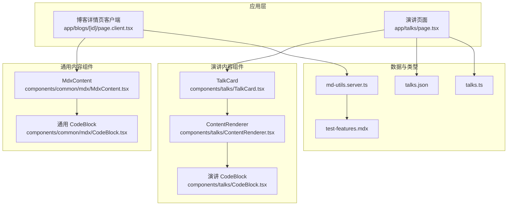
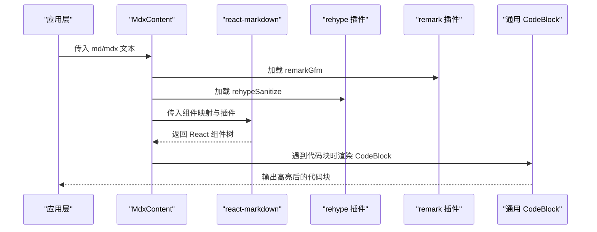
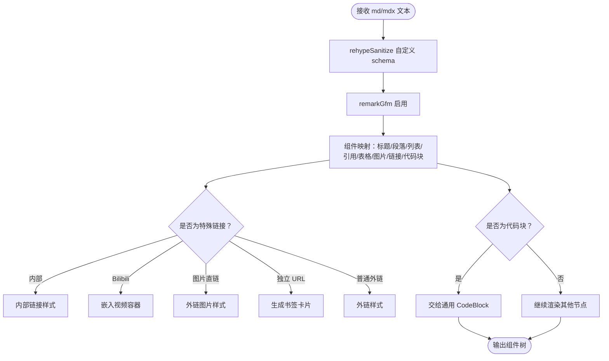
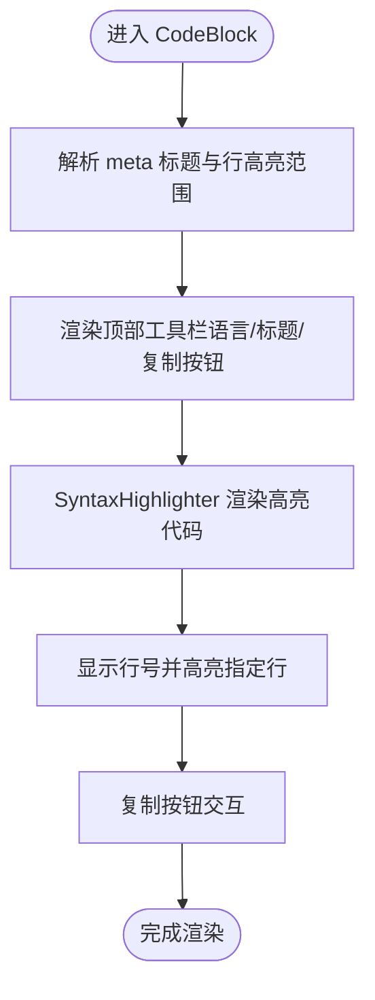
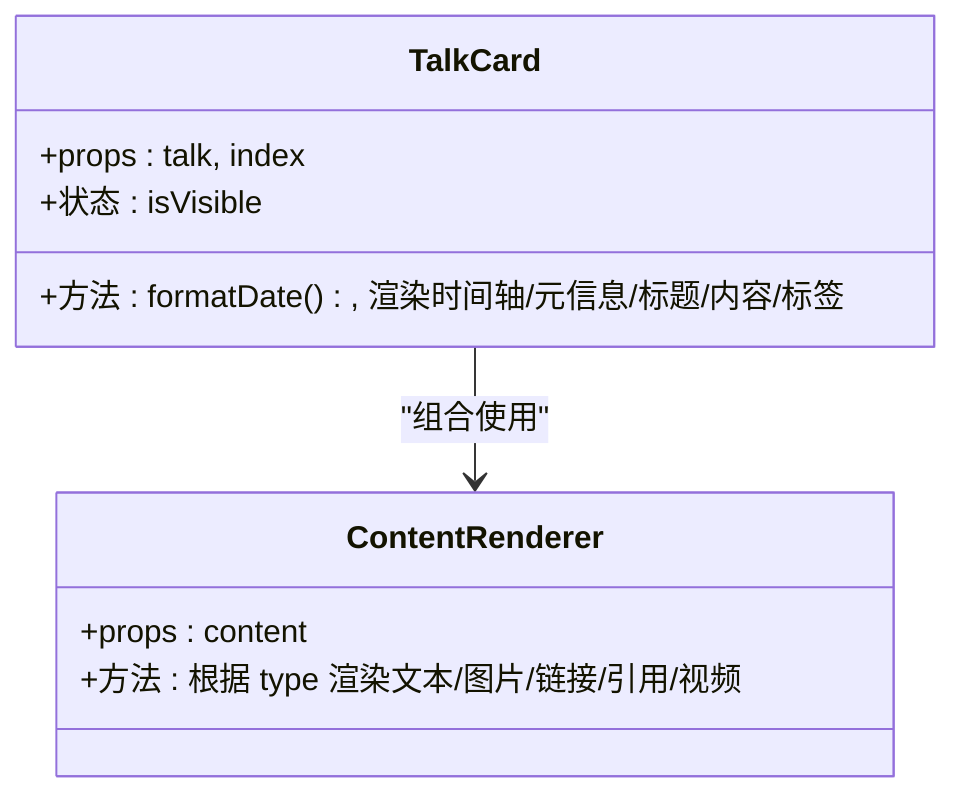
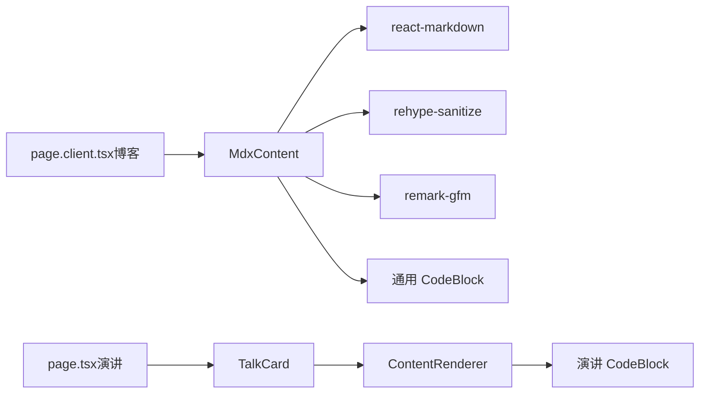

# 内容渲染组件

<cite>
**本文引用的文件**
- [MdxContent.tsx](file://components/common/mdx/MdxContent.tsx)
- [CodeBlock.tsx（通用）](file://components/common/mdx/CodeBlock.tsx)
- [ContentRenderer.tsx](file://components/talks/ContentRenderer.tsx)
- [TalkCard.tsx](file://components/talks/TalkCard.tsx)
- [CodeBlock.tsx（演讲）](file://components/talks/CodeBlock.tsx)
- [md-utils.server.ts](file://lib/md-utils.server.ts)
- [talks.ts](file://types/talks.ts)
- [talks.json](file://data/talks.json)
- [test-features.mdx](file://content/blogs/test-features.mdx)
- [blog-template.mdx](file://data_templates/blog-template.mdx)
- [page.client.tsx（博客详情客户端）](file://app/blogs/[id]/page.client.tsx)
- [page.tsx（演讲页面）](file://app/talks/page.tsx)
</cite>

## 目录
1. [简介](#简介)
2. [项目结构](#项目结构)
3. [核心组件](#核心组件)
4. [架构总览](#架构总览)
5. [详细组件分析](#详细组件分析)
6. [依赖关系分析](#依赖关系分析)
7. [性能考量](#性能考量)
8. [故障排查指南](#故障排查指南)
9. [结论](#结论)
10. [附录](#附录)

## 简介
本文件聚焦博客系统的内容渲染组件，涵盖以下主题：
- MDX 内容渲染器：负责将 Markdown/MDX 文本安全地渲染为 React 组件树，支持 GFM、内联代码、表格、链接、图片、代码块等。
- 代码块高亮组件：提供语法高亮、行号、复制按钮、标题显示与行高亮范围解析。
- 演讲内容渲染器：针对“碎碎念”数据模型进行多类型内容（文本、图片、链接、引用、视频）的渲染。
- 演讲卡片组件：承载时间线、标签、心情、内容块等，组合内容渲染器形成完整的展示卡片。

文档同时解释 MDX/Markdown 的转换流程、自定义组件嵌入方式、主题与样式定制、复制与行号等增强能力，并给出使用示例与性能优化建议。

## 项目结构
围绕内容渲染的关键文件组织如下：
- 通用 MDX 渲染与代码高亮：components/common/mdx
- 演讲内容渲染与卡片：components/talks
- 内容与数据类型：content/blogs、data/talks.json、types/talks.ts
- 应用层使用：app/blogs/[id]/page.client.tsx、app/talks/page.tsx
- 服务端工具：lib/md-utils.server.ts



图表来源
- [page.client.tsx（博客详情客户端）](file://app/blogs/[id]/page.client.tsx)
- [page.tsx（演讲页面）](file://app/talks/page.tsx)
- [MdxContent.tsx](file://components/common/mdx/MdxContent.tsx)
- [CodeBlock.tsx（通用）](file://components/common/mdx/CodeBlock.tsx)
- [ContentRenderer.tsx](file://components/talks/ContentRenderer.tsx)
- [TalkCard.tsx](file://components/talks/TalkCard.tsx)
- [CodeBlock.tsx（演讲）](file://components/talks/CodeBlock.tsx)
- [md-utils.server.ts](file://lib/md-utils.server.ts)
- [talks.json](file://data/talks.json)
- [talks.ts](file://types/talks.ts)
- [test-features.mdx](file://content/blogs/test-features.mdx)

章节来源
- [MdxContent.tsx](file://components/common/mdx/MdxContent.tsx)
- [CodeBlock.tsx（通用）](file://components/common/mdx/CodeBlock.tsx)
- [ContentRenderer.tsx](file://components/talks/ContentRenderer.tsx)
- [TalkCard.tsx](file://components/talks/TalkCard.tsx)
- [CodeBlock.tsx（演讲）](file://components/talks/CodeBlock.tsx)
- [md-utils.server.ts](file://lib/md-utils.server.ts)
- [talks.ts](file://types/talks.ts)
- [talks.json](file://data/talks.json)
- [test-features.mdx](file://content/blogs/test-features.mdx)
- [page.client.tsx（博客详情客户端）](file://app/blogs/[id]/page.client.tsx)
- [page.tsx（演讲页面）](file://app/talks/page.tsx)

## 核心组件
- MdxContent：基于 react-markdown + rehype + remark，提供安全的 Markdown/MDX 渲染，内置自定义组件映射（标题、段落、列表、引用、表格、图片、链接、代码块等），并集成 GFM 与 sanitize。
- 通用 CodeBlock：基于 react-syntax-highlighter，支持语言高亮、行号、复制、标题与行高亮范围解析。
- ContentRenderer：根据“碎碎念”数据模型的 type 字段选择渲染器，支持文本（含内联代码块）、图片（带灯箱）、链接（书签卡片）、引用、视频。
- TalkCard：承载时间轴、标签、心情、标题与内容块，组合 ContentRenderer 展示完整碎碎念条目。
- 演讲 CodeBlock：轻量版代码块，提供复制与语言标签显示，适用于演讲内容场景。

章节来源
- [MdxContent.tsx](file://components/common/mdx/MdxContent.tsx)
- [CodeBlock.tsx（通用）](file://components/common/mdx/CodeBlock.tsx)
- [ContentRenderer.tsx](file://components/talks/ContentRenderer.tsx)
- [TalkCard.tsx](file://components/talks/TalkCard.tsx)
- [CodeBlock.tsx（演讲）](file://components/talks/CodeBlock.tsx)

## 架构总览
内容渲染的整体流程：
- 博客侧：应用层读取 MDX 内容，传递给 MdxContent；MdxContent 解析并渲染为 React 组件；通用 CodeBlock 提供代码高亮。
- 演讲侧：应用层拉取 talks.json，传递给 TalkCard；TalkCard 逐条渲染 ContentRenderer；ContentRenderer 根据内容类型渲染文本、图片、链接、引用、视频；其中文本内的代码块由演讲 CodeBlock 渲染。



图表来源
- [MdxContent.tsx](file://components/common/mdx/MdxContent.tsx)
- [CodeBlock.tsx（通用）](file://components/common/mdx/CodeBlock.tsx)
- [page.client.tsx（博客详情客户端）](file://app/blogs/[id]/page.client.tsx)

章节来源
- [MdxContent.tsx](file://components/common/mdx/MdxContent.tsx)
- [CodeBlock.tsx（通用）](file://components/common/mdx/CodeBlock.tsx)
- [page.client.tsx（博客详情客户端）](file://app/blogs/[id]/page.client.tsx)

## 详细组件分析

### MdxContent 组件
职责与特性：
- 安全渲染：通过 rehypeSanitize 自定义 schema，允许 className/class、target/rel 等属性，确保输出安全。
- 插件链：启用 remark-gfm，支持表格、任务列表等 GFM 特性。
- 自定义组件映射：统一标题、段落、列表、引用、表格、图片、链接、代码块等的样式与行为。
- 链接处理：区分内部链接、Bilibili 视频、图片直链、独立 URL（生成书签卡片）等。
- 代码块处理：当非行内代码且存在语言类名时，交由通用 CodeBlock 渲染。



图表来源
- [MdxContent.tsx](file://components/common/mdx/MdxContent.tsx)

章节来源
- [MdxContent.tsx](file://components/common/mdx/MdxContent.tsx)

### 通用 CodeBlock 组件
职责与特性：
- 语法高亮：基于 react-syntax-highlighter，使用 oneLight 主题风格。
- 行号与行高亮：开启 showLineNumbers，通过 lineProps 对指定行设置背景与左侧强调边框。
- 标题显示：支持 meta 中 title 参数显示文件名。
- 复制功能：点击复制按钮将代码写入剪贴板，反馈“已复制”。



图表来源
- [CodeBlock.tsx（通用）](file://components/common/mdx/CodeBlock.tsx)

章节来源
- [CodeBlock.tsx（通用）](file://components/common/mdx/CodeBlock.tsx)

### 演讲内容渲染器（ContentRenderer）
职责与特性：
- 多类型渲染：根据 content.type 分发至对应渲染器（text、image、link、quote、video）。
- 文本渲染：若文本包含代码块标记，拆分并识别语言，调用演讲 CodeBlock 渲染。
- 图片渲染：懒加载、占位动画、点击放大灯箱、Esc 关闭、遮罩层与动画。
- 链接渲染：生成书签卡片，自动抓取 favicon，错误回退。
- 引用渲染：斜体引用文本，可选作者与来源。
- 视频渲染：iframe 嵌入，支持全屏与权限声明。

```mermaid
sequenceDiagram
participant Card as "TalkCard"
participant Renderer as "ContentRenderer"
participant Text as "TextContent"
participant Img as "ImageContent"
participant Link as "LinkContent"
participant Quote as "QuoteContent"
participant Video as "VideoContent"
participant CB as "演讲 CodeBlock"
Card->>Renderer : 传入 content
alt type == text
Renderer->>Text : 渲染文本
Text->>CB : 若含代码块则渲染 CodeBlock
else type == image
Renderer->>Img : 渲染图片与灯箱
else type == link
Renderer->>Link : 渲染书签卡片
else type == quote
Renderer->>Quote : 渲染引用
else type == video
Renderer->>Video : 渲染视频
end
```

图表来源
- [ContentRenderer.tsx](file://components/talks/ContentRenderer.tsx)
- [TalkCard.tsx](file://components/talks/TalkCard.tsx)
- [CodeBlock.tsx（演讲）](file://components/talks/CodeBlock.tsx)

章节来源
- [ContentRenderer.tsx](file://components/talks/ContentRenderer.tsx)
- [TalkCard.tsx](file://components/talks/TalkCard.tsx)
- [CodeBlock.tsx（演讲）](file://components/talks/CodeBlock.tsx)

### 演讲卡片组件（TalkCard）
职责与特性：
- 时间轴：左侧时间线与置顶点，支持淡入动画延迟。
- 元信息：日期、心情、地点等，按需显示。
- 标题与内容：支持可选标题，内容块通过 ContentRenderer 渲染。
- 标签：展示话题标签，圆角徽标样式。



图表来源
- [TalkCard.tsx](file://components/talks/TalkCard.tsx)
- [ContentRenderer.tsx](file://components/talks/ContentRenderer.tsx)

章节来源
- [TalkCard.tsx](file://components/talks/TalkCard.tsx)
- [ContentRenderer.tsx](file://components/talks/ContentRenderer.tsx)

### 数据模型与服务端工具
- 数据模型：talks.ts 定义 TalkItem、TalkContentItem 及各子类型，支持 text、image、link、quote、video。
- 数据源：talks.json 提供演示数据，包含多条碎碎念及其内容块。
- 服务端工具：md-utils.server.ts 提供读取与解析 md/mdx 文件的能力，提取 frontmatter 与正文，计算字数与摘要。

```mermaid
erDiagram
TALKS_DATA {
array talks
object metadata
}
TALK_ITEM {
string id PK
string title
array content
array tags
datetime createdAt
datetime updatedAt
string location
string mood
boolean isPinned
boolean isDraft
}
TEXT_CONTENT {
string type = "text"
string content
}
IMAGE_CONTENT {
string type = "image"
string url
string alt
string caption
number width
number height
}
LINK_CONTENT {
string type = "link"
string url
string title
string description
string image
string siteName
}
QUOTE_CONTENT {
string type = "quote"
string text
string author
string source
}
VIDEO_CONTENT {
string type = "video"
string url
string thumbnail
string title
string duration
}
TALKS_DATA ||--o{ TALK_ITEM : "包含"
TALK_ITEM ||--o{ TEXT_CONTENT : "包含"
TALK_ITEM ||--o{ IMAGE_CONTENT : "包含"
TALK_ITEM ||--o{ LINK_CONTENT : "包含"
TALK_ITEM ||--o{ QUOTE_CONTENT : "包含"
TALK_ITEM ||--o{ VIDEO_CONTENT : "包含"
```

图表来源
- [talks.ts](file://types/talks.ts)
- [talks.json](file://data/talks.json)

章节来源
- [talks.ts](file://types/talks.ts)
- [talks.json](file://data/talks.json)
- [md-utils.server.ts](file://lib/md-utils.server.ts)

## 依赖关系分析
- MdxContent 依赖：
  - react-markdown、rehype-sanitize、remark-gfm
  - 自身组件 CodeBlock
  - Next.js Image、Link
- 通用 CodeBlock 依赖：
  - react-syntax-highlighter（oneLight 主题）
  - lucide-react（复制/勾选图标）
- ContentRenderer 依赖：
  - 演讲 CodeBlock
  - Next.js Image
- TalkCard 依赖：
  - ContentRenderer
  - Next.js Link
- 应用层使用：
  - 博客详情页：MdxContent 接收 mdxContent
  - 演讲页面：SWR 拉取 talks.json，传递给 TalkCard



图表来源
- [MdxContent.tsx](file://components/common/mdx/MdxContent.tsx)
- [CodeBlock.tsx（通用）](file://components/common/mdx/CodeBlock.tsx)
- [ContentRenderer.tsx](file://components/talks/ContentRenderer.tsx)
- [TalkCard.tsx](file://components/talks/TalkCard.tsx)
- [page.client.tsx（博客详情客户端）](file://app/blogs/[id]/page.client.tsx)
- [page.tsx（演讲页面）](file://app/talks/page.tsx)

章节来源
- [MdxContent.tsx](file://components/common/mdx/MdxContent.tsx)
- [CodeBlock.tsx（通用）](file://components/common/mdx/CodeBlock.tsx)
- [ContentRenderer.tsx](file://components/talks/ContentRenderer.tsx)
- [TalkCard.tsx](file://components/talks/TalkCard.tsx)
- [page.client.tsx（博客详情客户端）](file://app/blogs/[id]/page.client.tsx)
- [page.tsx（演讲页面）](file://app/talks/page.tsx)

## 性能考量
- 代码高亮：
  - 仅在需要时渲染高亮（非行内代码块），避免不必要的重渲染。
  - 行高亮范围解析采用一次性解析，减少运行时开销。
- 图片与灯箱：
  - 图片懒加载与占位动画，减少首屏压力。
  - 灯箱仅在打开时挂载，关闭时移除事件监听，避免内存泄漏。
- 列表渲染：
  - 演讲卡片使用索引延迟动画，降低大量元素同时入场的抖动。
- 数据获取：
  - 演讲页面使用 SWR 缓存与重连重验，减少重复请求。
- Markdown 渲染：
  - 使用 useMemo 缓存组件映射与插件数组，避免每次渲染重建。

## 故障排查指南
- 代码块未高亮或报错
  - 检查代码块语言类名是否正确（如 language-jsx）。
  - 确认 meta 中 title 与行高亮范围格式正确（title="..." 与 {1,3-5}）。
- 链接未按预期渲染
  - 内部链接：确认路径正确且与 Next.js 路由匹配。
  - Bilibili 视频：确认链接格式为播放页 URL。
  - 独立 URL：确认为有效可解析的 URL，否则不会生成书签卡片。
- 图片无法显示或闪烁
  - 确认图片 URL 可访问，检查懒加载与占位逻辑。
  - 灯箱关闭后检查事件监听是否正确清理。
- 演讲内容渲染异常
  - 确认 talks.json 的 content 数组结构与类型字段正确。
  - 检查各子类型字段是否齐全（如 image 的 url、link 的 url/title/description 等）。

章节来源
- [MdxContent.tsx](file://components/common/mdx/MdxContent.tsx)
- [CodeBlock.tsx（通用）](file://components/common/mdx/CodeBlock.tsx)
- [ContentRenderer.tsx](file://components/talks/ContentRenderer.tsx)
- [TalkCard.tsx](file://components/talks/TalkCard.tsx)
- [talks.json](file://data/talks.json)

## 结论
本内容渲染体系以 MdxContent 为核心，结合通用与演讲场景的专用组件，实现了从基础 Markdown/GFM 到复杂富文本内容（图片、链接、视频、代码块）的一体化渲染。通过安全的 sanitize、灵活的组件映射与完善的交互（复制、行高亮、灯箱），既保证了可读性也提升了用户体验。配合服务端工具与应用层数据流，整体具备良好的扩展性与维护性。

## 附录

### MDX/Markdown 支持与转换流程
- 输入：md/mdx 文件（包含 frontmatter 与正文）。
- 解析：服务端工具读取并解析，提取 frontmatter 与正文，计算摘要与字数。
- 渲染：应用层将正文传递给 MdxContent；MdxContent 通过 react-markdown + 插件链渲染为 React 组件；遇到代码块时交由 CodeBlock 渲染高亮。

章节来源
- [md-utils.server.ts](file://lib/md-utils.server.ts)
- [MdxContent.tsx](file://components/common/mdx/MdxContent.tsx)
- [test-features.mdx](file://content/blogs/test-features.mdx)

### 自定义组件嵌入方式
- 在 MdxContent 的组件映射中注册自定义组件（如 h1/h2 等），即可在 md/mdx 中以相同标签形式使用。
- 代码块：通过语言类名触发 CodeBlock；可在 meta 中附加标题与行高亮范围。
- 链接：根据协议与域名自动识别并渲染为不同样式或嵌入式组件。

章节来源
- [MdxContent.tsx](file://components/common/mdx/MdxContent.tsx)
- [CodeBlock.tsx（通用）](file://components/common/mdx/CodeBlock.tsx)

### 代码块主题、行号与复制
- 主题：通用 CodeBlock 使用 oneLight；演讲 CodeBlock 为自绘样式。
- 行号：默认开启 showLineNumbers；可通过 meta 的行号范围高亮指定行。
- 复制：点击复制按钮，写入剪贴板并短暂反馈“已复制”。

章节来源
- [CodeBlock.tsx（通用）](file://components/common/mdx/CodeBlock.tsx)
- [CodeBlock.tsx（演讲）](file://components/talks/CodeBlock.tsx)

### 使用示例与样式定制
- 博客详情页：直接传入 mdxContent 给 MdxContent，即可获得完整的渲染结果。
- 演讲页面：从数据源读取 talks.json，传递给 TalkCard，内部自动渲染 ContentRenderer。
- 样式定制：通过组件映射与 CSS 类名覆盖，或在应用层引入全局样式（如目录样式）。

章节来源
- [page.client.tsx（博客详情客户端）](file://app/blogs/[id]/page.client.tsx)
- [page.tsx（演讲页面）](file://app/talks/page.tsx)
- [MdxContent.tsx](file://components/common/mdx/MdxContent.tsx)
- [ContentRenderer.tsx](file://components/talks/ContentRenderer.tsx)

### 开发自定义组件的建议
- 保持纯函数式与无副作用，便于在 react-markdown 中稳定渲染。
- 合理使用 useMemo 缓存组件映射，避免频繁重建。
- 注意安全：通过 rehypeSanitize 的 schema 控制允许的属性与标签。
- 交互体验：为复制、展开/折叠、灯箱等操作提供清晰的视觉反馈与无障碍支持。