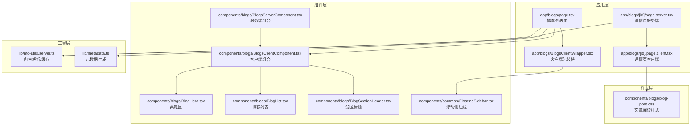
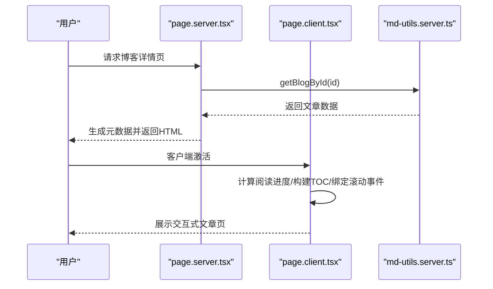
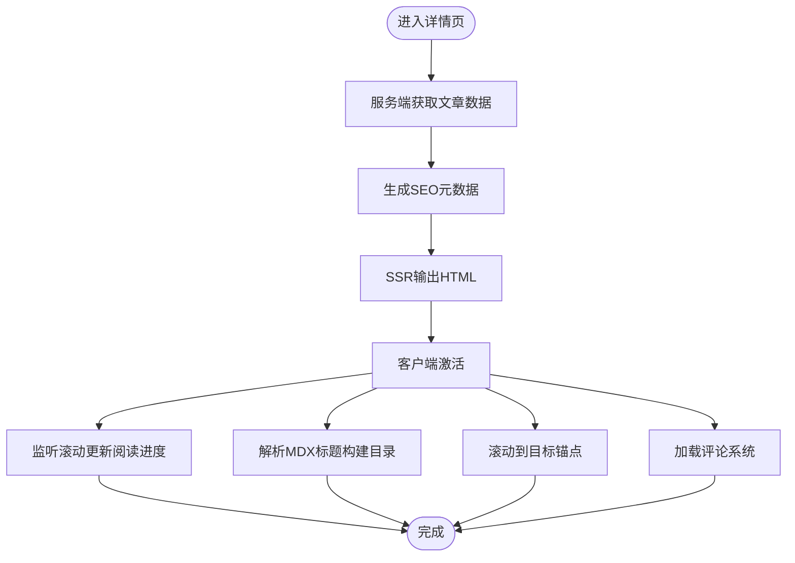
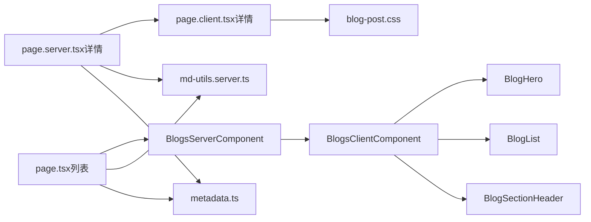

# 博客专用组件

<cite>
**本文引用的文件**
- [BlogHero.tsx](file://components/blogs/BlogHero.tsx)
- [BlogList.tsx](file://components/blogs/BlogList.tsx)
- [BlogSectionHeader.tsx](file://components/blogs/BlogSectionHeader.tsx)
- [BlogsClientComponent.tsx](file://components/blogs/BlogsClientComponent.tsx)
- [BlogsServerComponent.tsx](file://components/blogs/BlogsServerComponent.tsx)
- [BlogsClientWrapper.tsx](file://app/blogs/BlogsClientWrapper.tsx)
- [page.tsx（博客列表）](file://app/blogs/page.tsx)
- [page.client.tsx（博客详情）](file://app/blogs/[id]/page.client.tsx)
- [page.server.tsx（博客详情）](file://app/blogs/[id]/page.server.tsx)
- [md-utils.server.ts](file://lib/md-utils.server.ts)
- [blog-post.css](file://components/blogs/blog-post.css)
- [FloatingSidebar.tsx](file://components/common/FloatingSidebar.tsx)
- [metadata.ts](file://lib/metadata.ts)
- [button.tsx](file://components/common/ui/button.tsx)
</cite>

## 目录
1. [简介](#简介)
2. [项目结构](#项目结构)
3. [核心组件](#核心组件)
4. [架构总览](#架构总览)
5. [组件详解](#组件详解)
6. [依赖关系分析](#依赖关系分析)
7. [性能考量](#性能考量)
8. [故障排查指南](#故障排查指南)
9. [结论](#结论)
10. [附录](#附录)

## 简介
本文件面向博客系统中的“博客专用组件”，系统性梳理博客英雄区、博客列表、博客分区标题、博客客户端组件、博客服务端组件等组件的设计与实现，覆盖数据结构、渲染逻辑、状态管理、性能优化、样式定制与响应式设计，并解释 Server Components 与 Client Components 的混合使用模式及数据获取最佳实践。

## 项目结构
博客相关组件主要分布在以下位置：
- 组件层（components/blogs）：定义可复用的博客展示组件（英雄区、列表、分区标题、客户端/服务端组合组件）
- 应用层（app/blogs）：页面路由与数据流入口（列表页、详情页）
- 工具层（lib）：内容解析与元数据生成（Markdown/MDX、SEO 元数据）
- 样式层（components/blogs/blog-post.css）：文章阅读体验的全局样式

图表来源
- [page.tsx（博客列表）:14-91](file://app/blogs/page.tsx#L14-L91)
- [page.client.tsx（博客详情）:186-497](file://app/blogs/[id]/page.client.tsx#L186-L497)
- [page.server.tsx（博客详情）:31-52](file://app/blogs/[id]/page.server.tsx#L31-L52)
- [BlogsClientWrapper.tsx:15-26](file://app/blogs/BlogsClientWrapper.tsx#L15-L26)
- [BlogsClientComponent.tsx:39-66](file://components/blogs/BlogsClientComponent.tsx#L39-L66)
- [BlogsServerComponent.tsx:4-7](file://components/blogs/BlogsServerComponent.tsx#L4-L7)
- [md-utils.server.ts:136-154](file://lib/md-utils.server.ts#L136-L154)
- [metadata.ts:152-160](file://lib/metadata.ts#L152-L160)
- [blog-post.css:1-564](file://components/blogs/blog-post.css#L1-L564)

章节来源
- [page.tsx（博客列表）:14-91](file://app/blogs/page.tsx#L14-L91)
- [page.client.tsx（博客详情）:186-497](file://app/blogs/[id]/page.client.tsx#L186-L497)
- [page.server.tsx（博客详情）:31-52](file://app/blogs/[id]/page.server.tsx#L31-L52)
- [BlogsClientWrapper.tsx:15-26](file://app/blogs/BlogsClientWrapper.tsx#L15-L26)
- [BlogsClientComponent.tsx:39-66](file://components/blogs/BlogsClientComponent.tsx#L39-L66)
- [BlogsServerComponent.tsx:4-7](file://components/blogs/BlogsServerComponent.tsx#L4-L7)
- [md-utils.server.ts:136-154](file://lib/md-utils.server.ts#L136-L154)
- [metadata.ts:152-160](file://lib/metadata.ts#L152-L160)
- [blog-post.css:1-564](file://components/blogs/blog-post.css#L1-L564)

## 核心组件
- 博客英雄区（BlogHero）：展示作者头像、标题、副标题与社交入口
- 博客列表（BlogList）：展示文章列表，支持标签与日期显示
- 博客分区标题（BlogSectionHeader）：带“查看全部”跳转的分区标题
- 博客客户端组件（BlogsClientComponent）：聚合英雄区、统计、FunZone、最近文章、留言墙等
- 博客服务端组件（BlogsServerComponent）：服务端拉取文章数据并传递给客户端组件
- 博客客户端包装器（BlogsClientWrapper）：处理标签筛选、浮动侧边栏交互
- 博客详情页（page.server.tsx + page.client.tsx）：服务端生成元数据与数据，客户端负责滚动进度、TOC、评论等交互

章节来源
- [BlogHero.tsx:10-59](file://components/blogs/BlogHero.tsx#L10-L59)
- [BlogList.tsx:7-67](file://components/blogs/BlogList.tsx#L7-L67)
- [BlogSectionHeader.tsx:1-25](file://components/blogs/BlogSectionHeader.tsx#L1-L25)
- [BlogsClientComponent.tsx:35-66](file://components/blogs/BlogsClientComponent.tsx#L35-L66)
- [BlogsServerComponent.tsx:1-8](file://components/blogs/BlogsServerComponent.tsx#L1-L8)
- [BlogsClientWrapper.tsx:11-26](file://app/blogs/BlogsClientWrapper.tsx#L11-L26)
- [page.client.tsx（博客详情）:186-497](file://app/blogs/[id]/page.client.tsx#L186-L497)
- [page.server.tsx（博客详情）:31-52](file://app/blogs/[id]/page.server.tsx#L31-L52)

## 架构总览
Next.js App Router 下的博客组件采用“服务端渲染 + 客户端增强”的混合模式：
- 列表页：服务端组件负责内容拉取与排序，客户端组件负责局部交互
- 详情页：服务端组件负责 SEO 元数据与数据获取，客户端组件负责滚动进度、目录、评论等交互
- 内容数据：通过缓存函数统一读取与解析 Markdown/MDX 文件，保证 SSR 与缓存一致性

图表来源
- [page.server.tsx（博客详情）:31-52](file://app/blogs/[id]/page.server.tsx#L31-L52)
- [page.client.tsx（博客详情）:186-497](file://app/blogs/[id]/page.client.tsx#L186-L497)
- [md-utils.server.ts:156-218](file://lib/md-utils.server.ts#L156-L218)

## 组件详解

### 博客英雄区（BlogHero）
- 数据结构：接收可选标题与副标题 props，默认值用于站点展示
- 渲染逻辑：头像占位与降级处理、社交入口、响应式布局
- 性能优化：图片懒加载与降级策略，避免阻塞渲染
- 样式定制：Tailwind 类名控制尺寸、间距与主题色；可替换头像资源
- 响应式设计：移动端与桌面端布局切换

章节来源
- [BlogHero.tsx:10-59](file://components/blogs/BlogHero.tsx#L10-L59)

### 博客列表（BlogList）
- 数据结构：BlogListItem 接口定义文章字段（标题、摘要、日期、阅读时长、浏览量、评论数、封面图、slug、标签等）
- 渲染逻辑：最多展示前 N 条（默认 5），支持标签截断与日期展示
- 性能优化：切片操作仅渲染必要数量；链接使用语义化 aria-label
- 样式定制：列表项 hover 效果、标签气泡、时间戳对齐
- 响应式设计：移动端堆叠、桌面端横向布局

章节来源
- [BlogList.tsx:7-67](file://components/blogs/BlogList.tsx#L7-L67)

### 博客分区标题（BlogSectionHeader）
- 数据结构：title、viewAllLink、viewAllText 三要素
- 渲染逻辑：左侧强调条 + 右侧“查看全部”链接
- 性能优化：轻量纯展示组件，无状态
- 样式定制：上划线强调、小字与大写字母间距

章节来源
- [BlogSectionHeader.tsx:1-25](file://components/blogs/BlogSectionHeader.tsx#L1-L25)

### 博客客户端组件（BlogsClientComponent）
- 组合逻辑：聚合 Hero、StatsBar、FunZone、NowSection、分区标题、列表、Guestbook
- 状态管理：内部无状态，通过 props 注入数据
- 性能优化：按需引入动画样式，减少全局样式体积
- 交互点：作为客户端组件承载后续交互扩展

章节来源
- [BlogsClientComponent.tsx:35-66](file://components/blogs/BlogsClientComponent.tsx#L35-L66)

### 博客服务端组件（BlogsServerComponent）
- 数据获取：调用缓存函数 getAllBlogPosts，避免重复 IO
- 传递数据：将文章数组传给客户端组件
- 适用场景：列表页与聚合页的 SSR 场景

章节来源
- [BlogsServerComponent.tsx:1-8](file://components/blogs/BlogsServerComponent.tsx#L1-L8)
- [md-utils.server.ts:136-138](file://lib/md-utils.server.ts#L136-L138)

### 博客客户端包装器（BlogsClientWrapper）
- 状态管理：维护当前激活标签，支持清除筛选
- 交互点：与浮动侧边栏联动，点击标签触发筛选
- 适用场景：博客列表页的筛选与导航增强

章节来源
- [BlogsClientWrapper.tsx:11-26](file://app/blogs/BlogsClientWrapper.tsx#L11-L26)
- [FloatingSidebar.tsx:43-215](file://components/common/FloatingSidebar.tsx#L43-L215)

### 博客详情页（page.server.tsx + page.client.tsx）
- 服务端职责：根据 id 获取文章、生成 SEO 元数据（标题、描述、关键词、OpenGraph）、兜底 404
- 客户端职责：计算阅读进度条、构建目录（基于 MDX 标题）、滚动定位、移动端 TOC 弹窗、评论区集成
- 性能优化：服务端预渲染 + 客户端交互增强；目录与滚动事件在客户端注册

图表来源
- [page.server.tsx（博客详情）:31-52](file://app/blogs/[id]/page.server.tsx#L31-L52)
- [page.client.tsx（博客详情）:186-497](file://app/blogs/[id]/page.client.tsx#L186-L497)

章节来源
- [page.server.tsx（博客详情）:31-52](file://app/blogs/[id]/page.server.tsx#L31-L52)
- [page.client.tsx（博客详情）:186-497](file://app/blogs/[id]/page.client.tsx#L186-L497)

## 依赖关系分析
- 数据依赖：所有博客组件最终依赖 md-utils.server.ts 的缓存函数进行内容读取与解析
- 元数据依赖：页面元数据由 metadata.ts 统一生成，详情页通过 generateMetadata 注入
- 样式依赖：文章阅读样式由 blog-post.css 提供，详情页客户端内联样式补充 TOC
- 交互依赖：客户端包装器与浮动侧边栏协同，实现标签筛选与回到顶部等交互

图表来源
- [page.tsx（博客列表）:14-91](file://app/blogs/page.tsx#L14-L91)
- [BlogsServerComponent.tsx:4-7](file://components/blogs/BlogsServerComponent.tsx#L4-L7)
- [BlogsClientComponent.tsx:39-66](file://components/blogs/BlogsClientComponent.tsx#L39-L66)
- [page.server.tsx（博客详情）:31-52](file://app/blogs/[id]/page.server.tsx#L31-L52)
- [page.client.tsx（博客详情）:186-497](file://app/blogs/[id]/page.client.tsx#L186-L497)
- [md-utils.server.ts:136-154](file://lib/md-utils.server.ts#L136-L154)
- [metadata.ts:152-160](file://lib/metadata.ts#L152-L160)
- [blog-post.css:1-564](file://components/blogs/blog-post.css#L1-L564)

章节来源
- [page.tsx（博客列表）:14-91](file://app/blogs/page.tsx#L14-L91)
- [page.server.tsx（博客详情）:31-52](file://app/blogs/[id]/page.server.tsx#L31-L52)
- [page.client.tsx（博客详情）:186-497](file://app/blogs/[id]/page.client.tsx#L186-L497)
- [md-utils.server.ts:136-154](file://lib/md-utils.server.ts#L136-L154)
- [metadata.ts:152-160](file://lib/metadata.ts#L152-L160)
- [blog-post.css:1-564](file://components/blogs/blog-post.css#L1-L564)

## 性能考量
- 缓存与去重：getAllBlogPosts/getAllNotes/getAllBlogs 使用 React cache 包裹，避免重复 IO
- 按需渲染：列表组件仅渲染前 N 条；详情页目录按需解析标题
- 图片优化：Hero 组件提供降级方案与优先加载策略
- 交互延迟：详情页客户端逻辑在 hydrate 后执行，避免阻塞首屏
- 样式体积：文章阅读样式独立文件，客户端内联样式仅用于 TOC

章节来源
- [md-utils.server.ts:136-154](file://lib/md-utils.server.ts#L136-L154)
- [BlogList.tsx:24-26](file://components/blogs/BlogList.tsx#L24-L26)
- [BlogHero.tsx:20-33](file://components/blogs/BlogHero.tsx#L20-L33)
- [page.client.tsx（博客详情）:186-497](file://app/blogs/[id]/page.client.tsx#L186-L497)

## 故障排查指南
- 文章未显示或为空：检查内容目录与文件命名规范，确认 frontmatter 字段完整
- 图片加载失败：Hero 组件已内置降级方案，确认静态资源路径与权限
- 详情页 404：服务端组件在未找到文章时触发 notFound，检查 id 与文件存在性
- SEO 元数据异常：确认 generateMetadata 返回值与 metadata.ts 配置一致
- 目录不显示：确保 MDX 内容包含标题语法（#/##/####），客户端会据此生成目录

章节来源
- [BlogHero.tsx:30-33](file://components/blogs/BlogHero.tsx#L30-L33)
- [page.server.tsx（博客详情）:35-37](file://app/blogs/[id]/page.server.tsx#L35-L37)
- [page.client.tsx（博客详情）:191-205](file://app/blogs/[id]/page.client.tsx#L191-L205)
- [md-utils.server.ts:156-218](file://lib/md-utils.server.ts#L156-L218)

## 结论
博客专用组件以清晰的职责划分与混合渲染模式实现了高性能与良好用户体验：服务端负责内容与 SEO，客户端负责交互与动态体验；通过缓存与按需渲染进一步优化性能；样式与响应式设计确保跨设备一致性。建议在新增功能时遵循现有模式，保持组件单一职责与可复用性。

## 附录

### 组件 Props 接口速览
- BlogHeroProps
  - title?: string
  - subtitle?: string
- BlogListProps
  - posts: BlogListItem[]
- BlogListItem
  - id: string
  - title: string
  - excerpt: string
  - date: string
  - readTime: string
  - views: number
  - comments: number
  - imageUrl: string
  - slug: string
  - tags: string[]
- BlogSectionHeaderProps
  - title: string
  - viewAllLink?: string
  - viewAllText?: string
- BlogsClientComponentProps
  - posts: BlogListItem[]
- BlogsClientWrapperProps
  - tags: string[]
- BlogDetailClientProps（详情页）
  - blog: BlogPost
  - pageViews: number

章节来源
- [BlogHero.tsx:10-18](file://components/blogs/BlogHero.tsx#L10-L18)
- [BlogList.tsx:20-22](file://components/blogs/BlogList.tsx#L20-L22)
- [BlogList.tsx:7-18](file://components/blogs/BlogList.tsx#L7-L18)
- [BlogSectionHeader.tsx:1-5](file://components/blogs/BlogSectionHeader.tsx#L1-L5)
- [BlogsClientComponent.tsx:35-37](file://components/blogs/BlogsClientComponent.tsx#L35-L37)
- [BlogsClientWrapper.tsx:11-13](file://app/blogs/BlogsClientWrapper.tsx#L11-L13)
- [page.client.tsx（博客详情）:181-184](file://app/blogs/[id]/page.client.tsx#L181-L184)

### 使用示例与最佳实践
- 在列表页使用 BlogsServerComponent 一次性拉取并传递文章数据
- 在详情页使用 page.server.tsx 生成 SEO 元数据，page.client.tsx 承载交互
- 标签筛选：通过 BlogsClientWrapper 与 FloatingSidebar 实现
- 样式定制：修改 blog-post.css 或在客户端内联样式覆盖 TOC

章节来源
- [BlogsServerComponent.tsx:4-7](file://components/blogs/BlogsServerComponent.tsx#L4-L7)
- [page.tsx（博客列表）:14-91](file://app/blogs/page.tsx#L14-L91)
- [BlogsClientWrapper.tsx:15-26](file://app/blogs/BlogsClientWrapper.tsx#L15-L26)
- [FloatingSidebar.tsx:43-215](file://components/common/FloatingSidebar.tsx#L43-L215)
- [blog-post.css:1-564](file://components/blogs/blog-post.css#L1-L564)