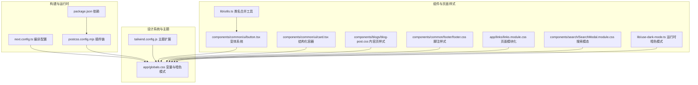
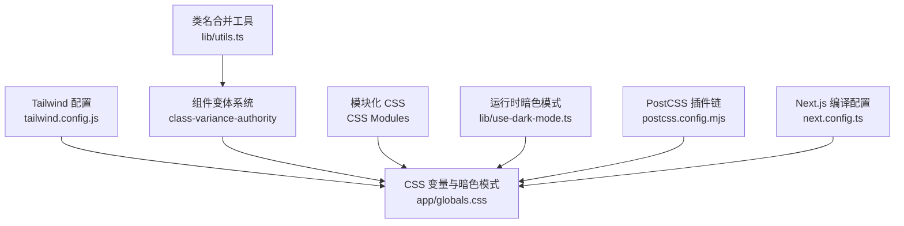
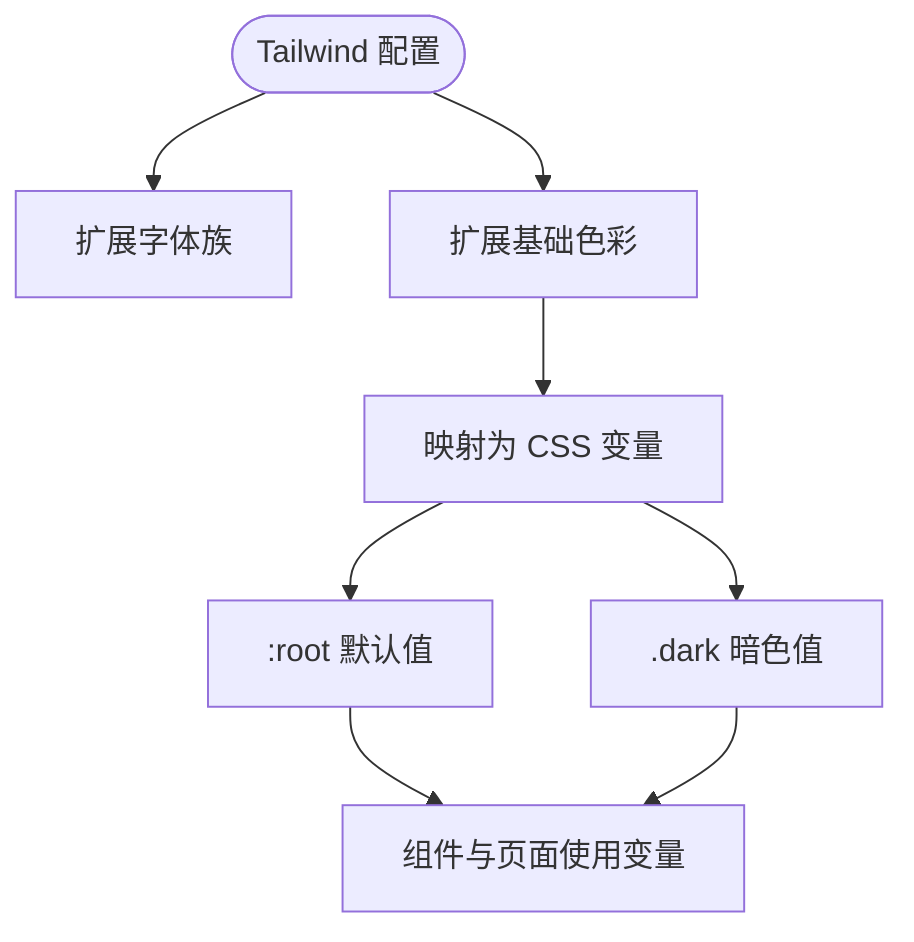
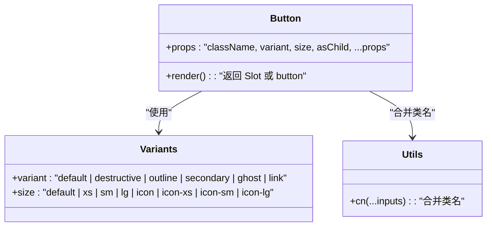
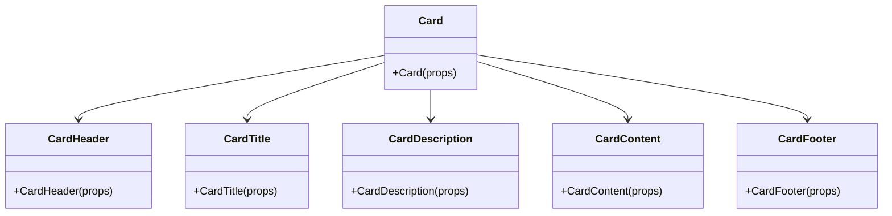
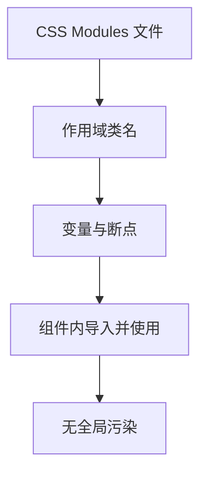
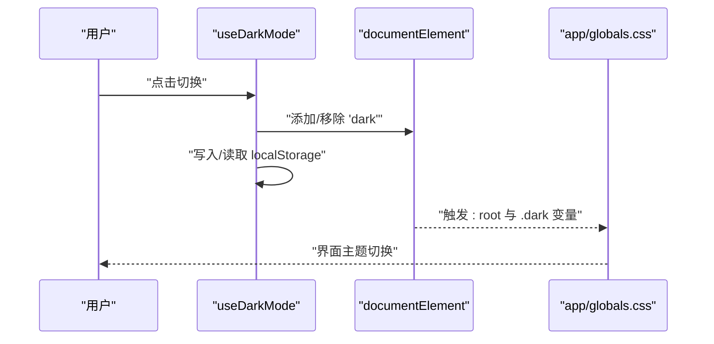
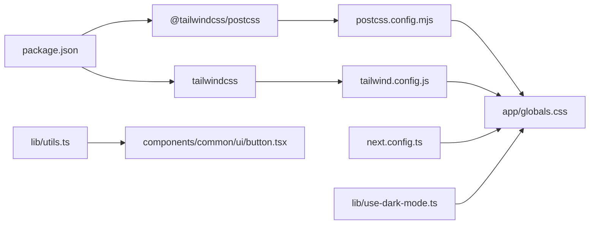

# 样式系统

<cite>
**本文引用的文件**
- [tailwind.config.js](file://tailwind.config.js)
- [postcss.config.mjs](file://postcss.config.mjs)
- [app/globals.css](file://app/globals.css)
- [lib/use-dark-mode.ts](file://lib/use-dark-mode.ts)
- [lib/utils.ts](file://lib/utils.ts)
- [components/common/ui/button.tsx](file://components/common/ui/button.tsx)
- [components/common/ui/card.tsx](file://components/common/ui/card.tsx)
- [components/blogs/blog-post.css](file://components/blogs/blog-post.css)
- [components/common/footer/footer.css](file://components/common/footer/footer.css)
- [app/links/links.module.css](file://app/links/links.module.css)
- [components/search/SearchModal.module.css](file://components/search/SearchModal.module.css)
- [package.json](file://package.json)
- [next.config.ts](file://next.config.ts)
- [docs/[id]/modules.d.ts](file://docs/[id]/modules.d.ts)
</cite>

## 目录
1. [简介](#简介)
2. [项目结构](#项目结构)
3. [核心组件](#核心组件)
4. [架构总览](#架构总览)
5. [详细组件分析](#详细组件分析)
6. [依赖关系分析](#依赖关系分析)
7. [性能考量](#性能考量)
8. [故障排查指南](#故障排查指南)
9. [结论](#结论)
10. [附录](#附录)

## 简介
本文件系统性梳理博客系统的样式体系，涵盖 Tailwind CSS 设计系统与主题变量、模块化 CSS 的组织与隔离、组件样式封装与变体系统、暗色模式实现与动态切换、响应式设计策略、样式调试与浏览器兼容性、以及构建优化与最佳实践。目标是帮助开发者快速理解并扩展样式系统。

## 项目结构
样式系统由三层构成：
- 全局设计系统与主题：通过 Tailwind 配置与 CSS 变量在全局层面统一颜色、字体与半径等设计令牌，并以暗色模式类驱动主题切换。
- 组件样式与变体：UI 组件采用 class-variance-authority 的变体系统，结合 cn 工具进行类名合并；页面与内容区域使用模块化 CSS 实现强隔离。
- 构建与运行时：PostCSS 插件链生成 CSS，Next.js 编译管线处理 MDX 与资源，运行时通过自定义 Hook 管理暗色模式。

图表来源
- [postcss.config.mjs:1-8](file://postcss.config.mjs#L1-L8)
- [tailwind.config.js:1-22](file://tailwind.config.js#L1-L22)
- [app/globals.css:1-298](file://app/globals.css#L1-L298)
- [lib/use-dark-mode.ts:1-60](file://lib/use-dark-mode.ts#L1-L60)
- [lib/utils.ts:1-12](file://lib/utils.ts#L1-L12)
- [components/common/ui/button.tsx:1-65](file://components/common/ui/button.tsx#L1-L65)
- [components/common/ui/card.tsx:1-93](file://components/common/ui/card.tsx#L1-L93)
- [components/blogs/blog-post.css:1-564](file://components/blogs/blog-post.css#L1-L564)
- [components/common/footer/footer.css:1-412](file://components/common/footer/footer.css#L1-L412)
- [app/links/links.module.css:1-499](file://app/links/links.module.css#L1-L499)
- [components/search/SearchModal.module.css:1-204](file://components/search/SearchModal.module.css#L1-L204)

章节来源
- [postcss.config.mjs:1-8](file://postcss.config.mjs#L1-L8)
- [tailwind.config.js:1-22](file://tailwind.config.js#L1-L22)
- [app/globals.css:1-298](file://app/globals.css#L1-L298)
- [lib/use-dark-mode.ts:1-60](file://lib/use-dark-mode.ts#L1-L60)
- [lib/utils.ts:1-12](file://lib/utils.ts#L1-L12)
- [components/common/ui/button.tsx:1-65](file://components/common/ui/button.tsx#L1-L65)
- [components/common/ui/card.tsx:1-93](file://components/common/ui/card.tsx#L1-L93)
- [components/blogs/blog-post.css:1-564](file://components/blogs/blog-post.css#L1-L564)
- [components/common/footer/footer.css:1-412](file://components/common/footer/footer.css#L1-L412)
- [app/links/links.module.css:1-499](file://app/links/links.module.css#L1-L499)
- [components/search/SearchModal.module.css:1-204](file://components/search/SearchModal.module.css#L1-L204)

## 核心组件
- Tailwind 设计系统与主题变量
  - 在 Tailwind 配置中扩展字体族与基础色彩，作为站点级设计令牌。
  - 在全局 CSS 中定义 CSS 变量与暗色模式类，形成“主题变量 → Tailwind 变量 → 组件类”的映射链路。
- UI 组件变体系统
  - 使用 class-variance-authority 定义按钮等组件的变体与尺寸，结合 cn 工具合并类名，确保样式可组合且可维护。
- 模块化 CSS
  - 页面与内容区域采用模块化 CSS，通过 CSS Modules 的命名空间隔离样式，避免全局污染。
- 暗色模式运行时管理
  - 自定义 Hook 在客户端读取本地存储与系统偏好，同步根元素的 dark 类，驱动 CSS 变量切换。

章节来源
- [tailwind.config.js:1-22](file://tailwind.config.js#L1-L22)
- [app/globals.css:1-298](file://app/globals.css#L1-L298)
- [components/common/ui/button.tsx:1-65](file://components/common/ui/button.tsx#L1-L65)
- [lib/utils.ts:1-12](file://lib/utils.ts#L1-L12)
- [app/links/links.module.css:1-499](file://app/links/links.module.css#L1-L499)
- [lib/use-dark-mode.ts:1-60](file://lib/use-dark-mode.ts#L1-L60)

## 架构总览
样式系统遵循“设计系统（Tailwind + CSS 变量）—组件（变体 + 模块化）—运行时（暗色模式）”的分层架构。PostCSS 插件链负责将设计系统转换为实际 CSS，Next.js 编译管线处理 MDX 与资源，运行时 Hook 控制主题切换。

图表来源
- [tailwind.config.js:1-22](file://tailwind.config.js#L1-L22)
- [app/globals.css:1-298](file://app/globals.css#L1-L298)
- [components/common/ui/button.tsx:1-65](file://components/common/ui/button.tsx#L1-L65)
- [lib/utils.ts:1-12](file://lib/utils.ts#L1-L12)
- [app/links/links.module.css:1-499](file://app/links/links.module.css#L1-L499)
- [lib/use-dark-mode.ts:1-60](file://lib/use-dark-mode.ts#L1-L60)
- [postcss.config.mjs:1-8](file://postcss.config.mjs#L1-L8)
- [next.config.ts:1-38](file://next.config.ts#L1-L38)

## 详细组件分析

### Tailwind 设计系统与主题变量
- 字体系统
  - 在 Tailwind 中扩展 sans 与 serif 字体族，配合全局 CSS 的字体变量，确保组件与页面一致的排版风格。
- 色彩方案
  - 定义背景、前景、主色等基础色彩，通过 CSS 变量在 :root 与 .dark 中分别声明，实现明暗两套主题。
- 边框圆角与半径
  - 通过 CSS 变量定义多级圆角，供组件与页面按需使用。

图表来源
- [tailwind.config.js:7-19](file://tailwind.config.js#L7-L19)
- [app/globals.css:8-50](file://app/globals.css#L8-L50)
- [app/globals.css:52-123](file://app/globals.css#L52-L123)

章节来源
- [tailwind.config.js:1-22](file://tailwind.config.js#L1-L22)
- [app/globals.css:1-298](file://app/globals.css#L1-L298)

### 组件样式与变体系统（按钮）
- 变体与尺寸
  - 通过 cva 定义 variant 与 size 两类变体，覆盖默认、危险、描边、次级、幽灵、链接等场景与多种尺寸。
- 语义化数据属性
  - 组件输出 data-slot、data-variant、data-size，便于调试与测试。
- 类名合并
  - 使用 cn 工具合并传入 className 与变体生成的类，避免冲突并保持灵活性。

图表来源
- [components/common/ui/button.tsx:7-39](file://components/common/ui/button.tsx#L7-L39)
- [lib/utils.ts:9-11](file://lib/utils.ts#L9-L11)

章节来源
- [components/common/ui/button.tsx:1-65](file://components/common/ui/button.tsx#L1-L65)
- [lib/utils.ts:1-12](file://lib/utils.ts#L1-L12)

### 组件样式与结构化容器（卡片）
- 结构化布局
  - CardHeader、CardTitle、CardDescription、CardContent、CardFooter 等子组件提供统一的卡片结构，便于复用。
- 响应式与网格
  - 使用 CSS Grid 与容器查询，适配不同断点下的布局变化。

图表来源
- [components/common/ui/card.tsx:5-92](file://components/common/ui/card.tsx#L5-L92)

章节来源
- [components/common/ui/card.tsx:1-93](file://components/common/ui/card.tsx#L1-L93)

### 模块化 CSS（页面与内容）
- 页面模块化（以链接页为例）
  - 使用 CSS Modules 将类名作用域限定在组件内，避免全局污染；通过变量统一控制最大宽度、内边距、字体与色彩。
- 内容页样式（博客文章）
  - 采用 CSS 变量与自定义 token，定义阅读栏、面包屑、标题、正文排版、目录、代码高亮、表格、引用等样式，并提供移动端响应式规则。
- 搜索模态
  - 通过模块化 CSS 管理模态框的层级、遮罩、输入框、滚动区域与高亮样式，保证交互一致性。

图表来源
- [app/links/links.module.css:1-499](file://app/links/links.module.css#L1-L499)
- [components/blogs/blog-post.css:1-564](file://components/blogs/blog-post.css#L1-L564)
- [components/search/SearchModal.module.css:1-204](file://components/search/SearchModal.module.css#L1-L204)

章节来源
- [app/links/links.module.css:1-499](file://app/links/links.module.css#L1-L499)
- [components/blogs/blog-post.css:1-564](file://components/blogs/blog-post.css#L1-L564)
- [components/search/SearchModal.module.css:1-204](file://components/search/SearchModal.module.css#L1-L204)

### 暗色模式运行时管理
- 状态初始化
  - 优先读取本地存储，其次回退到系统 prefers-color-scheme，最后同步 HTML 的 dark 类。
- 切换逻辑
  - 切换时更新 HTML 类与本地存储，确保刷新后状态一致。
- 组件联动
  - 组件与页面通过 CSS 变量与暗色类实现即时切换，无需重载。

图表来源
- [lib/use-dark-mode.ts:14-58](file://lib/use-dark-mode.ts#L14-L58)
- [app/globals.css:6,52-123](file://app/globals.css#L6,L52-L123)

章节来源
- [lib/use-dark-mode.ts:1-60](file://lib/use-dark-mode.ts#L1-L60)
- [app/globals.css:1-298](file://app/globals.css#L1-L298)

### 响应式设计与滚动条定制
- 响应式断点
  - 在页面与脚注样式中使用媒体查询，针对超小屏、小屏、中屏与大屏分别调整布局与字号。
- 滚动条美化
  - 提供搜索结果与通用滚动条的样式，区分亮/暗模式并在移动端隐藏滚动条以提升体验。

章节来源
- [app/links/links.module.css:470-499](file://app/links/links.module.css#L470-L499)
- [components/common/footer/footer.css:280-412](file://components/common/footer/footer.css#L280-L412)
- [app/globals.css:226-295](file://app/globals.css#L226-L295)

### 样式继承与组件集成
- 继承规则
  - 全局 base 层应用基础边框与轮廓样式，页面主体继承背景与文字色；组件通过 Tailwind 与 CSS 变量继承设计令牌。
- 集成方式
  - 组件通过类名与数据属性暴露语义；页面通过 CSS Modules 引入样式；暗色模式通过运行时 Hook 注入。

章节来源
- [app/globals.css:125-139](file://app/globals.css#L125-L139)
- [components/common/ui/button.tsx:51-61](file://components/common/ui/button.tsx#L51-L61)
- [app/links/links.module.css:1-499](file://app/links/links.module.css#L1-L499)

## 依赖关系分析
- 构建链路
  - package.json 声明 tailwind 与 PostCSS 相关依赖；postcss.config.mjs 配置插件；tailwind.config.js 扩展设计系统；next.config.ts 支持 MDX。
- 运行时依赖
  - use-dark-mode 依赖浏览器 API；utils 的 cn 依赖 clsx 与 tailwind-merge。

图表来源
- [package.json:16-62](file://package.json#L16-L62)
- [postcss.config.mjs:1-8](file://postcss.config.mjs#L1-L8)
- [tailwind.config.js:1-22](file://tailwind.config.js#L1-L22)
- [app/globals.css:1-298](file://app/globals.css#L1-L298)
- [next.config.ts:1-38](file://next.config.ts#L1-L38)
- [lib/use-dark-mode.ts:1-60](file://lib/use-dark-mode.ts#L1-L60)
- [lib/utils.ts:1-12](file://lib/utils.ts#L1-L12)
- [components/common/ui/button.tsx:1-65](file://components/common/ui/button.tsx#L1-L65)

章节来源
- [package.json:1-64](file://package.json#L1-L64)
- [postcss.config.mjs:1-8](file://postcss.config.mjs#L1-L8)
- [tailwind.config.js:1-22](file://tailwind.config.js#L1-L22)
- [app/globals.css:1-298](file://app/globals.css#L1-L298)
- [next.config.ts:1-38](file://next.config.ts#L1-L38)
- [lib/use-dark-mode.ts:1-60](file://lib/use-dark-mode.ts#L1-L60)
- [lib/utils.ts:1-12](file://lib/utils.ts#L1-L12)
- [components/common/ui/button.tsx:1-65](file://components/common/ui/button.tsx#L1-L65)

## 性能考量
- 构建优化
  - Tailwind 仅扫描 app 与 components 目录，减少未使用类的产出体积。
  - 使用 CSS 变量与暗色类，避免重复生成大量样式。
- 运行时优化
  - 按需引入动画与滚动条样式，移动端隐藏滚动条以降低渲染负担。
- 资源优化
  - Next.js 图片格式优化与远程图片白名单，减少带宽与加载时间。

章节来源
- [tailwind.config.js:3-6](file://tailwind.config.js#L3-L6)
- [app/globals.css:141-164](file://app/globals.css#L141-L164)
- [app/globals.css:226-295](file://app/globals.css#L226-L295)
- [next.config.ts:13-29](file://next.config.ts#L13-L29)

## 故障排查指南
- 暗色模式不生效
  - 检查 HTML 是否存在 dark 类；确认 localStorage 与系统偏好设置；核对 .dark 块中的变量是否正确。
- CSS 变量未生效
  - 确认 :root 与 .dark 中变量定义完整；检查组件是否使用了正确的 CSS 变量。
- 模块化样式类名冲突
  - 确认 CSS Modules 导入与使用；避免在组件外直接使用类名。
- 动画或滚动条异常
  - 检查媒体查询断点与条件样式；确认伪类与选择器优先级。

章节来源
- [lib/use-dark-mode.ts:14-58](file://lib/use-dark-mode.ts#L14-L58)
- [app/globals.css:52-123](file://app/globals.css#L52-L123)
- [docs/[id]/modules.d.ts:1-59](file://docs/[id]/modules.d.ts#L1-L59)

## 结论
该样式系统以 Tailwind 设计系统为核心，结合 CSS 变量与暗色模式类，实现了统一的设计令牌与灵活的主题切换；通过 class-variance-authority 与 CSS Modules，既保证了组件样式的可组合性，又实现了样式隔离。配合响应式断点与运行时优化，整体具备良好的可维护性与性能表现。

## 附录
- 最佳实践
  - 优先使用 Tailwind 工具类与设计令牌，必要时再补充局部样式。
  - 组件样式尽量通过变体系统与数据属性表达语义，便于测试与调试。
  - 使用 CSS Modules 管理页面与内容样式，避免全局污染。
  - 暗色模式切换应同步 HTML 类与本地存储，确保一致性。
- 样式定制示例路径
  - 修改设计令牌：[tailwind.config.js:7-19](file://tailwind.config.js#L7-L19)
  - 定义新主题变量：[app/globals.css:8-50](file://app/globals.css#L8-L50)
  - 添加按钮变体：[components/common/ui/button.tsx:7-39](file://components/common/ui/button.tsx#L7-L39)
  - 页面模块化样式：[app/links/links.module.css:1-499](file://app/links/links.module.css#L1-L499)
  - 内容页样式：[components/blogs/blog-post.css:1-564](file://components/blogs/blog-post.css#L1-L564)
  - 搜索模态样式：[components/search/SearchModal.module.css:1-204](file://components/search/SearchModal.module.css#L1-L204)
  - 暗色模式开关：[lib/use-dark-mode.ts:14-58](file://lib/use-dark-mode.ts#L14-L58)