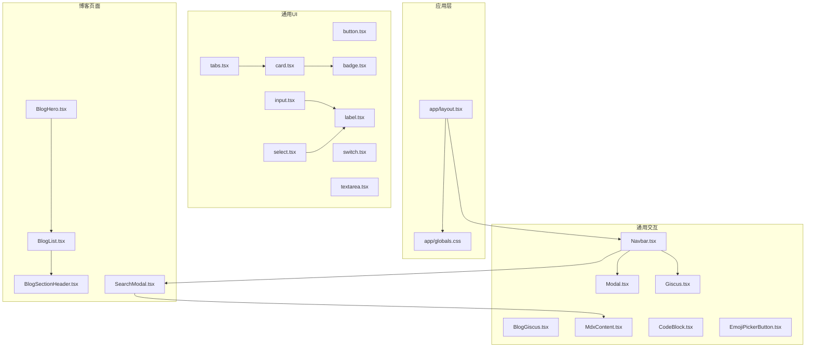
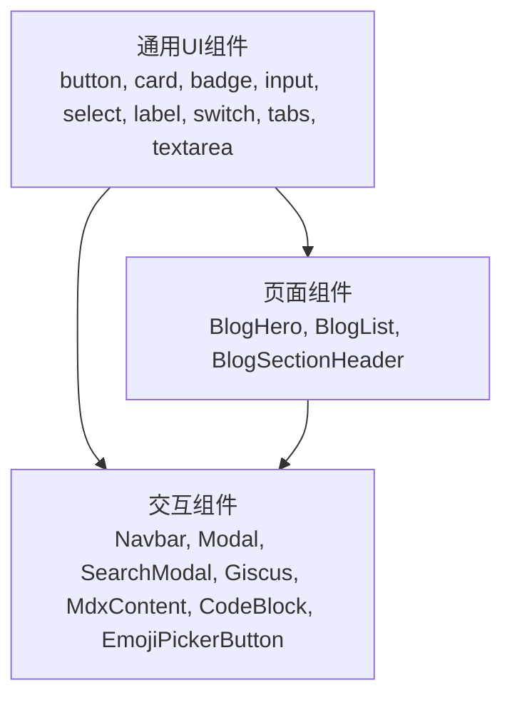
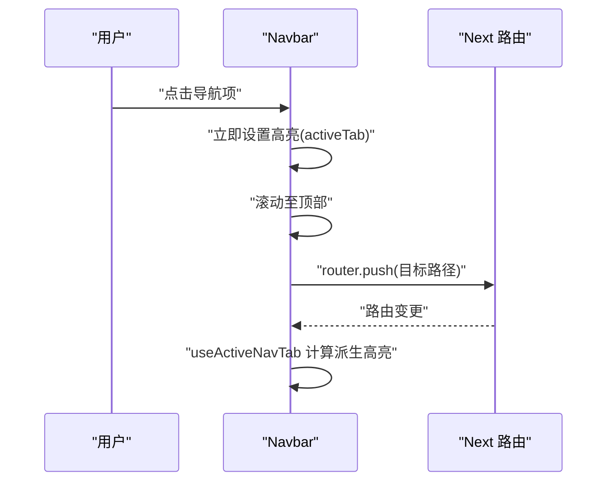
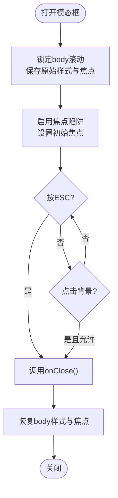
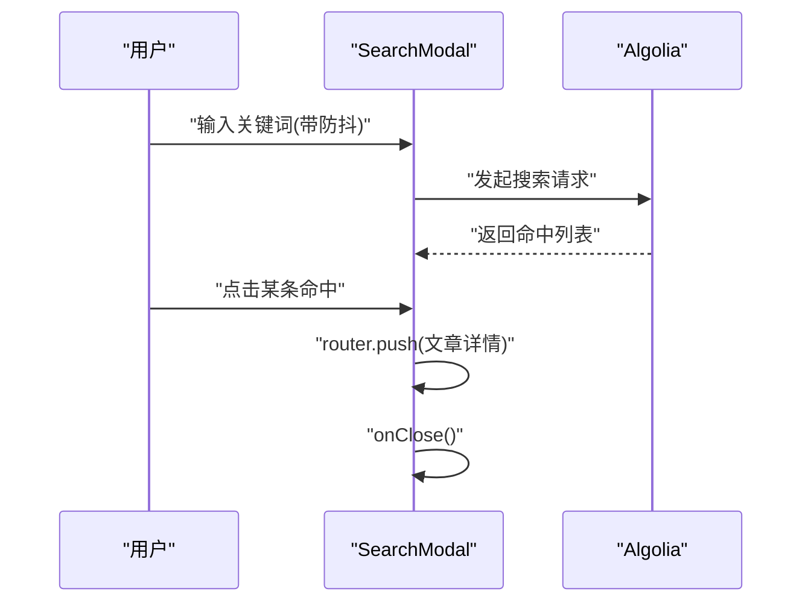
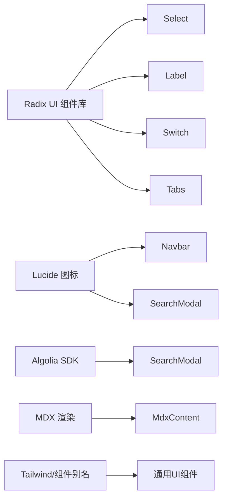

# 组件系统

<cite>
**本文引用的文件**
- [components/common/ui/button.tsx](file://components/common/ui/button.tsx)
- [components/common/ui/card.tsx](file://components/common/ui/card.tsx)
- [components/common/ui/badge.tsx](file://components/common/ui/badge.tsx)
- [components/common/ui/input.tsx](file://components/common/ui/input.tsx)
- [components/common/ui/select.tsx](file://components/common/ui/select.tsx)
- [components/common/ui/label.tsx](file://components/common/ui/label.tsx)
- [components/common/ui/switch.tsx](file://components/common/ui/switch.tsx)
- [components/common/ui/tabs.tsx](file://components/common/ui/tabs.tsx)
- [components/common/ui/textarea.tsx](file://components/common/ui/textarea.tsx)
- [components/common/Navbar.tsx](file://components/common/Navbar.tsx)
- [components/common/Modal.tsx](file://components/common/Modal.tsx)
- [components/search/SearchModal.tsx](file://components/search/SearchModal.tsx)
- [components/blogs/BlogHero.tsx](file://components/blogs/BlogHero.tsx)
- [components/blogs/BlogList.tsx](file://components/blogs/BlogList.tsx)
- [components/blogs/BlogSectionHeader.tsx](file://components/blogs/BlogSectionHeader.tsx)
- [components/common/giscus/Giscus.tsx](file://components/common/giscus/Giscus.tsx)
- [components/common/giscus/BlogGiscus.tsx](file://components/common/giscus/BlogGiscus.tsx)
- [components/common/mdx/MdxContent.tsx](file://components/common/mdx/MdxContent.tsx)
- [components/common/mdx/CodeBlock.tsx](file://components/common/mdx/CodeBlock.tsx)
- [components/common/emoji/EmojiPickerButton.tsx](file://components/common/emoji/EmojiPickerButton.tsx)
- [app/layout.tsx](file://app/layout.tsx)
- [app/globals.css](file://app/globals.css)
- [tailwind.config.js](file://tailwind.config.js)
- [components.json](file://components.json)
- [lib/config.ts](file://lib/config.ts)
- [lib/use-active-nav-tab.ts](file://lib/use-active-nav-tab.ts)
- [lib/algolia-config.ts](file://lib/algolia-config.ts)
- [lib/utils.ts](file://lib/utils.ts)
</cite>

## 目录
1. [简介](#简介)
2. [项目结构](#项目结构)
3. [核心组件](#核心组件)
4. [架构总览](#架构总览)
5. [详细组件分析](#详细组件分析)
6. [依赖关系分析](#依赖关系分析)
7. [性能考量](#性能考量)
8. [故障排查指南](#故障排查指南)
9. [结论](#结论)
10. [附录](#附录)

## 简介
本文件系统性梳理博客系统的组件体系，覆盖通用 UI 组件、页面级组件、交互与状态管理、可访问性与无障碍、响应式与主题适配、动画与过渡、样式与主题扩展、跨浏览器兼容与性能优化，并给出与 shadcn/ui 组件库的对照与自定义开发方法。读者可据此快速理解组件的外观、行为、交互模式与最佳实践。

## 项目结构
组件主要分布在以下目录：
- 通用 UI 组件：components/common/ui
- 页面与业务组件：components/blogs、components/home、components/search、components/talks、components/notes、components/links
- 通用交互与工具：components/common（如 Navbar、Modal、Giscus、MDX 渲染）
- 应用入口与全局样式：app/layout.tsx、app/globals.css
- 主题与样式：tailwind.config.js、components.json
- 配置与工具：lib/config.ts、lib/use-active-nav-tab.ts、lib/algolia-config.ts、lib/utils.ts

图表来源
- [app/layout.tsx](file://app/layout.tsx)
- [app/globals.css](file://app/globals.css)
- [components/common/ui/button.tsx](file://components/common/ui/button.tsx)
- [components/common/ui/card.tsx](file://components/common/ui/card.tsx)
- [components/common/ui/badge.tsx](file://components/common/ui/badge.tsx)
- [components/common/ui/input.tsx](file://components/common/ui/input.tsx)
- [components/common/ui/select.tsx](file://components/common/ui/select.tsx)
- [components/common/ui/label.tsx](file://components/common/ui/label.tsx)
- [components/common/ui/switch.tsx](file://components/common/ui/switch.tsx)
- [components/common/ui/tabs.tsx](file://components/common/ui/tabs.tsx)
- [components/common/ui/textarea.tsx](file://components/common/ui/textarea.tsx)
- [components/common/Navbar.tsx](file://components/common/Navbar.tsx)
- [components/common/Modal.tsx](file://components/common/Modal.tsx)
- [components/common/giscus/Giscus.tsx](file://components/common/giscus/Giscus.tsx)
- [components/common/giscus/BlogGiscus.tsx](file://components/common/giscus/BlogGiscus.tsx)
- [components/common/mdx/MdxContent.tsx](file://components/common/mdx/MdxContent.tsx)
- [components/common/mdx/CodeBlock.tsx](file://components/common/mdx/CodeBlock.tsx)
- [components/common/emoji/EmojiPickerButton.tsx](file://components/common/emoji/EmojiPickerButton.tsx)
- [components/blogs/BlogHero.tsx](file://components/blogs/BlogHero.tsx)
- [components/blogs/BlogList.tsx](file://components/blogs/BlogList.tsx)
- [components/blogs/BlogSectionHeader.tsx](file://components/blogs/BlogSectionHeader.tsx)
- [components/search/SearchModal.tsx](file://components/search/SearchModal.tsx)

章节来源
- [app/layout.tsx](file://app/layout.tsx)
- [app/globals.css](file://app/globals.css)
- [tailwind.config.js](file://tailwind.config.js)
- [components.json](file://components.json)

## 核心组件
本节概述通用 UI 组件族，说明外观、行为、可变性与可组合性。

- 按钮 Button
  - 外观与状态：基于变体与尺寸的类变体系统，支持禁用、聚焦环、无效状态、图标嵌入、asChild 渲染。
  - 行为：支持 asChild 透传到 Slot，以包裹链接或自定义元素；提供 data-slot、data-variant、data-size 便于主题与测试。
  - 适用场景：表单提交、导航跳转、操作触发、图标按钮。
  - 章节来源
    - [components/common/ui/button.tsx](file://components/common/ui/button.tsx)

- 卡片 Card 家族
  - 组件：Card、CardHeader、CardTitle、CardDescription、CardAction、CardContent、CardFooter。
  - 外观：统一圆角、边框、阴影、背景与前景色；头部网格布局支持右侧动作区；内容区留白与分隔线控制。
  - 行为：通过 data-slot 标记，便于主题覆盖与样式隔离。
  - 章节来源
    - [components/common/ui/card.tsx](file://components/common/ui/card.tsx)

- 徽章 Badge
  - 外观：紧凑的圆角标签，支持多种变体与 asChild。
  - 行为：聚焦环、无效状态、图标内联；适合标签、分类、状态指示。
  - 章节来源
    - [components/common/ui/badge.tsx](file://components/common/ui/badge.tsx)

- 输入 Input
  - 外观：带边框、背景、占位符、选择高亮、禁用态、无效态、聚焦环。
  - 行为：aria-invalid 与聚焦环联动；支持文件上传样式片段。
  - 章节来源
    - [components/common/ui/input.tsx](file://components/common/ui/input.tsx)

- 选择器 Select
  - 外观：触发器带下拉图标，内容面板带滑入/淡入动画；支持分组、标签、分隔线、滚动按钮。
  - 行为：客户端组件，使用 radix-ui；支持位置与对齐；提供 data-slot 与尺寸标记。
  - 章节来源
    - [components/common/ui/select.tsx](file://components/common/ui/select.tsx)

- 标签 Label
  - 外观：与表单控件配对，支持禁用态、peer 状态联动。
  - 行为：客户端组件，使用 radix-ui。
  - 章节来源
    - [components/common/ui/label.tsx](file://components/common/ui/label.tsx)

- 开关 Switch
  - 外观：拇指可平移，支持大小尺寸；状态切换时改变背景。
  - 行为：客户端组件，使用 radix-ui；提供 data-slot 与 data-size。
  - 章节来源
    - [components/common/ui/switch.tsx](file://components/common/ui/switch.tsx)

- 标签页 Tabs
  - 外观：支持水平/垂直方向，列表支持默认/线条两种变体；激活态指示线。
  - 行为：客户端组件，使用 radix-ui；提供 data-slot 与 data-orientation。
  - 章节来源
    - [components/common/ui/tabs.tsx](file://components/common/ui/tabs.tsx)

- 文本域 Textarea
  - 外观：边框、背景、占位符、聚焦环、无效态；字段自适应高度。
  - 行为：支持禁用、aria-invalid。
  - 章节来源
    - [components/common/ui/textarea.tsx](file://components/common/ui/textarea.tsx)

## 架构总览
组件系统采用“通用 UI 组件 + 页面组件 + 交互与工具”的分层组织。通用 UI 组件通过类变体系统与 data-slot 标记实现主题化与可测试性；页面组件负责业务逻辑与数据流；交互组件（如 Navbar、Modal、SearchModal）提供复杂状态与可访问性保障。

图表来源
- [components/common/ui/button.tsx](file://components/common/ui/button.tsx)
- [components/common/ui/card.tsx](file://components/common/ui/card.tsx)
- [components/common/ui/badge.tsx](file://components/common/ui/badge.tsx)
- [components/common/ui/input.tsx](file://components/common/ui/input.tsx)
- [components/common/ui/select.tsx](file://components/common/ui/select.tsx)
- [components/common/ui/label.tsx](file://components/common/ui/label.tsx)
- [components/common/ui/switch.tsx](file://components/common/ui/switch.tsx)
- [components/common/ui/tabs.tsx](file://components/common/ui/tabs.tsx)
- [components/common/ui/textarea.tsx](file://components/common/ui/textarea.tsx)
- [components/blogs/BlogHero.tsx](file://components/blogs/BlogHero.tsx)
- [components/blogs/BlogList.tsx](file://components/blogs/BlogList.tsx)
- [components/blogs/BlogSectionHeader.tsx](file://components/blogs/BlogSectionHeader.tsx)
- [components/common/Navbar.tsx](file://components/common/Navbar.tsx)
- [components/common/Modal.tsx](file://components/common/Modal.tsx)
- [components/search/SearchModal.tsx](file://components/search/SearchModal.tsx)
- [components/common/giscus/Giscus.tsx](file://components/common/giscus/Giscus.tsx)
- [components/common/mdx/MdxContent.tsx](file://components/common/mdx/MdxContent.tsx)
- [components/common/mdx/CodeBlock.tsx](file://components/common/mdx/CodeBlock.tsx)
- [components/common/emoji/EmojiPickerButton.tsx](file://components/common/emoji/EmojiPickerButton.tsx)

## 详细组件分析

### 导航栏 Navbar
- 视觉外观
  - 固定顶部、模糊背景、边框分隔；左侧 Logo+头像；中间横向导航；右侧移动端菜单按钮。
  - 移动端菜单：抽屉式，带淡入/淡出动画，遮罩层点击关闭。
- 行为与交互
  - 受控高亮：根据路由与配置计算当前 Tab；点击即时更新高亮，随后导航。
  - 滚动透明度：滚动超过阈值时降低不透明度并禁用交互。
  - 点击外部关闭：监听文档级鼠标事件；Esc 键关闭。
  - 焦点与可访问性：菜单按钮含 aria-label 与 aria-expanded；滚动锁定与 body 样式恢复。
- 动画与过渡
  - 菜单进入/退出动画；导航项逐个上浮入场；滚动透明度过渡。
- 章节来源
  - [components/common/Navbar.tsx](file://components/common/Navbar.tsx)
  - [lib/config.ts](file://lib/config.ts)
  - [lib/use-active-nav-tab.ts](file://lib/use-active-nav-tab.ts)

图表来源
- [components/common/Navbar.tsx](file://components/common/Navbar.tsx)
- [lib/use-active-nav-tab.ts](file://lib/use-active-nav-tab.ts)

### 模态框 Modal
- 视觉外观
  - 对话框容器，支持最大宽度枚举；滚动内容区，支持标题与描述的无障碍标识。
- 行为与交互
  - 焦点陷阱：Tab 循环聚焦；支持启用/禁用；自动聚焦首个可聚焦元素。
  - ESC 关闭：监听键盘事件；支持自定义关闭回调。
  - 背景点击关闭：可选；阻止内容点击冒泡。
  - 滚动锁定：打开时锁定 body 滚动，计算滚动条宽度补偿；关闭时恢复。
- 章节来源
  - [components/common/Modal.tsx](file://components/common/Modal.tsx)

图表来源
- [components/common/Modal.tsx](file://components/common/Modal.tsx)

### 搜索模态框 SearchModal
- 视觉外观
  - 顶部搜索框（带图标与清空按钮），中部结果列表，底部 Algolia 标识。
- 行为与交互
  - 防抖搜索：输入防抖，避免频繁请求；空查询提示。
  - 加载态：中心覆盖层显示加载与提示；命中为空时提示无结果。
  - 结果点击：点击命中项导航至文章详情；预取目标 URL。
  - 可访问性：Portal 挂载至 body；键盘 Esc 关闭；滚动锁定。
- 章节来源
  - [components/search/SearchModal.tsx](file://components/search/SearchModal.tsx)
  - [lib/algolia-config.ts](file://lib/algolia-config.ts)

图表来源
- [components/search/SearchModal.tsx](file://components/search/SearchModal.tsx)
- [lib/algolia-config.ts](file://lib/algolia-config.ts)

### 博客英雄区 BlogHero
- 视觉外观
  - 头像圆形边框；左右布局（移动端纵向）；标题与副标题；社交入口徽标。
- 行为与交互
  - 图片回退：头像加载失败时使用 DiceBear 占位图。
  - 社交入口：GitHub、友情链接、RSS 链接。
- 章节来源
  - [components/blogs/BlogHero.tsx](file://components/blogs/BlogHero.tsx)

### 博客列表 BlogList
- 视觉外观
  - 列表项：序号、标题、标签云、日期；悬停高亮；无结果提示。
- 行为与交互
  - 仅展示前 5 篇最新文章；标签最多显示 3 个；点击跳转详情。
- 章节来源
  - [components/blogs/BlogList.tsx](file://components/blogs/BlogList.tsx)

### 博客分区标题 BlogSectionHeader
- 视觉外观
  - 上划线装饰、标题文本、查看全部链接。
- 行为与交互
  - 支持自定义“查看全部”链接与文案。
- 章节来源
  - [components/blogs/BlogSectionHeader.tsx](file://components/blogs/BlogSectionHeader.tsx)

### 评论系统 Giscus 与 BlogGiscus
- 视觉外观
  - 基于 Giscus 的评论 iframe，按需注入到博客详情页。
- 行为与交互
  - 通过配置注入语言、主题、活动等参数；支持懒加载与条件渲染。
- 章节来源
  - [components/common/giscus/Giscus.tsx](file://components/common/giscus/Giscus.tsx)
  - [components/common/giscus/BlogGiscus.tsx](file://components/common/giscus/BlogGiscus.tsx)

### MDX 内容渲染 MdxContent 与 CodeBlock
- 视觉外观
  - 代码块高亮与复制；标题锚点；表格、图片等语义化渲染。
- 行为与交互
  - 代码块复制、行号、行选中；标题滚动到视口中央。
- 章节来源
  - [components/common/mdx/MdxContent.tsx](file://components/common/mdx/MdxContent.tsx)
  - [components/common/mdx/CodeBlock.tsx](file://components/common/mdx/CodeBlock.tsx)

### 表单与输入组件（Button、Card、Badge、Input、Select、Label、Switch、Tabs、Textarea）
- 视觉外观
  - 统一圆角、边框、阴影、聚焦环、无效态；卡片布局网格；标签页指示线。
- 行为与交互
  - 类变体系统驱动外观；data-slot 标记；asChild 支持；客户端组件与 Radix UI 集成。
- 章节来源
  - [components/common/ui/button.tsx](file://components/common/ui/button.tsx)
  - [components/common/ui/card.tsx](file://components/common/ui/card.tsx)
  - [components/common/ui/badge.tsx](file://components/common/ui/badge.tsx)
  - [components/common/ui/input.tsx](file://components/common/ui/input.tsx)
  - [components/common/ui/select.tsx](file://components/common/ui/select.tsx)
  - [components/common/ui/label.tsx](file://components/common/ui/label.tsx)
  - [components/common/ui/switch.tsx](file://components/common/ui/switch.tsx)
  - [components/common/ui/tabs.tsx](file://components/common/ui/tabs.tsx)
  - [components/common/ui/textarea.tsx](file://components/common/ui/textarea.tsx)

## 依赖关系分析
- 组件耦合
  - 通用 UI 组件低耦合，通过类变体与 data-slot 实现主题化与可替换性。
  - 页面组件依赖通用 UI 与交互组件，形成清晰职责边界。
- 外部依赖
  - Radix UI：Select、Label、Switch、Tabs、TabsPrimitive。
  - Lucide：图标库（Menu、X、Github、Link、Rss、ChevronDown/Up、Check 等）。
  - Algolia：SearchModal 使用 InstantSearch 与 Algolia SDK。
  - MDX：MdxContent 与 CodeBlock 用于博客正文渲染。
- 主题与样式
  - Tailwind 配置与 components.json 控制原子类与组件别名；cn 工具函数合并类名。
- 章节来源
  - [components/common/ui/select.tsx](file://components/common/ui/select.tsx)
  - [components/common/ui/label.tsx](file://components/common/ui/label.tsx)
  - [components/common/ui/switch.tsx](file://components/common/ui/switch.tsx)
  - [components/common/ui/tabs.tsx](file://components/common/ui/tabs.tsx)
  - [components/search/SearchModal.tsx](file://components/search/SearchModal.tsx)
  - [components/common/mdx/MdxContent.tsx](file://components/common/mdx/MdxContent.tsx)
  - [tailwind.config.js](file://tailwind.config.js)
  - [components.json](file://components.json)
  - [lib/utils.ts](file://lib/utils.ts)

图表来源
- [components/common/ui/select.tsx](file://components/common/ui/select.tsx)
- [components/common/ui/label.tsx](file://components/common/ui/label.tsx)
- [components/common/ui/switch.tsx](file://components/common/ui/switch.tsx)
- [components/common/ui/tabs.tsx](file://components/common/ui/tabs.tsx)
- [components/common/Navbar.tsx](file://components/common/Navbar.tsx)
- [components/search/SearchModal.tsx](file://components/search/SearchModal.tsx)
- [components/common/mdx/MdxContent.tsx](file://components/common/mdx/MdxContent.tsx)
- [tailwind.config.js](file://tailwind.config.js)
- [components.json](file://components.json)

## 性能考量
- 懒加载与预取
  - 搜索命中项使用路由预取，减少首屏延迟。
- 滚动与动画
  - Navbar 滚动透明度与禁用交互，减少不必要的事件处理。
  - Modal 打开时锁定 body 滚动，避免布局抖动。
- 组件体积
  - 通用 UI 组件按需引入；Select、Tabs、Switch 等为客户端组件，避免 SSR 不必要开销。
- 样式与主题
  - 使用类变体系统与 data-slot，减少重复样式与深层选择器，利于 Tree Shaking。
- 章节来源
  - [components/search/SearchModal.tsx](file://components/search/SearchModal.tsx)
  - [components/common/Navbar.tsx](file://components/common/Navbar.tsx)
  - [components/common/Modal.tsx](file://components/common/Modal.tsx)

## 故障排查指南
- 搜索无结果
  - 确认 Algolia 环境变量与索引名称正确；检查网络请求与权限。
  - 章节来源
    - [components/search/SearchModal.tsx](file://components/search/SearchModal.tsx)
    - [lib/algolia-config.ts](file://lib/algolia-config.ts)

- 模态框焦点异常
  - 确认启用焦点陷阱；检查可聚焦元素是否存在；确保关闭时恢复焦点。
  - 章节来源
    - [components/common/Modal.tsx](file://components/common/Modal.tsx)

- 导航高亮不同步
  - 检查路由变化与 useActiveNavTab 计算；确认 activeTab 更新顺序。
  - 章节来源
    - [components/common/Navbar.tsx](file://components/common/Navbar.tsx)
    - [lib/use-active-nav-tab.ts](file://lib/use-active-nav-tab.ts)

- 图片加载失败
  - 确认 onError 回退逻辑生效；检查网络与资源路径。
  - 章节来源
    - [components/blogs/BlogHero.tsx](file://components/blogs/BlogHero.tsx)

## 结论
该组件系统以通用 UI 组件为核心，结合页面组件与交互组件，实现了高可组合性、可访问性与主题化的统一风格。通过类变体系统与 data-slot 标记，组件具备良好的可定制性与可测试性；配合 Radix UI、Lucide、Algolia 等生态，满足现代博客的交互与性能需求。

## 附录

### 组件属性、事件与插槽速览
- Button
  - 属性：className、variant、size、asChild、原生 button props
  - 事件：原生事件透传
  - 插槽：无
  - 章节来源
    - [components/common/ui/button.tsx](file://components/common/ui/button.tsx)

- Card 家族
  - 属性：className、原生 div props
  - 事件：原生事件透传
  - 插槽：无
  - 章节来源
    - [components/common/ui/card.tsx](file://components/common/ui/card.tsx)

- Badge
  - 属性：className、variant、asChild、原生 span props
  - 事件：原生事件透传
  - 插槽：无
  - 章节来源
    - [components/common/ui/badge.tsx](file://components/common/ui/badge.tsx)

- Input
  - 属性：className、type、原生 input props
  - 事件：原生事件透传
  - 插槽：无
  - 章节来源
    - [components/common/ui/input.tsx](file://components/common/ui/input.tsx)

- Select
  - 属性：Root/Trigger/Content/Item 等各自 props；客户端组件
  - 事件：原生事件透传
  - 插槽：无
  - 章节来源
    - [components/common/ui/select.tsx](file://components/common/ui/select.tsx)

- Label
  - 属性：className、原生 Label props
  - 事件：原生事件透传
  - 插槽：无
  - 章节来源
    - [components/common/ui/label.tsx](file://components/common/ui/label.tsx)

- Switch
  - 属性：className、size、原生 Switch props
  - 事件：原生事件透传
  - 插槽：无
  - 章节来源
    - [components/common/ui/switch.tsx](file://components/common/ui/switch.tsx)

- Tabs
  - 属性：Tabs/TabsList/TabsTrigger/TabsContent 各自 props；客户端组件
  - 事件：原生事件透传
  - 插槽：无
  - 章节来源
    - [components/common/ui/tabs.tsx](file://components/common/ui/tabs.tsx)

- Textarea
  - 属性：className、原生 textarea props
  - 事件：原生事件透传
  - 插槽：无
  - 章节来源
    - [components/common/ui/textarea.tsx](file://components/common/ui/textarea.tsx)

- Navbar
  - 属性：无受控 props；依赖路由与配置
  - 事件：点击、滚动、键盘事件
  - 插槽：无
  - 章节来源
    - [components/common/Navbar.tsx](file://components/common/Navbar.tsx)

- Modal
  - 属性：isOpen、onClose、children、className、closeOnBackdropClick、maxWidth、enableFocusTrap、title、ariaDescription
  - 事件：键盘、点击
  - 插槽：无
  - 章节来源
    - [components/common/Modal.tsx](file://components/common/Modal.tsx)

- SearchModal
  - 属性：isOpen、onClose
  - 事件：键盘、点击、路由
  - 插槽：无
  - 章节来源
    - [components/search/SearchModal.tsx](file://components/search/SearchModal.tsx)

- BlogHero
  - 属性：title、subtitle
  - 事件：无
  - 插槽：无
  - 章节来源
    - [components/blogs/BlogHero.tsx](file://components/blogs/BlogHero.tsx)

- BlogList
  - 属性：posts（数组）
  - 事件：无
  - 插槽：无
  - 章节来源
    - [components/blogs/BlogList.tsx](file://components/blogs/BlogList.tsx)

- BlogSectionHeader
  - 属性：title、viewAllLink、viewAllText
  - 事件：无
  - 插槽：无
  - 章节来源
    - [components/blogs/BlogSectionHeader.tsx](file://components/blogs/BlogSectionHeader.tsx)

### 使用示例与代码片段路径
- 在页面中使用 Button 与 Card
  - 示例路径：[components/common/ui/button.tsx](file://components/common/ui/button.tsx)
  - 示例路径：[components/common/ui/card.tsx](file://components/common/ui/card.tsx)

- 在表单中使用 Input、Label、Select、Switch、Textarea
  - 示例路径：[components/common/ui/input.tsx](file://components/common/ui/input.tsx)
  - 示例路径：[components/common/ui/label.tsx](file://components/common/ui/label.tsx)
  - 示例路径：[components/common/ui/select.tsx](file://components/common/ui/select.tsx)
  - 示例路径：[components/common/ui/switch.tsx](file://components/common/ui/switch.tsx)
  - 示例路径：[components/common/ui/textarea.tsx](file://components/common/ui/textarea.tsx)

- 在博客页使用 BlogHero、BlogList、BlogSectionHeader
  - 示例路径：[components/blogs/BlogHero.tsx](file://components/blogs/BlogHero.tsx)
  - 示例路径：[components/blogs/BlogList.tsx](file://components/blogs/BlogList.tsx)
  - 示例路径：[components/blogs/BlogSectionHeader.tsx](file://components/blogs/BlogSectionHeader.tsx)

- 在文章页使用 Giscus 与 MdxContent
  - 示例路径：[components/common/giscus/Giscus.tsx](file://components/common/giscus/Giscus.tsx)
  - 示例路径：[components/common/giscus/BlogGiscus.tsx](file://components/common/giscus/BlogGiscus.tsx)
  - 示例路径：[components/common/mdx/MdxContent.tsx](file://components/common/mdx/MdxContent.tsx)

- 在任意页面使用 Modal 与 SearchModal
  - 示例路径：[components/common/Modal.tsx](file://components/common/Modal.tsx)
  - 示例路径：[components/search/SearchModal.tsx](file://components/search/SearchModal.tsx)

### 响应式设计与无障碍访问
- 响应式
  - 移动优先：Navbar、SearchModal、BlogHero、BlogList 均针对移动端进行布局调整。
  - 章节来源
    - [components/common/Navbar.tsx](file://components/common/Navbar.tsx)
    - [components/search/SearchModal.tsx](file://components/search/SearchModal.tsx)
    - [components/blogs/BlogHero.tsx](file://components/blogs/BlogHero.tsx)
    - [components/blogs/BlogList.tsx](file://components/blogs/BlogList.tsx)

- 无障碍
  - Modal：role dialog、aria-modal、aria-labelledby/aria-describedby、焦点陷阱、Esc 关闭。
  - Navbar：菜单按钮 aria-label 与 aria-expanded；移动端菜单遮罩层。
  - SearchModal：Portal 挂载、Esc 关闭、滚动锁定。
  - Select/Label/Switch/Tabs：客户端组件，使用 Radix UI，提供语义化结构。
  - 章节来源
    - [components/common/Modal.tsx](file://components/common/Modal.tsx)
    - [components/common/Navbar.tsx](file://components/common/Navbar.tsx)
    - [components/search/SearchModal.tsx](file://components/search/SearchModal.tsx)
    - [components/common/ui/select.tsx](file://components/common/ui/select.tsx)
    - [components/common/ui/label.tsx](file://components/common/ui/label.tsx)
    - [components/common/ui/switch.tsx](file://components/common/ui/switch.tsx)
    - [components/common/ui/tabs.tsx](file://components/common/ui/tabs.tsx)

### 样式自定义与主题支持
- 类变体系统
  - Button、Badge、TabsList 等通过类变体生成不同外观；支持覆盖默认变体。
  - 章节来源
    - [components/common/ui/button.tsx](file://components/common/ui/button.tsx)
    - [components/common/ui/badge.tsx](file://components/common/ui/badge.tsx)
    - [components/common/ui/tabs.tsx](file://components/common/ui/tabs.tsx)

- data-slot 标记
  - 为每个子组件提供稳定选择器，便于主题覆盖与样式隔离。
  - 章节来源
    - [components/common/ui/button.tsx](file://components/common/ui/button.tsx)
    - [components/common/ui/card.tsx](file://components/common/ui/card.tsx)
    - [components/common/ui/select.tsx](file://components/common/ui/select.tsx)

- Tailwind 与组件别名
  - tailwind.config.js 与 components.json 控制原子类与组件别名，统一主题变量。
  - 章节来源
    - [tailwind.config.js](file://tailwind.config.js)
    - [components.json](file://components.json)

### 跨浏览器兼容性与性能优化
- 兼容性
  - 使用现代 CSS（Grid、Flex、Backdrop Filter）与 CSS 变量；为旧版浏览器提供降级方案（如图片回退）。
  - 章节来源
    - [components/blogs/BlogHero.tsx](file://components/blogs/BlogHero.tsx)
    - [components/common/Navbar.tsx](file://components/common/Navbar.tsx)

- 性能
  - 防抖搜索、路由预取、滚动锁定、CSS 动画替代 JS 动画、类变体减少重排。
  - 章节来源
    - [components/search/SearchModal.tsx](file://components/search/SearchModal.tsx)
    - [components/common/Navbar.tsx](file://components/common/Navbar.tsx)
    - [components/common/Modal.tsx](file://components/common/Modal.tsx)

### 组件组合模式与集成
- 组合模式
  - Card 家族作为容器组合 Button、Badge、Input 等；Tabs 与 TabsList 组合触发与内容区。
- 与 UI 元素集成
  - Select/Label/Switch/Tabs 与表单/对话框/标签页深度集成；Navbar 与路由、配置集成。
- 章节来源
    - [components/common/ui/card.tsx](file://components/common/ui/card.tsx)
    - [components/common/ui/button.tsx](file://components/common/ui/button.tsx)
    - [components/common/ui/badge.tsx](file://components/common/ui/badge.tsx)
    - [components/common/ui/select.tsx](file://components/common/ui/select.tsx)
    - [components/common/ui/label.tsx](file://components/common/ui/label.tsx)
    - [components/common/ui/switch.tsx](file://components/common/ui/switch.tsx)
    - [components/common/ui/tabs.tsx](file://components/common/ui/tabs.tsx)
    - [components/common/Navbar.tsx](file://components/common/Navbar.tsx)

### shadcn/ui 使用与自定义组件开发方法
- 使用方法
  - 通过 components.json 与 Tailwind 配置，将组件别名映射到实际组件路径；在页面中直接使用别名组件。
- 自定义开发
  - 基于类变体系统（cva）与 data-slot 标记；遵循 asChild 与原生事件透传；为客户端组件添加 use client；为表单组件添加 aria-invalid 与聚焦环。
- 章节来源
    - [components.json](file://components.json)
    - [tailwind.config.js](file://tailwind.config.js)
    - [components/common/ui/button.tsx](file://components/common/ui/button.tsx)
    - [components/common/ui/select.tsx](file://components/common/ui/select.tsx)
    - [components/common/ui/tabs.tsx](file://components/common/ui/tabs.tsx)
    - [components/common/Modal.tsx](file://components/common/Modal.tsx)