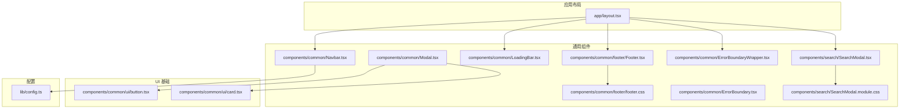
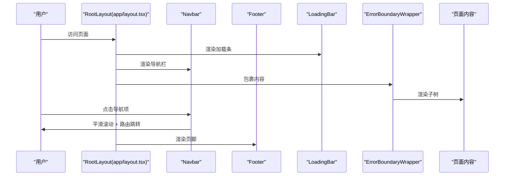
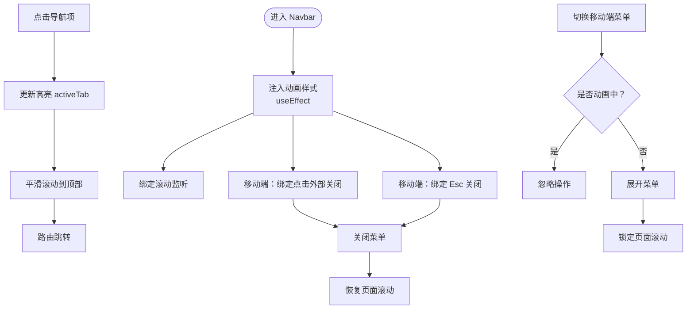
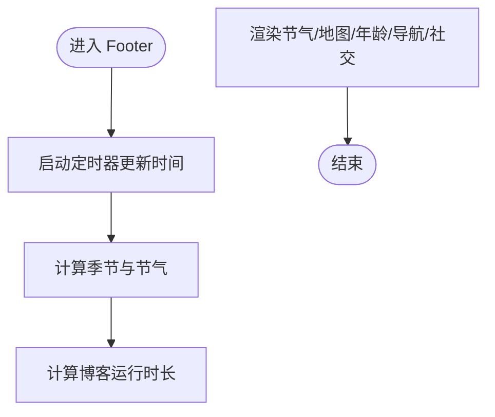
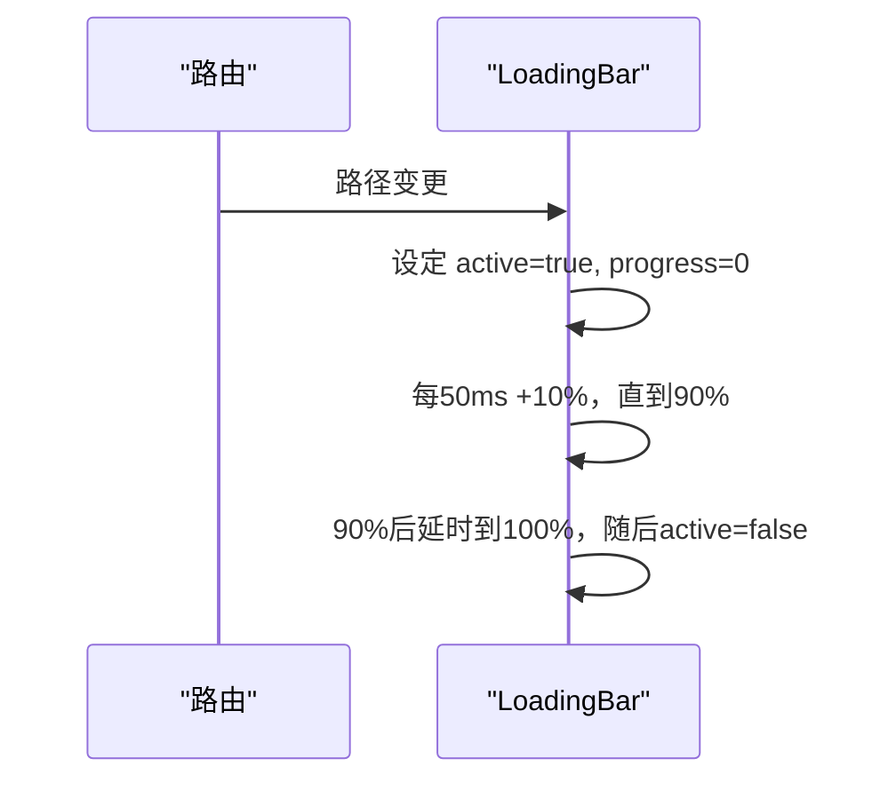
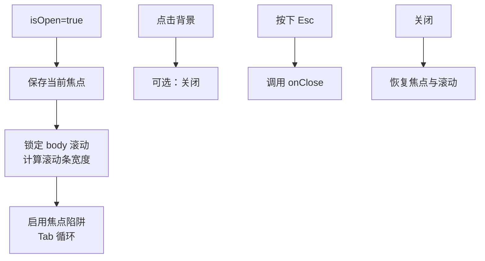
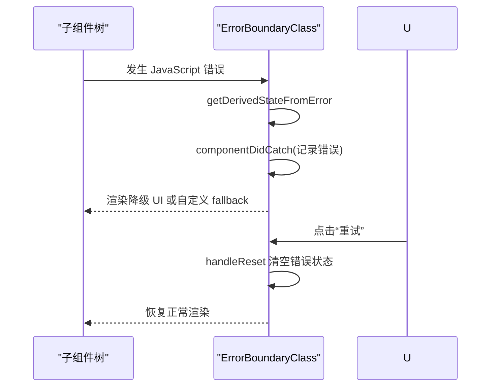
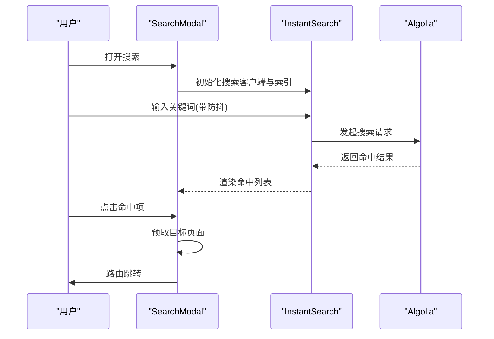
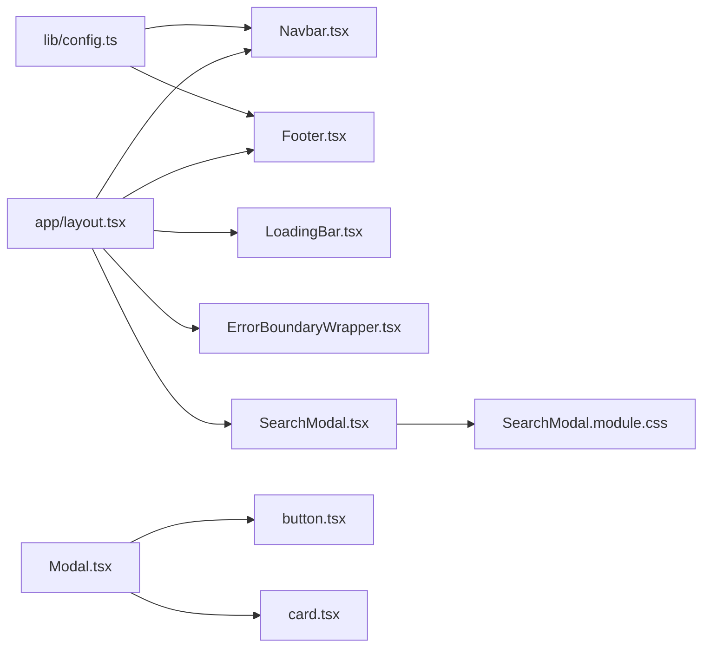

# 通用组件库

<cite>
**本文引用的文件**
- [app/layout.tsx](file://app/layout.tsx)
- [components/common/Navbar.tsx](file://components/common/Navbar.tsx)
- [components/common/footer/Footer.tsx](file://components/common/footer/Footer.tsx)
- [components/common/footer/footer.css](file://components/common/footer/footer.css)
- [components/common/LoadingBar.tsx](file://components/common/LoadingBar.tsx)
- [components/common/Modal.tsx](file://components/common/Modal.tsx)
- [components/common/ErrorBoundary.tsx](file://components/common/ErrorBoundary.tsx)
- [components/common/ErrorBoundaryWrapper.tsx](file://components/common/ErrorBoundaryWrapper.tsx)
- [components/search/SearchModal.tsx](file://components/search/SearchModal.tsx)
- [components/search/SearchModal.module.css](file://components/search/SearchModal.module.css)
- [components/common/ui/button.tsx](file://components/common/ui/button.tsx)
- [components/common/ui/card.tsx](file://components/common/ui/card.tsx)
- [lib/config.ts](file://lib/config.ts)
</cite>

## 目录
1. [引言](#引言)
2. [项目结构](#项目结构)
3. [核心组件](#核心组件)
4. [架构总览](#架构总览)
5. [组件详解](#组件详解)
6. [依赖关系分析](#依赖关系分析)
7. [性能考量](#性能考量)
8. [故障排查指南](#故障排查指南)
9. [结论](#结论)
10. [附录](#附录)

## 引言
本文件面向博客系统的通用组件库，系统性梳理并说明导航栏、页脚、加载条、模态框、错误边界等基础组件的设计理念、实现细节、参数与事件、样式与交互、响应式策略、使用方式与最佳实践。文档同时给出组件间通信与数据传递机制，并通过可视化图表帮助读者快速理解整体架构。

## 项目结构
通用组件库主要位于 components/common 与 components/search 目录，配合 app/layout.tsx 在全局布局中装配导航、页脚、加载条与错误边界；UI 基础组件位于 components/common/ui；站点配置集中在 lib/config.ts。

**图表来源**
- [app/layout.tsx:64-107](file://app/layout.tsx#L64-L107)
- [components/common/Navbar.tsx:46-234](file://components/common/Navbar.tsx#L46-L234)
- [components/common/footer/Footer.tsx:93-250](file://components/common/footer/Footer.tsx#L93-L250)
- [components/common/footer/footer.css:1-412](file://components/common/footer/footer.css#L1-L412)
- [components/common/LoadingBar.tsx:11-59](file://components/common/LoadingBar.tsx#L11-L59)
- [components/common/Modal.tsx:42-187](file://components/common/Modal.tsx#L42-L187)
- [components/common/ErrorBoundary.tsx:26-146](file://components/common/ErrorBoundary.tsx#L26-L146)
- [components/common/ErrorBoundaryWrapper.tsx:18-24](file://components/common/ErrorBoundaryWrapper.tsx#L18-L24)
- [components/search/SearchModal.tsx:69-179](file://components/search/SearchModal.tsx#L69-L179)
- [components/search/SearchModal.module.css:1-204](file://components/search/SearchModal.module.css#L1-L204)
- [components/common/ui/button.tsx:1-65](file://components/common/ui/button.tsx#L1-L65)
- [components/common/ui/card.tsx:1-93](file://components/common/ui/card.tsx#L1-L93)
- [lib/config.ts:13-108](file://lib/config.ts#L13-L108)

**章节来源**
- [app/layout.tsx:64-107](file://app/layout.tsx#L64-L107)

## 核心组件
- 导航栏：提供桌面与移动端导航，支持高亮联动、滚动隐藏、移动端菜单与键盘/点击外层关闭。
- 页脚：展示节气、地图与博客运行时长，动态主题色与响应式布局。
- 加载条：页面切换时的进度指示，渐进式动画与自动收尾。
- 模态框：通用对话框，支持焦点陷阱、ESC 关闭、背景点击关闭、最大宽度与无障碍属性。
- 错误边界：捕获子树 JS 错误，提供友好降级 UI 与重试/返回首页操作。
- 搜索模态框：基于 Algolia 的即时搜索，带防抖、加载覆盖层、命中高亮与预取跳转。
- UI 基础组件：按钮、卡片等，提供变体与尺寸规范，便于统一风格。

**章节来源**
- [components/common/Navbar.tsx:46-234](file://components/common/Navbar.tsx#L46-L234)
- [components/common/footer/Footer.tsx:93-250](file://components/common/footer/Footer.tsx#L93-L250)
- [components/common/LoadingBar.tsx:11-59](file://components/common/LoadingBar.tsx#L11-L59)
- [components/common/Modal.tsx:42-187](file://components/common/Modal.tsx#L42-L187)
- [components/common/ErrorBoundary.tsx:26-146](file://components/common/ErrorBoundary.tsx#L26-L146)
- [components/search/SearchModal.tsx:69-179](file://components/search/SearchModal.tsx#L69-L179)
- [components/common/ui/button.tsx:1-65](file://components/common/ui/button.tsx#L1-L65)
- [components/common/ui/card.tsx:1-93](file://components/common/ui/card.tsx#L1-L93)

## 架构总览
全局布局负责装配导航、页脚、加载条与错误边界；导航与页脚从站点配置读取导航项与社交链接；搜索模态框独立于布局，通过 Portal 渲染并接入 Algolia；模态框与错误边界均采用客户端组件以获得状态与副作用能力。

**图表来源**
- [app/layout.tsx:64-107](file://app/layout.tsx#L64-L107)
- [components/common/Navbar.tsx:46-234](file://components/common/Navbar.tsx#L46-L234)
- [components/common/footer/Footer.tsx:93-250](file://components/common/footer/Footer.tsx#L93-L250)
- [components/common/LoadingBar.tsx:11-59](file://components/common/LoadingBar.tsx#L11-L59)
- [components/common/ErrorBoundaryWrapper.tsx:18-24](file://components/common/ErrorBoundaryWrapper.tsx#L18-L24)

## 组件详解

### 导航栏（Navbar）
- 功能特性
  - 桌面端水平导航与移动端汉堡菜单。
  - 高亮联动：根据当前路径与配置推导活动标签，点击即时更新高亮。
  - 交互增强：点击导航项先更新高亮，再平滑滚动至顶部，最后路由跳转。
  - 移动端菜单：点击外部区域或按 Esc 关闭；禁用页面滚动；入场/出场动画。
  - 滚动感知：随滚动轻微透明化与交互禁用，提升阅读体验。
- Props 与事件
  - 无对外 props（内部通过配置与路由驱动）。
  - 内部事件：点击导航项、切换移动端菜单、Esc 关闭、点击外部关闭。
- 视觉样式与响应式
  - 固定顶部、毛玻璃背景、边框分隔；移动端菜单绝对定位与遮罩层。
  - 动画使用 keyframes，延迟逐项入场；移动端菜单入场/出场动画。
- 使用场景
  - 全站通用导航，建议在根布局中直接引入。
- 状态管理与生命周期
  - 使用受控状态 activeTab 与派生状态 derivedActiveTab；useEffect 管理滚动监听、点击外部关闭、Esc 监听。
- 性能优化
  - useMemo 缓存导航项；useCallback 可用于稳定事件处理器（如需进一步优化）。
  - 动画与滚动监听在移动端开启时才绑定，避免不必要的开销。

**图表来源**
- [components/common/Navbar.tsx:46-234](file://components/common/Navbar.tsx#L46-L234)

**章节来源**
- [components/common/Navbar.tsx:46-234](file://components/common/Navbar.tsx#L46-L234)
- [lib/config.ts:44-54](file://lib/config.ts#L44-L54)

### 页脚（Footer）
- 功能特性
  - 节气展示：根据当前日期计算当前节气与季节主题。
  - 地图与城市：SVG 世界地图标注博主所在城市，实时本地时间。
  - 博客运行时长：累计运行年份与天数、时分秒计时。
  - 导航与社交：读取配置生成导航链接与社交图标。
- 视觉样式与响应式
  - 使用 CSS 变量驱动季节主题色；网格布局三栏信息；多断点响应式。
  - 地图城市点位脉冲动画；分隔线与描述文本随季节过渡。
- 使用场景
  - 全站底部信息展示，建议在根布局中引入。
- 状态管理与生命周期
  - 两个定时器分别更新日期与时钟；卸载清理。
- 性能优化
  - 仅在客户端渲染以避免 SSR 时间差异；SVG 与静态资源按需加载。

**图表来源**
- [components/common/footer/Footer.tsx:93-250](file://components/common/footer/Footer.tsx#L93-L250)
- [components/common/footer/footer.css:1-412](file://components/common/footer/footer.css#L1-L412)

**章节来源**
- [components/common/footer/Footer.tsx:93-250](file://components/common/footer/Footer.tsx#L93-L250)
- [components/common/footer/footer.css:1-412](file://components/common/footer/footer.css#L1-L412)

### 加载条（LoadingBar）
- 功能特性
  - 页面切换时显示进度条，从 0 到 90 递增，接近完成时短暂停留后到 100 并淡出。
  - 通过路径变更触发，避免同步 setState 触发 ESLint。
- 视觉样式与交互
  - 固定顶部，渐变色条，宽度随进度变化，淡入淡出。
- 使用场景
  - 全局页面切换加载指示，建议在根布局中引入。
- 状态管理与生命周期
  - 依赖路径变化重置状态；定时器推进进度；完成时延时隐藏。
- 性能优化
  - 低开销定时器与最小 DOM 更新；仅在需要时渲染。

**图表来源**
- [components/common/LoadingBar.tsx:11-59](file://components/common/LoadingBar.tsx#L11-L59)

**章节来源**
- [components/common/LoadingBar.tsx:11-59](file://components/common/LoadingBar.tsx#L11-L59)

### 模态框（Modal）
- 功能特性
  - 打开/关闭受控；可选背景点击关闭；支持最大宽度枚举；启用焦点陷阱。
  - 锁定 body 滚动，计算滚动条宽度补偿；恢复焦点。
  - 支持标题与描述的无障碍属性；内容区域阻止点击冒泡。
- Props 与事件
  - isOpen: 是否打开
  - onClose: 关闭回调
  - children: 子元素
  - className: 自定义类名
  - closeOnBackdropClick: 是否点击背景关闭
  - maxWidth: 最大宽度枚举
  - enableFocusTrap: 是否启用焦点陷阱
  - title: 标题（无障碍）
  - ariaDescription: 描述（无障碍）
- 视觉样式与交互
  - 居中布局，圆角背景与阴影，最大高度限制与滚动容器。
- 使用场景
  - 通用弹窗、确认对话、登录/注册表单等。
- 状态管理与生命周期
  - 打开时保存与恢复焦点；安装/卸载键盘事件；锁定/解锁滚动。
- 性能优化
  - 未打开时不渲染；焦点陷阱仅在启用时生效。

**图表来源**
- [components/common/Modal.tsx:42-187](file://components/common/Modal.tsx#L42-L187)

**章节来源**
- [components/common/Modal.tsx:42-187](file://components/common/Modal.tsx#L42-L187)

### 错误边界（ErrorBoundary）
- 功能特性
  - 捕获子树 JavaScript 错误，显示友好降级 UI；支持自定义 fallback 与 onError 回调。
  - 开发环境展示错误详情与组件栈；提供“重试”与“返回首页”按钮。
- Props 与事件
  - children: 子节点
  - fallback: 自定义降级 UI
  - onError: 错误上报回调
- 视觉样式与交互
  - 居中错误面板，破坏性样式提示，按钮交互。
- 使用场景
  - 全局错误兜底，建议包裹主内容区域。
- 状态管理与生命周期
  - getDerivedStateFromError 更新状态；componentDidCatch 记录错误；handleReset 清空错误状态。
- 性能优化
  - 仅在发生错误时渲染降级 UI；避免在正常路径产生额外开销。

**图表来源**
- [components/common/ErrorBoundary.tsx:26-146](file://components/common/ErrorBoundary.tsx#L26-L146)

**章节来源**
- [components/common/ErrorBoundary.tsx:26-146](file://components/common/ErrorBoundary.tsx#L26-L146)
- [components/common/ErrorBoundaryWrapper.tsx:18-24](file://components/common/ErrorBoundaryWrapper.tsx#L18-L24)

### 搜索模态框（SearchModal）
- 功能特性
  - 基于 Algolia InstantSearch，防抖搜索框、命中高亮与摘要、加载覆盖层。
  - ESC 关闭；SSR 安全的 Portal 渲染；命中项点击跳转并预取。
- 视觉样式与交互
  - 顶部搜索框、结果滚动区、底部 Algolia 标识；PC 端固定高度与阴影。
- 使用场景
  - 文章搜索入口，建议在根布局或特定页面中触发。
- 状态管理与生命周期
  - mounted 控制 Portal；键盘事件与 body 滚动控制；搜索状态与命中数据来自 Algolia。
- 性能优化
  - 防抖减少请求频率；加载覆盖层避免闪烁；命中项预取提升跳转速度。

**图表来源**
- [components/search/SearchModal.tsx:69-179](file://components/search/SearchModal.tsx#L69-L179)
- [components/search/SearchModal.module.css:1-204](file://components/search/SearchModal.module.css#L1-L204)

**章节来源**
- [components/search/SearchModal.tsx:69-179](file://components/search/SearchModal.tsx#L69-L179)
- [components/search/SearchModal.module.css:1-204](file://components/search/SearchModal.module.css#L1-L204)

### UI 基础组件（Button、Card）
- Button
  - 支持多种变体与尺寸，使用变体工厂与类名合并工具；支持作为子元素渲染。
- Card
  - 提供卡片容器与头部/标题/描述/内容/底部/动作等子组件，便于组合布局。
- 使用场景
  - 通用按钮与卡片容器，广泛用于表单、列表与详情页。

**章节来源**
- [components/common/ui/button.tsx:1-65](file://components/common/ui/button.tsx#L1-L65)
- [components/common/ui/card.tsx:1-93](file://components/common/ui/card.tsx#L1-L93)

## 依赖关系分析
- 组件耦合
  - Navbar 依赖站点配置与活动标签钩子；Footer 依赖时间与地理常量；LoadingBar 依赖路由路径；SearchModal 依赖 Algolia 客户端与模块样式。
  - ErrorBoundaryWrapper 仅作为客户端包装器，便于在服务端组件中使用。
- 外部依赖
  - Next.js 导航与路由、Lucide 图标、Algolia InstantSearch、CSS Modules。
- 潜在循环依赖
  - 未见直接循环；布局与组件解耦良好。

**图表来源**
- [lib/config.ts:13-108](file://lib/config.ts#L13-L108)
- [app/layout.tsx:64-107](file://app/layout.tsx#L64-L107)
- [components/common/Navbar.tsx:46-234](file://components/common/Navbar.tsx#L46-L234)
- [components/common/footer/Footer.tsx:93-250](file://components/common/footer/Footer.tsx#L93-L250)
- [components/common/LoadingBar.tsx:11-59](file://components/common/LoadingBar.tsx#L11-L59)
- [components/common/ErrorBoundaryWrapper.tsx:18-24](file://components/common/ErrorBoundaryWrapper.tsx#L18-L24)
- [components/search/SearchModal.tsx:69-179](file://components/search/SearchModal.tsx#L69-L179)
- [components/search/SearchModal.module.css:1-204](file://components/search/SearchModal.module.css#L1-L204)
- [components/common/Modal.tsx:42-187](file://components/common/Modal.tsx#L42-L187)
- [components/common/ui/button.tsx:1-65](file://components/common/ui/button.tsx#L1-L65)
- [components/common/ui/card.tsx:1-93](file://components/common/ui/card.tsx#L1-L93)

**章节来源**
- [lib/config.ts:13-108](file://lib/config.ts#L13-L108)
- [app/layout.tsx:64-107](file://app/layout.tsx#L64-L107)

## 性能考量
- 渲染与副作用
  - Navbar 与 Footer 使用 useEffect 管理滚动与定时器，注意在卸载时清理；LoadingBar 使用定时器推进进度，完成即停止。
  - Modal 在打开时锁定滚动与保存焦点，关闭时恢复；焦点陷阱仅在启用时安装事件。
  - SearchModal 使用 Portal 避免层级问题，SSR 安全地在 mounted 后渲染。
- 数据流与缓存
  - Navbar 使用 useMemo 缓存导航项；可考虑将事件处理器 useCallback 化以减少重渲染。
- 资源与网络
  - Footer 的图片回退与 Algolia 搜索请求需关注网络与缓存策略；建议在服务端预取或缓存常用资源。
- 可访问性
  - Modal 提供 aria-modal、标题与描述；Navbar/Footnote 提供 aria-label 与 role；SearchModal 使用键盘事件与预取提升可达性。

[本节为通用指导，无需具体文件引用]

## 故障排查指南
- 导航栏无法点击或菜单不关闭
  - 检查移动端菜单开关逻辑与点击外部关闭事件是否正确绑定；确认动画状态未阻塞交互。
- 页脚时间显示异常
  - 确认时区配置与定时器更新逻辑；避免 SSR 与客户端时间差异导致的水合不一致。
- 加载条不消失
  - 检查路径变更触发与进度推进逻辑；确保完成时延时与 active 状态正确切换。
- 模态框焦点丢失或无法 ESC 关闭
  - 确认焦点陷阱启用与键盘事件安装；检查打开/关闭时的滚动锁定与恢复。
- 错误边界未生效
  - 确认包裹范围与客户端组件声明；检查 onError 回调与降级 UI 渲染。
- 搜索模态框无法打开或搜索无结果
  - 检查 Portal 渲染时机与 Algolia 客户端初始化；确认索引名与密钥配置正确。

**章节来源**
- [components/common/Navbar.tsx:88-132](file://components/common/Navbar.tsx#L88-L132)
- [components/common/footer/Footer.tsx:97-114](file://components/common/footer/Footer.tsx#L97-L114)
- [components/common/LoadingBar.tsx:36-44](file://components/common/LoadingBar.tsx#L36-L44)
- [components/common/Modal.tsx:89-144](file://components/common/Modal.tsx#L89-L144)
- [components/common/ErrorBoundary.tsx:36-53](file://components/common/ErrorBoundary.tsx#L36-L53)
- [components/search/SearchModal.tsx:76-86](file://components/search/SearchModal.tsx#L76-L86)

## 结论
通用组件库围绕导航、页脚、加载条、模态框、错误边界与搜索模态框构建，形成统一的导航与信息架构、一致的交互与可访问性保障、以及可扩展的基础 UI 组件体系。通过配置驱动与客户端组件能力，组件在性能、可维护性与用户体验之间取得平衡。建议在新页面中优先复用这些组件，并遵循其 Props、事件与无障碍约定。

[本节为总结，无需具体文件引用]

## 附录
- 组件使用示例（路径）
  - 在根布局中装配导航、页脚、加载条与错误边界：[app/layout.tsx:96-103](file://app/layout.tsx#L96-L103)
  - 导航栏使用配置项渲染：[lib/config.ts:44-54](file://lib/config.ts#L44-L54)
  - 模态框在页面中打开/关闭：[components/common/Modal.tsx:42-187](file://components/common/Modal.tsx#L42-L187)
  - 错误边界包裹内容：[components/common/ErrorBoundaryWrapper.tsx:18-24](file://components/common/ErrorBoundaryWrapper.tsx#L18-L24)
  - 搜索模态框触发与结果跳转：[components/search/SearchModal.tsx:69-179](file://components/search/SearchModal.tsx#L69-L179)

[本节为补充说明，无需具体文件引用]