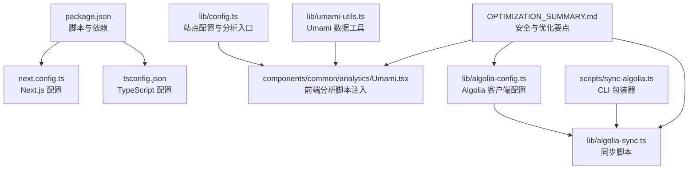
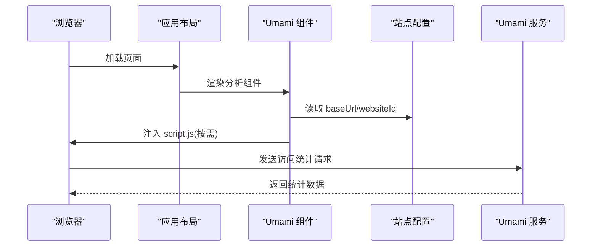
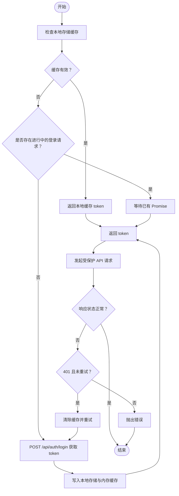
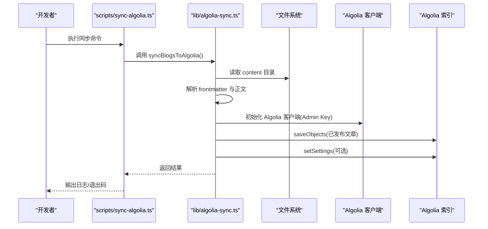
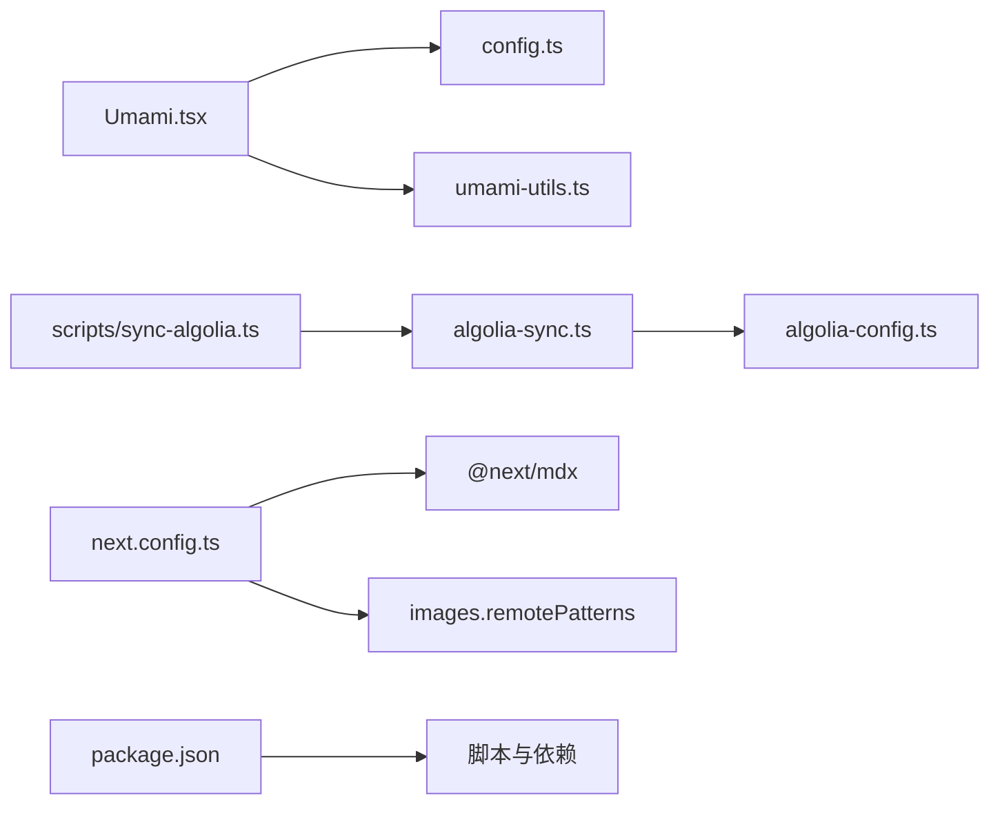

# 配置与部署

<cite>
**本文引用的文件**
- [package.json](file://package.json)
- [next.config.ts](file://next.config.ts)
- [tsconfig.json](file://tsconfig.json)
- [lib/config.ts](file://lib/config.ts)
- [lib/algolia-config.ts](file://lib/algolia-config.ts)
- [lib/algolia-sync.ts](file://lib/algolia-sync.ts)
- [scripts/sync-algolia.ts](file://scripts/sync-algolia.ts)
- [lib/umami-utils.ts](file://lib/umami-utils.ts)
- [components/common/analytics/Umami.tsx](file://components/common/analytics/Umami.tsx)
- [OPTIMIZATION_SUMMARY.md](file://OPTIMIZATION_SUMMARY.md)
</cite>

## 目录
1. [简介](#简介)
2. [项目结构](#项目结构)
3. [核心组件](#核心组件)
4. [架构总览](#架构总览)
5. [详细组件分析](#详细组件分析)
6. [依赖关系分析](#依赖关系分析)
7. [性能与优化](#性能与优化)
8. [部署与环境配置](#部署与环境配置)
9. [CI/CD 与自动化部署](#cicd-与自动化部署)
10. [监控、日志与故障排除](#监控日志与故障排除)
11. [结论](#结论)
12. [附录](#附录)

## 简介
本指南面向博客项目的配置与部署，覆盖环境变量、分析工具与第三方服务集成、构建与部署流程、性能优化策略、Vercel 与本地服务器部署方式、CI/CD 自动化、监控与日志、以及常见问题排查。文档以仓库现有实现为依据，确保可操作性与完整性。

## 项目结构
本项目采用 Next.js 应用结构，关键配置集中在根目录与 lib 目录：
- 根配置：package.json（脚本与依赖）、next.config.ts（Next.js 配置）、tsconfig.json（TypeScript 配置）
- 站点配置：lib/config.ts（站点元信息、导航、分析配置）
- 搜索集成：lib/algolia-config.ts、lib/algolia-sync.ts、scripts/sync-algolia.ts
- 分析集成：components/common/analytics/Umami.tsx、lib/umami-utils.ts
- 安全与优化：OPTIMIZATION_SUMMARY.md（XSS 防护、速率限制、错误边界）

图表来源
- [package.json:1-64](file://package.json#L1-L64)
- [next.config.ts:1-38](file://next.config.ts#L1-L38)
- [tsconfig.json:1-35](file://tsconfig.json#L1-L35)
- [lib/config.ts:1-108](file://lib/config.ts#L1-L108)
- [lib/algolia-config.ts:1-33](file://lib/algolia-config.ts#L1-L33)
- [lib/algolia-sync.ts:1-133](file://lib/algolia-sync.ts#L1-L133)
- [scripts/sync-algolia.ts:1-30](file://scripts/sync-algolia.ts#L1-L30)
- [lib/umami-utils.ts:1-326](file://lib/umami-utils.ts#L1-L326)
- [components/common/analytics/Umami.tsx:1-24](file://components/common/analytics/Umami.tsx#L1-L24)
- [OPTIMIZATION_SUMMARY.md:1-199](file://OPTIMIZATION_SUMMARY.md#L1-L199)

章节来源
- [package.json:1-64](file://package.json#L1-L64)
- [next.config.ts:1-38](file://next.config.ts#L1-L38)
- [tsconfig.json:1-35](file://tsconfig.json#L1-L35)

## 核心组件
- 站点配置与分析入口：lib/config.ts 提供站点元信息、导航、关键词、语言与时区，并集中读取 NEXT_PUBLIC_* 与非公开环境变量（如 Umami 凭据）。
- Algolia 搜索：lib/algolia-config.ts 提供前端搜索所需的应用 ID、API Key 与索引名；lib/algolia-sync.ts 与 scripts/sync-algolia.ts 提供服务端同步脚本，支持批量写入与索引设置。
- Umami 分析：components/common/analytics/Umami.tsx 注入前端脚本；lib/umami-utils.ts 提供鉴权令牌缓存、内存缓存与 API 请求封装。
- 构建与运行：package.json 定义 dev/build/start/lint/typecheck/analyze 等脚本；next.config.ts 配置 MDX 扩展、图片远程模式、编译器选项与输出模式。

章节来源
- [lib/config.ts:1-108](file://lib/config.ts#L1-L108)
- [lib/algolia-config.ts:1-33](file://lib/algolia-config.ts#L1-L33)
- [lib/algolia-sync.ts:1-133](file://lib/algolia-sync.ts#L1-L133)
- [scripts/sync-algolia.ts:1-30](file://scripts/sync-algolia.ts#L1-L30)
- [lib/umami-utils.ts:1-326](file://lib/umami-utils.ts#L1-L326)
- [components/common/analytics/Umami.tsx:1-24](file://components/common/analytics/Umami.tsx#L1-L24)
- [package.json:1-64](file://package.json#L1-L64)
- [next.config.ts:1-38](file://next.config.ts#L1-L38)

## 架构总览
下图展示了前端分析脚本注入、Umami 数据获取与 Algolia 同步的整体流程。

图表来源
- [components/common/analytics/Umami.tsx:1-24](file://components/common/analytics/Umami.tsx#L1-L24)
- [lib/config.ts:80-97](file://lib/config.ts#L80-L97)
- [lib/umami-utils.ts:198-249](file://lib/umami-utils.ts#L198-L249)

## 详细组件分析

### 站点配置与分析入口（lib/config.ts）
- 站点元信息：名称、描述、URL、作者信息、社交链接、关键词、OG 图片、Favicon、主题色、语言与时区、分页配置。
- 分析工具配置：
  - Google Analytics ID（NEXT_PUBLIC_*）
  - Umami 配置：baseUrl、username、password、websiteId（NEXT_PUBLIC_*）
- 导航与社交链接：统一管理导航项与社交图标链接，便于维护。

章节来源
- [lib/config.ts:13-97](file://lib/config.ts#L13-L97)

### Umami 分析集成（components/common/analytics/Umami.tsx 与 lib/umami-utils.ts）
- 前端注入：当 baseUrl 与 websiteId 存在时，动态注入 script.js 并传入 data-website-id。
- 后端工具：
  - 令牌缓存：本地存储与内存缓存结合，TTL 1 小时，避免频繁登录。
  - 并发控制：tokenPromise 避免重复登录请求。
  - API 请求：统一鉴权头 Authorization: Bearer，401 自动刷新缓存重试一次。
  - 统计接口：fetchUmamiStats、fetchPageViews，支持内存缓存与查询参数透传。

图表来源
- [lib/umami-utils.ts:83-133](file://lib/umami-utils.ts#L83-L133)
- [lib/umami-utils.ts:145-187](file://lib/umami-utils.ts#L145-L187)
- [lib/umami-utils.ts:198-249](file://lib/umami-utils.ts#L198-L249)
- [lib/umami-utils.ts:260-311](file://lib/umami-utils.ts#L260-L311)

章节来源
- [components/common/analytics/Umami.tsx:1-24](file://components/common/analytics/Umami.tsx#L1-L24)
- [lib/umami-utils.ts:1-326](file://lib/umami-utils.ts#L1-L326)

### Algolia 搜索集成（lib/algolia-config.ts、lib/algolia-sync.ts、scripts/sync-algolia.ts）
- 前端配置：读取 NEXT_PUBLIC_* 变量，提供 isAlgoliaConfigured 判断。
- 同步脚本：
  - 读取 content 目录下的 Markdown 文件，解析 gray-matter，过滤 status=’draft’ 的条目。
  - 使用 Admin API Key 初始化客户端，批量 saveObjects 到索引。
  - 可选设置索引属性（可搜索字段、排序、分面等），失败不中断。
  - CLI 包装器加载 .env.local 并调用同步函数。

图表来源
- [scripts/sync-algolia.ts:12-29](file://scripts/sync-algolia.ts#L12-L29)
- [lib/algolia-sync.ts:15-109](file://lib/algolia-sync.ts#L15-L109)
- [lib/algolia-config.ts:7-11](file://lib/algolia-config.ts#L7-L11)

章节来源
- [lib/algolia-config.ts:1-33](file://lib/algolia-config.ts#L1-L33)
- [lib/algolia-sync.ts:1-133](file://lib/algolia-sync.ts#L1-L133)
- [scripts/sync-algolia.ts:1-30](file://scripts/sync-algolia.ts#L1-L30)

### 构建与运行配置（package.json、next.config.ts、tsconfig.json）
- 脚本：
  - dev/build/start：开发、构建、生产启动
  - lint/lint:fix/typecheck：代码质量与类型检查
  - analyze：打包分析
  - algolia:sync：调用 ts-node 执行同步脚本
  - precompute:wordcount：预计算字数
- Next.js 配置：
  - pageExtensions：启用 md/mdx
  - images.remotePatterns：允许的远程图片源
  - compiler.removeConsole：生产环境移除 console
  - output: standalone：单体输出便于容器/平台部署
- TypeScript 配置：严格模式、路径别名、模块解析等。

章节来源
- [package.json:5-14](file://package.json#L5-L14)
- [package.json:16-62](file://package.json#L16-L62)
- [next.config.ts:4-35](file://next.config.ts#L4-L35)
- [tsconfig.json:1-35](file://tsconfig.json#L1-L35)

## 依赖关系分析
- 组件耦合：
  - Umami 组件依赖站点配置；Umami 工具依赖 Umami 服务端鉴权与 API。
  - Algolia 同步脚本依赖 Algolia SDK 与内容目录；CLI 包装器负责加载 .env.local。
- 外部依赖：
  - 分析：Umami（自托管）、Google Analytics（NEXT_PUBLIC_*）
  - 搜索：Algolia（NEXT_PUBLIC_* 与 Admin Key）
- 可能的循环依赖：当前文件间无直接循环导入。

图表来源
- [components/common/analytics/Umami.tsx:1-24](file://components/common/analytics/Umami.tsx#L1-L24)
- [lib/config.ts:80-97](file://lib/config.ts#L80-L97)
- [lib/umami-utils.ts:1-326](file://lib/umami-utils.ts#L1-L326)
- [lib/algolia-sync.ts:1-133](file://lib/algolia-sync.ts#L1-L133)
- [lib/algolia-config.ts:1-33](file://lib/algolia-config.ts#L1-L33)
- [scripts/sync-algolia.ts:1-30](file://scripts/sync-algolia.ts#L1-L30)
- [next.config.ts:1-38](file://next.config.ts#L1-L38)
- [package.json:1-64](file://package.json#L1-L64)

## 性能与优化
- 生产移除 console：next.config.ts 中开启 removeConsole，减少包体积与运行时开销。
- 单体输出：output: standalone，简化部署与容器化。
- 图片格式：images.formats 支持 AVIF/WebP，提升加载性能。
- MDX 扩展：pageExtensions 包含 md/mdx，便于内容组织。
- 安全与稳定性（来自优化摘要）：
  - XSS 防护：引入 rehype-sanitize，渲染时消毒 HTML。
  - API 速率限制：基于内存的限流器，返回标准化 429 响应头。
  - 全局错误边界：提升用户体验，避免白屏。
- 建议后续优化（来自优化摘要）：
  - 移除 Git 历史中的敏感信息
  - 添加 robots.txt
  - 添加安全 HTTP 头（CSP、HSTS 等）
  - Push 订阅数据持久化
  - 图片优化（使用 Next.js Image 组件）
  - 导航栏滚动体验优化

章节来源
- [next.config.ts:30-35](file://next.config.ts#L30-L35)
- [OPTIMIZATION_SUMMARY.md:1-199](file://OPTIMIZATION_SUMMARY.md#L1-L199)

## 部署与环境配置

### 环境变量清单与用途
- 分析工具
  - NEXT_PUBLIC_GOOGLE_ANALYTICS_ID：Google Analytics ID（前端）
  - NEXT_PUBLIC_UMAMI_BASE_URL：Umami 实例基础 URL（前端）
  - UMAMI_USERNAME：Umami 用户名（服务端）
  - UMAMI_PASSWORD：Umami 密码（服务端）
  - NEXT_PUBLIC_UMAMI_WEBSITE_ID：Umami 网站 ID（前端）
- 搜索服务
  - NEXT_PUBLIC_ALGOLIA_APP_ID：Algolia 应用 ID（前端）
  - NEXT_PUBLIC_ALGOLIA_SEARCH_API_KEY：Algolia 搜索 API Key（前端）
  - NEXT_PUBLIC_ALGOLIA_INDEX_NAME：索引名称（前端）
  - ALGOLIA_ADMIN_API_KEY：Algolia 管理 API Key（服务端，同步脚本使用）
- 构建与运行
  - NODE_ENV：生产环境移除 console（next.config.ts）
  - NEXT_TELEMETRY_DISABLED：可选禁用 Telemetry

章节来源
- [lib/config.ts:80-97](file://lib/config.ts#L80-L97)
- [lib/algolia-config.ts:7-11](file://lib/algolia-config.ts#L7-L11)
- [lib/algolia-sync.ts:16-24](file://lib/algolia-sync.ts#L16-L24)
- [next.config.ts:30-32](file://next.config.ts#L30-L32)

### 构建脚本配置
- 开发：next dev
- 构建：next build（输出 standalone）
- 启动：next start
- 质量：lint、lint:fix、typecheck
- 分析：ANALYZE=true npm run build
- 搜索同步：npm run algolia:sync 或通过 CLI 脚本
- 预计算：npm run precompute:wordcount

章节来源
- [package.json:5-14](file://package.json#L5-L14)
- [next.config.ts:34](file://next.config.ts#L34)

### 部署流程说明

#### Vercel 部署
- 推荐使用 Vercel 平台部署 Next.js 应用，自动识别 next.config.ts 与 package.json。
- 设置环境变量：
  - 前端分析：NEXT_PUBLIC_UMAMI_BASE_URL、NEXT_PUBLIC_UMAMI_WEBSITE_ID、NEXT_PUBLIC_GOOGLE_ANALYTICS_ID
  - 搜索：NEXT_PUBLIC_ALGOLIA_APP_ID、NEXT_PUBLIC_ALGOLIA_SEARCH_API_KEY、NEXT_PUBLIC_ALGOLIA_INDEX_NAME
  - Umami 凭据：UMAMI_USERNAME、UMAMI_PASSWORD（仅服务端使用）
- 构建与预览：
  - 构建命令：npm run build
  - 输出目录：.next（默认）
- 静态资源与图片：
  - next.config.ts 已配置 images.remotePatterns，确保外部图片可用
- Algolia 同步：
  - 建议在 Vercel 构建钩子或单独的 CI 步骤中执行 npm run algolia:sync（需提供 ALGOLIA_ADMIN_API_KEY）

章节来源
- [next.config.ts:13-29](file://next.config.ts#L13-L29)
- [lib/algolia-sync.ts:16-24](file://lib/algolia-sync.ts#L16-L24)
- [package.json:7-8](file://package.json#L7-L8)

#### 本地服务器部署
- 本地开发：npm run dev
- 生产构建：npm run build
- 生产启动：npm run start
- 环境变量：
  - 在 .env.local 中设置 NEXT_PUBLIC_* 与服务端密钥（如 UMAMI_*、ALGOLIA_ADMIN_API_KEY）
  - 注意：.env.local 不应提交到版本库
- 图片与静态资源：
  - 确保 images.remotePatterns 配置允许的域名可达
- Algolia 同步：
  - 在本地执行 npm run algolia:sync 或使用 scripts/sync-algolia.ts（需先加载 .env.local）

章节来源
- [package.json:6-8](file://package.json#L6-L8)
- [scripts/sync-algolia.ts:9-10](file://scripts/sync-algolia.ts#L9-L10)
- [next.config.ts:13-29](file://next.config.ts#L13-L29)

### 第三方服务集成最佳实践
- Umami
  - 使用 NEXT_PUBLIC_UMAMI_BASE_URL 与 NEXT_PUBLIC_UMAMI_WEBSITE_ID 注入前端脚本
  - 服务端使用 UMAMI_USERNAME/UMAMI_PASSWORD 获取 token，避免泄露
  - 令牌与内存缓存配合，降低请求频率
- Algolia
  - 前端使用 NEXT_PUBLIC_* 读取搜索凭据
  - 服务端使用 ALGOLIA_ADMIN_API_KEY 执行同步，定期运行
  - 索引设置可选，失败不阻塞同步流程
- Google Analytics
  - 使用 NEXT_PUBLIC_* 注入，避免在客户端暴露后端密钥

章节来源
- [lib/config.ts:80-97](file://lib/config.ts#L80-L97)
- [lib/algolia-config.ts:7-11](file://lib/algolia-config.ts#L7-L11)
- [lib/algolia-sync.ts:16-24](file://lib/algolia-sync.ts#L16-L24)
- [lib/umami-utils.ts:83-133](file://lib/umami-utils.ts#L83-L133)

## CI/CD 与自动化部署
- 构建与测试
  - 使用 npm run build 与 npm run typecheck 作为构建阶段步骤
  - 可在 CI 中加入 npm run lint 与 npm run lint:fix
- 搜索同步
  - 在 CI 中执行 npm run algolia:sync（需配置 ALGOLIA_ADMIN_API_KEY）
  - 或使用 scripts/sync-algolia.ts（需加载 .env.local）
- 部署触发
  - Vercel 自动监听仓库变更并触发构建
  - 也可在 CI 中配置部署脚本（如 vercel、Vercel CLI）
- 安全建议
  - 将 .env.local 与敏感密钥纳入 CI 的机密管理
  - 避免在构建日志中打印敏感信息

章节来源
- [package.json:5-14](file://package.json#L5-L14)
- [scripts/sync-algolia.ts:9-10](file://scripts/sync-algolia.ts#L9-L10)
- [lib/algolia-sync.ts:112-132](file://lib/algolia-sync.ts#L112-L132)

## 监控、日志与故障排除

### 监控与日志
- Umami
  - 前端：通过注入的 script.js 收集访问数据
  - 后端：lib/umami-utils.ts 提供 fetchUmamiStats/fetchPageViews，支持内存缓存与错误处理
- Algolia
  - 同步脚本输出成功/警告/错误日志，便于排障
- 构建与运行
  - next.config.ts 移除生产 console，减少噪音
  - 使用 ANALYZE=true 查看包体积分布

章节来源
- [components/common/analytics/Umami.tsx:1-24](file://components/common/analytics/Umami.tsx#L1-L24)
- [lib/umami-utils.ts:198-311](file://lib/umami-utils.ts#L198-L311)
- [lib/algolia-sync.ts:26-109](file://lib/algolia-sync.ts#L26-L109)
- [next.config.ts:30-32](file://next.config.ts#L30-L32)
- [package.json:12](file://package.json#L12)

### 常见问题与解决方案
- Umami 无法加载或无数据
  - 检查 NEXT_PUBLIC_UMAMI_BASE_URL 与 NEXT_PUBLIC_UMAMI_WEBSITE_ID 是否正确
  - 确认服务端 UMAMI_USERNAME/UMAMI_PASSWORD 可登录
  - 清理本地缓存：调用 clearUmamiCache 或删除本地存储 token
- Algolia 无搜索结果
  - 确认 NEXT_PUBLIC_ALGOLIA_APP_ID/NEXT_PUBLIC_ALGOLIA_SEARCH_API_KEY/NEXT_PUBLIC_ALGOLIA_INDEX_NAME
  - 执行同步脚本，确认已发布文章被写入索引
  - 检查索引设置是否成功（同步脚本会尝试 setSettings）
- 构建失败或图片加载异常
  - 确认 images.remotePatterns 中域名可达
  - 检查 NODE_ENV 与 removeConsole 配置
- API 速率限制导致 429
  - 检查 X-RateLimit-* 响应头，合理降频或升级限流等级
- XSS 风险
  - 确认 rehype-sanitize 已生效，渲染时对不受信任内容进行消毒

章节来源
- [lib/umami-utils.ts:316-325](file://lib/umami-utils.ts#L316-L325)
- [lib/algolia-sync.ts:16-24](file://lib/algolia-sync.ts#L16-L24)
- [next.config.ts:13-29](file://next.config.ts#L13-L29)
- [OPTIMIZATION_SUMMARY.md:23-58](file://OPTIMIZATION_SUMMARY.md#L23-L58)

## 结论
本指南基于仓库现有实现，提供了从环境变量、第三方服务集成到构建与部署的完整配置说明，并结合安全与性能优化建议。建议在生产环境中：
- 严格管理密钥与 .env.local
- 使用 Vercel 等平台自动化部署与构建
- 定期执行 Algolia 同步与监控分析数据
- 持续关注后续优化项（robots.txt、安全头、图片优化等）

## 附录

### 环境变量对照表
- 分析工具
  - NEXT_PUBLIC_GOOGLE_ANALYTICS_ID：Google Analytics ID（前端）
  - NEXT_PUBLIC_UMAMI_BASE_URL：Umami 基础 URL（前端）
  - UMAMI_USERNAME：Umami 用户名（服务端）
  - UMAMI_PASSWORD：Umami 密码（服务端）
  - NEXT_PUBLIC_UMAMI_WEBSITE_ID：Umami 网站 ID（前端）
- 搜索服务
  - NEXT_PUBLIC_ALGOLIA_APP_ID：Algolia 应用 ID（前端）
  - NEXT_PUBLIC_ALGOLIA_SEARCH_API_KEY：Algolia 搜索 API Key（前端）
  - NEXT_PUBLIC_ALGOLIA_INDEX_NAME：索引名称（前端）
  - ALGOLIA_ADMIN_API_KEY：Algolia 管理 API Key（服务端）
- 构建与运行
  - NODE_ENV：生产环境移除 console
  - NEXT_TELEMETRY_DISABLED：可选禁用 Telemetry

章节来源
- [lib/config.ts:80-97](file://lib/config.ts#L80-L97)
- [lib/algolia-config.ts:7-11](file://lib/algolia-config.ts#L7-L11)
- [lib/algolia-sync.ts:16-24](file://lib/algolia-sync.ts#L16-L24)
- [next.config.ts:30-32](file://next.config.ts#L30-L32)