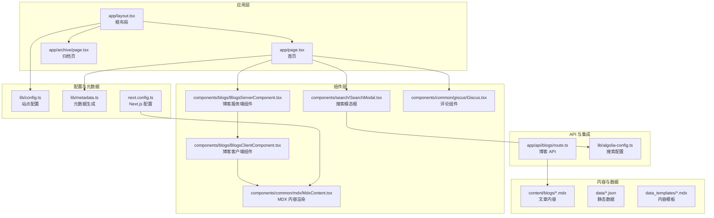
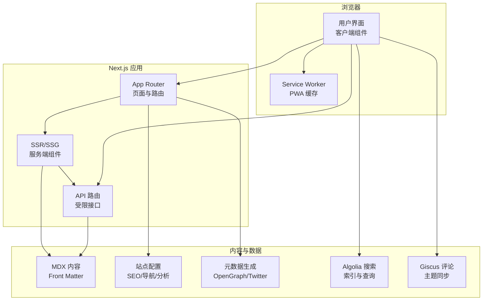
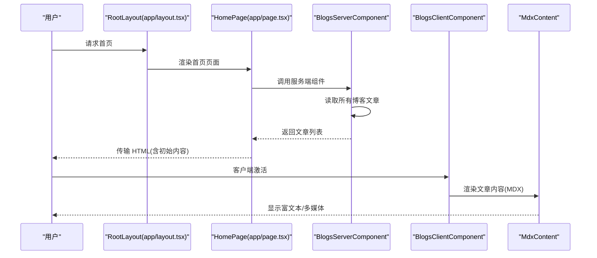
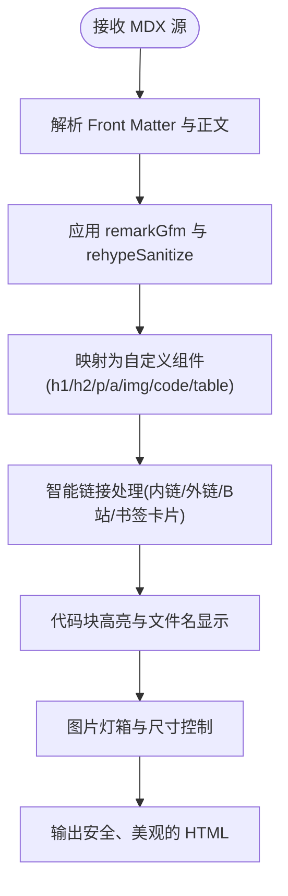
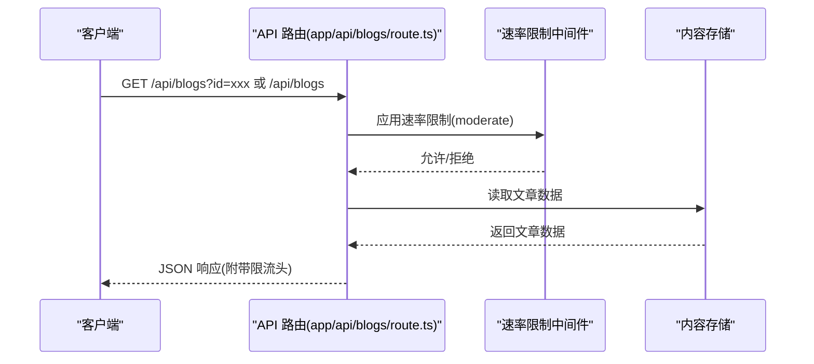
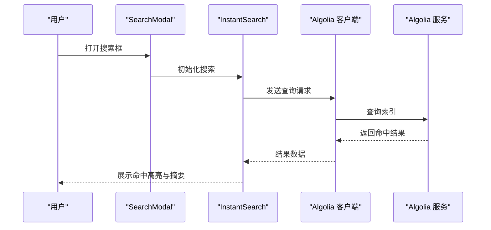
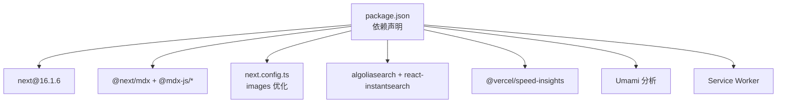

# 项目概述

<cite>
**本文引用的文件**
- [package.json](file://package.json)
- [next.config.ts](file://next.config.ts)
- [app/layout.tsx](file://app/layout.tsx)
- [app/page.tsx](file://app/page.tsx)
- [lib/config.ts](file://lib/config.ts)
- [lib/metadata.ts](file://lib/metadata.ts)
- [components/blogs/BlogsServerComponent.tsx](file://components/blogs/BlogsServerComponent.tsx)
- [components/blogs/BlogsClientComponent.tsx](file://components/blogs/BlogsClientComponent.tsx)
- [components/common/mdx/MdxContent.tsx](file://components/common/mdx/MdxContent.tsx)
- [content/blogs/test-features.mdx](file://content/blogs/test-features.mdx)
- [app/api/blogs/route.ts](file://app/api/blogs/route.ts)
- [components/search/SearchModal.tsx](file://components/search/SearchModal.tsx)
- [lib/algolia-config.ts](file://lib/algolia-config.ts)
- [components/common/giscus/Giscus.tsx](file://components/common/giscus/Giscus.tsx)
- [app/archive/page.tsx](file://app/archive/page.tsx)
</cite>

## 目录
1. [引言](#引言)
2. [项目结构](#项目结构)
3. [核心组件](#核心组件)
4. [架构总览](#架构总览)
5. [详细组件分析](#详细组件分析)
6. [依赖关系分析](#依赖关系分析)
7. [性能考量](#性能考量)
8. [故障排除指南](#故障排除指南)
9. [结论](#结论)

## 引言
本项目是一个基于 Next.js 16 的现代化个人技术博客系统，旨在提供高质量的内容创作与阅读体验。项目支持多种内容类型：博客文章、手记、碎碎念，并通过 Server Components、App Router、MDX 支持等现代前端技术实现高性能、可维护的前端架构。整体设计理念强调“内容优先、体验至上”，既适合初学者快速上手，也为有经验的开发者提供了可扩展的技术细节。

## 项目结构
项目采用 Next.js 16 的 App Router 结构，以功能域划分目录，结合 Server Components 与客户端组件的职责分离，形成清晰的层次化组织方式：

- app：应用入口与页面路由，包含布局、页面与 API 路由
- components：可复用 UI 组件与业务组件，按功能域拆分
- content：静态内容资源（如 MDX 文章）
- data：静态数据（如友链、演讲信息）
- data_templates：内容模板（博客、手记、演讲）
- docs：文档与演示组件
- lib：通用逻辑（配置、元数据、算法、工具）
- public：公共资源（PWA 清单、Service Worker）
- scripts：构建与运维脚本

**图表来源**
- [app/layout.tsx:64-107](file://app/layout.tsx#L64-L107)
- [app/page.tsx:6-14](file://app/page.tsx#L6-L14)
- [app/archive/page.tsx:109-256](file://app/archive/page.tsx#L109-L256)
- [components/blogs/BlogsServerComponent.tsx:1-8](file://components/blogs/BlogsServerComponent.tsx#L1-L8)
- [components/blogs/BlogsClientComponent.tsx:1-67](file://components/blogs/BlogsClientComponent.tsx#L1-L67)
- [components/common/mdx/MdxContent.tsx:1-220](file://components/common/mdx/MdxContent.tsx#L1-L220)
- [components/search/SearchModal.tsx:1-179](file://components/search/SearchModal.tsx#L1-L179)
- [components/common/giscus/Giscus.tsx:1-148](file://components/common/giscus/Giscus.tsx#L1-L148)
- [lib/config.ts:13-98](file://lib/config.ts#L13-L98)
- [lib/metadata.ts:25-79](file://lib/metadata.ts#L25-L79)
- [next.config.ts:1-38](file://next.config.ts#L1-L38)
- [content/blogs/test-features.mdx:1-133](file://content/blogs/test-features.mdx#L1-L133)
- [app/api/blogs/route.ts:1-62](file://app/api/blogs/route.ts#L1-L62)
- [lib/algolia-config.ts:1-33](file://lib/algolia-config.ts#L1-L33)

**章节来源**
- [package.json:1-64](file://package.json#L1-L64)
- [next.config.ts:1-38](file://next.config.ts#L1-L38)
- [app/layout.tsx:1-108](file://app/layout.tsx#L1-L108)
- [app/page.tsx:1-16](file://app/page.tsx#L1-L16)
- [lib/config.ts:1-108](file://lib/config.ts#L1-L108)
- [lib/metadata.ts:1-160](file://lib/metadata.ts#L1-L160)

## 核心组件
- 根布局与元数据：根布局负责全局样式、SEO 元数据、分析与 PWA 注册；元数据模块提供统一的页面元信息生成能力，支持文章类与网站类内容。
- 博客内容渲染：服务端组件负责读取内容并传递给客户端组件，客户端组件负责首屏交互与动态区域（统计、公告、留言墙等）。
- MDX 支持：内置 MDX 编译器与渲染管线，支持 GitHub 风格表格、任务列表、代码高亮、内链/外链智能处理、Bilibili 视频嵌入、书签卡片等增强功能。
- 搜索与评论：集成 Algolia 搜索（InstantSearch），提供防抖搜索、命中高亮与预取；评论系统基于 Giscus，支持主题同步与懒加载。
- 归档与统计：按年份分组展示文章时间线，提供年度/日度进度可视化。

**章节来源**
- [app/layout.tsx:18-56](file://app/layout.tsx#L18-L56)
- [lib/metadata.ts:25-79](file://lib/metadata.ts#L25-L79)
- [components/blogs/BlogsServerComponent.tsx:1-8](file://components/blogs/BlogsServerComponent.tsx#L1-L8)
- [components/blogs/BlogsClientComponent.tsx:1-67](file://components/blogs/BlogsClientComponent.tsx#L1-L67)
- [components/common/mdx/MdxContent.tsx:1-220](file://components/common/mdx/MdxContent.tsx#L1-L220)
- [components/search/SearchModal.tsx:1-179](file://components/search/SearchModal.tsx#L1-L179)
- [components/common/giscus/Giscus.tsx:1-148](file://components/common/giscus/Giscus.tsx#L1-L148)
- [app/archive/page.tsx:109-256](file://app/archive/page.tsx#L109-L256)

## 架构总览
项目采用“服务端渲染 + 客户端交互”的混合架构：
- 服务端：Next.js App Router 负责页面路由与数据获取；服务端组件负责内容聚合与初始渲染。
- 客户端：客户端组件负责动态交互、动画、状态管理与第三方集成（搜索、评论、PWA）。
- 内容层：MDX 文件作为统一内容格式，配合 Front Matter 元数据，实现多类型内容的一致化处理。
- 数据层：API 路由提供受速率限制的内容接口；Algolia 提供全文检索；Giscus 提供评论生态。

**图表来源**
- [app/layout.tsx:64-107](file://app/layout.tsx#L64-L107)
- [app/page.tsx:6-14](file://app/page.tsx#L6-L14)
- [app/api/blogs/route.ts:10-61](file://app/api/blogs/route.ts#L10-L61)
- [components/common/mdx/MdxContent.tsx:140-219](file://components/common/mdx/MdxContent.tsx#L140-L219)
- [lib/metadata.ts:25-79](file://lib/metadata.ts#L25-L79)
- [lib/config.ts:13-98](file://lib/config.ts#L13-L98)
- [components/search/SearchModal.tsx:17-20](file://components/search/SearchModal.tsx#L17-L20)
- [components/common/giscus/Giscus.tsx:21-147](file://components/common/giscus/Giscus.tsx#L21-L147)

## 详细组件分析

### 博客内容渲染流程（服务端 → 客户端）
该流程展示了从服务端读取内容到客户端渲染的完整链路，体现 Next.js 16 的 Server Components 优势。

**图表来源**
- [app/layout.tsx:64-107](file://app/layout.tsx#L64-L107)
- [app/page.tsx:6-14](file://app/page.tsx#L6-L14)
- [components/blogs/BlogsServerComponent.tsx:1-8](file://components/blogs/BlogsServerComponent.tsx#L1-L8)
- [components/blogs/BlogsClientComponent.tsx:1-67](file://components/blogs/BlogsClientComponent.tsx#L1-L67)
- [components/common/mdx/MdxContent.tsx:140-219](file://components/common/mdx/MdxContent.tsx#L140-L219)

**章节来源**
- [app/page.tsx:6-14](file://app/page.tsx#L6-L14)
- [components/blogs/BlogsServerComponent.tsx:1-8](file://components/blogs/BlogsServerComponent.tsx#L1-L8)
- [components/blogs/BlogsClientComponent.tsx:1-67](file://components/blogs/BlogsClientComponent.tsx#L1-L67)
- [components/common/mdx/MdxContent.tsx:1-220](file://components/common/mdx/MdxContent.tsx#L1-L220)

### MDX 内容渲染与增强功能
MDX 内容渲染组件对 Markdown/GFM 进行增强，支持多种交互与展示特性，确保内容在保持简洁的同时具备丰富的表现力。

**图表来源**
- [components/common/mdx/MdxContent.tsx:17-30](file://components/common/mdx/MdxContent.tsx#L17-L30)
- [components/common/mdx/MdxContent.tsx:140-219](file://components/common/mdx/MdxContent.tsx#L140-L219)
- [content/blogs/test-features.mdx:1-133](file://content/blogs/test-features.mdx#L1-L133)

**章节来源**
- [components/common/mdx/MdxContent.tsx:1-220](file://components/common/mdx/MdxContent.tsx#L1-L220)
- [content/blogs/test-features.mdx:1-133](file://content/blogs/test-features.mdx#L1-L133)

### 博客 API 与速率限制
博客 API 路由提供统一的数据接口，支持按 ID 获取单篇文章或返回全部文章列表，并集成速率限制中间件以保障稳定性。

**图表来源**
- [app/api/blogs/route.ts:10-61](file://app/api/blogs/route.ts#L10-L61)

**章节来源**
- [app/api/blogs/route.ts:1-62](file://app/api/blogs/route.ts#L1-L62)

### 搜索与评论集成
搜索与评论分别通过 Algolia 与 Giscus 提供，前者强调“即时检索”，后者强调“社区互动”。

**图表来源**
- [components/search/SearchModal.tsx:17-20](file://components/search/SearchModal.tsx#L17-L20)
- [components/search/SearchModal.tsx:161-167](file://components/search/SearchModal.tsx#L161-L167)
- [lib/algolia-config.ts:7-11](file://lib/algolia-config.ts#L7-L11)

**章节来源**
- [components/search/SearchModal.tsx:1-179](file://components/search/SearchModal.tsx#L1-L179)
- [lib/algolia-config.ts:1-33](file://lib/algolia-config.ts#L1-L33)

## 依赖关系分析
项目依赖围绕 Next.js 16 生态展开，重点包括 MDX 编译、图像优化、分析与搜索等模块。

**图表来源**
- [package.json:16-44](file://package.json#L16-L44)
- [next.config.ts:11-35](file://next.config.ts#L11-L35)

**章节来源**
- [package.json:1-64](file://package.json#L1-L64)
- [next.config.ts:1-38](file://next.config.ts#L1-L38)

## 性能考量
- 图像优化：通过 next.config.ts 配置 WebP/AVIF 格式与远程图像源白名单，减少带宽与提升加载速度。
- 构建产物：启用 standalone 输出与生产环境移除 console，降低运行时开销。
- 交互延迟：MDX 渲染与搜索采用客户端组件与防抖策略，确保首屏快速可用。
- 分析与监控：集成 Vercel Speed Insights 与自托管 Umami，便于性能观测与优化。

**章节来源**
- [next.config.ts:13-35](file://next.config.ts#L13-L35)
- [app/layout.tsx:10-16](file://app/layout.tsx#L10-L16)

## 故障排除指南
- 速率限制错误：当 API 请求超过限制时，响应头会包含限流信息，检查速率限制配置与调用频率。
- Algolia 未配置：若搜索无结果，请确认 NEXT_PUBLIC_ALGOLIA_* 环境变量已正确设置。
- MDX 渲染异常：检查 Front Matter 字段完整性与内容格式，确保标题、日期、标签等字段符合预期。
- 评论不显示：确认 Giscus 的仓库与分类配置正确，且主题同步逻辑生效。

**章节来源**
- [app/api/blogs/route.ts:10-22](file://app/api/blogs/route.ts#L10-L22)
- [lib/algolia-config.ts:14-32](file://lib/algolia-config.ts#L14-L32)
- [components/common/mdx/MdxContent.tsx:140-219](file://components/common/mdx/MdxContent.tsx#L140-L219)
- [components/common/giscus/Giscus.tsx:41-61](file://components/common/giscus/Giscus.tsx#L41-L61)

## 结论
本博客项目以 Next.js 16 为核心，结合 Server Components、App Router 与 MDX 技术，构建了一个内容丰富、性能优良、易于扩展的个人技术博客系统。通过统一的元数据与配置体系、完善的搜索与评论集成，以及清晰的组件分层，既能满足初学者的学习需求，也能为进阶开发者提供可定制的扩展点。建议在实际部署中关注环境变量配置、内容格式规范与性能监控，以获得更稳定的线上体验。